## Getting data

Here are a few examples of how to get some free data.  
For the present analysis we will download a data set from Kaggle, but first a few other examples...

### Yahoo Finance

Use screener to find tickers:  
https://finance.yahoo.com/research-hub/screener/ 

#### quantmod


```r
library(tidyverse)
library(quantmod)
library(ggplot2)
```
 
Simplest call. "AAPL" object will be created


```r
getSymbols("AAPL")
AAPL %>% head
```


```r
getSymbols(c("AAPL", "IBM"))
IBM %>% head
AAPL %>% head
```

Example without auto assign

```r
d <- getSymbols("AAPL", auto.assign = F)
d %>% head
```
 
Specifying from/to dates

```r
d <- getSymbols("AAPL", auto.assign = F, from = "2020-01-01", to = "2020-06-01")
d %>% head 
```
 
Specifying return class

```r
d <- getSymbols("AAPL", auto.assign = F, from = "2020-01-01", to = "2020-06-01", return.class='data.frame')
d %>% head  
```

#### yahoofinancer


```r
library(yahoofinancer)
```

https://yahoofinancer.rsquaredacademy.com/ 

https://cloud.r-project.org/web/packages/yahoofinancer/yahoofinancer.pdf


```r
aapl <- Ticker$new('aapl')
```


```r
names(aapl)
```


```r
aapl$regular_market_price
```


```r
names(aapl$technical_insights)
```


```r
aapl$fifty_two_week_high
```


```r
aapl$previous_close
```


```r
nifty_50 <- Index$new('^NSEI')
head(nifty_50$get_history(start = '2024-01-20', interval = '1d'))
```


```r
head(currency_converter('GBP', 'USD', '2024-01-20', '2024-01-30'))
```


```r
head(aapl$get_history(start = '2024-10-20', interval = '1d'))
```


```r
get_trending(country = "US", count = 10)
```


```r
wheat <- Ticker$new('CWDH25.CBT')
wheat$fifty_two_week_high
```


### Alpha Vantage

See Alpha Vantage SPI documentation:  
https://www.alphavantage.co/documentation/

NOTE  
25 requests per day limit  
https://www.alphavantage.co/premium/

#### Without `alphavantager`:


```r
library(tidyverse)
library(jsonlite)
library(httr)
 
symbol = "AMZN"
av_key = ""
 
url <- str_c("https://www.alphavantage.co/query?function=TIME_SERIES_DAILY&symbol=", symbol ,"&apikey=", av_key, "&datatype=csv")
 
d <- read_csv(url)
 
d %>% head
```

#### With `alphavantager` package

SETUP API KEY

```r
av_api_key(av_key)
```


TIME SERIES INTRADAY

```r
av_get("MSFT", av_fun = "TIME_SERIES_INTRADAY", interval = "5min", outputsize = "full")
```

Get market cap of Amazon

```r
d <- av_get(symbol = "AMZN", av_fun = "OVERVIEW")
d$value[which(d$rank_group == "MarketCapitalization")]
```

## Top market cap tickers

Got 480 top market cap tickers from  
https://www.marketwatch.com/tools/screener/stock?exchange=all&skip=0&orderbyfield=Symbol&direction=asc&visiblecolumns=Symbol&marketcapmin=25000.0&marketcapmax=10000000.0

NOTE  
Cap data is available from  
- https://www.nasdaq.com/market-activity/stocks/screener?page=1&rows_per_page=25  
	- See here: `/Users/mhvpbp13/Library/Mobile Documents/com~apple~CloudDocs/Data research/_data/ticker symbols`

Then manually copy-pasted tickers into csv. (Could not figure out how to scrape.)


```r
top_mcap_tickers <- as.vector(read.csv("/Users/mhvpbp13/Library/Mobile\ Documents/com~apple~CloudDocs/Data\ research/aktieanalyser/top_marketcap.csv"))[[1]]
```


```r
top_mcap_tickers
```

```
##   [1] "AAPL"  "ABBV"  "ABEV"  "ABNB"  "ABT"   "ACGL"  "ACN"   "ADBE"  "ADI"  
##  [10] "ADP"   "ADSK"  "AEE"   "AEM"   "AEP"   "AFL"   "AIG"   "AJG"   "ALC"  
##  [19] "ALL"   "ALNY"  "AMAT"  "AMD"   "AME"   "AMGN"  "AMP"   "AMT"   "AMX"  
##  [28] "AMZN"  "ANET"  "ANSS"  "AON"   "APD"   "APH"   "APO"   "APP"   "ARES" 
##  [37] "ARGX"  "ARM"   "ASML"  "AVB"   "AVGO"  "AXON"  "AXP"   "AZN"   "AZO"  
##  [46] "BA"    "BABA"  "BAC"   "BAM"   "BBVA"  "BCS"   "BDX"   "BHP"   "BIDU" 
##  [55] "BK"    "BKNG"  "BKR"   "BLK"   "BMO"   "BMY"   "BN"    "BNS"   "BNTX" 
##  [64] "BP"    "BR"    "BRK.A" "BRK.B" "BRO"   "BSX"   "BTI"   "BUD"   "BX"   
##  [73] "C"     "CAH"   "CARR"  "CAT"   "CB"    "CBRE"  "CCEP"  "CCI"   "CCL"  
##  [82] "CDNS"  "CDW"   "CEG"   "CHD"   "CHT"   "CHTR"  "CI"    "CL"    "CM"   
##  [91] "CMCSA" "CME"   "CMG"   "CMI"   "CNC"   "CNI"   "CNQ"   "COF"   "COIN" 
## [100] "COP"   "COR"   "COST"  "CP"    "CPAY"  "CPNG"  "CPRT"  "CQP"   "CRH"  
## [109] "CRM"   "CRWD"  "CSCO"  "CSGP"  "CSX"   "CTAS"  "CTSH"  "CTVA"  "CUK"  
## [118] "CVE"   "CVNA"  "CVS"   "CVX"   "D"     "DAL"   "DASH"  "DB"    "DD"   
## [127] "DDOG"  "DE"    "DECK"  "DELL"  "DEO"   "DFS"   "DHI"   "DHR"   "DIS"  
## [136] "DLR"   "DOV"   "DOW"   "DTE"   "DUK"   "DXCM"  "E"     "EA"    "EBAY" 
## [145] "ECL"   "ED"    "EFX"   "ELV"   "EMR"   "ENB"   "EOG"   "EPD"   "EQIX" 
## [154] "EQNR"  "EQR"   "EQT"   "ERIC"  "ET"    "ETN"   "ETR"   "EW"    "EXC"  
## [163] "EXR"   "F"     "FANG"  "FAST"  "FCNCA" "FCX"   "FDX"   "FER"   "FERG" 
## [172] "FI"    "FICO"  "FIS"   "FITB"  "FLUT"  "FNV"   "FTNT"  "FTV"   "FWONA"
## [181] "FWONK" "GD"    "GDDY"  "GE"    "GEHC"  "GEV"   "GIB"   "GILD"  "GIS"  
## [190] "GLW"   "GM"    "GOLD"  "GOOG"  "GOOGL" "GPN"   "GRMN"  "GS"    "GSK"  
## [199] "GWW"   "HCA"   "HD"    "HDB"   "HEI"   "HEI.A" "HES"   "HIG"   "HLN"  
## [208] "HLT"   "HMC"   "HON"   "HOOD"  "HPE"   "HPQ"   "HSBC"  "HSY"   "HUBS" 
## [217] "HUM"   "HWM"   "IBKR"  "IBM"   "IBN"   "ICE"   "IDXX"  "IMO"   "INFY" 
## [226] "ING"   "INTC"  "INTU"  "IOT"   "IP"    "IQV"   "IR"    "IRM"   "ISRG" 
## [235] "IT"    "ITUB"  "ITW"   "JCI"   "JD"    "JNJ"   "JPM"   "K"     "KDP"  
## [244] "KEYS"  "KHC"   "KKR"   "KLAC"  "KMB"   "KMI"   "KO"    "KR"    "KVUE" 
## [253] "LEN"   "LEN.B" "LHX"   "LIN"   "LLY"   "LLYVA" "LLYVK" "LMT"   "LNG"  
## [262] "LOW"   "LPLA"  "LRCX"  "LULU"  "LVS"   "LYB"   "LYG"   "LYV"   "MA"   
## [271] "MAR"   "MCD"   "MCHP"  "MCK"   "MCO"   "MDLZ"  "MDT"   "MELI"  "MET"  
## [280] "META"  "MFC"   "MFG"   "MKL"   "MLM"   "MMC"   "MMM"   "MNST"  "MO"   
## [289] "MPC"   "MPLX"  "MPWR"  "MRK"   "MRVL"  "MS"    "MSCI"  "MSFT"  "MSI"  
## [298] "MSTR"  "MTB"   "MTD"   "MU"    "MUFG"  "NDAQ"  "NEE"   "NEM"   "NET"  
## [307] "NFLX"  "NGG"   "NKE"   "NOC"   "NOK"   "NOW"   "NSC"   "NTAP"  "NTES" 
## [316] "NU"    "NUE"   "NVDA"  "NVO"   "NVS"   "NWG"   "NXPI"  "O"     "ODFL" 
## [325] "OKE"   "ONC"   "ORCL"  "ORLY"  "OTIS"  "OWL"   "OXY"   "PANW"  "PAYX" 
## [334] "PBR"   "PBR.A" "PCAR"  "PCG"   "PDD"   "PEG"   "PEP"   "PFE"   "PG"   
## [343] "PGR"   "PH"    "PHG"   "PLD"   "PLTR"  "PM"    "PNC"   "PPG"   "PPL"  
## [352] "PRU"   "PSA"   "PSX"   "PWR"   "PYPL"  "QCOM"  "QSR"   "RACE"  "RBLX" 
## [361] "RCL"   "RDDT"  "REGN"  "RELX"  "RIO"   "RJF"   "RKT"   "RMD"   "ROK"  
## [370] "ROP"   "ROST"  "RSG"   "RTX"   "RY"    "SAN"   "SAP"   "SBUX"  "SCCO" 
## [379] "SCHW"  "SE"    "SHEL"  "SHOP"  "SHW"   "SLB"   "SLF"   "SMFG"  "SNOW" 
## [388] "SNPS"  "SNY"   "SO"    "SONY"  "SPG"   "SPGI"  "SPOT"  "SRE"   "STLA" 
## [397] "STT"   "STZ"   "SU"    "SW"    "SYF"   "SYK"   "SYY"   "T"     "TAK"  
## [406] "TCOM"  "TD"    "TDG"   "TEAM"  "TEL"   "TFC"   "TGT"   "TJX"   "TKO"  
## [415] "TM"    "TMO"   "TMUS"  "TPL"   "TRGP"  "TRI"   "TRP"   "TRV"   "TSCO" 
## [424] "TSLA"  "TSM"   "TT"    "TTD"   "TTE"   "TTWO"  "TW"    "TXN"   "TYL"  
## [433] "UAL"   "UBER"  "UBS"   "UI"    "UL"    "UNH"   "UNP"   "UPS"   "URI"  
## [442] "USB"   "V"     "VALE"  "VEEV"  "VG"    "VICI"  "VLO"   "VMC"   "VRSK" 
## [451] "VRT"   "VRTX"  "VST"   "VTR"   "VZ"    "WAB"   "WBD"   "WCN"   "WDAY" 
## [460] "WDS"   "WEC"   "WELL"  "WFC"   "WIT"   "WM"    "WMB"   "WMT"   "WPM"  
## [469] "WSM"   "WTW"   "XEL"   "XHG"   "XOM"   "XYL"   "XYZ"   "YUM"   "ZM"   
## [478] "ZS"    "ZTS"
```


Many data sets are not available, because the data only runs until 2018.


```r
top_mcap_data <- lapply(top_mcap_tickers, function(ticker) {
  try(
    df <- read.csv(
      paste0(
        "/Users/mhvpbp13/Library/Mobile\ Documents/com~apple~CloudDocs/Data\ research/_data/kaggle/full_history/", ticker, ".csv"
      )
    )
  )
})

names(top_mcap_data) <- top_mcap_tickers
```


How many data sets succeded?


```r
test_ticker_data <- as.vector(t(as.data.frame(lapply(top_mcap_data, function(x) {
    is.data.frame(x) && nrow(x) != 0
  }))))
sum(test_ticker_data)
```

```
## [1] 405
```

Make list of only successful tickers

```r
top_mcap_data_valid <- top_mcap_data[which(test_ticker_data)]
```


Make a list of price series for all valid tickers (close prices).  
Data sets are in order newest at the top, so read in reverse order.  

```r
top_mcap_prices_list <- lapply(top_mcap_data_valid, function(data) {
    zoo::read.zoo(data.frame(
      date = rev(data$date),
      price = rev(data$close)
    ))
  }
)
```

Combine the data frames of prices.  
Merging will put the each price in the the correct (time) row, because we
converted each data frame to a zoo object above.

```r
top_mcap_prices_df <- do.call(merge, top_mcap_prices_list)
```

Make a list of log-returs for all valid tickers (close prices)

```r
log_returns_from_prices <- function(prices) {
  N <- length(prices)
  log(utils::tail(prices, N - 1) / utils::head(prices, N - 1))
}

top_mcap_returns_list <- lapply(top_mcap_data_valid, function(data) {
    zoo::read.zoo(data.frame(
      date = rev(data$date)[-1],
      logreturn = log_returns_from_prices(rev(data$close))
    ))
  }
)
```


Combine the data frames of logreturns.  
Merging will put the each logreturn in the the correct (time) row, because we
converted each data frame to a zoo object above.

```r
top_mcap_returns_df <- do.call(merge, top_mcap_returns_list)
```


We want all series to start at the first date of the shortest series.  
Which elements in each series are not NA? Pick the first.

```r
first_dates <- lapply(top_mcap_returns_df, function(x) {which(!is.na(x))[1]})
```

Which of all the _first dates_ is the latest one?

```r
first_date <- first_dates[which(first_dates == max(unlist(first_dates)))]
first_date
```

```
## $LIN
## [1] 12321
```

Let's start the data there...

```r
top_mcap_returns_df_short <- top_mcap_returns_df[unlist(first_date):(nrow(top_mcap_returns_df))]
```

Only two rows!  
Let's omit LIN...

```r
first_dates <- lapply(top_mcap_returns_df[, -which(names(top_mcap_returns_df) == "LIN")], function(x) {which(!is.na(x))[1]})
```

Which of all the _first dates_ is NOW the latest one?

```r
first_date <- first_dates[which(first_dates == max(unlist(first_dates)))]
first_date
```

```
## $PDD
## [1] 12253
```

Let's omit PDD as well...
Repeating this process some times gives us...

```r
omitted <- c(
  which(names(top_mcap_returns_df) == "LIN"),
  which(names(top_mcap_returns_df) == "PDD"),
  which(names(top_mcap_returns_df) == "KDP"),
  which(names(top_mcap_returns_df) == "SPOT"),
  which(names(top_mcap_returns_df) == "ZS"),
  which(names(top_mcap_returns_df) == "EQNR"),
  which(names(top_mcap_returns_df) == "MUFG"),
  which(names(top_mcap_returns_df) == "SE"),
  which(names(top_mcap_returns_df) == "VICI"),
  which(names(top_mcap_returns_df) == "ARGX"),
  which(names(top_mcap_returns_df) == "CVNA"),
  which(names(top_mcap_returns_df) == "TTD"),
  which(names(top_mcap_returns_df) == "FTV"),
  which(names(top_mcap_returns_df) == "TEAM"),
  which(names(top_mcap_returns_df) == "RACE"),
  which(names(top_mcap_returns_df) == "HPE"),
  which(names(top_mcap_returns_df) == "KHC"),
  which(names(top_mcap_returns_df) == "PYPL"),
  which(names(top_mcap_returns_df) == "AXON"),
  which(names(top_mcap_returns_df) == "SHOP"),
  which(names(top_mcap_returns_df) == "GDDY"),
  which(names(top_mcap_returns_df) == "QSR"),
  which(names(top_mcap_returns_df) == "KEYS"),
  which(names(top_mcap_returns_df) == "HUBS"),
  which(names(top_mcap_returns_df) == "BABA"),
  which(names(top_mcap_returns_df) == "SYF"),
  which(names(top_mcap_returns_df) == "FWONK"),
  which(names(top_mcap_returns_df) == "ANET"),
  which(names(top_mcap_returns_df) == "JD"),
  which(names(top_mcap_returns_df) == "ARES"),
  which(names(top_mcap_returns_df) == "HLT"),
  which(names(top_mcap_returns_df) == "VEEV"),
  which(names(top_mcap_returns_df) == "FI"),
  which(names(top_mcap_returns_df) == "CDW"),
  which(names(top_mcap_returns_df) == "IQV"),
  which(names(top_mcap_returns_df) == "ZTS"),
  which(names(top_mcap_returns_df) == "FWONA"),
  which(names(top_mcap_returns_df) == "ABBV"),
  which(names(top_mcap_returns_df) == "MPLX"),
  which(names(top_mcap_returns_df) == "FANG"),
  which(names(top_mcap_returns_df) == "WDAY"),
  which(names(top_mcap_returns_df) == "PANW"),
  which(names(top_mcap_returns_df) == "NOW"),
  which(names(top_mcap_returns_df) == "PSX"),
  which(names(top_mcap_returns_df) == "XYL"),
  which(names(top_mcap_returns_df) == "MPC"),
  which(names(top_mcap_returns_df) == "APO"),
  which(names(top_mcap_returns_df) == "HCA"),
  which(names(top_mcap_returns_df) == "KMI"),
  which(names(top_mcap_returns_df) == "TRGP"),
  which(names(top_mcap_returns_df) == "GM"),
  which(names(top_mcap_returns_df) == "LPLA"),
  which(names(top_mcap_returns_df) == "COR"),
  which(names(top_mcap_returns_df) == "NXPI"),
  which(names(top_mcap_returns_df) == "KKR"),
  which(names(top_mcap_returns_df) == "ET"),
  which(names(top_mcap_returns_df) == "UBS"),
  which(names(top_mcap_returns_df) == "VST")
  
)
        
first_dates <- lapply(top_mcap_returns_df[ , -omitted], function(x) {which(!is.na(x))[1]})

first_date <- first_dates[which(first_dates == max(unlist(first_dates)))]
first_date
```

```
## $TSLA
## [1] 10220
```

Also removing UBS and VST, which look weird.

Ok, this gives us a bit more than 8 years of data...

```r
top_mcap_returns_df_short <- top_mcap_returns_df[unlist(first_date):(nrow(top_mcap_returns_df)), -omitted]
top_mcap_prices_df_short <- top_mcap_prices_df[(unlist(first_date) - 1):(nrow(top_mcap_prices_df)), -omitted]

cat(paste0("Number of rows: ", nrow(top_mcap_returns_df_short), "\n"))
```

```
## Number of rows: 2103
```

```r
cat(paste0("Number of assets: ", ncol(top_mcap_returns_df_short)))
```

```
## Number of assets: 347
```

How many NAs?

```r
sum(is.na(top_mcap_returns_df_short))
```

```
## [1] 5
```

Ok then.

Interpolate NAs with zoo...  

```r
# replace trailing NA with previous value
replace_trailing_NAs <- function(x) {
  for(i in seq_along(x)) {
    if(is.na(x[i])) {x[i] <- x[i - 1]}
  }
  x
}

top_mcap_returns_df_short_filled <- top_mcap_returns_df_short

for(i in 1:ncol(top_mcap_returns_df_short)) {
  col <- top_mcap_returns_df_short[, i]
  if(sum(is.na(col)) > 0) {
    top_mcap_returns_df_short_filled[, i] <- zoo::na.approx(col, na.rm = FALSE)
    
    # cat(sum(is.na(col)), "\n")
    # cat(sum(is.na(top_mcap_returns_df_short_filled[, i])), "\n")

    if(sum(is.na(col)) == sum(is.na(top_mcap_returns_df_short_filled[, i]))) {
      # We should have removed all leading NAs, so any remaining NAs must be trailing...
      top_mcap_returns_df_short_filled[, i] <- replace_trailing_NAs(top_mcap_returns_df_short_filled[, i])
    }
  }
}
```


```r
sum(is.na(top_mcap_returns_df_short_filled))
```

```
## [1] 0
```


## Clusters vs sectors

Now, let's try k-Sharp...


See 

+ https://www.rdocumentation.org/packages/dtwclust/versions/3.1.1/topics/dtwclust  
+ https://journal.r-project.org/archive/2019/RJ-2019-023/RJ-2019-023.pdf  


This can not be installed... (Fails to compile dependencies)  
Maybe try Linux box...?  

```r
#library(dtwclust)
```


```r
# tsclust(top_mcap_returns_df[ ,-1], k = 4L, seed = 8L,
# distance = "sbd", centroid = "shape")
```


#### Sectors

We would like to get the sector for each ticker symbol.

We could try getting the data with `alphavantager` package...

SETUP API KEY

```r
av_api_key(av_key)
```


TIME SERIES INTRADAY

```r
av_get("MSFT", av_fun = "TIME_SERIES_INTRADAY", interval = "5min", outputsize = "full")
```

Get market cap of Amazon

```r
d <- av_get(symbol = "AMZN", av_fun = "OVERVIEW")
d$value[which(d$rank_group == "MarketCapitalization")]
```


!!!!!!!!!!!!!!!!!!!!!!!!!!!!!!!!!!!!!!!!!!!!  
OBS!  
Alpha Vantage had max 25 requests per day.  
Cluster 1 has 45 symbols - so 45 requests!!  
!!!!!!!!!!!!!!!!!!!!!!!!!!!!!!!!!!!!!!!!!!!!  


```r
range_of_symbols_to_get <- 1:2
```


```r
symbols_1 <- names(top_mcap_prices_df_short)[which(py$mcap_clusters == 0)]
overviews <- lapply(symbols_1[range_of_symbols_to_get], function(x) {av_get(symbol = x, av_fun = "OVERVIEW")})
sectors <- lapply(overviews, function(x) {x$value[which(x$rank_group == "Sector")]})
```


Instead we can download the data for free as csv here:

https://www.nasdaq.com/market-activity/stocks/screener?page=1&rows_per_page=25 


```r
nasdaq_table <- read.csv("/Users/mhvpbp13/Library/Mobile\ Documents/com~apple~CloudDocs/Data\ research/_data/ticker\ symbols/nasdaq_tickers.csv")
nyse_table <- read.csv("/Users/mhvpbp13/Library/Mobile\ Documents/com~apple~CloudDocs/Data\ research/_data/ticker\ symbols/nyse_tickers.csv")
#ticker_table <- rbind(nasdaq_table[, c("Symbol", "Sector")], nyse_table[, c("Symbol", "Sector")])
ticker_table <- rbind(nasdaq_table, nyse_table)
```


### Python in R with Reticulate

See https://rstudio.github.io/cheatsheets/html/reticulate.html


```r
num_clusters <- 10L
```


Note that runtime for k-Shape is linear in $n$, the number of time series, and linear in $k$, the number of clusters, but increases as $m^3$ for $m$ elements in each data set. The algorithm gets slow for $m > n$, 


```python
import tslearn.clustering as clust
```

```
## /Users/mhvpbp13/Library/r-miniconda/envs/r-reticulate/lib/python3.8/site-packages/tslearn/bases/bases.py:15: UserWarning: h5py not installed, hdf5 features will not be supported.
## Install h5py to use hdf5 features: http://docs.h5py.org/
##   warn(h5py_msg)
```

For some reason it seems we have to transpose...

```r
top_mcap_returns_df_short_filled_matrix <- as.matrix(t(top_mcap_returns_df_short_filled))
```


Generate k-Shape clusters

```python
mcap_clusters_model = clust.KShape(n_clusters=r.num_clusters, max_iter=100, n_init=1, random_state=0)

mcap_clusters = mcap_clusters_model.fit_predict(r.top_mcap_returns_df_short_filled_matrix)
```

```r
## Cluster numbers start with 0.
## For presentation starting with 1 may make more sense.
## So if the input cluster is 0, the printed cluster number will be 1
group_by_sectors <- function(cluster_num, verbose = FALSE) {
  symbols <- names(top_mcap_prices_df_short)[which(py$mcap_clusters == cluster_num)]
  sectors <- ticker_table[which(ticker_table$Symbol %in% symbols), ]
  sectors_list <- lapply(unique(sectors$Sector), function(x) {
      list(sectors$Symbol[which(sectors$Sector == x)])
    }
  )
  names(sectors_list) <- unique(sectors$Sector)
  
  cat("\n")
  cat("====== Cluster ", cluster_num + 1, " ======\n")
  
  if(verbose == TRUE) {
    for(i in seq_along(sectors_list)) {
      cat("\n")
      cat(names(sectors_list[i]), ":\n")
      cat("\n")
      cat(unlist(sectors_list[i]), "\n")
      cat("\n")
    }
  }
  
  sectors_list
}
```


```r
for(i in 0:(num_clusters - 1)) {
  sector_lists <- group_by_sectors(cluster_num = i, verbose = TRUE)
}
```


====== Cluster  1  ======

Technology :

ADSK AMD MRVL MU TTWO ETN 


Industrials :

CSX ODFL CAT CMI CNI CP DE DOV HEI IR LYB MLM NSC PH PWR UNP VMC WAB 


Health Care :

DXCM CNC 


Consumer Discretionary :

LULU TSCO UAL CMG DAL DECK DHI F LEN LVS LYV RCL URI WSM 


Telecommunications :

TMUS 


Finance :

WTW BX CBRE 


Energy :

VLO 


====== Cluster  2  ======

Health Care :

ALNY REGN 


====== Cluster  3  ======

Energy :

BP CNQ COP CVE CVX ENB EOG EQT HES OXY SLB SU TPL XOM 


Utilities :

EPD OKE TRP WMB 


Basic Materials :

FCX 


====== Cluster  4  ======

Basic Materials :

AEM FNV GOLD NEM WPM 


====== Cluster  5  ======

Technology :

ADBE BIDU FTNT GOOG GOOGL NTES CRM 


Consumer Discretionary :

AMZN BKNG MELI NFLX 


Real Estate :

EQIX 


Health Care :

VRTX 


====== Cluster  6  ======

Consumer Discretionary :

COST ORLY AZO CHD CL KMB MCD PG SYY TGT UL WMT 


Consumer Staples :

MDLZ MNST PEP BUD CVS DEO GIS HSY K KO KR STZ 


Real Estate :

AMT CCI 


Health Care :

BTI JNJ MO PM 


Telecommunications :

T 


====== Cluster  7  ======

Consumer Discretionary :

TSLA 


====== Cluster  8  ======

Utilities :

AEP EXC XEL AEE D DTE DUK ED ETR NGG PCG PEG PPL SO SRE WEC 


Real Estate :

AVB DLR EQR EXR IRM O PLD PSA SPG VTR WELL 


Technology :

NEE 


====== Cluster  9  ======

Technology :

AAPL ADI ADP AMAT ANSS ASML AVGO CDNS CTSH EA ERIC INTC INTU KLAC LRCX MCHP MPWR MSFT MSTR NTAP NVDA QCOM SNPS TXN VRSK APH EMR GE HPQ IBM INFY MSI ORCL SAP TEL TSM TYL WIT 


Finance :

ACGL CME FCNCA FITB IBKR NDAQ AFL AIG AJG ALL AMP AON AXP BK BLK BRO CB COF DFS EFX HIG ICE MCO MET MKL MMC MTB PGR PNC PRU RJF SCHW SPGI STT TRV USB WFC 


Health Care :

AMGN AZN GILD IDXX ISRG ABT BDX BMY BSX CAH CI EW GSK HUM LLY MCK MDT MMM MRK NVO NVS PFE RMD SYK UNH 


Telecommunications :

CHTR CMCSA CSCO CHT 


Consumer Discretionary :

CPRT CSGP CTAS EBAY FAST MAR PAYX PCAR ROST SBUX ACN BAM BR CCL CUK DIS ECL FDX FICO FIS GIB GPN HD IT LOW MA MSCI NKE PPG RELX SHW TJX TM TRI V YUM 


Industrials :

HON ROP AME APD BA DHR GD GLW GRMN GWW ITW JCI LMT MTD NOC NUE ROK TDG TMO UPS 


Basic Materials :

IP 


Utilities :

RSG VG WCN WM 


====== Cluster  10  ======

Health Care :

SNY PHG 


Consumer Staples :

ABEV 


Telecommunications :

AMX 


Finance :

BAC BBVA BCS BMO BNS C CM DB GS HDB HSBC IBN ING ITUB JPM LYG MFC MFG MS RY SAN SLF SMFG TD 


Energy :

BHP E PBR 


Industrials :

CRH 


Consumer Discretionary :

HMC 


Technology :

NOK 


Basic Materials :

RIO SCCO VALE 


```python
centroids = mcap_clusters_model.cluster_centers_
centroids.shape
```

```
## (10, 2103, 1)
```


```r
dim(py$centroids)
```

```
## [1]   10 2103    1
```


```r
centroids <- as.data.frame(t(py$centroids[,,1]))
```


It seems the Python function KShape doesn't provide the label of the centroids,
so we find the centroid ticker symbols by minimizing sum of square differences
between centroids (scaled by KShape) and return vectors for each cluster.

```r
find_centroid_ticker <- function(centroiddf) {
  
  centroid_symbols <- list()

  for(i in seq_along(centroiddf)) {
    
    id <- which(py$mcap_clusters == i - 1)
    cluster_symbols <-  names(top_mcap_returns_df_short)[id]
    cluster_returns <- scale(top_mcap_returns_df_short[, id])
    
    sum_sq_diffs <- numeric(ncol(cluster_returns))
    for(j in 1:ncol(cluster_returns)) {
      sq_diffs <- unlist((cluster_returns[, j] - centroiddf[, i])^2)
      sum_sq_diffs[[j]] <- sum(sq_diffs)
    }

    id <- which(sum_sq_diffs == min(sum_sq_diffs))
    centroid_symbols[i] <- if(length(cluster_symbols[id]) > 0) {
      cluster_symbols[id]} else {NA}
  }
 centroid_symbols
}

get_table_by_tickers <- function(tickers, tickertable) {
  tickertable1 <- tickertable[tickertable$Symbol %in% tickers, ]
  tickertable1[!is.na(tickertable1$Symbol), ]
}
```


Note: Why is one of them NA?

```r
centroid_symbols <- unlist(find_centroid_ticker(centroids))
centroid_symbols
```

```
##  [1] "F"    "REGN" "OKE"  "FNV"  "NTES" "MNST" "TSLA" "VTR"  NA     "MFG"
```


```r
centroid_table <- get_table_by_tickers(centroid_symbols[!is.na(centroid_symbols)], ticker_table)
knitr::kable(centroid_table, digits = 3)
```


|     |Symbol |Name                                              |Last.Sale | Net.Change|X..Change |   Market.Cap|Country       | IPO.Year|   Volume|Sector                 |Industry                                   |
|:----|:------|:-------------------------------------------------|:---------|----------:|:---------|------------:|:-------------|--------:|--------:|:----------------------|:------------------------------------------|
|2281 |MNST   |Monster Beverage Corporation                      |$49.25    |      -0.27|-0.545%   | 4.789659e+10|United States |       NA|  6107115|Consumer Staples       |Beverages (Production/Distribution)        |
|2483 |NTES   |NetEase Inc. American Depositary Shares           |$103.50   |      -1.31|-1.25%    | 6.646321e+10|China         |       NA|  1496724|Technology             |Computer Software: Prepackaged Software    |
|2975 |REGN   |Regeneron Pharmaceuticals Inc. Common Stock       |$673.60   |      -0.67|-0.099%   | 7.364111e+10|United States |     1991|   622963|Health Care            |Biotechnology: Pharmaceutical Preparations |
|3555 |TSLA   |Tesla Inc. Common Stock                           |$355.84   |      -0.10|-0.028%   | 1.144565e+12|United States |     2010| 68052647|Consumer Discretionary |Auto Manufacturing                         |
|4875 |F      |Ford Motor Company Common Stock                   |$9.48     |       0.13|1.39%     | 3.757348e+10|United States |       NA| 53530640|Consumer Discretionary |Auto Manufacturing                         |
|4943 |FNV    |Franco-Nevada Corporation                         |$138.32   |      -5.66|-3.931%   | 2.661646e+10|Canada        |       NA|   614397|Basic Materials        |Precious Metals                            |
|5493 |MFG    |Mizuho Financial Group Inc. Sponosred ADR (Japan) |$5.74     |       0.14|2.50%     | 7.285682e+10|Japan         |       NA|  1265337|Finance                |Major Banks                                |
|5774 |OKE    |ONEOK Inc. Common Stock                           |$97.85    |      -1.12|-1.132%   | 5.716242e+10|United States |       NA|  2813953|Utilities              |Oil & Gas Production                       |
|6549 |VTR    |Ventas Inc. Common Stock                          |$66.53    |       1.59|2.448%    | 2.789966e+10|United States |       NA|  4227448|Real Estate            |Real Estate Investment Trusts              |

```r
#centroid_table
```


```r
library(corrplot)
```


```r
centroid_correlations <- cor(centroids)
corrplot(centroid_correlations, method = "circle", tl.cex = 0.3)
```

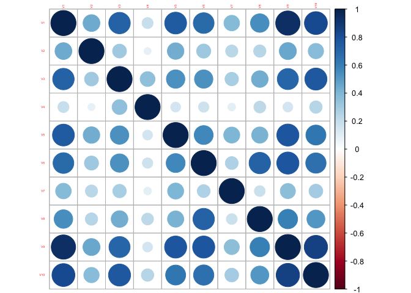<!-- -->


```r
range(centroid_correlations[centroid_correlations != 1])
```

```
## [1] 0.08069414 0.93399314
```


```r
centroid_symbols_ids <- which(names(top_mcap_prices_df_short) %in% centroid_symbols)
ggplot(
  aes(x = Index, y = Value, colour = Series), 
  data = fortify(scale(top_mcap_prices_df_short[, centroid_symbols_ids]), melt = TRUE)) + 
    geom_line(linewidth = 0.2) + 
    labs(title = "Scaled centroid prices", x ="Time", y = "Price") +
    theme(legend.position="none")
```

```
## Warning: Removed 1 row containing missing values (`geom_line()`).
```

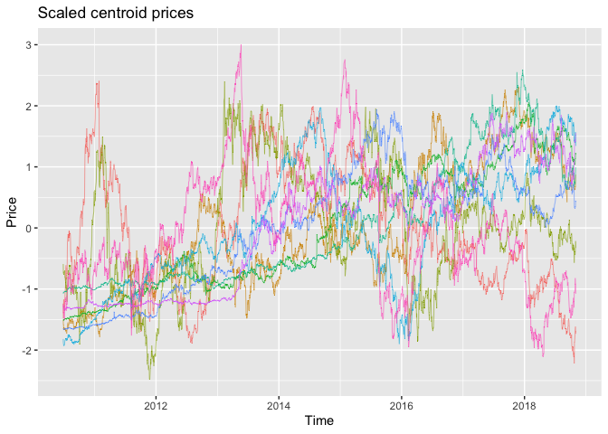<!-- -->

Plot weighted portfolio average of centroid stocks.  

```r
sds <- lapply(top_mcap_prices_df_short[, centroid_symbols_ids], function(x) {sd(x, na.rm = TRUE)})
weights <- lapply(sds, function(x) {x/sum(unlist(sds))})

centroid_pf_prices <- as.matrix(top_mcap_prices_df_short[, centroid_symbols_ids]) %*% unname(unlist(weights))


centroid_portfolio <- data.frame(
  date = index(top_mcap_prices_df_short),
  price = centroid_pf_prices
)
  
  
ggplot(aes(x = date, y = price), data = centroid_portfolio) + 
    geom_line(linewidth = 0.2) + 
    labs(title = "Avg. of centroid prices", x ="Time", y = "Price") +
    theme(legend.position="none")
```

```
## Warning: Removed 1 row containing missing values (`geom_line()`).
```

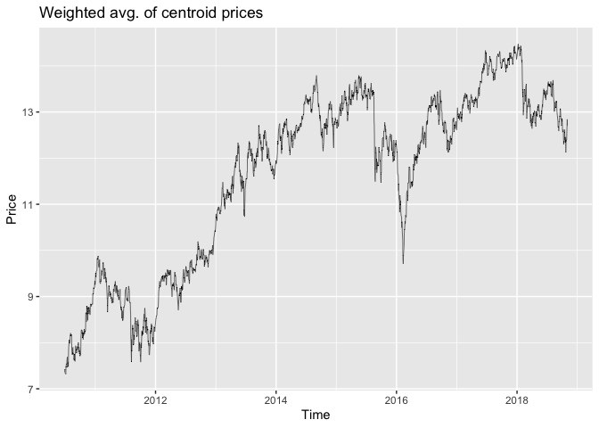<!-- -->

## Cluster plots


```r
logreturn_sd <- unlist(lapply(top_mcap_returns_df_short_filled, sd))
logreturn_mean <- unlist(lapply(top_mcap_returns_df_short_filled, mean))
```


```r
topcapplotter <- function(cluster_num) {
  id <- which(py$mcap_clusters == cluster_num)
  max_sd <- max(logreturn_sd[id])
  
  tickers <- names(top_mcap_prices_df_short)[id]
  ticker_table <- get_table_by_tickers(tickers[!is.na(tickers)], ticker_table)
  
  if(length(id) > 0) {
    
    if(length(id) > 1) {
      correlations <- stats::cor(top_mcap_returns_df_short[, id])
      correlations_plot <- function() {corrplot(correlations, method = "circle", tl.cex = 0.3)}
    } else {
      correlations <- 1
      correlations_plot <- function() {NA}
    }
    
    price_plot <- ggplot(
        aes(x = Index, y = Value, colour = Series), 
        data = fortify(top_mcap_prices_df_short[, id], melt = TRUE)) +
      geom_line(linewidth = 0.2) +
      labs(title = paste0("Cluster ", cluster_num + 1), x ="Time", y = "Price") +
      theme(legend.position="none")
  
    index_plot <- ggplot(
         aes(x = Index, y = Value, colour = Series),
         data = fortify(100 * exp(cumsum(top_mcap_returns_df_short[, id])), melt = TRUE)) +
       geom_line(linewidth = 0.2) +
       labs(title = paste0("Cluster ", cluster_num + 1, " - indexed prices"), x ="Time", y = "Price index") +
       theme(legend.position="none")
  
    norm_ret_plot <- ggplot(
        aes(x = Index, y = Value, colour = Series),
        data = fortify(100 * exp(cumsum(scale(top_mcap_returns_df_short[, id]) * max_sd)), melt = TRUE)) +
      geom_line(linewidth = 0.2) +
      labs(title = paste0("Cluster ", cluster_num + 1, " - indexed prices from z-normalized logreturns"), x ="Time", y = "Price index") +
      theme(legend.position="none")
  
    norm_plot <- ggplot(
        aes(x = Index, y = Value, colour = Series),
        data = fortify(scale(100 * exp(cumsum(top_mcap_returns_df_short[, id]))), melt = TRUE)) +
      geom_line(linewidth = 0.2) +
      labs(title = paste0("Cluster ", cluster_num + 1, " - normalized indexed prices"), x ="Time", y = "Price index") +
      theme(legend.position="none")
  } else {
    tickers = NA
    id = NA
    price_plot = NA
    index_plot = NA
    norm_ret_plot = NA
    norm_plot = NA
    correlations = NA
    correlations_plot = function() {NA}
    ticker_table = NA
  }

  list(
    tickers = tickers,
    id = id,
    price_plot = price_plot,
    index_plot = index_plot,
    norm_ret_plot = norm_ret_plot,
    norm_plot = norm_plot,
    correlations = correlations,
    correlations_plot = correlations_plot,
    ticker_table = ticker_table
  )
}
```


```r
plots <- lapply(0:(num_clusters - 1), function(i) {topcapplotter(i)})
```


```r
plots[[i]]$correlations_plot()
```


```r
cat("\n")
cat("Range of correlations: ", range(plots[[i]]$correlations[plots[[i]]$correlations != 1]), "\n")
cat("\n")
```


```r
cat(plots[[i]]$tickers)
```


```r
print(knitr::kable(plots[[i]]$ticker_table, digits = 3))
# plots$ticker_table
```


```r
print(plots[[i]]$price_plot)
```


```r
print(plots[[i]]$index_plot)
```


```r
print(plots[[i]]$norm_ret_plot)
```


```r
print(plots[[i]]$norm_plot)
```


```r
for(i in 1:num_clusters) {
  cat("\n")
  cat("### Cluster ", i, "\n")
  cat("\n")
  if(length(plots[[i]]$tickers) > 0) {

    plots[[i]]$correlations_plot()
    cat("\n")
    cat("\n")
    cat("Range of correlations: ", range(plots[[i]]$correlations[plots[[i]]$correlations != 1]), "\n")
    cat("\n")
    cat("\n")
    print(knitr::kable(plots[[i]]$ticker_table, digits = 3))
    # plots$ticker_table
    cat("\n")
    print(plots[[i]]$price_plot)
    cat("\n")
    print(plots[[i]]$index_plot)
    cat("\n")
    print(plots[[i]]$norm_ret_plot)
    cat("\n")
    print(plots[[i]]$norm_plot)
    cat("\n")
    
  } else {
    cat("\n")
    cat("Cluster ", i, " is empty.")
    cat("\n")
  }
}
```


### Cluster  1 

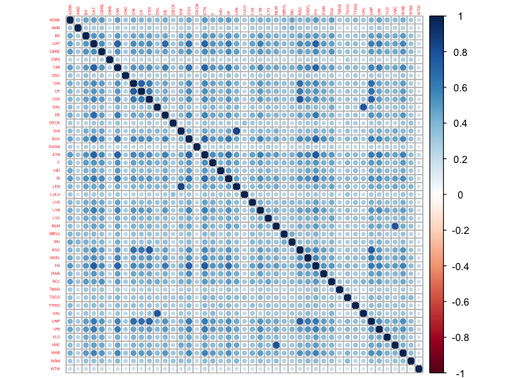<!-- -->

Range of correlations:  0.09528991 0.8426108 


|     |Symbol |Name                                                               |Last.Sale | Net.Change|X..Change |   Market.Cap|Country        | IPO.Year|   Volume|Sector                 |Industry                                              |
|:----|:------|:------------------------------------------------------------------|:---------|----------:|:---------|------------:|:--------------|--------:|--------:|:----------------------|:-----------------------------------------------------|
|74   |ADSK   |Autodesk Inc. Common Stock                                         |$302.72   |     -0.760|-0.25%    |  65084800000|United States  |       NA|   924069|Technology             |Computer Software: Prepackaged Software               |
|194  |AMD    |Advanced Micro Devices Inc. Common Stock                           |$113.10   |      1.290|1.154%    | 183276057502|United States  |       NA| 32408329|Technology             |Semiconductors                                        |
|925  |CSX    |CSX Corporation Common Stock                                       |$33.37    |      0.270|0.816%    |  64351347136|United States  |       NA| 10739899|Industrials            |Railroads                                             |
|1088 |DXCM   |DexCom Inc. Common Stock                                           |$89.07    |      4.980|5.922%    |  34790331387|United States  |     2005|  7591692|Health Care            |Medical/Dental Instruments                            |
|2130 |LULU   |lululemon athletica inc. Common Stock                              |$366.68   |    -24.170|-6.184%   |  42779662368|Canada         |     2007|  3308878|Consumer Discretionary |Apparel                                               |
|2318 |MRVL   |Marvell Technology Inc. Common Stock                               |$106.51   |      3.010|2.908%    |  92163103000|United States  |     2000| 13533675|Technology             |Semiconductors                                        |
|2348 |MU     |Micron Technology Inc. Common Stock                                |$99.52    |      3.860|4.035%    | 110882390673|United States  |       NA| 21268069|Technology             |Semiconductors                                        |
|2583 |ODFL   |Old Dominion Freight Line Inc. Common Stock                        |$206.34   |     -0.050|-0.024%   |  44053081578|United States  |     1991|  1274117|Industrials            |Trucking Freight/Courier Services                     |
|3503 |TMUS   |T-Mobile US Inc. Common Stock                                      |$270.815  |      5.735|2.163%    | 309201659176|United States  |       NA|  4835265|Telecommunications     |Telecommunications Equipment                          |
|3552 |TSCO   |Tractor Supply Company Common Stock                                |$57.14    |      0.150|0.263%    |  30818137302|United States  |     1994|  4901295|Consumer Discretionary |RETAIL: Building Materials                            |
|3566 |TTWO   |Take-Two Interactive Software Inc. Common Stock                    |$208.76   |     -1.330|-0.633%   |  36845243585|United States  |     1997|  1454185|Technology             |Computer Software: Prepackaged Software               |
|3587 |UAL    |United Airlines Holdings Inc. Common Stock                         |$104.26   |      3.370|3.34%     |  34288601334|United States  |       NA|  5205588|Consumer Discretionary |Air Freight/Delivery Services                         |
|3826 |WTW    |Willis Towers Watson Public Limited Company Ordinary Shares        |$320.40   |     -1.880|-0.583%   |  32272441229|United Kingdom |     2001|   560959|Finance                |Specialty Insurers                                    |
|4382 |BX     |Blackstone Inc. Common Stock                                       |$164.84   |      4.360|2.717%    | 120650676071|United States  |     2007|  4179183|Finance                |Investment Managers                                   |
|4410 |CAT    |Caterpillar Inc. Common Stock                                      |$353.32   |     -0.380|-0.107%   | 170583775060|United States  |       NA|  2043615|Industrials            |Construction/Ag Equipment/Trucks                      |
|4417 |CBRE   |CBRE Group Inc Common Stock Class A                                |$143.73   |      0.600|0.419%    |  43983964840|United States  |       NA|  2078167|Finance                |Real Estate                                           |
|4500 |CMG    |Chipotle Mexican Grill Inc. Common Stock                           |$57.08    |     -1.050|-1.806%   |  77362635960|United States  |     2006|  8753276|Consumer Discretionary |Restaurants                                           |
|4501 |CMI    |Cummins Inc. Common Stock                                          |$373.78   |      4.460|1.208%    |  51387709480|United States  |       NA|   802016|Industrials            |Industrial Machinery/Components                       |
|4516 |CNC    |Centene Corporation Common Stock                                   |$56.86    |      0.050|0.088%    |  28706623900|United States  |       NA|  3447696|Health Care            |Medical Specialities                                  |
|4519 |CNI    |Canadian National Railway Company Common Stock                     |$101.59   |     -0.980|-0.955%   |  63950905000|Canada         |       NA|  1412653|Industrials            |Railroads                                             |
|4550 |CP     |Canadian Pacific Kansas City Limited Common Shares                 |$77.52    |     -0.760|-0.971%   |  72335860465|Canada         |       NA|  1443200|Industrials            |Railroads                                             |
|4625 |DAL    |Delta Air Lines Inc. Common Stock                                  |$65.39    |      1.330|2.076%    |  42239455572|United States  |       NA|  6046345|Consumer Discretionary |Air Freight/Delivery Services                         |
|4646 |DE     |Deere & Company Common Stock                                       |$480.22   |     14.000|3.003%    | 130415881922|United States  |       NA|  1919274|Industrials            |Industrial Machinery/Components                       |
|4649 |DECK   |Deckers Outdoor Corporation Common Stock                           |$155.07   |     -3.040|-1.923%   |  23535538200|United States  |     1993|  2263161|Consumer Discretionary |Shoe Manufacturing                                    |
|4661 |DHI    |D.R. Horton Inc. Common Stock                                      |$130.57   |      1.230|0.951%    |  41145542997|United States  |       NA|  2477779|Consumer Discretionary |Homebuilding                                          |
|4695 |DOV    |Dover Corporation Common Stock                                     |$202.33   |     -0.360|-0.178%   |  27758050481|United States  |       NA|   571479|Industrials            |Industrial Machinery/Components                       |
|4850 |ETN    |Eaton Corporation PLC Ordinary Shares                              |$309.17   |      1.360|0.442%    | 122183984000|Ireland        |       NA|  3175050|Technology             |Industrial Machinery/Components                       |
|4875 |F      |Ford Motor Company Common Stock                                    |$9.48     |      0.130|1.39%     |  37573484234|United States  |       NA| 53530640|Consumer Discretionary |Auto Manufacturing                                    |
|5124 |HEI    |Heico Corporation Common Stock                                     |$220.85   |     -3.830|-1.705%   |  30660624272|United States  |     2000|   714003|Industrials            |Aerospace                                             |
|5252 |IR     |Ingersoll Rand Inc. Common Stock                                   |$85.72    |     -6.830|-7.38%    |  34546224985|United States  |     2017|  7441852|Industrials            |Industrial Machinery/Components                       |
|5399 |LEN    |Lennar Corporation Class A Common Stock                            |$123.84   |      0.090|0.073%    |  32882065779|United States  |       NA|  1970540|Consumer Discretionary |Homebuilding                                          |
|5435 |LVS    |Las Vegas Sands Corp. Common Stock                                 |$43.37    |      1.160|2.748%    |  31050086681|United States  |     2004|  5917301|Consumer Discretionary |Hotels/Resorts                                        |
|5441 |LYB    |LyondellBasell Industries NV Ordinary Shares Class A (Netherlands) |$76.70    |      0.460|0.603%    |  24908848017|Netherlands    |       NA|  1481277|Industrials            |Major Chemicals                                       |
|5443 |LYV    |Live Nation Entertainment Inc. Common Stock                        |$153.76   |      1.180|0.773%    |  35726702606|United States  |       NA|  1461285|Consumer Discretionary |Services-Misc. Amusement & Recreation                 |
|5527 |MLM    |Martin Marietta Materials Inc. Common Stock                        |$527.38   |     -4.280|-0.805%   |  32232440901|United States  |     1994|   687818|Industrials            |Mining & Quarrying of Nonmetallic Minerals (No Fuels) |
|5719 |NSC    |Norfolk Southern Corporation Common Stock                          |$255.99   |     -1.230|-0.478%   |  57964872427|United States  |       NA|   908791|Industrials            |Railroads                                             |
|5872 |PH     |Parker-Hannifin Corporation Common Stock                           |$700.25   |      6.430|0.927%    |  90167581311|United States  |       NA|  1034346|Industrials            |Metal Fabrications                                    |
|5976 |PWR    |Quanta Services Inc. Common Stock                                  |$285.45   |     -5.410|-1.86%    |  42135729793|United States  |       NA|  2091861|Industrials            |Engineering & Construction                            |
|6007 |RCL    |Royal Caribbean Cruises Ltd. Common Stock                          |$263.09   |      3.000|1.153%    |  70738386892|United States  |     1993|  1308342|Consumer Discretionary |Marine Transportation                                 |
|6467 |UNP    |Union Pacific Corporation Common Stock                             |$249.22   |     -1.750|-0.697%   | 150600251125|United States  |       NA|  1696298|Industrials            |Railroads                                             |
|6470 |URI    |United Rentals Inc. Common Stock                                   |$741.26   |     11.890|1.63%     |  48409539463|United States  |     1997|   415973|Consumer Discretionary |Diversified Commercial Services                       |
|6517 |VLO    |Valero Energy Corporation Common Stock                             |$135.31   |      4.320|3.298%    |  42837147201|United States  |       NA|  3512767|Energy                 |Integrated oil Companies                              |
|6521 |VMC    |Vulcan Materials Company (Holding Company) Common Stock            |$270.46   |      1.130|0.42%     |  35717288109|United States  |       NA|   927825|Industrials            |Mining & Quarrying of Nonmetallic Minerals (No Fuels) |
|6556 |WAB    |Westinghouse Air Brake Technologies Corporation Common Stock       |$188.19   |     -8.290|-4.219%   |  32151912784|United States  |       NA|  1949399|Industrials            |Railroads                                             |
|6620 |WSM    |Williams-Sonoma Inc. Common Stock (DE)                             |$214.60   |      7.540|3.641%    |  26417247768|United States  |       NA|  1126838|Consumer Discretionary |Home Furnishings                                      |

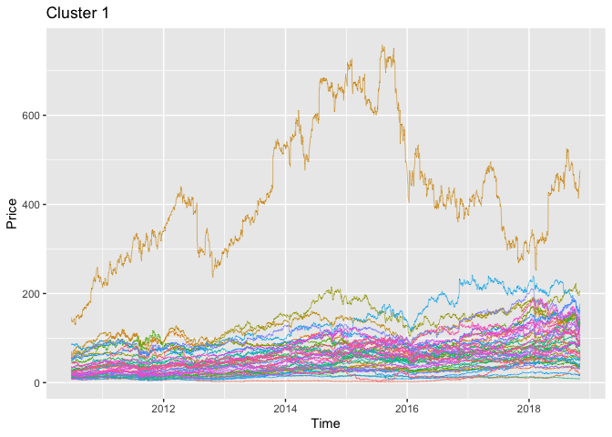<!-- -->
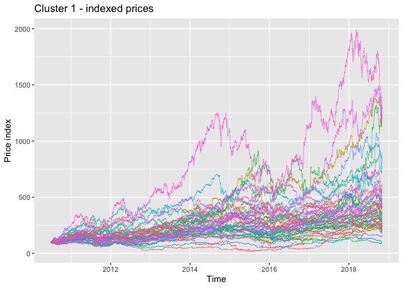<!-- -->
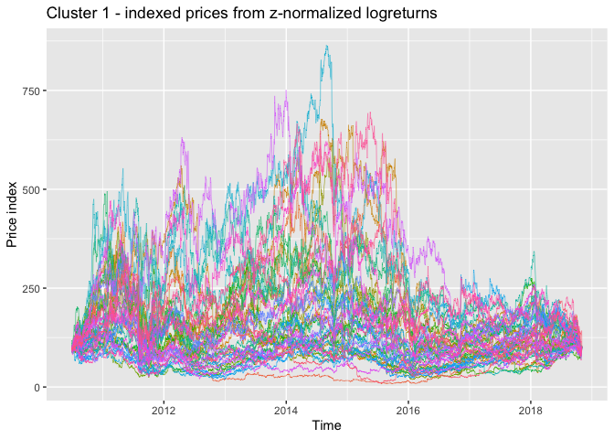<!-- -->


### Cluster  2 

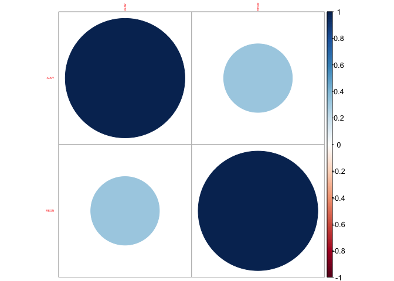<!-- -->

Range of correlations:  0.3297116 0.3297116 


|     |Symbol |Name                                        |Last.Sale | Net.Change|X..Change |  Market.Cap|Country       | IPO.Year| Volume|Sector      |Industry                                   |
|:----|:------|:-------------------------------------------|:---------|----------:|:---------|-----------:|:-------------|--------:|------:|:-----------|:------------------------------------------|
|176  |ALNY   |Alnylam Pharmaceuticals Inc. Common Stock   |$256.45   |      -8.44|-3.186%   | 33077156165|United States |     2004| 805993|Health Care |Biotechnology: Pharmaceutical Preparations |
|2975 |REGN   |Regeneron Pharmaceuticals Inc. Common Stock |$673.60   |      -0.67|-0.099%   | 73641105795|United States |     1991| 622963|Health Care |Biotechnology: Pharmaceutical Preparations |

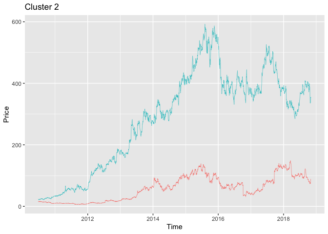<!-- -->
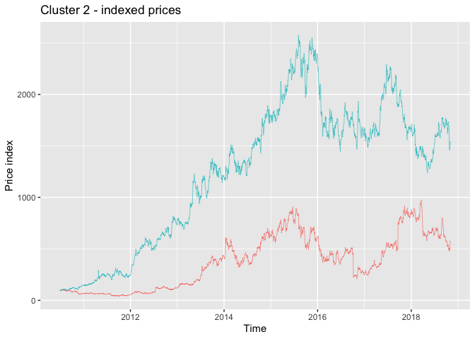<!-- -->
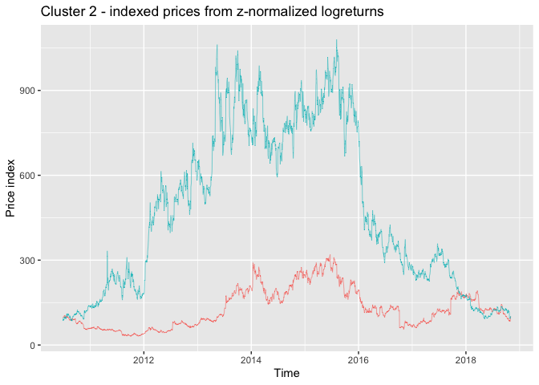<!-- -->


### Cluster  3 

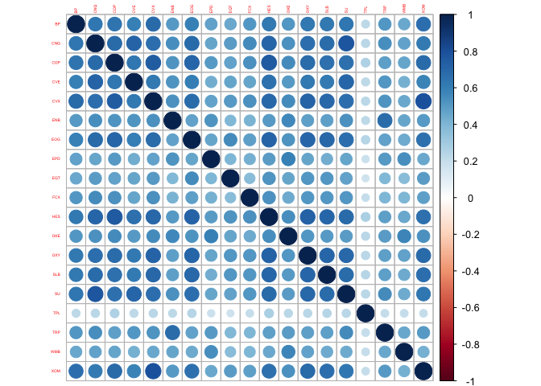<!-- -->

Range of correlations:  0.1746445 0.7917253 


|     |Symbol |Name                                            |Last.Sale | Net.Change|X..Change |   Market.Cap|Country        | IPO.Year|   Volume|Sector          |Industry                    |
|:----|:------|:-----------------------------------------------|:---------|----------:|:---------|------------:|:--------------|--------:|--------:|:---------------|:---------------------------|
|4336 |BP     |BP p.l.c. Common Stock                          |$35.00    |       0.51|1.479%    |  94418764475|United Kingdom |       NA| 13148362|Energy          |Integrated oil Companies    |
|4527 |CNQ    |Canadian Natural Resources Limited Common Stock |$30.12    |      -0.28|-0.921%   |  64297404960|Canada         |       NA|  3389614|Energy          |Oil & Gas Production        |
|4546 |COP    |ConocoPhillips Common Stock                     |$96.26    |      -0.64|-0.66%    | 110786835132|United States  |       NA|  7959637|Energy          |Integrated oil Companies    |
|4602 |CVE    |Cenovus Energy Inc Common Stock                 |$15.31    |      -0.06|-0.39%    |  27972839760|Canada         |       NA|  7263330|Energy          |Oil & Gas Production        |
|4608 |CVX    |Chevron Corporation Common Stock                |$155.34   |      -0.54|-0.346%   | 279160166426|United States  |       NA|  5827519|Energy          |Integrated oil Companies    |
|4797 |ENB    |Enbridge Inc Common Stock                       |$43.07    |      -2.38|-5.237%   |  93806460000|Canada         |       NA|  5862689|Energy          |Natural Gas Distribution    |
|4809 |EOG    |EOG Resources Inc. Common Stock                 |$129.31   |       0.29|0.225%    |  72730462646|United States  |       NA|  2220579|Energy          |Oil & Gas Production        |
|4817 |EPD    |Enterprise Products Partners L.P. Common Stock  |$33.44    |       0.23|0.693%    |  72483706863|United States  |       NA|  4566979|Utilities       |Natural Gas Distribution    |
|4831 |EQT    |EQT Corporation Common Stock                    |$53.43    |       0.56|1.059%    |  31880826120|United States  |       NA|  5552108|Energy          |Oil & Gas Production        |
|4892 |FCX    |Freeport-McMoRan Inc. Common Stock              |$39.47    |      -0.75|-1.865%   |  56715536714|United States  |       NA| 17557099|Basic Materials |Metal Mining                |
|5127 |HES    |Hess Corporation Common Stock                   |$146.55   |       0.70|0.48%     |  45154728219|United States  |       NA|  1650445|Energy          |Integrated oil Companies    |
|5774 |OKE    |ONEOK Inc. Common Stock                         |$97.85    |      -1.12|-1.132%   |  57162423089|United States  |       NA|  2813953|Utilities       |Oil & Gas Production        |
|5808 |OXY    |Occidental Petroleum Corporation Common Stock   |$48.06    |       0.18|0.376%    |  45096766599|United States  |       NA| 10413957|Energy          |Oil & Gas Production        |
|6188 |SLB    |Schlumberger N.V. Common Stock                  |$41.75    |      -0.33|-0.784%   |  58485505035|France         |       NA| 12224349|Energy          |Oilfield Services/Equipment |
|6284 |SU     |Suncor Energy  Inc. Common Stock                |$39.56    |      -0.39|-0.976%   |  49731425568|Canada         |       NA|  3955278|Energy          |Integrated oil Companies    |
|6382 |TPL    |Texas Pacific Land Corporation Common Stock     |$1372.40  |      19.22|1.42%     |  31530771974|United States  |       NA|    85792|Energy          |Oil & Gas Production        |
|6396 |TRP    |TC Energy Corporation Common Stock              |$45.92    |      -1.48|-3.122%   |  47619040000|Canada         |       NA|  3448624|Utilities       |Natural Gas Distribution    |
|6601 |WMB    |Williams Companies Inc. (The) Common Stock      |$56.98    |      -0.48|-0.835%   |  69459292250|United States  |       NA|  7440827|Utilities       |Natural Gas Distribution    |
|6640 |XOM    |Exxon Mobil Corporation Common Stock            |$108.24   |       0.11|0.102%    | 475725032577|United States  |       NA| 15726587|Energy          |Integrated oil Companies    |

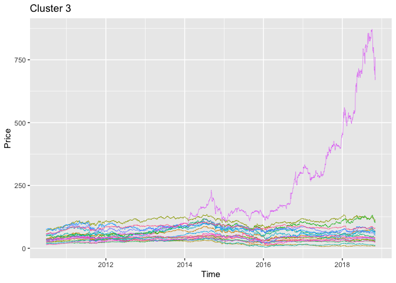<!-- -->
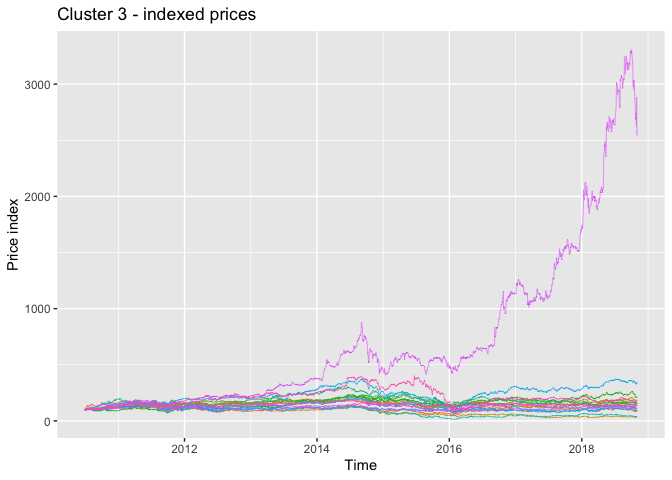<!-- -->
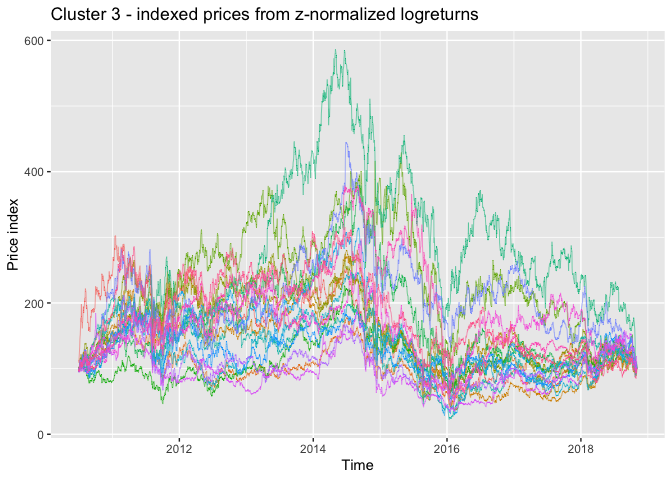<!-- -->


### Cluster  4 

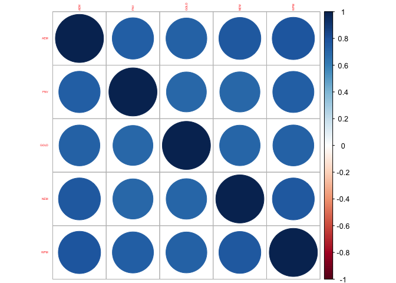<!-- -->

Range of correlations:  0.690282 0.7723112 


|     |Symbol |Name                                                |Last.Sale | Net.Change|X..Change |  Market.Cap|Country       | IPO.Year|   Volume|Sector          |Industry        |
|:----|:------|:---------------------------------------------------|:---------|----------:|:---------|-----------:|:-------------|--------:|--------:|:---------------|:---------------|
|3974 |AEM    |Agnico Eagle Mines Limited Common Stock             |$95.85    |      -4.96|-4.92%    | 48107830137|Canada        |       NA|  4623051|Basic Materials |Precious Metals |
|4943 |FNV    |Franco-Nevada Corporation                           |$138.32   |      -5.66|-3.931%   | 26616460729|Canada        |       NA|   614397|Basic Materials |Precious Metals |
|5065 |GOLD   |Barrick Gold Corporation Common Stock (BC)          |$17.94    |      -0.50|-2.711%   | 31444054777|Canada        |       NA| 29054056|Basic Materials |Precious Metals |
|5645 |NEM    |Newmont Corporation                                 |$46.54    |      -1.21|-2.534%   | 52983485293|United States |       NA|  9887843|Basic Materials |Precious Metals |
|6611 |WPM    |Wheaton Precious Metals Corp Common Shares (Canada) |$67.50    |      -1.76|-2.541%   | 30622988183|Canada        |       NA|  1434846|Basic Materials |Precious Metals |

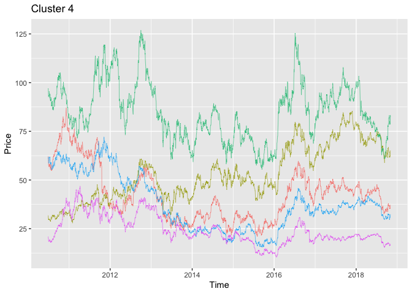<!-- -->
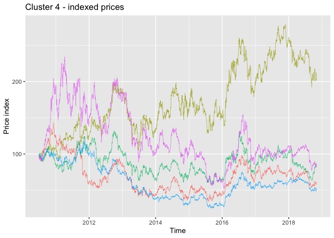<!-- -->
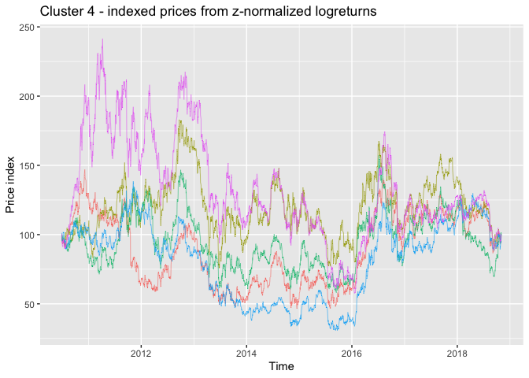<!-- -->


### Cluster  5 

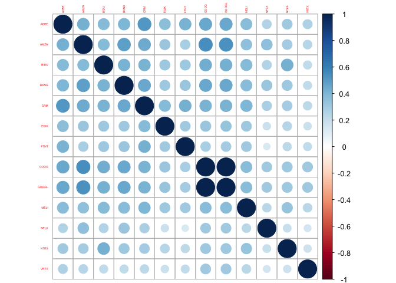<!-- -->

Range of correlations:  0.1390009 0.9948979 


|     |Symbol |Name                                             |Last.Sale | Net.Change|X..Change |   Market.Cap|Country       | IPO.Year|   Volume|Sector                 |Industry                                       |
|:----|:------|:------------------------------------------------|:---------|----------:|:---------|------------:|:-------------|--------:|--------:|:----------------------|:----------------------------------------------|
|61   |ADBE   |Adobe Inc. Common Stock                          |$460.16   |       0.94|0.205%    | 2.003076e+11|United States |     1986|  2621957|Technology             |Computer Software: Prepackaged Software        |
|214  |AMZN   |Amazon.com Inc. Common Stock                     |$228.68   |      -1.69|-0.734%   | 2.423489e+12|United States |     1997| 26973108|Consumer Discretionary |Catalog/Specialty Distribution                 |
|474  |BIDU   |Baidu Inc. ADS                                   |$97.48    |       0.89|0.921%    | 3.418126e+10|China         |     2005| 11595238|Technology             |Computer Software: Programming Data Processing |
|488  |BKNG   |Booking Holdings Inc. Common Stock               |$5044.40  |      35.70|0.713%    | 1.669531e+11|United States |       NA|   202541|Consumer Discretionary |Transportation Services                        |
|1175 |EQIX   |Equinix Inc. Common Stock REIT                   |$933.60   |      10.60|1.148%    | 9.086916e+10|United States |     2000|   523352|Real Estate            |Real Estate Investment Trusts                  |
|1387 |FTNT   |Fortinet Inc. Common Stock                       |$111.64   |       1.66|1.509%    | 8.556678e+10|United States |     2009|  4976400|Technology             |Computer peripheral equipment                  |
|1520 |GOOG   |Alphabet Inc. Class C Capital Stock              |$186.87   |      -1.01|-0.538%   | 2.277945e+12|United States |     2004| 12672393|Technology             |Computer Software: Programming Data Processing |
|1521 |GOOGL  |Alphabet Inc. Class A Common Stock               |$185.23   |      -0.91|-0.489%   | 2.257954e+12|United States |     2004| 20401830|Technology             |Computer Software: Programming Data Processing |
|2213 |MELI   |MercadoLibre Inc. Common Stock                   |$2109.99  |      43.84|2.122%    | 1.069710e+11|Argentina     |     2007|   355437|Consumer Discretionary |Business Services                              |
|2426 |NFLX   |Netflix Inc. Common Stock                        |$1058.60  |      14.91|1.429%    | 4.528237e+11|United States |     2002|  3142695|Consumer Discretionary |Consumer Electronics/Video Chains              |
|2483 |NTES   |NetEase Inc. American Depositary Shares          |$103.50   |      -1.31|-1.25%    | 6.646321e+10|China         |       NA|  1496724|Technology             |Computer Software: Prepackaged Software        |
|3727 |VRTX   |Vertex Pharmaceuticals Incorporated Common Stock |$459.00   |      -3.58|-0.774%   | 1.182059e+11|United States |     1991|   994996|Health Care            |Biotechnology: Pharmaceutical Preparations     |
|4572 |CRM    |Salesforce Inc. Common Stock                     |$326.54   |      -3.31|-1.003%   | 3.124988e+11|United States |     2004|  5875771|Technology             |Computer Software: Prepackaged Software        |

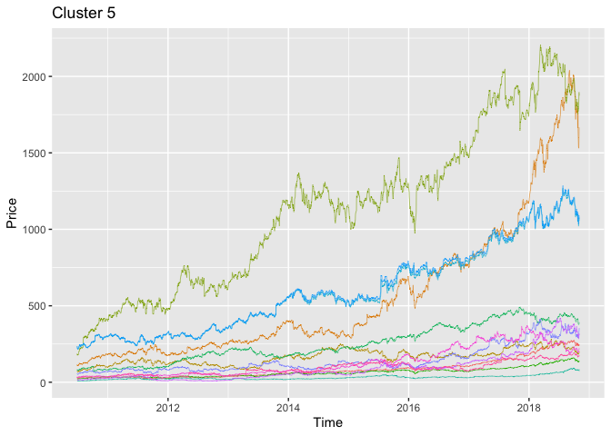<!-- -->
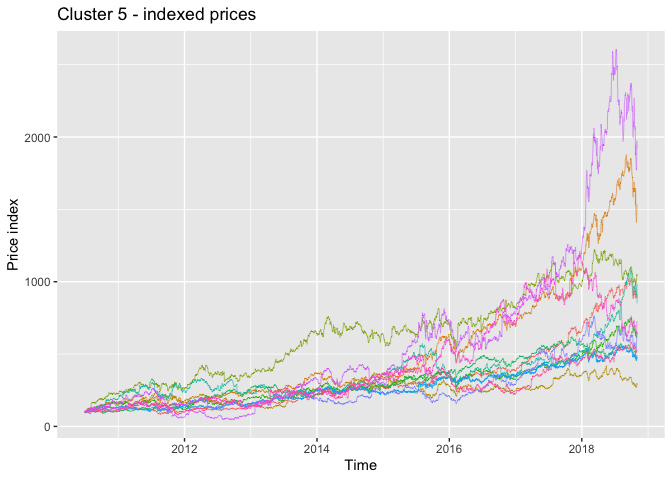<!-- -->
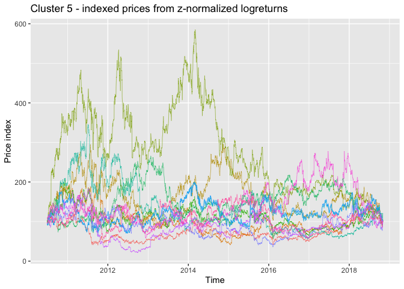<!-- -->


### Cluster  6 

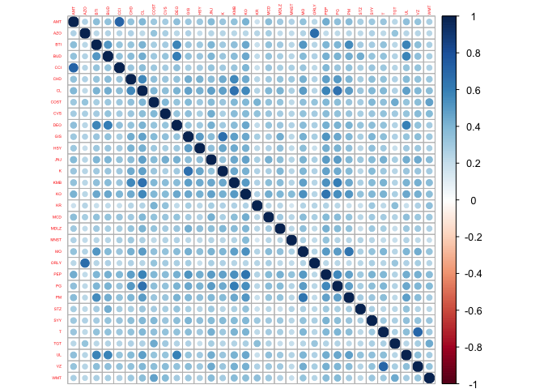<!-- -->

Range of correlations:  0.1516609 0.7135947 


|     |Symbol |Name                                                         |Last.Sale | Net.Change|X..Change |   Market.Cap|Country        | IPO.Year|   Volume|Sector                 |Industry                                   |
|:----|:------|:------------------------------------------------------------|:---------|----------:|:---------|------------:|:--------------|--------:|--------:|:----------------------|:------------------------------------------|
|861  |COST   |Costco Wholesale Corporation Common Stock                    |$1071.85  |      -5.01|-0.465%   | 475793003810|United States  |       NA|  1409602|Consumer Discretionary |Department/Specialty Retail Stores         |
|2204 |MDLZ   |Mondelez International Inc. Class A Common Stock             |$60.82    |      -0.34|-0.556%   |  78672200657|United States  |       NA| 10040881|Consumer Staples       |Packaged Foods                             |
|2281 |MNST   |Monster Beverage Corporation                                 |$49.25    |      -0.27|-0.545%   |  47896593206|United States  |       NA|  6107115|Consumer Staples       |Beverages (Production/Distribution)        |
|2648 |ORLY   |O'Reilly Automotive Inc. Common Stock                        |$1318.80  |     -16.88|-1.264%   |  76135237928|United States  |     1993|   344553|Consumer Discretionary |Auto & Home Supply Stores                  |
|2739 |PEP    |PepsiCo Inc. Common Stock                                    |$143.39   |      -1.19|-0.823%   | 196659361771|United States  |       NA|  4999988|Consumer Staples       |Beverages (Production/Distribution)        |
|4066 |AMT    |American Tower Corporation (REIT) Common Stock               |$189.38   |      -0.61|-0.321%   |  88495266383|United States  |       NA|  1776015|Real Estate            |Real Estate Investment Trusts              |
|4177 |AZO    |AutoZone Inc. Common Stock                                   |$3458.55  |     -11.16|-0.322%   |  58041939468|United States  |       NA|    77024|Consumer Discretionary |Auto & Home Supply Stores                  |
|4362 |BTI    |British American Tobacco  Industries p.l.c. Common Stock ADR |$38.82    |      -0.79|-1.994%   |  80502772360|United Kingdom |     1998|  7051545|Health Care            |Medicinal Chemicals and Botanical Products |
|4367 |BUD    |Anheuser-Busch Inbev SA Sponsored ADR (Belgium)              |$53.12    |       0.00|0.00%     |  92279918611|Belgium        |       NA|  1865937|Consumer Staples       |Beverages (Production/Distribution)        |
|4422 |CCI    |Crown Castle Inc. Common Stock                               |$87.96    |      -1.91|-2.125%   |  38227258376|United States  |       NA|  3411345|Real Estate            |Real Estate Investment Trusts              |
|4451 |CHD    |Church & Dwight Company Inc. Common Stock                    |$105.00   |      -2.53|-2.353%   |  25724741175|United States  |       NA|  1723559|Consumer Discretionary |Package Goods/Cosmetics                    |
|4482 |CL     |Colgate-Palmolive Company Common Stock                       |$86.04    |      -1.71|-1.949%   |  70295622740|United States  |       NA|  4136569|Consumer Discretionary |Package Goods/Cosmetics                    |
|4607 |CVS    |CVS Health Corporation Common Stock                          |$65.83    |      -0.54|-0.814%   |  82998138997|United States  |       NA| 10208402|Consumer Staples       |Retail-Drug Stores and Proprietary Stores  |
|4652 |DEO    |Diageo plc Common Stock                                      |$107.53   |      -1.85|-1.691%   |  59817788321|United Kingdom |       NA|   864253|Consumer Staples       |Beverages (Production/Distribution)        |
|5030 |GIS    |General Mills Inc. Common Stock                              |$58.84    |      -0.70|-1.176%   |  32434446750|United States  |       NA|  4690261|Consumer Staples       |Packaged Foods                             |
|5181 |HSY    |The Hershey Company Common Stock                             |$157.88   |      -2.93|-1.822%   |  31947768246|United States  |       NA|  1449913|Consumer Staples       |Specialty Foods                            |
|5291 |JNJ    |Johnson & Johnson Common Stock                               |$156.15   |      -1.10|-0.70%    | 375950327078|United States  |       NA|  6402296|Health Care            |Biotechnology: Pharmaceutical Preparations |
|5311 |K      |Kellanova Common Stock                                       |$82.26    |       0.05|0.061%    |  28354848760|United States  |       NA|  2982343|Consumer Staples       |Packaged Foods                             |
|5344 |KMB    |Kimberly-Clark Corporation Common Stock                      |$132.67   |      -2.69|-1.987%   |  44243495414|United States  |       NA|  1976447|Consumer Discretionary |Containers/Packaging                       |
|5356 |KO     |Coca-Cola Company (The) Common Stock                         |$68.87    |      -0.63|-0.906%   | 296677988894|United States  |       NA| 20769741|Consumer Staples       |Beverages (Production/Distribution)        |
|5362 |KR     |Kroger Company (The) Common Stock                            |$65.13    |      -0.50|-0.762%   |  47128467247|United States  |       NA|  3856625|Consumer Staples       |Food Chains                                |
|5464 |MCD    |McDonald's Corporation Common Stock                          |$308.55   |      -1.47|-0.474%   | 221113004115|United States  |       NA|  2673769|Consumer Discretionary |Restaurants                                |
|5540 |MO     |Altria Group Inc.                                            |$53.29    |      -0.33|-0.615%   |  90316583811|United States  |       NA|  4563396|Health Care            |Medicinal Chemicals and Botanical Products |
|5867 |PG     |Procter & Gamble Company (The) Common Stock                  |$162.89   |      -8.13|-4.754%   | 381952911982|United States  |       NA| 13171662|Consumer Discretionary |Package Goods/Cosmetics                    |
|5898 |PM     |Philip Morris International Inc Common Stock                 |$150.46   |       1.28|0.858%    | 233943817472|United States  |       NA|  4777678|Health Care            |Medicinal Chemicals and Botanical Products |
|6283 |STZ    |Constellation Brands Inc. Common Stock                       |$162.94   |      -0.26|-0.159%   |  29448200296|United States  |       NA|  2283725|Consumer Staples       |Beverages (Production/Distribution)        |
|6303 |SYY    |Sysco Corporation Common Stock                               |$71.10    |      -0.77|-1.071%   |  34784227688|United States  |       NA|  2542037|Consumer Discretionary |Food Distributors                          |
|6304 |T      |AT&T Inc.                                                    |$25.87    |       0.24|0.936%    | 185699594210|United States  |       NA| 31685963|Telecommunications     |Telecommunications Equipment               |
|6351 |TGT    |Target Corporation Common Stock                              |$127.88   |      -0.70|-0.544%   |  58596141481|United States  |       NA|  4547301|Consumer Discretionary |Department/Specialty Retail Stores         |
|6457 |UL     |Unilever PLC Common Stock                                    |$54.89    |      -1.07|-1.912%   | 135886931046|United Kingdom |       NA|  2502253|Consumer Discretionary |Package Goods/Cosmetics                    |
|6604 |WMT    |Walmart Inc. Common Stock                                    |$104.04   |      -1.01|-0.961%   | 835793501809|United States  |       NA| 14099209|Consumer Discretionary |Department/Specialty Retail Stores         |

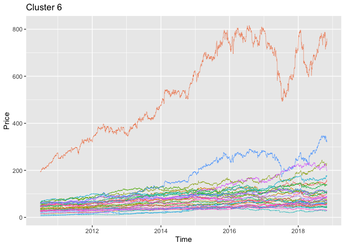<!-- -->
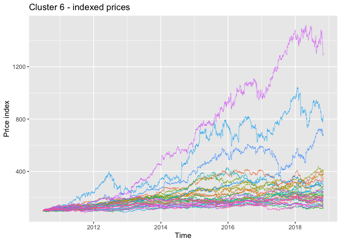<!-- -->
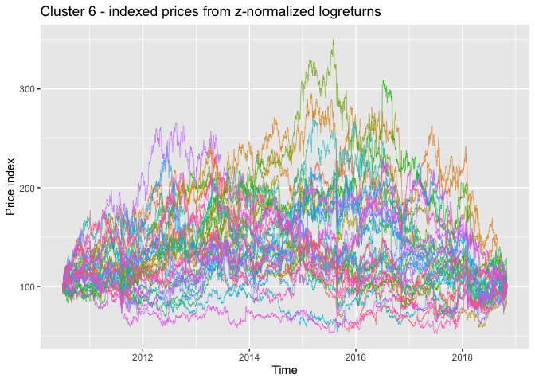<!-- -->


### Cluster  7 

```
## Warning in min(x): no non-missing arguments to min; returning Inf
```

```
## Warning in max(x): no non-missing arguments to max; returning -Inf
```

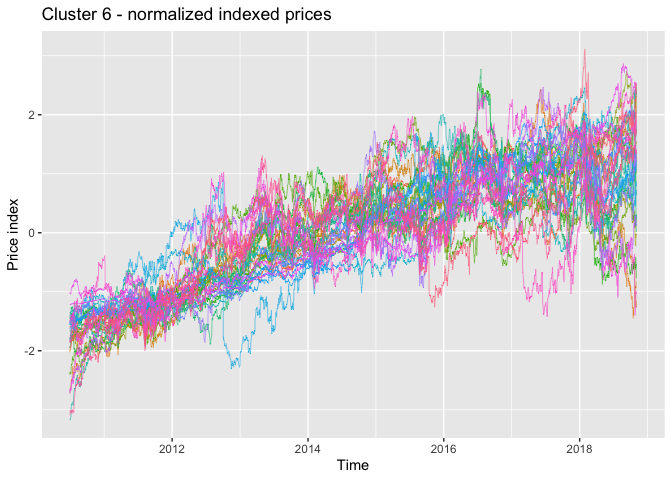<!-- -->Range of correlations:  Inf -Inf 


|     |Symbol |Name                    |Last.Sale | Net.Change|X..Change |   Market.Cap|Country       | IPO.Year|   Volume|Sector                 |Industry           |
|:----|:------|:-----------------------|:---------|----------:|:---------|------------:|:-------------|--------:|--------:|:----------------------|:------------------|
|3555 |TSLA   |Tesla Inc. Common Stock |$355.84   |       -0.1|-0.028%   | 1.144565e+12|United States |     2010| 68052647|Consumer Discretionary |Auto Manufacturing |

```
## Warning: Removed 1 row containing missing values (`geom_line()`).
```

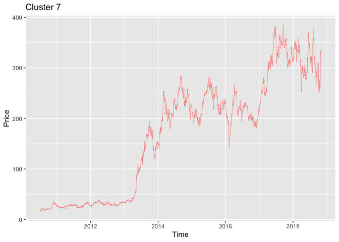<!-- -->
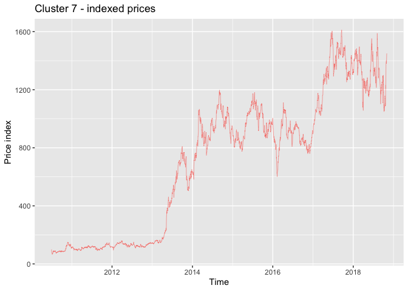<!-- -->
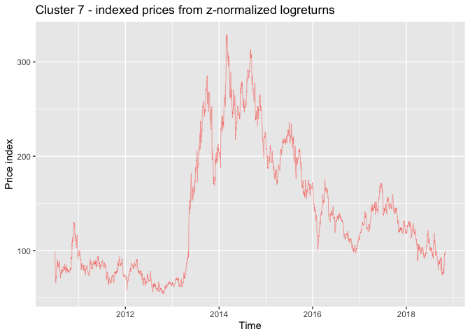<!-- -->


### Cluster  8 

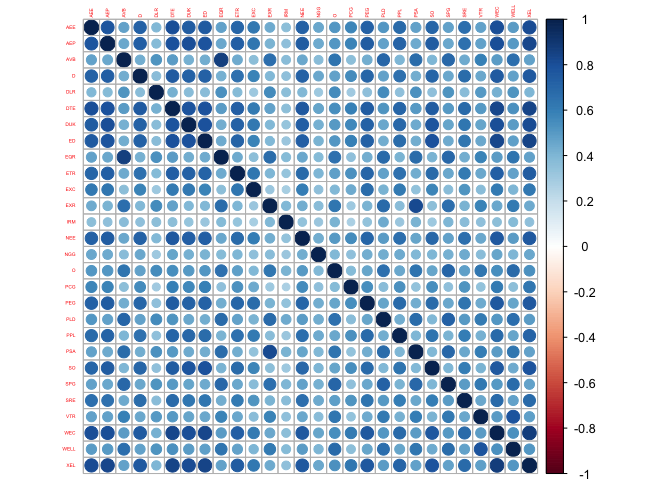<!-- -->

Range of correlations:  0.2758113 0.8728014 


|     |Symbol |Name                                                                         |Last.Sale | Net.Change|X..Change |   Market.Cap|Country        | IPO.Year|   Volume|Sector      |Industry                      |
|:----|:------|:----------------------------------------------------------------------------|:---------|----------:|:---------|------------:|:--------------|--------:|--------:|:-----------|:-----------------------------|
|90   |AEP    |American Electric Power Company Inc. Common Stock                            |$101.83   |       0.84|0.832%    |  54231128063|United States  |       NA|  2770855|Utilities   |Electric Utilities: Central   |
|1219 |EXC    |Exelon Corporation Common Stock                                              |$42.85    |      -0.12|-0.279%   |  43073555177|United States  |       NA|  8592975|Utilities   |Power Generation              |
|3842 |XEL    |Xcel Energy Inc. Common Stock                                                |$68.61    |       0.21|0.307%    |  39398726124|United States  |       NA|  4167836|Utilities   |Power Generation              |
|3971 |AEE    |Ameren Corporation Common Stock                                              |$98.07    |      -0.20|-0.204%   |  26177606110|United States  |       NA|  3561331|Utilities   |Power Generation              |
|4156 |AVB    |AvalonBay Communities Inc. Common Stock                                      |$218.35   |      -1.75|-0.795%   |  31057499826|United States  |       NA|   741056|Real Estate |Real Estate Investment Trusts |
|4623 |D      |Dominion Energy Inc. Common Stock                                            |$55.59    |      -1.12|-1.975%   |  46696135109|United States  |       NA|  3663674|Utilities   |Electric Utilities: Central   |
|4676 |DLR    |Digital Realty Trust Inc. Common Stock                                       |$164.28   |      -0.53|-0.322%   |  54493746914|United States  |     2004|  4795087|Real Estate |Real Estate Investment Trusts |
|4711 |DTE    |DTE Energy Company Common Stock                                              |$129.04   |       1.23|0.962%    |  26724259617|United States  |       NA|  1891676|Utilities   |Electric Utilities: Central   |
|4716 |DUK    |Duke Energy Corporation (Holding Company) Common Stock                       |$111.60   |      -2.35|-2.062%   |  86209036398|United States  |       NA|  3581582|Utilities   |Power Generation              |
|4750 |ED     |Consolidated Edison Inc. Common Stock                                        |$94.92    |      -0.74|-0.774%   |  32881445075|United States  |       NA|  1948209|Utilities   |Power Generation              |
|4829 |EQR    |Equity Residential Common Shares of Beneficial Interest                      |$71.23    |      -0.29|-0.405%   |  27026761575|United States  |       NA|  1901216|Real Estate |Real Estate Investment Trusts |
|4852 |ETR    |Entergy Corporation Common Stock                                             |$82.49    |      -0.76|-0.913%   |  35373034150|United States  |       NA|  3915977|Utilities   |Electric Utilities: Central   |
|4874 |EXR    |Extra Space Storage Inc Common Stock                                         |$154.92   |      -1.03|-0.66%    |  32840494509|United States  |     2004|  1409682|Real Estate |Real Estate Investment Trusts |
|5253 |IRM    |Iron Mountain Incorporated (Delaware)Common Stock REIT                       |$95.41    |       0.16|0.168%    |  27999053997|United States  |       NA|  2521271|Real Estate |Real Estate Investment Trusts |
|5640 |NEE    |NextEra Energy Inc. Common Stock                                             |$68.06    |      -0.54|-0.787%   | 139958892992|United States  |       NA| 14183718|Technology  |EDP Services                  |
|5652 |NGG    |National Grid Transco PLC National Grid PLC (NEW) American Depositary Shares |$60.73    |      -0.54|-0.881%   |  59420856933|United Kingdom |       NA|   511375|Utilities   |Natural Gas Distribution      |
|5755 |O      |Realty Income Corporation Common Stock                                       |$54.49    |      -0.43|-0.783%   |  47690250115|United States  |       NA|  3720631|Real Estate |Real Estate Investment Trusts |
|5832 |PCG    |Pacific Gas & Electric Co. Common Stock                                      |$15.29    |      -0.56|-3.533%   |  44030051138|United States  |       NA| 28222107|Utilities   |Power Generation              |
|5853 |PEG    |Public Service Enterprise Group Incorporated Common Stock                    |$83.70    |      -0.18|-0.215%   |  41701467738|United States  |       NA|  1665285|Utilities   |Power Generation              |
|5894 |PLD    |Prologis Inc. Common Stock                                                   |$120.85   |      -0.05|-0.041%   | 111928248750|United States  |       NA|  2101258|Real Estate |Real Estate Investment Trusts |
|5920 |PPL    |PPL Corporation Common Stock                                                 |$33.73    |      -0.68|-1.976%   |  24891728269|United States  |       NA|  7404345|Utilities   |Electric Utilities: Central   |
|5945 |PSA    |Public Storage Common Stock                                                  |$297.40   |      -3.84|-1.275%   |  52077312807|United States  |       NA|   398801|Real Estate |Real Estate Investment Trusts |
|6214 |SO     |Southern Company (The) Common Stock                                          |$85.58    |      -1.20|-1.383%   |  93768652124|United States  |       NA|  4390808|Utilities   |Electric Utilities: Central   |
|6231 |SPG    |Simon Property Group Inc. Common Stock                                       |$185.05   |      -1.17|-0.628%   |  60377769437|United States  |       NA|   998005|Real Estate |Real Estate Investment Trusts |
|6252 |SRE    |DBA Sempra Common Stock                                                      |$84.10    |       0.24|0.286%    |  53268878102|United States  |       NA|  3603492|Utilities   |Natural Gas Distribution      |
|6549 |VTR    |Ventas Inc. Common Stock                                                     |$66.53    |       1.59|2.448%    |  27899656548|United States  |       NA|  4227448|Real Estate |Real Estate Investment Trusts |
|6573 |WEC    |WEC Energy Group Inc. Common Stock                                           |$102.97   |      -0.81|-0.78%    |  32575017305|United States  |       NA|  1743218|Utilities   |Power Generation              |
|6574 |WELL   |Welltower Inc. Common Stock                                                  |$149.97   |      -1.47|-0.971%   |  96176970058|United States  |       NA|  1878568|Real Estate |Real Estate Investment Trusts |

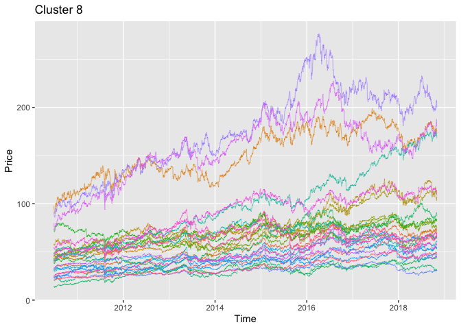<!-- -->
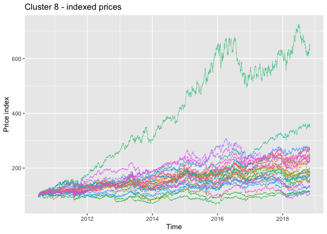<!-- -->
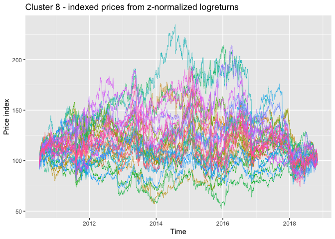<!-- -->


### Cluster  9 

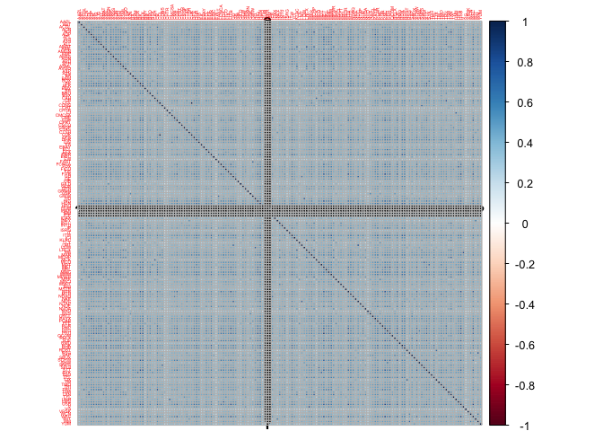<!-- -->

Range of correlations:  NA NA 


|     |Symbol |Name                                                                           |Last.Sale | Net.Change|X..Change |   Market.Cap|Country        | IPO.Year|    Volume|Sector                 |Industry                                                       |
|:----|:------|:------------------------------------------------------------------------------|:---------|----------:|:---------|------------:|:--------------|--------:|---------:|:----------------------|:--------------------------------------------------------------|
|9    |AAPL   |Apple Inc. Common Stock                                                        |$244.60   |      3.070|1.271%    | 3.674399e+12|United States  |     1980|  40837639|Technology             |Computer Manufacturing                                         |
|35   |ACGL   |Arch Capital Group Ltd. Common Stock                                           |$88.20    |     -1.960|-2.174%   | 3.318453e+10|Bermuda        |       NA|   1823984|Finance                |Property-Casualty Insurers                                     |
|65   |ADI    |Analog Devices Inc. Common Stock                                               |$214.61   |      5.270|2.517%    | 1.065103e+11|United States  |       NA|   3938563|Technology             |Semiconductors                                                 |
|70   |ADP    |Automatic Data Processing Inc. Common Stock                                    |$308.15   |     -2.070|-0.667%   | 1.253773e+11|United States  |       NA|   1100945|Technology             |EDP Services                                                   |
|191  |AMAT   |Applied Materials Inc. Common Stock                                            |$169.20   |    -15.070|-8.178%   | 1.376754e+11|United States  |     1972|  12446698|Technology             |Semiconductors                                                 |
|196  |AMGN   |Amgen Inc. Common Stock                                                        |$291.16   |     -3.430|-1.164%   | 1.565080e+11|United States  |     1983|   2189346|Health Care            |Biotechnology: Biological Products (No Diagnostic Substances)  |
|232  |ANSS   |ANSYS Inc. Common Stock                                                        |$338.93   |     -0.235|-0.069%   | 2.963941e+10|United States  |     1996|    307401|Technology             |Computer Software: Prepackaged Software                        |
|300  |ASML   |ASML Holding N.V. New York Registry Shares                                     |$751.55   |    -25.440|-3.274%   | 2.956761e+11|Netherlands    |     1995|   2045959|Technology             |Industrial Machinery/Components                                |
|368  |AVGO   |Broadcom Inc. Common Stock                                                     |$233.04   |     -2.760|-1.17%    | 1.092341e+12|United States  |     2009|  16968260|Technology             |Semiconductors                                                 |
|391  |AZN    |AstraZeneca PLC American Depositary Shares                                     |$73.58    |     -0.870|-1.169%   | 2.281835e+11|United Kingdom |       NA|   5783596|Health Care            |Biotechnology: Pharmaceutical Preparations                     |
|680  |CDNS   |Cadence Design Systems Inc. Common Stock                                       |$295.19   |     -0.970|-0.328%   | 8.095969e+10|United States  |       NA|   2104828|Technology             |Computer Software: Prepackaged Software                        |
|756  |CHTR   |Charter Communications Inc. Class A Common Stock New                           |$360.27   |     -0.500|-0.139%   | 5.113904e+10|United States  |       NA|    671832|Telecommunications     |Cable & Other Pay Television Services                          |
|803  |CMCSA  |Comcast Corporation Class A Common Stock                                       |$35.39    |      0.010|0.028%    | 1.338104e+11|United States  |       NA|  17925568|Telecommunications     |Cable & Other Pay Television Services                          |
|805  |CME    |CME Group Inc. Class A Common Stock                                            |$245.48   |     -4.630|-1.851%   | 8.846171e+10|United States  |     2002|   1444259|Finance                |Investment Bankers/Brokers/Service                             |
|868  |CPRT   |Copart Inc. (DE) Common Stock                                                  |$59.39    |     -0.440|-0.735%   | 5.722395e+10|United States  |     1994|   2392531|Consumer Discretionary |Retail-Auto Dealers and Gas Stations                           |
|912  |CSCO   |Cisco Systems Inc. Common Stock (DE)                                           |$64.87    |      1.030|1.613%    | 2.583615e+11|United States  |     1990|  23689848|Telecommunications     |Computer Communications Equipment                              |
|913  |CSGP   |CoStar Group Inc. Common Stock                                                 |$74.06    |      0.500|0.68%     | 3.036160e+10|United States  |     1998|   3412412|Consumer Discretionary |Business Services                                              |
|926  |CTAS   |Cintas Corporation Common Stock                                                |$204.22   |     -1.380|-0.671%   | 8.241174e+10|United States  |     1983|   1062560|Consumer Discretionary |Apparel                                                        |
|939  |CTSH   |Cognizant Technology Solutions Corporation Class A Common Stock                |$90.70    |      1.120|1.25%     | 4.486163e+10|United States  |     1998|   4369973|Technology             |EDP Services                                                   |
|1099 |EA     |Electronic Arts Inc. Common Stock                                              |$129.40   |     -0.420|-0.324%   | 3.372392e+10|United States  |       NA|   2319075|Technology             |Computer Software: Prepackaged Software                        |
|1100 |EBAY   |eBay Inc. Common Stock                                                         |$69.90    |      0.640|0.924%    | 3.348210e+10|United States  |     1998|   3501531|Consumer Discretionary |Business Services                                              |
|1177 |ERIC   |Ericsson American Depositary Shares                                            |$7.87     |     -0.040|-0.506%   | 2.631847e+10|Sweden         |       NA|   7777501|Technology             |Radio And Television Broadcasting And Communications Equipment |
|1246 |FAST   |Fastenal Company Common Stock                                                  |$74.78    |     -0.010|-0.013%   | 4.288033e+10|United States  |     1987|   2549005|Consumer Discretionary |RETAIL: Building Materials                                     |
|1267 |FCNCA  |First Citizens BancShares Inc. Class A Common Stock                            |$2141.49  |     34.470|1.636%    | 2.995836e+10|United States  |       NA|     34868|Finance                |Major Banks                                                    |
|1305 |FITB   |Fifth Third Bancorp Common Stock                                               |$44.06    |      0.480|1.101%    | 2.954414e+10|United States  |       NA|   4676808|Finance                |Major Banks                                                    |
|1476 |GILD   |Gilead Sciences Inc. Common Stock                                              |$104.08   |     -1.880|-1.774%   | 1.297114e+11|United States  |     1992|   6399591|Health Care            |Biotechnology: Biological Products (No Diagnostic Substances)  |
|1633 |HON    |Honeywell International Inc. Common Stock                                      |$202.75   |     -2.520|-1.228%   | 1.318377e+11|United States  |       NA|   5349124|Industrials            |Aerospace                                                      |
|1720 |IBKR   |Interactive Brokers Group Inc. Class A Common Stock                            |$234.12   |     -0.730|-0.311%   | 2.549077e+10|United States  |     2019|   1673195|Finance                |Investment Bankers/Brokers/Service                             |
|1741 |IDXX   |IDEXX Laboratories Inc. Common Stock                                           |$444.53   |    -15.230|-3.313%   | 3.640019e+10|United States  |     1991|    553751|Health Care            |Biotechnology: In Vitro & In Vivo Diagnostic Substances        |
|1808 |INTC   |Intel Corporation Common Stock                                                 |$23.60    |     -0.530|-2.196%   | 1.021880e+11|United States  |       NA| 229710276|Technology             |Semiconductors                                                 |
|1813 |INTU   |Intuit Inc. Common Stock                                                       |$587.38   |      3.480|0.596%    | 1.644870e+11|United States  |     1993|   1348762|Technology             |Computer Software: Prepackaged Software                        |
|1857 |ISRG   |Intuitive Surgical Inc. Common Stock                                           |$595.55   |      4.160|0.703%    | 2.124071e+11|United States  |     2000|   1188782|Health Care            |Industrial Specialties                                         |
|1944 |KLAC   |KLA Corporation Common Stock                                                   |$750.74   |    -13.540|-1.772%   | 9.976340e+10|United States  |     1980|    998510|Technology             |Electronic Components                                          |
|2106 |LRCX   |Lam Research Corporation Common Stock                                          |$82.75    |     -0.550|-0.66%    | 1.062230e+11|United States  |     1984|   9148952|Technology             |Industrial Machinery/Components                                |
|2158 |MAR    |Marriott International Class A Common Stock                                    |$283.52   |     -4.720|-1.638%   | 7.816513e+10|United States  |       NA|   1659899|Consumer Discretionary |Hotels/Resorts                                                 |
|2189 |MCHP   |Microchip Technology Incorporated Common Stock                                 |$55.76    |      1.500|2.764%    | 2.998879e+10|United States  |     1993|   7122874|Technology             |Semiconductors                                                 |
|2301 |MPWR   |Monolithic Power Systems Inc. Common Stock                                     |$684.93   |    -15.060|-2.151%   | 3.341089e+10|United States  |     2004|    625261|Technology             |Semiconductors                                                 |
|2325 |MSFT   |Microsoft Corporation Common Stock                                             |$408.43   |     -2.110|-0.514%   | 3.036261e+12|United States  |     1986|  22680015|Technology             |Computer Software: Prepackaged Software                        |
|2334 |MSTR   |MicroStrategy Incorporated Common Stock Class A                                |$337.73   |     12.810|3.943%    | 8.515157e+10|United States  |     1998|  13884642|Technology             |Computer Software: Prepackaged Software                        |
|2396 |NDAQ   |Nasdaq Inc. Common Stock                                                       |$80.91    |     -0.780|-0.955%   | 4.650364e+10|United States  |       NA|   2012012|Finance                |Investment Bankers/Brokers/Service                             |
|2480 |NTAP   |NetApp Inc. Common Stock                                                       |$119.06   |      1.330|1.13%     | 2.420566e+10|United States  |     1995|   1036123|Technology             |Electronic Components                                          |
|2509 |NVDA   |NVIDIA Corporation Common Stock                                                |$138.85   |      3.560|2.631%    | 3.400436e+12|United States  |     1999| 194879813|Technology             |Semiconductors                                                 |
|2703 |PAYX   |Paychex Inc. Common Stock                                                      |$147.25   |     -1.380|-0.928%   | 5.301929e+10|United States  |     1983|   1052382|Consumer Discretionary |Diversified Commercial Services                                |
|2712 |PCAR   |PACCAR Inc. Common Stock                                                       |$105.96   |      0.700|0.665%    | 5.555489e+10|United States  |       NA|   1849815|Consumer Discretionary |Auto Manufacturing                                             |
|2896 |QCOM   |QUALCOMM Incorporated Common Stock                                             |$172.23   |      0.080|0.046%    | 1.904864e+11|United States  |     1991|   4686342|Technology             |Radio And Television Broadcasting And Communications Equipment |
|3050 |ROP    |Roper Technologies Inc. Common Stock                                           |$573.58   |      0.150|0.026%    | 6.150450e+10|United States  |     1992|    353178|Industrials            |Industrial Machinery/Components                                |
|3051 |ROST   |Ross Stores Inc. Common Stock                                                  |$138.76   |     -1.680|-1.196%   | 4.578098e+10|United States  |     1985|   2350602|Consumer Discretionary |Clothing/Shoe/Accessory Stores                                 |
|3123 |SBUX   |Starbucks Corporation Common Stock                                             |$112.55   |      0.160|0.142%    | 1.278455e+11|United States  |     1992|   9108603|Consumer Discretionary |Restaurants                                                    |
|3271 |SNPS   |Synopsys Inc. Common Stock                                                     |$522.53   |     -5.760|-1.09%    | 8.077188e+10|United States  |     1992|    943680|Technology             |Computer Software: Prepackaged Software                        |
|3581 |TXN    |Texas Instruments Incorporated Common Stock                                    |$183.03   |      2.230|1.233%    | 1.669630e+11|United States  |       NA|   4136730|Technology             |Semiconductors                                                 |
|3725 |VRSK   |Verisk Analytics Inc. Common Stock                                             |$293.48   |     -2.020|-0.684%   | 4.144250e+10|United States  |     2009|    535488|Technology             |EDP Services                                                   |
|3948 |ABT    |Abbott Laboratories Common Stock                                               |$130.61   |     -1.180|-0.895%   | 2.265372e+11|United States  |       NA|   3732522|Health Care            |Biotechnology: Pharmaceutical Preparations                     |
|3956 |ACN    |Accenture plc Class A Ordinary Shares (Ireland)                                |$388.00   |     -1.530|-0.393%   | 2.428056e+11|Ireland        |     2001|   2022755|Consumer Discretionary |Business Services                                              |
|3985 |AFL    |AFLAC Incorporated Common Stock                                                |$103.34   |     -0.740|-0.711%   | 5.740831e+10|United States  |       NA|   1450313|Finance                |Accident &Health Insurance                                     |
|4013 |AIG    |American International Group Inc. New Common Stock                             |$74.34    |     -2.060|-2.696%   | 4.637102e+10|United States  |       NA|   5336398|Finance                |Life Insurance                                                 |
|4021 |AJG    |Arthur J. Gallagher & Co. Common Stock                                         |$321.50   |     -7.060|-2.149%   | 7.053710e+10|United States  |       NA|   2079538|Finance                |Specialty Insurers                                             |
|4035 |ALL    |Allstate Corporation (The) Common Stock                                        |$187.63   |     -5.140|-2.666%   | 4.968507e+10|United States  |       NA|   3917486|Finance                |Property-Casualty Insurers                                     |
|4054 |AME    |AMETEK Inc.                                                                    |$183.54   |     -0.890|-0.483%   | 4.245421e+10|United States  |       NA|   1041782|Industrials            |Industrial Machinery/Components                                |
|4060 |AMP    |Ameriprise Financial Inc. Common Stock                                         |$545.93   |      6.190|1.147%    | 5.296316e+10|United States  |       NA|   1097325|Finance                |Investment Managers                                            |
|4083 |AON    |Aon plc Class A Ordinary Shares (Ireland)                                      |$386.99   |     -3.300|-0.846%   | 8.369289e+10|United States  |       NA|    740415|Finance                |Specialty Insurers                                             |
|4088 |APD    |Air Products and Chemicals Inc. Common Stock                                   |$316.12   |      0.960|0.305%    | 7.032901e+10|United States  |       NA|   1171412|Industrials            |Major Chemicals                                                |
|4090 |APH    |Amphenol Corporation Common Stock                                              |$68.88    |     -0.490|-0.706%   | 8.341927e+10|United States  |       NA|   5467244|Technology             |Electrical Products                                            |
|4170 |AXP    |American Express Company Common Stock                                          |$311.04   |      3.540|1.151%    | 2.185156e+11|United States  |       NA|   1724967|Finance                |Finance: Consumer Services                                     |
|4180 |BA     |Boeing Company (The) Common Stock                                              |$184.42   |     -1.020|-0.55%    | 1.383287e+11|United States  |       NA|   5037276|Industrials            |Aerospace                                                      |
|4198 |BAM    |Brookfield Asset Management Inc Class A Limited Voting Shares                  |$59.83    |      2.260|3.926%    | 2.337534e+10|               |     2022|   1928739|Consumer Discretionary |Other Consumer Services                                        |
|4231 |BDX    |Becton Dickinson and Company Common Stock                                      |$224.80   |     -0.210|-0.093%   | 6.454804e+10|United States  |       NA|   1131450|Health Care            |Medical/Dental Instruments                                     |
|4288 |BK     |The Bank of New York Mellon Corporation Common Stock                           |$87.84    |      0.960|1.105%    | 6.386656e+10|United States  |       NA|   5104218|Finance                |Major Banks                                                    |
|4303 |BLK    |BlackRock Inc. Common Stock                                                    |$973.92   |     -6.380|-0.651%   | 1.508397e+11|United States  |     1999|    965213|Finance                |Investment Bankers/Brokers/Service                             |
|4317 |BMY    |Bristol-Myers Squibb Company Common Stock                                      |$53.90    |     -2.070|-3.698%   | 1.093799e+11|United States  |       NA|  13220460|Health Care            |Biotechnology: Pharmaceutical Preparations                     |
|4338 |BR     |Broadridge Financial Solutions Inc. Common Stock                               |$240.33   |     -2.420|-0.997%   | 2.812310e+10|United States  |       NA|    277689|Consumer Discretionary |Business Services                                              |
|4346 |BRO    |Brown & Brown Inc. Common Stock                                                |$110.60   |     -0.330|-0.297%   | 3.162700e+10|United States  |       NA|   1454035|Finance                |Specialty Insurers                                             |
|4358 |BSX    |Boston Scientific Corporation Common Stock                                     |$106.11   |     -0.030|-0.028%   | 1.563878e+11|United States  |       NA|   3966419|Health Care            |Medical/Dental Instruments                                     |
|4403 |CAH    |Cardinal Health Inc. Common Stock                                              |$126.21   |     -0.570|-0.45%    | 3.048830e+10|United States  |       NA|   1620303|Health Care            |Other Pharmaceuticals                                          |
|4413 |CB     |Chubb Limited  Common Stock                                                    |$264.52   |     -3.220|-1.203%   | 1.066275e+11|Switzerland    |       NA|   1919804|Finance                |Property-Casualty Insurers                                     |
|4427 |CCL    |Carnival Corporation Common Stock                                              |$26.23    |      0.370|1.431%    | 3.546008e+10|United States  |     1987|  12156626|Consumer Discretionary |Marine Transportation                                          |
|4460 |CHT    |Chunghwa Telecom Co. Ltd.                                                      |$38.52    |     -0.090|-0.233%   | 2.988168e+10|Taiwan         |       NA|     68406|Telecommunications     |Telecommunications Equipment                                   |
|4462 |CI     |The Cigna Group Common Stock                                                   |$292.32   |     -7.500|-2.502%   | 8.130957e+10|United States  |       NA|   1579578|Health Care            |Medical Specialities                                           |
|4535 |COF    |Capital One Financial Corporation Common Stock                                 |$202.16   |      4.850|2.458%    | 7.712613e+10|United States  |     1994|   2506325|Finance                |Major Banks                                                    |
|4597 |CUK    |Carnival Plc ADS ADS                                                           |$23.74    |      0.270|1.15%     | 3.209388e+10|United States  |       NA|   1601253|Consumer Discretionary |Marine Transportation                                          |
|4657 |DFS    |Discover Financial Services Common Stock                                       |$195.97   |      5.860|3.082%    | 4.923294e+10|United States  |       NA|   1238124|Finance                |Finance: Consumer Services                                     |
|4662 |DHR    |Danaher Corporation Common Stock                                               |$206.30   |      2.710|1.331%    | 1.490054e+11|United States  |       NA|   4791698|Industrials            |Industrial Machinery/Components                                |
|4668 |DIS    |Walt Disney Company (The) Common Stock                                         |$110.38   |      0.790|0.721%    | 1.995437e+11|United States  |       NA|   5961927|Consumer Discretionary |Services-Misc. Amusement & Recreation                          |
|4747 |ECL    |Ecolab Inc. Common Stock                                                       |$264.74   |     -0.730|-0.275%   | 7.496426e+10|United States  |       NA|    991753|Consumer Discretionary |Package Goods/Cosmetics                                        |
|4766 |EFX    |Equifax Inc. Common Stock                                                      |$249.50   |     -1.370|-0.546%   | 3.092603e+10|United States  |       NA|    943612|Finance                |Finance: Consumer Services                                     |
|4796 |EMR    |Emerson Electric Company Common Stock                                          |$123.34   |     -1.960|-1.564%   | 6.955143e+10|United States  |       NA|   2151809|Technology             |Consumer Electronics/Appliances                                |
|4869 |EW     |Edwards Lifesciences Corporation Common Stock                                  |$76.19    |      0.190|0.25%     | 4.493686e+10|United States  |       NA|   3899190|Health Care            |Industrial Specialties                                         |
|4894 |FDX    |FedEx Corporation Common Stock                                                 |$267.77   |      4.650|1.767%    | 6.449257e+10|United States  |       NA|   1264582|Consumer Discretionary |Air Freight/Delivery Services                                  |
|4915 |FICO   |Fair Isaac Corporation Common Stock                                            |$1799.19  |     -3.600|-0.20%    | 4.393287e+10|United States  |       NA|     99645|Consumer Discretionary |Business Services                                              |
|4920 |FIS    |Fidelity National Information Services Inc. Common Stock                       |$68.98    |     -1.550|-2.198%   | 3.713568e+10|United States  |       NA|   6281734|Consumer Discretionary |Business Services                                              |
|4993 |GD     |General Dynamics Corporation Common Stock                                      |$241.94   |     -4.220|-1.714%   | 6.540867e+10|United States  |       NA|   2763057|Industrials            |Marine Transportation                                          |
|5002 |GE     |GE Aerospace Common Stock                                                      |$208.27   |     -0.090|-0.043%   | 2.235342e+11|United States  |       NA|   4267163|Technology             |Consumer Electronics/Appliances                                |
|5027 |GIB    |CGI Inc. Common Stock                                                          |$120.32   |     -2.110|-1.723%   | 2.743045e+10|Canada         |       NA|    207297|Consumer Discretionary |Professional Services                                          |
|5045 |GLW    |Corning Incorporated Common Stock                                              |$52.54    |      0.430|0.825%    | 4.498521e+10|United States  |       NA|   3779842|Industrials            |Telecommunications Equipment                                   |
|5075 |GPN    |Global Payments Inc. Common Stock                                              |$105.63   |      1.500|1.441%    | 2.688229e+10|United States  |       NA|   1975846|Consumer Discretionary |Business Services                                              |
|5082 |GRMN   |Garmin Ltd. Common Stock (Switzerland)                                         |$212.62   |      2.390|1.137%    | 4.082835e+10|Switzerland    |     2000|    892163|Industrials            |Industrial Machinery/Components                                |
|5092 |GSK    |GSK plc American Depositary Shares (Each representing two Ordinary Shares)     |$36.17    |     -0.380|-1.04%    | 7.497942e+10|United Kingdom |     2022|   4541918|Health Care            |Biotechnology: Pharmaceutical Preparations                     |
|5106 |GWW    |W.W. Grainger Inc. Common Stock                                                |$1027.73  |     -0.100|-0.01%    | 5.005062e+10|United States  |       NA|    299201|Industrials            |Office Equipment/Supplies/Services                             |
|5121 |HD     |Home Depot Inc. (The) Common Stock                                             |$409.50   |     -2.930|-0.71%    | 4.067820e+11|United States  |       NA|   3002032|Consumer Discretionary |RETAIL: Building Materials                                     |
|5137 |HIG    |Hartford Financial Services Group Inc. (The) Common Stock                      |$111.98   |     -0.300|-0.267%   | 3.246199e+10|United States  |       NA|   1848544|Finance                |Property-Casualty Insurers                                     |
|5170 |HPQ    |HP Inc. Common Stock                                                           |$33.64    |      0.340|1.021%    | 3.154752e+10|United States  |       NA|   4182724|Technology             |Computer Manufacturing                                         |
|5189 |HUM    |Humana Inc. Common Stock                                                       |$253.83   |      0.950|0.376%    | 3.056401e+10|United States  |       NA|   2386187|Health Care            |Medical Specialities                                           |
|5203 |IBM    |International Business Machines Corporation Common Stock                       |$261.28   |      2.090|0.806%    | 2.415913e+11|United States  |       NA|   3922334|Technology             |Computer Manufacturing                                         |
|5207 |ICE    |Intercontinental Exchange Inc. Common Stock                                    |$166.71   |     -1.860|-1.103%   | 9.578571e+10|United States  |     2005|   1776137|Finance                |Investment Bankers/Brokers/Service                             |
|5233 |INFY   |Infosys Limited American Depositary Shares                                     |$21.57    |     -0.170|-0.782%   | 8.955638e+10|India          |       NA|   7038079|Technology             |EDP Services                                                   |
|5247 |IP     |International Paper Company Common Stock                                       |$56.12    |      0.680|1.227%    | 2.949302e+10|United States  |       NA|   7666126|Basic Materials        |Paper                                                          |
|5257 |IT     |Gartner Inc. Common Stock                                                      |$514.67   |     -2.500|-0.483%   | 3.969870e+10|United States  |     1993|    353808|Consumer Discretionary |Other Consumer Services                                        |
|5261 |ITW    |Illinois Tool Works Inc. Common Stock                                          |$258.11   |     -1.980|-0.761%   | 7.621988e+10|United States  |       NA|   1013793|Industrials            |Industrial Machinery/Components                                |
|5275 |JCI    |Johnson Controls International plc Ordinary Share                              |$89.77    |      1.220|1.378%    | 5.930154e+10|Switzerland    |       NA|   2800397|Industrials            |Industrial Machinery/Components                                |
|5410 |LLY    |Eli Lilly and Company Common Stock                                             |$844.27   |    -27.590|-3.164%   | 8.014788e+11|United States  |       NA|   3220083|Health Care            |Biotechnology: Pharmaceutical Preparations                     |
|5412 |LMT    |Lockheed Martin Corporation Common Stock                                       |$423.19   |    -11.530|-2.652%   | 9.961296e+10|United States  |       NA|   3251539|Industrials            |Military/Government/Technical                                  |
|5422 |LOW    |Lowe's Companies Inc. Common Stock                                             |$251.79   |     -0.870|-0.344%   | 1.421732e+11|United States  |       NA|   1805871|Consumer Discretionary |RETAIL: Building Materials                                     |
|5447 |MA     |Mastercard Incorporated Common Stock                                           |$564.76   |     -1.550|-0.274%   | 5.148965e+11|United States  |     2006|   1927383|Consumer Discretionary |Business Services                                              |
|5466 |MCK    |McKesson Corporation Common Stock                                              |$593.69   |     -8.780|-1.457%   | 7.440502e+10|United States  |       NA|    499288|Health Care            |Other Pharmaceuticals                                          |
|5468 |MCO    |Moody's Corporation Common Stock                                               |$522.84   |     -4.640|-0.88%    | 9.473861e+10|United States  |       NA|    779790|Finance                |Finance: Consumer Services                                     |
|5473 |MDT    |Medtronic plc. Ordinary Shares                                                 |$92.81    |      0.610|0.662%    | 1.190089e+11|United States  |       NA|  10853556|Health Care            |Biotechnology: Electromedical & Electrotherapeutic Apparatus   |
|5483 |MET    |MetLife Inc. Common Stock                                                      |$81.70    |     -0.640|-0.777%   | 5.657075e+10|United States  |     2000|   4290169|Finance                |Life Insurance                                                 |
|5524 |MKL    |Markel Group Inc. Common Stock                                                 |$1868.01  |    -28.930|-1.525%   | 2.402691e+10|United States  |     1986|     66854|Finance                |Property-Casualty Insurers                                     |
|5531 |MMC    |Marsh & McLennan Companies Inc. Common Stock                                   |$228.83   |     -2.270|-0.982%   | 1.123855e+11|United States  |       NA|   1691925|Finance                |Specialty Insurers                                             |
|5534 |MMM    |3M Company Common Stock                                                        |$148.62   |     -0.100|-0.067%   | 8.068580e+10|United States  |       NA|   2388343|Health Care            |Medical/Dental Instruments                                     |
|5558 |MRK    |Merck & Company Inc. Common Stock (new)                                        |$83.01    |     -1.410|-1.67%    | 2.099851e+11|United States  |       NA|  26769128|Health Care            |Biotechnology: Pharmaceutical Preparations                     |
|5573 |MSCI   |MSCI Inc. Common Stock                                                         |$572.63   |      0.330|0.058%    | 4.446586e+10|United States  |       NA|    453866|Consumer Discretionary |Business Services                                              |
|5578 |MSI    |Motorola Solutions Inc. Common Stock                                           |$438.14   |    -27.910|-5.989%   | 7.322222e+10|United States  |       NA|   1545130|Technology             |Radio And Television Broadcasting And Communications Equipment |
|5583 |MTB    |M&T Bank Corporation Common Stock                                              |$198.82   |      1.680|0.852%    | 3.298844e+10|United States  |       NA|   1197277|Finance                |Major Banks                                                    |
|5586 |MTD    |Mettler-Toledo International Inc. Common Stock                                 |$1271.91  |    -25.230|-1.945%   | 2.660385e+10|Switzerland    |     1997|    121069|Industrials            |Biotechnology: Laboratory Analytical Instruments               |
|5667 |NKE    |Nike Inc. Common Stock                                                         |$73.04    |     -0.170|-0.232%   | 1.080354e+11|United States  |       NA|   9239258|Consumer Discretionary |Shoe Manufacturing                                             |
|5689 |NOC    |Northrop Grumman Corporation Common Stock                                      |$438.90   |    -16.160|-3.551%   | 6.353326e+10|United States  |       NA|   2035305|Industrials            |Industrial Machinery/Components                                |
|5726 |NUE    |Nucor Corporation Common Stock                                                 |$137.77   |      2.220|1.638%    | 3.235018e+10|United States  |       NA|   2108239|Industrials            |Steel/Iron Ore                                                 |
|5733 |NVO    |Novo Nordisk A/S Common Stock                                                  |$77.87    |     -0.960|-1.218%   | 3.476896e+11|Denmark        |       NA|   9866688|Health Care            |Biotechnology: Pharmaceutical Preparations                     |
|5737 |NVS    |Novartis AG Common Stock                                                       |$105.43   |     -2.280|-2.117%   | 2.082337e+11|Switzerland    |       NA|   1271629|Health Care            |Biotechnology: Pharmaceutical Preparations                     |
|5797 |ORCL   |Oracle Corporation Common Stock                                                |$174.16   |      0.300|0.173%    | 4.871179e+11|United States  |     1986|   7256200|Technology             |Computer Software: Prepackaged Software                        |
|5858 |PFE    |Pfizer Inc. Common Stock                                                       |$25.53    |     -0.110|-0.429%   | 1.446783e+11|United States  |       NA|  33116138|Health Care            |Biotechnology: Pharmaceutical Preparations                     |
|5869 |PGR    |Progressive Corporation (The) Common Stock                                     |$262.60   |      0.470|0.179%    | 1.538341e+11|United States  |       NA|   2852122|Finance                |Property-Casualty Insurers                                     |
|5910 |PNC    |PNC Financial Services Group Inc. (The) Common Stock                           |$193.91   |     -1.520|-0.778%   | 7.694027e+10|United States  |       NA|   2362013|Finance                |Major Banks                                                    |
|5919 |PPG    |PPG Industries Inc. Common Stock                                               |$117.75   |     -0.170|-0.144%   | 2.731800e+10|United States  |       NA|   1677204|Consumer Discretionary |Paints/Coatings                                                |
|5944 |PRU    |Prudential Financial Inc. Common Stock                                         |$111.56   |     -0.350|-0.313%   | 3.971536e+10|United States  |     2001|   1276794|Finance                |Life Insurance                                                 |
|6014 |RELX   |RELX PLC PLC American Depositary Shares (Each representing One Ordinary Share) |$51.07    |     -0.840|-1.618%   | 9.491473e+10|United Kingdom |     2015|    676780|Consumer Discretionary |Business Services                                              |
|6046 |RJF    |Raymond James Financial Inc. Common Stock                                      |$159.84   |     -0.550|-0.343%   | 3.275282e+10|United States  |       NA|   1699199|Finance                |Investment Bankers/Brokers/Service                             |
|6057 |RMD    |ResMed Inc. Common Stock                                                       |$232.98   |     -6.500|-2.714%   | 3.421705e+10|United States  |       NA|   1025931|Health Care            |Medical/Dental Instruments                                     |
|6070 |ROK    |Rockwell Automation Inc. Common Stock                                          |$294.40   |     -4.260|-1.426%   | 3.328868e+10|United States  |       NA|    881936|Industrials            |Industrial Machinery/Components                                |
|6079 |RSG    |Republic Services Inc. Common Stock                                            |$231.37   |      6.880|3.065%    | 7.245400e+10|United States  |     1998|   1506663|Utilities              |Environmental Services                                         |
|6109 |SAP    |SAP  SE ADS                                                                    |$290.69   |     -3.000|-1.021%   | 3.393018e+11|Germany        |       NA|    783852|Technology             |Computer Software: Prepackaged Software                        |
|6134 |SCHW   |Charles Schwab Corporation (The) Common Stock                                  |$80.34    |     -1.230|-1.508%   | 1.470669e+11|United States  |       NA|   9582859|Finance                |Investment Bankers/Brokers/Service                             |
|6171 |SHW    |Sherwin-Williams Company (The) Common Stock                                    |$356.86   |     -4.270|-1.182%   | 8.987637e+10|United States  |       NA|   1871972|Consumer Discretionary |RETAIL: Building Materials                                     |
|6233 |SPGI   |S&P Global Inc. Common Stock                                                   |$539.69   |     -2.630|-0.485%   | 1.661166e+11|United States  |       NA|    973326|Finance                |Finance: Consumer Services                                     |
|6279 |STT    |State Street Corporation Common Stock                                          |$99.16    |      0.140|0.141%    | 2.906881e+10|United States  |       NA|   1520695|Finance                |Major Banks                                                    |
|6302 |SYK    |Stryker Corporation Common Stock                                               |$385.18   |     -3.190|-0.821%   | 1.469766e+11|United States  |       NA|   1267816|Health Care            |Medical/Dental Instruments                                     |
|6320 |TDG    |Transdigm Group Incorporated Common Stock                                      |$1314.19  |    -21.770|-1.63%    | 7.370580e+10|United States  |     2006|    350656|Industrials            |Military/Government/Technical                                  |
|6331 |TEL    |TE Connectivity plc Ordinary Shares                                            |$152.77   |     -0.450|-0.294%   | 4.557942e+10|Ireland        |       NA|   1753715|Technology             |Electronic Components                                          |
|6362 |TJX    |TJX Companies Inc. (The) Common Stock                                          |$124.34   |     -1.510|-1.20%    | 1.397778e+11|United States  |       NA|   4192919|Consumer Discretionary |Clothing/Shoe/Accessory Stores                                 |
|6369 |TM     |Toyota Motor Corporation Common Stock                                          |$184.24   |      0.230|0.125%    | 2.482481e+11|Japan          |       NA|    231470|Consumer Discretionary |Auto Manufacturing                                             |
|6372 |TMO    |Thermo Fisher Scientific Inc Common Stock                                      |$531.85   |     -0.790|-0.148%   | 2.034328e+11|United States  |       NA|   1517070|Industrials            |Industrial Machinery/Components                                |
|6392 |TRI    |Thomson Reuters Corp Common Shares                                             |$173.69   |     -5.250|-2.934%   | 7.814600e+10|United States  |       NA|    654840|Consumer Discretionary |Publishing                                                     |
|6406 |TRV    |The Travelers Companies Inc. Common Stock                                      |$238.30   |     -4.710|-1.938%   | 5.409862e+10|United States  |       NA|   1348176|Finance                |Property-Casualty Insurers                                     |
|6411 |TSM    |Taiwan Semiconductor Manufacturing Company Ltd.                                |$203.90   |      2.070|1.026%    | 1.057510e+12|Taiwan         |     1997|  23193938|Technology             |Semiconductors                                                 |
|6438 |TYL    |Tyler Technologies Inc. Common Stock                                           |$641.70   |     -5.040|-0.779%   | 2.746385e+10|United States  |       NA|    314107|Technology             |Computer Software: Prepackaged Software                        |
|6464 |UNH    |UnitedHealth Group Incorporated Common Stock (DE)                              |$523.51   |     -7.670|-1.444%   | 4.817781e+11|United States  |       NA|   3703692|Health Care            |Medical Specialities                                           |
|6469 |UPS    |United Parcel Service Inc. Common Stock                                        |$116.22   |      0.580|0.502%    | 9.917861e+10|United States  |     1999|   5938341|Industrials            |Trucking Freight/Courier Services                              |
|6473 |USB    |U.S. Bancorp Common Stock                                                      |$47.75    |      0.360|0.76%     | 7.449151e+10|United States  |       NA|   5398890|Finance                |Major Banks                                                    |
|6494 |V      |Visa Inc.                                                                      |$353.81   |     -1.820|-0.512%   | 6.573002e+11|United States  |       NA|   5719072|Consumer Discretionary |Business Services                                              |
|6505 |VG     |Venture Global Inc. Class A common stock                                       |$15.96    |      0.670|4.382%    | 3.829669e+10|               |     2025|   5396474|Utilities              |Oil/Gas Transmission                                           |
|6566 |WCN    |Waste Connections Inc. Common Shares                                           |$189.04   |      0.190|0.101%    | 4.877939e+10|Canada         |       NA|   1261705|Utilities              |Environmental Services                                         |
|6578 |WFC    |Wells Fargo & Company Common Stock                                             |$79.98    |      1.130|1.433%    | 2.630497e+11|United States  |       NA|  17516617|Finance                |Major Banks                                                    |
|6592 |WIT    |Wipro Limited Common Stock                                                     |$3.63     |      0.000|0.00%     | 3.793450e+10|India          |       NA|   3799990|Technology             |EDP Services                                                   |
|6600 |WM     |Waste Management Inc. Common Stock                                             |$227.73   |      0.130|0.057%    | 9.140297e+10|United States  |       NA|   1206430|Utilities              |Environmental Services                                         |
|6658 |YUM    |Yum! Brands Inc.                                                               |$147.91   |     -0.840|-0.565%   | 4.127752e+10|United States  |       NA|   1970782|Consumer Discretionary |Restaurants                                                    |

```
## Warning: Removed 5 rows containing missing values (`geom_line()`).
```

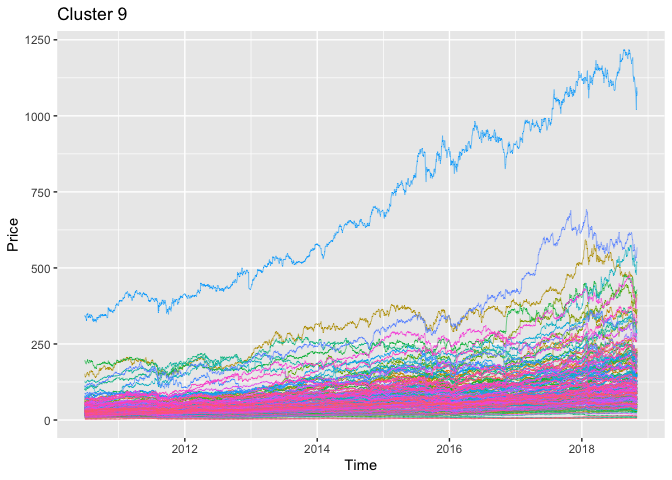<!-- -->

```
## Warning: Removed 5 rows containing missing values (`geom_line()`).
```

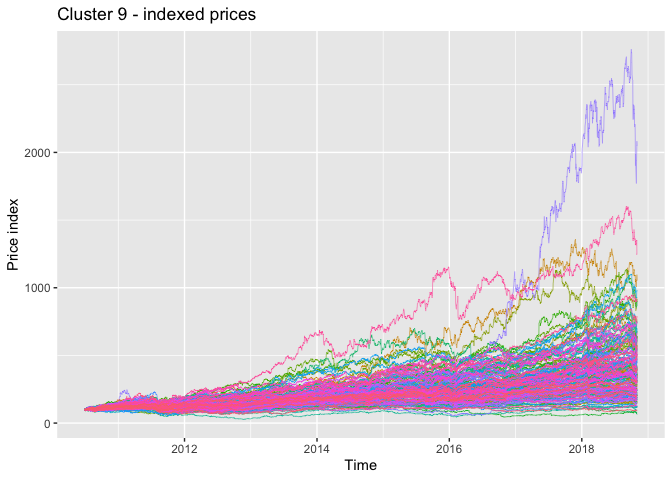<!-- -->

```
## Warning: Removed 5 rows containing missing values (`geom_line()`).
```

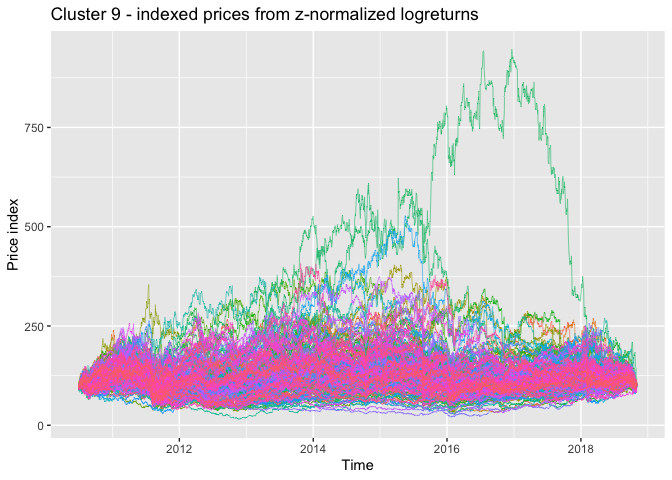<!-- -->

```
## Warning: Removed 5 rows containing missing values (`geom_line()`).
```


### Cluster  10 

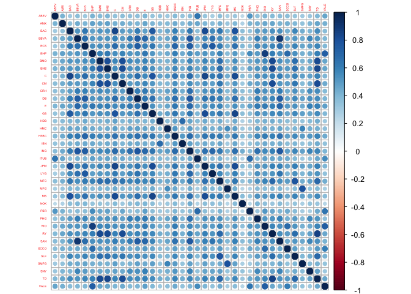<!-- -->

Range of correlations:  0.2207457 0.90548 


|     |Symbol |Name                                                                                                                        |Last.Sale | Net.Change|X..Change |   Market.Cap|Country        | IPO.Year|   Volume|Sector                 |Industry                                                       |
|:----|:------|:---------------------------------------------------------------------------------------------------------------------------|:---------|----------:|:---------|------------:|:--------------|--------:|--------:|:----------------------|:--------------------------------------------------------------|
|3278 |SNY    |Sanofi ADS                                                                                                                  |$54.50    |       0.51|0.945%    | 137863196621|France         |       NA|  1806359|Health Care            |Biotechnology: Pharmaceutical Preparations                     |
|3941 |ABEV   |Ambev S.A. American Depositary Shares (Each representing 1 Common Share)                                                    |$1.90     |       0.03|1.604%    |  29932283240|Brazil         |     2013| 39014987|Consumer Staples       |Beverages (Production/Distribution)                            |
|4071 |AMX    |America Movil S.A.B. de C.V. American Depositary Shares (each representing the right to receive twenty (20) Series B Shares |$15.28    |       0.45|3.034%    |  47711800000|Mexico         |     2023|  2383679|Telecommunications     |Telecommunications Equipment                                   |
|4183 |BAC    |Bank of America Corporation Common Stock                                                                                    |$46.96    |       0.63|1.36%     | 357406094125|United States  |       NA| 25937672|Finance                |Major Banks                                                    |
|4213 |BBVA   |Banco Bilbao Vizcaya Argentaria S.A. Common Stock                                                                           |$12.63    |       0.17|1.364%    |  73733186999|Spain          |       NA|  1459408|Finance                |Commercial Banks                                               |
|4225 |BCS    |Barclays PLC Common Stock                                                                                                   |$14.88    |       0.34|2.338%    |  53648045204|United Kingdom |       NA| 18505323|Finance                |Commercial Banks                                               |
|4268 |BHP    |BHP Group Limited American Depositary Shares (Each representing two Ordinary Shares)                                        |$51.55    |      -0.28|-0.54%    | 130686290287|Australia      |       NA|  2832252|Energy                 |Coal Mining                                                    |
|4316 |BMO    |Bank Of Montreal Common Stock                                                                                               |$101.05   |       0.58|0.577%    |  73715975000|Canada         |       NA|   392733|Finance                |Commercial Banks                                               |
|4323 |BNS    |Bank Nova Scotia Halifax Pfd 3 Ordinary Shares                                                                              |$51.23    |       0.06|0.117%    |  63752456280|Canada         |       NA|   943636|Finance                |Major Banks                                                    |
|4393 |C      |Citigroup Inc. Common Stock                                                                                                 |$84.61    |       2.51|3.057%    | 160019914982|United States  |       NA| 16022537|Finance                |Major Banks                                                    |
|4495 |CM     |Canadian Imperial Bank of Commerce Common Stock                                                                             |$62.07    |       0.06|0.097%    |  58493210602|Canada         |       NA|   546590|Finance                |Commercial Banks                                               |
|4568 |CRH    |CRH PLC Ordinary Shares                                                                                                     |$108.30   |       1.80|1.69%     |  73397278304|Ireland        |       NA|  5721365|Industrials            |Building Materials                                             |
|4631 |DB     |Deutsche Bank AG Common Stock                                                                                               |$20.20    |       0.25|1.253%    |  41208000000|Germany        |       NA|  1287981|Finance                |Major Banks                                                    |
|4727 |E      |ENI S.p.A. Common Stock                                                                                                     |$29.36    |       0.21|0.72%     |  49558768284|Italy          |       NA|   188052|Energy                 |Oil & Gas Production                                           |
|5087 |GS     |Goldman Sachs Group Inc. (The) Common Stock                                                                                 |$660.55   |      11.60|1.788%    | 207353132262|United States  |     1999|  2245960|Finance                |Investment Bankers/Brokers/Service                             |
|5122 |HDB    |HDFC Bank Limited Common Stock                                                                                              |$60.23    |       0.06|0.10%     | 152520643057|India          |     2001|  2209389|Finance                |Commercial Banks                                               |
|5155 |HMC    |Honda Motor Company Ltd. Common Stock                                                                                       |$28.69    |       0.74|2.648%    |  45817515860|Japan          |       NA|  1146613|Consumer Discretionary |Auto Manufacturing                                             |
|5179 |HSBC   |HSBC Holdings plc. Common Stock                                                                                             |$55.09    |      -0.10|-0.181%   | 197744606956|United Kingdom |       NA|  1169832|Finance                |Savings Institutions                                           |
|5204 |IBN    |ICICI Bank Limited Common Stock                                                                                             |$29.16    |       0.01|0.034%    | 102587626814|India          |       NA|  3987373|Finance                |Commercial Banks                                               |
|5234 |ING    |ING Group N.V. Common Stock                                                                                                 |$17.11    |       0.29|1.724%    |  59854107365|Netherlands    |     1997|  2622010|Finance                |Commercial Banks                                               |
|5260 |ITUB   |Itau Unibanco Banco Holding SA American Depositary Shares (Each repstg 500 Preferred shares)                                |$6.09     |       0.21|3.571%    |  59687277959|Brazil         |       NA| 23186360|Finance                |Major Banks                                                    |
|5298 |JPM    |JP Morgan Chase & Co. Common Stock                                                                                          |$276.59   |       0.27|0.098%    | 778695007321|United States  |       NA|  5685620|Finance                |Major Banks                                                    |
|5442 |LYG    |Lloyds Banking Group Plc American Depositary Shares                                                                         |$3.22     |       0.02|0.625%    |  48796695442|United Kingdom |       NA|  9791450|Finance                |Commercial Banks                                               |
|5492 |MFC    |Manulife Financial Corporation Common Stock                                                                                 |$29.69    |       0.05|0.169%    |  52013296209|Canada         |       NA|  1150869|Finance                |Life Insurance                                                 |
|5493 |MFG    |Mizuho Financial Group Inc. Sponosred ADR (Japan)                                                                           |$5.74     |       0.14|2.50%     |  72856815270|Japan          |       NA|  1265337|Finance                |Major Banks                                                    |
|5560 |MS     |Morgan Stanley Common Stock                                                                                                 |$138.95   |       2.11|1.542%    | 223853393702|United States  |       NA|  5044508|Finance                |Investment Bankers/Brokers/Service                             |
|5691 |NOK    |Nokia Corporation Sponsored American Depositary Shares                                                                      |$4.99     |       0.00|0.00%     |  28011348313|Finland        |     1994| 24229354|Technology             |Radio And Television Broadcasting And Communications Equipment |
|5829 |PBR    |Petroleo Brasileiro S.A.- Petrobras Common Stock                                                                            |$14.32    |       0.61|4.449%    |  92651382796|Brazil         |       NA| 20754284|Energy                 |Oil & Gas Production                                           |
|5874 |PHG    |Koninklijke Philips N.V. NY Registry Shares                                                                                 |$28.19    |      -0.42|-1.468%   |  25551504968|Netherlands    |       NA|   924000|Health Care            |Medical Electronics                                            |
|6038 |RIO    |Rio Tinto Plc Common Stock                                                                                                  |$63.36    |       0.07|0.111%    |  79393355015|Australia      |     2002|  3857305|Basic Materials        |Metal Mining                                                   |
|6093 |RY     |Royal Bank Of Canada Common Stock                                                                                           |$119.04   |      -0.27|-0.226%   | 168441601548|Canada         |       NA|  1492766|Finance                |Commercial Banks                                               |
|6107 |SAN    |Banco Santander S.A. Sponsored ADR (Spain)                                                                                  |$6.02     |       0.10|1.689%    |  89094046534|Spain          |       NA|  3632357|Finance                |Commercial Banks                                               |
|6126 |SCCO   |Southern Copper Corporation Common Stock                                                                                    |$97.27    |      -0.57|-0.583%   |  76409493211|United States  |       NA|  1946963|Basic Materials        |Metal Mining                                                   |
|6189 |SLF    |Sun Life Financial Inc. Common Stock                                                                                        |$55.13    |      -0.15|-0.271%   |  31858730696|Canada         |       NA|   858344|Finance                |Life Insurance                                                 |
|6198 |SMFG   |Sumitomo Mitsui Financial Group Inc Unsponsored American Depositary Shares (Japan)                                          |$15.13    |       0.30|2.023%    | 296934192584|Japan          |       NA|  1617932|Finance                |Commercial Banks                                               |
|6317 |TD     |Toronto Dominion Bank (The) Common Stock                                                                                    |$59.75    |      -0.18|-0.30%    | 104568475000|Canada         |       NA|  1148804|Finance                |Commercial Banks                                               |
|6497 |VALE   |VALE S.A.  American Depositary Shares Each Representing one common share                                                    |$9.76     |       0.19|1.985%    |  41675200000|Brazil         |       NA| 31745505|Basic Materials        |Metal Mining                                                   |

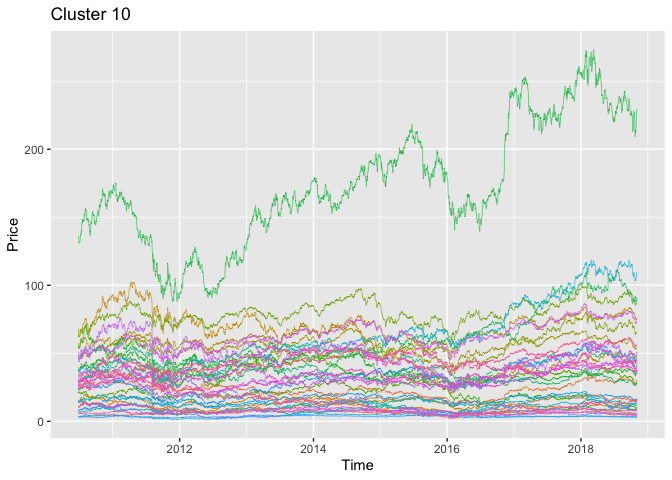<!-- -->
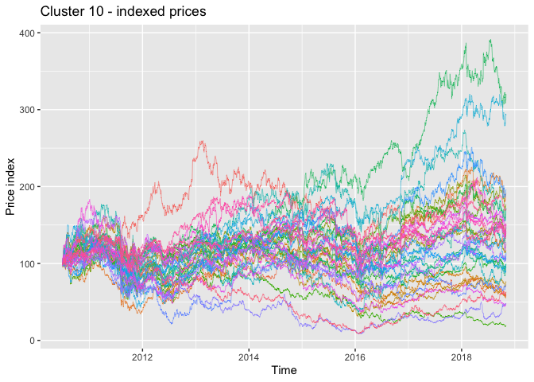<!-- -->
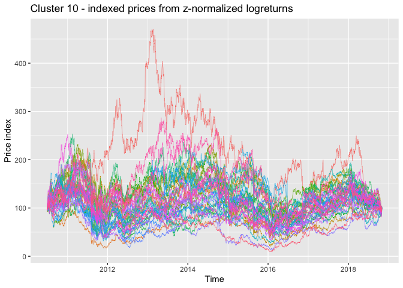<!-- -->
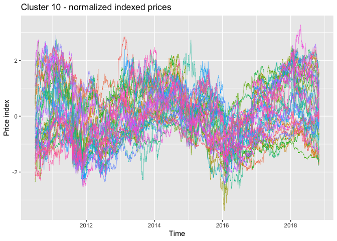<!-- -->


