## Getting data

Here are a few examples of how to get some free data.  
For the present analysis we will download a data set from Kaggle, but first a few other examples...

### Yahoo Finance

Use screener to find tickers:  
https://finance.yahoo.com/research-hub/screener/ 

#### quantmod


```r
library(tidyverse)
library(quantmod)
library(ggplot2)
```
 
Simplest call. "AAPL" object will be created


```r
getSymbols("AAPL")
AAPL %>% head
```


```r
getSymbols(c("AAPL", "IBM"))
IBM %>% head
AAPL %>% head
```

Example without auto assign

```r
d <- getSymbols("AAPL", auto.assign = F)
d %>% head
```
 
Specifying from/to dates

```r
d <- getSymbols("AAPL", auto.assign = F, from = "2020-01-01", to = "2020-06-01")
d %>% head 
```
 
Specifying return class

```r
d <- getSymbols("AAPL", auto.assign = F, from = "2020-01-01", to = "2020-06-01", return.class='data.frame')
d %>% head  
```

#### yahoofinancer


```r
library(yahoofinancer)
```

https://yahoofinancer.rsquaredacademy.com/ 

https://cloud.r-project.org/web/packages/yahoofinancer/yahoofinancer.pdf


```r
aapl <- Ticker$new('aapl')
```


```r
names(aapl)
```


```r
aapl$regular_market_price
```


```r
names(aapl$technical_insights)
```


```r
aapl$fifty_two_week_high
```


```r
aapl$previous_close
```


```r
nifty_50 <- Index$new('^NSEI')
head(nifty_50$get_history(start = '2024-01-20', interval = '1d'))
```


```r
head(currency_converter('GBP', 'USD', '2024-01-20', '2024-01-30'))
```


```r
head(aapl$get_history(start = '2024-10-20', interval = '1d'))
```


```r
get_trending(country = "US", count = 10)
```


```r
wheat <- Ticker$new('CWDH25.CBT')
wheat$fifty_two_week_high
```


### Alpha Vantage

See Alpha Vantage SPI documentation:  
https://www.alphavantage.co/documentation/

NOTE  
25 requests per day limit  
https://www.alphavantage.co/premium/

#### Without `alphavantager`:


```r
library(tidyverse)
library(jsonlite)
library(httr)
 
symbol = "AMZN"
av_key = ""
 
url <- str_c("https://www.alphavantage.co/query?function=TIME_SERIES_DAILY&symbol=", symbol ,"&apikey=", av_key, "&datatype=csv")
 
d <- read_csv(url)
 
d %>% head
```

#### With `alphavantager` package

SETUP API KEY

```r
av_api_key(av_key)
```


TIME SERIES INTRADAY

```r
av_get("MSFT", av_fun = "TIME_SERIES_INTRADAY", interval = "5min", outputsize = "full")
```

Get market cap of Amazon

```r
d <- av_get(symbol = "AMZN", av_fun = "OVERVIEW")
d$value[which(d$rank_group == "MarketCapitalization")]
```

## Top market cap tickers

Got 480 top market cap tickers from  
https://www.marketwatch.com/tools/screener/stock?exchange=all&skip=0&orderbyfield=Symbol&direction=asc&visiblecolumns=Symbol&marketcapmin=25000.0&marketcapmax=10000000.0

NOTE  
Cap data is available from  
- https://www.nasdaq.com/market-activity/stocks/screener?page=1&rows_per_page=25  
	- See here: `/Users/mhvpbp13/Library/Mobile Documents/com~apple~CloudDocs/Data research/_data/ticker symbols`

Then manually copy-pasted tickers into csv. (Could not figure out how to scrape.)


```r
top_mcap_tickers <- as.vector(read.csv("/Users/mhvpbp13/Library/Mobile\ Documents/com~apple~CloudDocs/Data\ research/aktieanalyser/top_marketcap.csv"))[[1]]
```


```r
top_mcap_tickers
```

```
##   [1] "AAPL"  "ABBV"  "ABEV"  "ABNB"  "ABT"   "ACGL"  "ACN"   "ADBE"  "ADI"  
##  [10] "ADP"   "ADSK"  "AEE"   "AEM"   "AEP"   "AFL"   "AIG"   "AJG"   "ALC"  
##  [19] "ALL"   "ALNY"  "AMAT"  "AMD"   "AME"   "AMGN"  "AMP"   "AMT"   "AMX"  
##  [28] "AMZN"  "ANET"  "ANSS"  "AON"   "APD"   "APH"   "APO"   "APP"   "ARES" 
##  [37] "ARGX"  "ARM"   "ASML"  "AVB"   "AVGO"  "AXON"  "AXP"   "AZN"   "AZO"  
##  [46] "BA"    "BABA"  "BAC"   "BAM"   "BBVA"  "BCS"   "BDX"   "BHP"   "BIDU" 
##  [55] "BK"    "BKNG"  "BKR"   "BLK"   "BMO"   "BMY"   "BN"    "BNS"   "BNTX" 
##  [64] "BP"    "BR"    "BRK.A" "BRK.B" "BRO"   "BSX"   "BTI"   "BUD"   "BX"   
##  [73] "C"     "CAH"   "CARR"  "CAT"   "CB"    "CBRE"  "CCEP"  "CCI"   "CCL"  
##  [82] "CDNS"  "CDW"   "CEG"   "CHD"   "CHT"   "CHTR"  "CI"    "CL"    "CM"   
##  [91] "CMCSA" "CME"   "CMG"   "CMI"   "CNC"   "CNI"   "CNQ"   "COF"   "COIN" 
## [100] "COP"   "COR"   "COST"  "CP"    "CPAY"  "CPNG"  "CPRT"  "CQP"   "CRH"  
## [109] "CRM"   "CRWD"  "CSCO"  "CSGP"  "CSX"   "CTAS"  "CTSH"  "CTVA"  "CUK"  
## [118] "CVE"   "CVNA"  "CVS"   "CVX"   "D"     "DAL"   "DASH"  "DB"    "DD"   
## [127] "DDOG"  "DE"    "DECK"  "DELL"  "DEO"   "DFS"   "DHI"   "DHR"   "DIS"  
## [136] "DLR"   "DOV"   "DOW"   "DTE"   "DUK"   "DXCM"  "E"     "EA"    "EBAY" 
## [145] "ECL"   "ED"    "EFX"   "ELV"   "EMR"   "ENB"   "EOG"   "EPD"   "EQIX" 
## [154] "EQNR"  "EQR"   "EQT"   "ERIC"  "ET"    "ETN"   "ETR"   "EW"    "EXC"  
## [163] "EXR"   "F"     "FANG"  "FAST"  "FCNCA" "FCX"   "FDX"   "FER"   "FERG" 
## [172] "FI"    "FICO"  "FIS"   "FITB"  "FLUT"  "FNV"   "FTNT"  "FTV"   "FWONA"
## [181] "FWONK" "GD"    "GDDY"  "GE"    "GEHC"  "GEV"   "GIB"   "GILD"  "GIS"  
## [190] "GLW"   "GM"    "GOLD"  "GOOG"  "GOOGL" "GPN"   "GRMN"  "GS"    "GSK"  
## [199] "GWW"   "HCA"   "HD"    "HDB"   "HEI"   "HEI.A" "HES"   "HIG"   "HLN"  
## [208] "HLT"   "HMC"   "HON"   "HOOD"  "HPE"   "HPQ"   "HSBC"  "HSY"   "HUBS" 
## [217] "HUM"   "HWM"   "IBKR"  "IBM"   "IBN"   "ICE"   "IDXX"  "IMO"   "INFY" 
## [226] "ING"   "INTC"  "INTU"  "IOT"   "IP"    "IQV"   "IR"    "IRM"   "ISRG" 
## [235] "IT"    "ITUB"  "ITW"   "JCI"   "JD"    "JNJ"   "JPM"   "K"     "KDP"  
## [244] "KEYS"  "KHC"   "KKR"   "KLAC"  "KMB"   "KMI"   "KO"    "KR"    "KVUE" 
## [253] "LEN"   "LEN.B" "LHX"   "LIN"   "LLY"   "LLYVA" "LLYVK" "LMT"   "LNG"  
## [262] "LOW"   "LPLA"  "LRCX"  "LULU"  "LVS"   "LYB"   "LYG"   "LYV"   "MA"   
## [271] "MAR"   "MCD"   "MCHP"  "MCK"   "MCO"   "MDLZ"  "MDT"   "MELI"  "MET"  
## [280] "META"  "MFC"   "MFG"   "MKL"   "MLM"   "MMC"   "MMM"   "MNST"  "MO"   
## [289] "MPC"   "MPLX"  "MPWR"  "MRK"   "MRVL"  "MS"    "MSCI"  "MSFT"  "MSI"  
## [298] "MSTR"  "MTB"   "MTD"   "MU"    "MUFG"  "NDAQ"  "NEE"   "NEM"   "NET"  
## [307] "NFLX"  "NGG"   "NKE"   "NOC"   "NOK"   "NOW"   "NSC"   "NTAP"  "NTES" 
## [316] "NU"    "NUE"   "NVDA"  "NVO"   "NVS"   "NWG"   "NXPI"  "O"     "ODFL" 
## [325] "OKE"   "ONC"   "ORCL"  "ORLY"  "OTIS"  "OWL"   "OXY"   "PANW"  "PAYX" 
## [334] "PBR"   "PBR.A" "PCAR"  "PCG"   "PDD"   "PEG"   "PEP"   "PFE"   "PG"   
## [343] "PGR"   "PH"    "PHG"   "PLD"   "PLTR"  "PM"    "PNC"   "PPG"   "PPL"  
## [352] "PRU"   "PSA"   "PSX"   "PWR"   "PYPL"  "QCOM"  "QSR"   "RACE"  "RBLX" 
## [361] "RCL"   "RDDT"  "REGN"  "RELX"  "RIO"   "RJF"   "RKT"   "RMD"   "ROK"  
## [370] "ROP"   "ROST"  "RSG"   "RTX"   "RY"    "SAN"   "SAP"   "SBUX"  "SCCO" 
## [379] "SCHW"  "SE"    "SHEL"  "SHOP"  "SHW"   "SLB"   "SLF"   "SMFG"  "SNOW" 
## [388] "SNPS"  "SNY"   "SO"    "SONY"  "SPG"   "SPGI"  "SPOT"  "SRE"   "STLA" 
## [397] "STT"   "STZ"   "SU"    "SW"    "SYF"   "SYK"   "SYY"   "T"     "TAK"  
## [406] "TCOM"  "TD"    "TDG"   "TEAM"  "TEL"   "TFC"   "TGT"   "TJX"   "TKO"  
## [415] "TM"    "TMO"   "TMUS"  "TPL"   "TRGP"  "TRI"   "TRP"   "TRV"   "TSCO" 
## [424] "TSLA"  "TSM"   "TT"    "TTD"   "TTE"   "TTWO"  "TW"    "TXN"   "TYL"  
## [433] "UAL"   "UBER"  "UBS"   "UI"    "UL"    "UNH"   "UNP"   "UPS"   "URI"  
## [442] "USB"   "V"     "VALE"  "VEEV"  "VG"    "VICI"  "VLO"   "VMC"   "VRSK" 
## [451] "VRT"   "VRTX"  "VST"   "VTR"   "VZ"    "WAB"   "WBD"   "WCN"   "WDAY" 
## [460] "WDS"   "WEC"   "WELL"  "WFC"   "WIT"   "WM"    "WMB"   "WMT"   "WPM"  
## [469] "WSM"   "WTW"   "XEL"   "XHG"   "XOM"   "XYL"   "XYZ"   "YUM"   "ZM"   
## [478] "ZS"    "ZTS"
```


Many data sets are not available, because the data only runs until 2018.


```r
top_mcap_data <- lapply(top_mcap_tickers, function(ticker) {
  try(
    df <- read.csv(
      paste0(
        "/Users/mhvpbp13/Library/Mobile\ Documents/com~apple~CloudDocs/Data\ research/_data/kaggle/full_history/", ticker, ".csv"
      )
    )
  )
})

names(top_mcap_data) <- top_mcap_tickers
```


How many data sets succeded?


```r
test_ticker_data <- as.vector(t(as.data.frame(lapply(top_mcap_data, function(x) {
    is.data.frame(x) && nrow(x) != 0
  }))))
sum(test_ticker_data)
```

```
## [1] 405
```

Make list of only successful tickers

```r
top_mcap_data_valid <- top_mcap_data[which(test_ticker_data)]
```


Make a list of price series for all valid tickers (close prices).  
Data sets are in order newest at the top, so read in reverse order.  

```r
top_mcap_prices_list <- lapply(top_mcap_data_valid, function(data) {
    zoo::read.zoo(data.frame(
      date = rev(data$date),
      price = rev(data$close)
    ))
  }
)
```

Combine the data frames of prices.  
Merging will put the each price in the the correct (time) row, because we
converted each data frame to a zoo object above.

```r
top_mcap_prices_df <- do.call(merge, top_mcap_prices_list)
```

Make a list of log-returs for all valid tickers (close prices)

```r
log_returns_from_prices <- function(prices) {
  N <- length(prices)
  log(utils::tail(prices, N - 1) / utils::head(prices, N - 1))
}

top_mcap_returns_list <- lapply(top_mcap_data_valid, function(data) {
    zoo::read.zoo(data.frame(
      date = rev(data$date)[-1],
      logreturn = log_returns_from_prices(rev(data$close))
    ))
  }
)
```


Combine the data frames (actually zoo matrices) of logreturns.  
Merging will put the each logreturn in the the correct (time) row, because we
converted each data frame to a zoo object above.

```r
top_mcap_returns_df <- do.call(merge, top_mcap_returns_list)
```

NOTE  
To turn a zoo matrix into a data frame with a "data" column, we could extract the matrix containing core data of the zoo object with `coredata()` and the time vector with `index()`.


We want all series to start at the first date of the shortest series.  
Which elements in each series are not NA? Pick the first.

```r
first_dates <- lapply(top_mcap_returns_df, function(x) {which(!is.na(x))[1]})
```

Which of all the _first dates_ is the latest one?

```r
first_date <- first_dates[which(first_dates == max(unlist(first_dates)))]
first_date
```

```
## $LIN
## [1] 12321
```

Let's start the data there...

```r
top_mcap_returns_df_short <- top_mcap_returns_df[unlist(first_date):(nrow(top_mcap_returns_df))]
```

Only two rows!  
Let's omit LIN...

```r
first_dates <- lapply(top_mcap_returns_df[, -which(names(top_mcap_returns_df) == "LIN")], function(x) {which(!is.na(x))[1]})
```

Which of all the _first dates_ is NOW the latest one?

```r
first_date <- first_dates[which(first_dates == max(unlist(first_dates)))]
first_date
```

```
## $PDD
## [1] 12253
```

Let's omit PDD as well...
Repeating this process some times gives us...

```r
omitted <- c(
  which(names(top_mcap_returns_df) == "LIN"),
  which(names(top_mcap_returns_df) == "PDD"),
  which(names(top_mcap_returns_df) == "KDP"),
  which(names(top_mcap_returns_df) == "SPOT"),
  which(names(top_mcap_returns_df) == "ZS"),
  which(names(top_mcap_returns_df) == "EQNR"),
  which(names(top_mcap_returns_df) == "MUFG"),
  which(names(top_mcap_returns_df) == "SE"),
  which(names(top_mcap_returns_df) == "VICI"),
  which(names(top_mcap_returns_df) == "ARGX"),
  which(names(top_mcap_returns_df) == "CVNA"),
  which(names(top_mcap_returns_df) == "TTD"),
  which(names(top_mcap_returns_df) == "FTV"),
  which(names(top_mcap_returns_df) == "TEAM"),
  which(names(top_mcap_returns_df) == "RACE"),
  which(names(top_mcap_returns_df) == "HPE"),
  which(names(top_mcap_returns_df) == "KHC"),
  which(names(top_mcap_returns_df) == "PYPL"),
  which(names(top_mcap_returns_df) == "AXON"),
  which(names(top_mcap_returns_df) == "SHOP"),
  which(names(top_mcap_returns_df) == "GDDY"),
  which(names(top_mcap_returns_df) == "QSR"),
  which(names(top_mcap_returns_df) == "KEYS"),
  which(names(top_mcap_returns_df) == "HUBS"),
  which(names(top_mcap_returns_df) == "BABA"),
  which(names(top_mcap_returns_df) == "SYF"),
  which(names(top_mcap_returns_df) == "FWONK"),
  which(names(top_mcap_returns_df) == "ANET"),
  which(names(top_mcap_returns_df) == "JD"),
  which(names(top_mcap_returns_df) == "ARES"),
  which(names(top_mcap_returns_df) == "HLT"),
  which(names(top_mcap_returns_df) == "VEEV"),
  which(names(top_mcap_returns_df) == "FI"),
  which(names(top_mcap_returns_df) == "CDW"),
  which(names(top_mcap_returns_df) == "IQV"),
  which(names(top_mcap_returns_df) == "ZTS"),
  which(names(top_mcap_returns_df) == "FWONA"),
  which(names(top_mcap_returns_df) == "ABBV"),
  which(names(top_mcap_returns_df) == "MPLX"),
  which(names(top_mcap_returns_df) == "FANG"),
  which(names(top_mcap_returns_df) == "WDAY"),
  which(names(top_mcap_returns_df) == "PANW"),
  which(names(top_mcap_returns_df) == "NOW"),
  which(names(top_mcap_returns_df) == "PSX"),
  which(names(top_mcap_returns_df) == "XYL"),
  which(names(top_mcap_returns_df) == "MPC"),
  which(names(top_mcap_returns_df) == "APO"),
  which(names(top_mcap_returns_df) == "HCA"),
  which(names(top_mcap_returns_df) == "KMI"),
  which(names(top_mcap_returns_df) == "TRGP"),
  which(names(top_mcap_returns_df) == "GM"),
  which(names(top_mcap_returns_df) == "LPLA"),
  which(names(top_mcap_returns_df) == "COR"),
  which(names(top_mcap_returns_df) == "NXPI"),
  which(names(top_mcap_returns_df) == "KKR"),
  which(names(top_mcap_returns_df) == "ET"),
  which(names(top_mcap_returns_df) == "UBS"),
  which(names(top_mcap_returns_df) == "VST")
  
)
        
first_dates <- lapply(top_mcap_returns_df[ , -omitted], function(x) {which(!is.na(x))[1]})

first_date <- first_dates[which(first_dates == max(unlist(first_dates)))]
first_date
```

```
## $TSLA
## [1] 10220
```

Also removing UBS and VST, which look weird.

Ok, this gives us a bit more than 8 years of data...

```r
top_mcap_returns_df_short <- top_mcap_returns_df[unlist(first_date):(nrow(top_mcap_returns_df)), -omitted]
top_mcap_prices_df_short <- top_mcap_prices_df[(unlist(first_date) - 1):(nrow(top_mcap_prices_df)), -omitted]

cat(paste0("Number of rows: ", nrow(top_mcap_returns_df_short), "\n"))
```

```
## Number of rows: 2103
```

```r
cat(paste0("Number of assets: ", ncol(top_mcap_returns_df_short)))
```

```
## Number of assets: 347
```

How many NAs?

```r
sum(is.na(top_mcap_returns_df_short))
```

```
## [1] 5
```

Ok then.

Interpolate NAs with zoo...  

```r
# replace trailing NA with previous value
replace_trailing_NAs <- function(x) {
  for(i in seq_along(x)) {
    if(is.na(x[i])) {x[i] <- x[i - 1]}
  }
  x
}

top_mcap_returns_df_short_filled <- top_mcap_returns_df_short

for(i in 1:ncol(top_mcap_returns_df_short)) {
  col <- top_mcap_returns_df_short[, i]
  if(sum(is.na(col)) > 0) {
    top_mcap_returns_df_short_filled[, i] <- zoo::na.approx(col, na.rm = FALSE)
    
    # cat(sum(is.na(col)), "\n")
    # cat(sum(is.na(top_mcap_returns_df_short_filled[, i])), "\n")

    if(sum(is.na(col)) == sum(is.na(top_mcap_returns_df_short_filled[, i]))) {
      # We should have removed all leading NAs, so any remaining NAs must be trailing...
      top_mcap_returns_df_short_filled[, i] <- replace_trailing_NAs(top_mcap_returns_df_short_filled[, i])
    }
  }
}
```


```r
sum(is.na(top_mcap_returns_df_short_filled))
```

```
## [1] 0
```


## Clusters vs sectors

Now, let's try k-Sharp...


See 

+ https://www.rdocumentation.org/packages/dtwclust/versions/3.1.1/topics/dtwclust  
+ https://journal.r-project.org/archive/2019/RJ-2019-023/RJ-2019-023.pdf  


This can not be installed... (Fails to compile dependencies)  
Maybe try Linux box...?  

```r
#library(dtwclust)
```


```r
# tsclust(top_mcap_returns_df[ ,-1], k = 4L, seed = 8L,
# distance = "sbd", centroid = "shape")
```


#### Sectors

We would like to get the sector for each ticker symbol.

We could try getting the data with `alphavantager` package...

SETUP API KEY

```r
av_api_key(av_key)
```


TIME SERIES INTRADAY

```r
av_get("MSFT", av_fun = "TIME_SERIES_INTRADAY", interval = "5min", outputsize = "full")
```

Get market cap of Amazon

```r
d <- av_get(symbol = "AMZN", av_fun = "OVERVIEW")
d$value[which(d$rank_group == "MarketCapitalization")]
```


!!!!!!!!!!!!!!!!!!!!!!!!!!!!!!!!!!!!!!!!!!!!  
OBS!  
Alpha Vantage had max 25 requests per day.  
Cluster 1 has 45 symbols - so 45 requests!!  
!!!!!!!!!!!!!!!!!!!!!!!!!!!!!!!!!!!!!!!!!!!!  


```r
range_of_symbols_to_get <- 1:2
```


```r
symbols_1 <- names(top_mcap_prices_df_short)[which(py$mcap_clusters == 0)]
overviews <- lapply(symbols_1[range_of_symbols_to_get], function(x) {av_get(symbol = x, av_fun = "OVERVIEW")})
sectors <- lapply(overviews, function(x) {x$value[which(x$rank_group == "Sector")]})
```


Instead we can download the data for free as csv here:

https://www.nasdaq.com/market-activity/stocks/screener?page=1&rows_per_page=25 


```r
nasdaq_table <- read.csv("/Users/mhvpbp13/Library/Mobile\ Documents/com~apple~CloudDocs/Data\ research/_data/ticker\ symbols/nasdaq_tickers.csv")
nyse_table <- read.csv("/Users/mhvpbp13/Library/Mobile\ Documents/com~apple~CloudDocs/Data\ research/_data/ticker\ symbols/nyse_tickers.csv")
#ticker_table <- rbind(nasdaq_table[, c("Symbol", "Sector")], nyse_table[, c("Symbol", "Sector")])
ticker_table <- rbind(nasdaq_table, nyse_table)
```


### Python in R with Reticulate

See https://rstudio.github.io/cheatsheets/html/reticulate.html


```r
num_clusters <- 10L
```


Note that runtime for k-Shape is linear in $n$, the number of time series, and linear in $k$, the number of clusters, but increases as $m^3$ for $m$ elements in each data set. The algorithm gets slow for $m > n$, 


```python
import tslearn.clustering as clust
```

```
## /Users/mhvpbp13/Library/r-miniconda/envs/r-reticulate/lib/python3.8/site-packages/tslearn/bases/bases.py:15: UserWarning: h5py not installed, hdf5 features will not be supported.
## Install h5py to use hdf5 features: http://docs.h5py.org/
##   warn(h5py_msg)
```

For some reason it seems we have to transpose...

```r
top_mcap_returns_df_short_filled_matrix <- as.matrix(t(top_mcap_returns_df_short_filled))
```


Generate k-Shape clusters

```python
mcap_clusters_model = clust.KShape(n_clusters=r.num_clusters, max_iter=100, n_init=1, random_state=0)

mcap_clusters = mcap_clusters_model.fit_predict(r.top_mcap_returns_df_short_filled_matrix)
```

```r
## Cluster numbers start with 0.
## For presentation starting with 1 may make more sense.
## So if the input cluster is 0, the printed cluster number will be 1
group_by_sectors <- function(cluster_num, verbose = FALSE) {
  symbols <- names(top_mcap_prices_df_short)[which(py$mcap_clusters == cluster_num)]
  sectors <- ticker_table[which(ticker_table$Symbol %in% symbols), ]
  sectors_list <- lapply(unique(sectors$Sector), function(x) {
      list(sectors$Symbol[which(sectors$Sector == x)])
    }
  )
  names(sectors_list) <- unique(sectors$Sector)
  
  cat("\n")
  cat("====== Cluster ", cluster_num + 1, " ======\n")
  
  if(verbose == TRUE) {
    for(i in seq_along(sectors_list)) {
      cat("\n")
      cat(names(sectors_list[i]), ":\n")
      cat("\n")
      cat(unlist(sectors_list[i]), "\n")
      cat("\n")
    }
  }
  
  sectors_list
}
```


```r
for(i in 0:(num_clusters - 1)) {
  sector_lists <- group_by_sectors(cluster_num = i, verbose = TRUE)
}
```


====== Cluster  1  ======

Technology :

ADSK AMD MRVL MU TTWO ETN 


Industrials :

CSX ODFL CAT CMI CNI CP DE DOV HEI IR LYB MLM NSC PH PWR UNP VMC WAB 


Health Care :

DXCM CNC 


Consumer Discretionary :

LULU TSCO UAL CMG DAL DECK DHI F LEN LVS LYV RCL URI WSM 


Telecommunications :

TMUS 


Finance :

WTW BX CBRE 


Energy :

VLO 


====== Cluster  2  ======

Health Care :

ALNY REGN 


====== Cluster  3  ======

Energy :

BP CNQ COP CVE CVX ENB EOG EQT HES OXY SLB SU TPL XOM 


Utilities :

EPD OKE TRP WMB 


Basic Materials :

FCX 


====== Cluster  4  ======

Basic Materials :

AEM FNV GOLD NEM WPM 


====== Cluster  5  ======

Technology :

ADBE BIDU FTNT GOOG GOOGL NTES CRM 


Consumer Discretionary :

AMZN BKNG MELI NFLX 


Real Estate :

EQIX 


Health Care :

VRTX 


====== Cluster  6  ======

Consumer Discretionary :

COST ORLY AZO CHD CL KMB MCD PG SYY TGT UL WMT 


Consumer Staples :

MDLZ MNST PEP BUD CVS DEO GIS HSY K KO KR STZ 


Real Estate :

AMT CCI 


Health Care :

BTI JNJ MO PM 


Telecommunications :

T 


====== Cluster  7  ======

Consumer Discretionary :

TSLA 


====== Cluster  8  ======

Utilities :

AEP EXC XEL AEE D DTE DUK ED ETR NGG PCG PEG PPL SO SRE WEC 


Real Estate :

AVB DLR EQR EXR IRM O PLD PSA SPG VTR WELL 


Technology :

NEE 


====== Cluster  9  ======

Technology :

AAPL ADI ADP AMAT ANSS ASML AVGO CDNS CTSH EA ERIC INTC INTU KLAC LRCX MCHP MPWR MSFT MSTR NTAP NVDA QCOM SNPS TXN VRSK APH EMR GE HPQ IBM INFY MSI ORCL SAP TEL TSM TYL WIT 


Finance :

ACGL CME FCNCA FITB IBKR NDAQ AFL AIG AJG ALL AMP AON AXP BK BLK BRO CB COF DFS EFX HIG ICE MCO MET MKL MMC MTB PGR PNC PRU RJF SCHW SPGI STT TRV USB WFC 


Health Care :

AMGN AZN GILD IDXX ISRG ABT BDX BMY BSX CAH CI EW GSK HUM LLY MCK MDT MMM MRK NVO NVS PFE RMD SYK UNH 


Telecommunications :

CHTR CMCSA CSCO CHT 


Consumer Discretionary :

CPRT CSGP CTAS EBAY FAST MAR PAYX PCAR ROST SBUX ACN BAM BR CCL CUK DIS ECL FDX FICO FIS GIB GPN HD IT LOW MA MSCI NKE PPG RELX SHW TJX TM TRI V YUM 


Industrials :

HON ROP AME APD BA DHR GD GLW GRMN GWW ITW JCI LMT MTD NOC NUE ROK TDG TMO UPS 


Basic Materials :

IP 


Utilities :

RSG VG WCN WM 


====== Cluster  10  ======

Health Care :

SNY PHG 


Consumer Staples :

ABEV 


Telecommunications :

AMX 


Finance :

BAC BBVA BCS BMO BNS C CM DB GS HDB HSBC IBN ING ITUB JPM LYG MFC MFG MS RY SAN SLF SMFG TD 


Energy :

BHP E PBR 


Industrials :

CRH 


Consumer Discretionary :

HMC 


Technology :

NOK 


Basic Materials :

RIO SCCO VALE 


```python
centroids = mcap_clusters_model.cluster_centers_
centroids.shape
```

```
## (10, 2103, 1)
```


```r
dim(py$centroids)
```

```
## [1]   10 2103    1
```


```r
centroids <- as.data.frame(t(py$centroids[,,1]))
```


It seems the Python function KShape doesn't provide the label of the centroids,
so we find the centroid ticker symbols by minimizing sum of square differences
between centroids (scaled by KShape) and return vectors for each cluster.

```r
find_centroid_ticker <- function(centroiddf) {
  
  centroid_symbols <- list()

  for(i in seq_along(centroiddf)) {
    
    id <- which(py$mcap_clusters == i - 1)
    cluster_symbols <-  names(top_mcap_returns_df_short)[id]
    cluster_returns <- scale(top_mcap_returns_df_short[, id])
    
    sum_sq_diffs <- numeric(ncol(cluster_returns))
    for(j in 1:ncol(cluster_returns)) {
      sq_diffs <- unlist((cluster_returns[, j] - centroiddf[, i])^2)
      sum_sq_diffs[[j]] <- sum(sq_diffs)
    }

    id <- which(sum_sq_diffs == min(sum_sq_diffs))
    centroid_symbols[i] <- if(length(cluster_symbols[id]) > 0) {
      cluster_symbols[id]} else {NA}
  }
 centroid_symbols
}

get_table_by_tickers <- function(tickers, tickertable) {
  tickertable1 <- tickertable[tickertable$Symbol %in% tickers, ]
  tickertable1[!is.na(tickertable1$Symbol), ]
}
```


Note: Why is one of them NA?

```r
centroid_symbols <- unlist(find_centroid_ticker(centroids))
centroid_symbols
```

```
##  [1] "F"    "REGN" "OKE"  "FNV"  "NTES" "MNST" "TSLA" "VTR"  NA     "MFG"
```


```r
centroid_table <- get_table_by_tickers(centroid_symbols[!is.na(centroid_symbols)], ticker_table)
knitr::kable(centroid_table, digits = 3)
```


|     |Symbol |Name                                              |Last.Sale | Net.Change|X..Change |   Market.Cap|Country       | IPO.Year|   Volume|Sector                 |Industry                                   |
|:----|:------|:-------------------------------------------------|:---------|----------:|:---------|------------:|:-------------|--------:|--------:|:----------------------|:------------------------------------------|
|2281 |MNST   |Monster Beverage Corporation                      |$49.25    |      -0.27|-0.545%   | 4.789659e+10|United States |       NA|  6107115|Consumer Staples       |Beverages (Production/Distribution)        |
|2483 |NTES   |NetEase Inc. American Depositary Shares           |$103.50   |      -1.31|-1.25%    | 6.646321e+10|China         |       NA|  1496724|Technology             |Computer Software: Prepackaged Software    |
|2975 |REGN   |Regeneron Pharmaceuticals Inc. Common Stock       |$673.60   |      -0.67|-0.099%   | 7.364111e+10|United States |     1991|   622963|Health Care            |Biotechnology: Pharmaceutical Preparations |
|3555 |TSLA   |Tesla Inc. Common Stock                           |$355.84   |      -0.10|-0.028%   | 1.144565e+12|United States |     2010| 68052647|Consumer Discretionary |Auto Manufacturing                         |
|4875 |F      |Ford Motor Company Common Stock                   |$9.48     |       0.13|1.39%     | 3.757348e+10|United States |       NA| 53530640|Consumer Discretionary |Auto Manufacturing                         |
|4943 |FNV    |Franco-Nevada Corporation                         |$138.32   |      -5.66|-3.931%   | 2.661646e+10|Canada        |       NA|   614397|Basic Materials        |Precious Metals                            |
|5493 |MFG    |Mizuho Financial Group Inc. Sponosred ADR (Japan) |$5.74     |       0.14|2.50%     | 7.285682e+10|Japan         |       NA|  1265337|Finance                |Major Banks                                |
|5774 |OKE    |ONEOK Inc. Common Stock                           |$97.85    |      -1.12|-1.132%   | 5.716242e+10|United States |       NA|  2813953|Utilities              |Oil & Gas Production                       |
|6549 |VTR    |Ventas Inc. Common Stock                          |$66.53    |       1.59|2.448%    | 2.789966e+10|United States |       NA|  4227448|Real Estate            |Real Estate Investment Trusts              |

```r
#centroid_table
```


```r
library(corrplot)
```


```r
centroid_correlations <- cor(centroids)
corrplot(centroid_correlations, method = "circle", tl.cex = 0.3)
```

<!-- -->


```r
range(centroid_correlations[centroid_correlations != 1])
```

```
## [1] 0.08069414 0.93399314
```


```r
centroid_symbols_ids <- which(names(top_mcap_prices_df_short) %in% centroid_symbols)
ggplot(
  aes(x = Index, y = Value, colour = Series), 
  data = fortify(scale(top_mcap_prices_df_short[, centroid_symbols_ids]), melt = TRUE)) + 
    geom_line(linewidth = 0.2) + 
    labs(title = "Scaled centroid prices", x ="Time", y = "Price") +
    theme(legend.position="none")
```

```
## Warning: Removed 1 row containing missing values (`geom_line()`).
```

<!-- -->

Plot weighted portfolio average of centroid stocks.  


```r
sds <- lapply(top_mcap_prices_df_short[, centroid_symbols_ids], function(x) {sd(x, na.rm = TRUE)})
#weights <- lapply(sds, function(x) {x/sum(unlist(sds))})
weights <- unlist(lapply(sds, function(x) {1/x}))
weights <- weights / sum(weights)

centroid_pf_prices <- as.matrix(top_mcap_prices_df_short[, centroid_symbols_ids]) %*% unname(unlist(weights))


centroid_portfolio <- data.frame(
  date = index(top_mcap_prices_df_short),
  price = centroid_pf_prices
)
  
  
ggplot(aes(x = date, y = price), data = centroid_portfolio) + 
    geom_line(linewidth = 0.2) + 
    labs(title = "Weighted avg. of centroid prices", x ="Time", y = "Price") +
    theme(legend.position="none")
```

```
## Warning: Removed 1 row containing missing values (`geom_line()`).
```

<!-- -->

## Cluster plots


```r
logreturn_sd <- unlist(lapply(top_mcap_returns_df_short_filled, sd))
logreturn_mean <- unlist(lapply(top_mcap_returns_df_short_filled, mean))
```


```r
topcapplotter <- function(cluster_num) {
  id <- which(py$mcap_clusters == cluster_num)
  max_sd <- max(logreturn_sd[id])
  
  tickers <- names(top_mcap_prices_df_short)[id]
  ticker_table <- get_table_by_tickers(tickers[!is.na(tickers)], ticker_table)
  
  if(length(id) > 0) {
    
    if(length(id) > 1) {
      correlations <- stats::cor(top_mcap_returns_df_short[, id])
      correlations_plot <- function() {corrplot(correlations, method = "circle", tl.cex = 0.3)}
    } else {
      correlations <- 1
      correlations_plot <- function() {NA}
    }
    
    price_plot <- ggplot(
        aes(x = Index, y = Value, colour = Series), 
        data = fortify(top_mcap_prices_df_short[, id], melt = TRUE)) +
      geom_line(linewidth = 0.2) +
      labs(title = paste0("Cluster ", cluster_num + 1), x ="Time", y = "Price") +
      theme(legend.position="none")
  
    index_plot <- ggplot(
         aes(x = Index, y = Value, colour = Series),
         data = fortify(100 * exp(cumsum(top_mcap_returns_df_short[, id])), melt = TRUE)) +
       geom_line(linewidth = 0.2) +
       labs(title = paste0("Cluster ", cluster_num + 1, " - indexed prices"), x ="Time", y = "Price index") +
       theme(legend.position="none")
  
    norm_ret_plot <- ggplot(
        aes(x = Index, y = Value, colour = Series),
        data = fortify(100 * exp(cumsum(scale(top_mcap_returns_df_short[, id]) * max_sd)), melt = TRUE)) +
      geom_line(linewidth = 0.2) +
      labs(title = paste0("Cluster ", cluster_num + 1, " - indexed prices from z-normalized logreturns"), x ="Time", y = "Price index") +
      theme(legend.position="none")
  
    norm_plot <- ggplot(
        aes(x = Index, y = Value, colour = Series),
        data = fortify(scale(100 * exp(cumsum(top_mcap_returns_df_short[, id]))), melt = TRUE)) +
      geom_line(linewidth = 0.2) +
      labs(title = paste0("Cluster ", cluster_num + 1, " - normalized indexed prices"), x ="Time", y = "Price index") +
      theme(legend.position="none")
  } else {
    tickers = NA
    id = NA
    price_plot = NA
    index_plot = NA
    norm_ret_plot = NA
    norm_plot = NA
    correlations = NA
    correlations_plot = function() {NA}
    ticker_table = NA
  }

  list(
    tickers = tickers,
    id = id,
    price_plot = price_plot,
    index_plot = index_plot,
    norm_ret_plot = norm_ret_plot,
    norm_plot = norm_plot,
    correlations = correlations,
    correlations_plot = correlations_plot,
    ticker_table = ticker_table
  )
}
```


```r
plots <- lapply(0:(num_clusters - 1), function(i) {topcapplotter(i)})
```


```r
plots[[i]]$correlations_plot()
```


```r
cat("\n")
cat("Range of correlations: ", range(plots[[i]]$correlations[plots[[i]]$correlations != 1]), "\n")
cat("\n")
```


```r
cat(plots[[i]]$tickers)
```


```r
print(knitr::kable(plots[[i]]$ticker_table, digits = 3))
# plots$ticker_table
```


```r
print(plots[[i]]$price_plot)
```


```r
print(plots[[i]]$index_plot)
```


```r
print(plots[[i]]$norm_ret_plot)
```


```r
print(plots[[i]]$norm_plot)
```


```r
for(i in 1:num_clusters) {
  cat("\n")
  cat("### Cluster ", i, "\n")
  cat("\n")
  if(length(plots[[i]]$tickers) > 0) {

    plots[[i]]$correlations_plot()
    cat("\n")
    cat("\n")
    cat("Range of correlations: ", range(plots[[i]]$correlations[plots[[i]]$correlations != 1]), "\n")
    cat("\n")
    cat("\n")
    print(knitr::kable(plots[[i]]$ticker_table, digits = 3))
    # plots$ticker_table
    cat("\n")
    print(plots[[i]]$price_plot)
    cat("\n")
    print(plots[[i]]$index_plot)
    cat("\n")
    print(plots[[i]]$norm_ret_plot)
    cat("\n")
    print(plots[[i]]$norm_plot)
    cat("\n")
    
  } else {
    cat("\n")
    cat("Cluster ", i, " is empty.")
    cat("\n")
  }
}
```


### Cluster  1 

<!-- -->

Range of correlations:  0.09528991 0.8426108 


|     |Symbol |Name                                                               |Last.Sale | Net.Change|X..Change |   Market.Cap|Country        | IPO.Year|   Volume|Sector                 |Industry                                              |
|:----|:------|:------------------------------------------------------------------|:---------|----------:|:---------|------------:|:--------------|--------:|--------:|:----------------------|:-----------------------------------------------------|
|74   |ADSK   |Autodesk Inc. Common Stock                                         |$302.72   |     -0.760|-0.25%    |  65084800000|United States  |       NA|   924069|Technology             |Computer Software: Prepackaged Software               |
|194  |AMD    |Advanced Micro Devices Inc. Common Stock                           |$113.10   |      1.290|1.154%    | 183276057502|United States  |       NA| 32408329|Technology             |Semiconductors                                        |
|925  |CSX    |CSX Corporation Common Stock                                       |$33.37    |      0.270|0.816%    |  64351347136|United States  |       NA| 10739899|Industrials            |Railroads                                             |
|1088 |DXCM   |DexCom Inc. Common Stock                                           |$89.07    |      4.980|5.922%    |  34790331387|United States  |     2005|  7591692|Health Care            |Medical/Dental Instruments                            |
|2130 |LULU   |lululemon athletica inc. Common Stock                              |$366.68   |    -24.170|-6.184%   |  42779662368|Canada         |     2007|  3308878|Consumer Discretionary |Apparel                                               |
|2318 |MRVL   |Marvell Technology Inc. Common Stock                               |$106.51   |      3.010|2.908%    |  92163103000|United States  |     2000| 13533675|Technology             |Semiconductors                                        |
|2348 |MU     |Micron Technology Inc. Common Stock                                |$99.52    |      3.860|4.035%    | 110882390673|United States  |       NA| 21268069|Technology             |Semiconductors                                        |
|2583 |ODFL   |Old Dominion Freight Line Inc. Common Stock                        |$206.34   |     -0.050|-0.024%   |  44053081578|United States  |     1991|  1274117|Industrials            |Trucking Freight/Courier Services                     |
|3503 |TMUS   |T-Mobile US Inc. Common Stock                                      |$270.815  |      5.735|2.163%    | 309201659176|United States  |       NA|  4835265|Telecommunications     |Telecommunications Equipment                          |
|3552 |TSCO   |Tractor Supply Company Common Stock                                |$57.14    |      0.150|0.263%    |  30818137302|United States  |     1994|  4901295|Consumer Discretionary |RETAIL: Building Materials                            |
|3566 |TTWO   |Take-Two Interactive Software Inc. Common Stock                    |$208.76   |     -1.330|-0.633%   |  36845243585|United States  |     1997|  1454185|Technology             |Computer Software: Prepackaged Software               |
|3587 |UAL    |United Airlines Holdings Inc. Common Stock                         |$104.26   |      3.370|3.34%     |  34288601334|United States  |       NA|  5205588|Consumer Discretionary |Air Freight/Delivery Services                         |
|3826 |WTW    |Willis Towers Watson Public Limited Company Ordinary Shares        |$320.40   |     -1.880|-0.583%   |  32272441229|United Kingdom |     2001|   560959|Finance                |Specialty Insurers                                    |
|4382 |BX     |Blackstone Inc. Common Stock                                       |$164.84   |      4.360|2.717%    | 120650676071|United States  |     2007|  4179183|Finance                |Investment Managers                                   |
|4410 |CAT    |Caterpillar Inc. Common Stock                                      |$353.32   |     -0.380|-0.107%   | 170583775060|United States  |       NA|  2043615|Industrials            |Construction/Ag Equipment/Trucks                      |
|4417 |CBRE   |CBRE Group Inc Common Stock Class A                                |$143.73   |      0.600|0.419%    |  43983964840|United States  |       NA|  2078167|Finance                |Real Estate                                           |
|4500 |CMG    |Chipotle Mexican Grill Inc. Common Stock                           |$57.08    |     -1.050|-1.806%   |  77362635960|United States  |     2006|  8753276|Consumer Discretionary |Restaurants                                           |
|4501 |CMI    |Cummins Inc. Common Stock                                          |$373.78   |      4.460|1.208%    |  51387709480|United States  |       NA|   802016|Industrials            |Industrial Machinery/Components                       |
|4516 |CNC    |Centene Corporation Common Stock                                   |$56.86    |      0.050|0.088%    |  28706623900|United States  |       NA|  3447696|Health Care            |Medical Specialities                                  |
|4519 |CNI    |Canadian National Railway Company Common Stock                     |$101.59   |     -0.980|-0.955%   |  63950905000|Canada         |       NA|  1412653|Industrials            |Railroads                                             |
|4550 |CP     |Canadian Pacific Kansas City Limited Common Shares                 |$77.52    |     -0.760|-0.971%   |  72335860465|Canada         |       NA|  1443200|Industrials            |Railroads                                             |
|4625 |DAL    |Delta Air Lines Inc. Common Stock                                  |$65.39    |      1.330|2.076%    |  42239455572|United States  |       NA|  6046345|Consumer Discretionary |Air Freight/Delivery Services                         |
|4646 |DE     |Deere & Company Common Stock                                       |$480.22   |     14.000|3.003%    | 130415881922|United States  |       NA|  1919274|Industrials            |Industrial Machinery/Components                       |
|4649 |DECK   |Deckers Outdoor Corporation Common Stock                           |$155.07   |     -3.040|-1.923%   |  23535538200|United States  |     1993|  2263161|Consumer Discretionary |Shoe Manufacturing                                    |
|4661 |DHI    |D.R. Horton Inc. Common Stock                                      |$130.57   |      1.230|0.951%    |  41145542997|United States  |       NA|  2477779|Consumer Discretionary |Homebuilding                                          |
|4695 |DOV    |Dover Corporation Common Stock                                     |$202.33   |     -0.360|-0.178%   |  27758050481|United States  |       NA|   571479|Industrials            |Industrial Machinery/Components                       |
|4850 |ETN    |Eaton Corporation PLC Ordinary Shares                              |$309.17   |      1.360|0.442%    | 122183984000|Ireland        |       NA|  3175050|Technology             |Industrial Machinery/Components                       |
|4875 |F      |Ford Motor Company Common Stock                                    |$9.48     |      0.130|1.39%     |  37573484234|United States  |       NA| 53530640|Consumer Discretionary |Auto Manufacturing                                    |
|5124 |HEI    |Heico Corporation Common Stock                                     |$220.85   |     -3.830|-1.705%   |  30660624272|United States  |     2000|   714003|Industrials            |Aerospace                                             |
|5252 |IR     |Ingersoll Rand Inc. Common Stock                                   |$85.72    |     -6.830|-7.38%    |  34546224985|United States  |     2017|  7441852|Industrials            |Industrial Machinery/Components                       |
|5399 |LEN    |Lennar Corporation Class A Common Stock                            |$123.84   |      0.090|0.073%    |  32882065779|United States  |       NA|  1970540|Consumer Discretionary |Homebuilding                                          |
|5435 |LVS    |Las Vegas Sands Corp. Common Stock                                 |$43.37    |      1.160|2.748%    |  31050086681|United States  |     2004|  5917301|Consumer Discretionary |Hotels/Resorts                                        |
|5441 |LYB    |LyondellBasell Industries NV Ordinary Shares Class A (Netherlands) |$76.70    |      0.460|0.603%    |  24908848017|Netherlands    |       NA|  1481277|Industrials            |Major Chemicals                                       |
|5443 |LYV    |Live Nation Entertainment Inc. Common Stock                        |$153.76   |      1.180|0.773%    |  35726702606|United States  |       NA|  1461285|Consumer Discretionary |Services-Misc. Amusement & Recreation                 |
|5527 |MLM    |Martin Marietta Materials Inc. Common Stock                        |$527.38   |     -4.280|-0.805%   |  32232440901|United States  |     1994|   687818|Industrials            |Mining & Quarrying of Nonmetallic Minerals (No Fuels) |
|5719 |NSC    |Norfolk Southern Corporation Common Stock                          |$255.99   |     -1.230|-0.478%   |  57964872427|United States  |       NA|   908791|Industrials            |Railroads                                             |
|5872 |PH     |Parker-Hannifin Corporation Common Stock                           |$700.25   |      6.430|0.927%    |  90167581311|United States  |       NA|  1034346|Industrials            |Metal Fabrications                                    |
|5976 |PWR    |Quanta Services Inc. Common Stock                                  |$285.45   |     -5.410|-1.86%    |  42135729793|United States  |       NA|  2091861|Industrials            |Engineering & Construction                            |
|6007 |RCL    |Royal Caribbean Cruises Ltd. Common Stock                          |$263.09   |      3.000|1.153%    |  70738386892|United States  |     1993|  1308342|Consumer Discretionary |Marine Transportation                                 |
|6467 |UNP    |Union Pacific Corporation Common Stock                             |$249.22   |     -1.750|-0.697%   | 150600251125|United States  |       NA|  1696298|Industrials            |Railroads                                             |
|6470 |URI    |United Rentals Inc. Common Stock                                   |$741.26   |     11.890|1.63%     |  48409539463|United States  |     1997|   415973|Consumer Discretionary |Diversified Commercial Services                       |
|6517 |VLO    |Valero Energy Corporation Common Stock                             |$135.31   |      4.320|3.298%    |  42837147201|United States  |       NA|  3512767|Energy                 |Integrated oil Companies                              |
|6521 |VMC    |Vulcan Materials Company (Holding Company) Common Stock            |$270.46   |      1.130|0.42%     |  35717288109|United States  |       NA|   927825|Industrials            |Mining & Quarrying of Nonmetallic Minerals (No Fuels) |
|6556 |WAB    |Westinghouse Air Brake Technologies Corporation Common Stock       |$188.19   |     -8.290|-4.219%   |  32151912784|United States  |       NA|  1949399|Industrials            |Railroads                                             |
|6620 |WSM    |Williams-Sonoma Inc. Common Stock (DE)                             |$214.60   |      7.540|3.641%    |  26417247768|United States  |       NA|  1126838|Consumer Discretionary |Home Furnishings                                      |

<!-- -->
<!-- -->
<!-- -->


### Cluster  2 

<!-- -->

Range of correlations:  0.3297116 0.3297116 


|     |Symbol |Name                                        |Last.Sale | Net.Change|X..Change |  Market.Cap|Country       | IPO.Year| Volume|Sector      |Industry                                   |
|:----|:------|:-------------------------------------------|:---------|----------:|:---------|-----------:|:-------------|--------:|------:|:-----------|:------------------------------------------|
|176  |ALNY   |Alnylam Pharmaceuticals Inc. Common Stock   |$256.45   |      -8.44|-3.186%   | 33077156165|United States |     2004| 805993|Health Care |Biotechnology: Pharmaceutical Preparations |
|2975 |REGN   |Regeneron Pharmaceuticals Inc. Common Stock |$673.60   |      -0.67|-0.099%   | 73641105795|United States |     1991| 622963|Health Care |Biotechnology: Pharmaceutical Preparations |

<!-- -->
<!-- -->
<!-- -->


### Cluster  3 

<!-- -->

Range of correlations:  0.1746445 0.7917253 


|     |Symbol |Name                                            |Last.Sale | Net.Change|X..Change |   Market.Cap|Country        | IPO.Year|   Volume|Sector          |Industry                    |
|:----|:------|:-----------------------------------------------|:---------|----------:|:---------|------------:|:--------------|--------:|--------:|:---------------|:---------------------------|
|4336 |BP     |BP p.l.c. Common Stock                          |$35.00    |       0.51|1.479%    |  94418764475|United Kingdom |       NA| 13148362|Energy          |Integrated oil Companies    |
|4527 |CNQ    |Canadian Natural Resources Limited Common Stock |$30.12    |      -0.28|-0.921%   |  64297404960|Canada         |       NA|  3389614|Energy          |Oil & Gas Production        |
|4546 |COP    |ConocoPhillips Common Stock                     |$96.26    |      -0.64|-0.66%    | 110786835132|United States  |       NA|  7959637|Energy          |Integrated oil Companies    |
|4602 |CVE    |Cenovus Energy Inc Common Stock                 |$15.31    |      -0.06|-0.39%    |  27972839760|Canada         |       NA|  7263330|Energy          |Oil & Gas Production        |
|4608 |CVX    |Chevron Corporation Common Stock                |$155.34   |      -0.54|-0.346%   | 279160166426|United States  |       NA|  5827519|Energy          |Integrated oil Companies    |
|4797 |ENB    |Enbridge Inc Common Stock                       |$43.07    |      -2.38|-5.237%   |  93806460000|Canada         |       NA|  5862689|Energy          |Natural Gas Distribution    |
|4809 |EOG    |EOG Resources Inc. Common Stock                 |$129.31   |       0.29|0.225%    |  72730462646|United States  |       NA|  2220579|Energy          |Oil & Gas Production        |
|4817 |EPD    |Enterprise Products Partners L.P. Common Stock  |$33.44    |       0.23|0.693%    |  72483706863|United States  |       NA|  4566979|Utilities       |Natural Gas Distribution    |
|4831 |EQT    |EQT Corporation Common Stock                    |$53.43    |       0.56|1.059%    |  31880826120|United States  |       NA|  5552108|Energy          |Oil & Gas Production        |
|4892 |FCX    |Freeport-McMoRan Inc. Common Stock              |$39.47    |      -0.75|-1.865%   |  56715536714|United States  |       NA| 17557099|Basic Materials |Metal Mining                |
|5127 |HES    |Hess Corporation Common Stock                   |$146.55   |       0.70|0.48%     |  45154728219|United States  |       NA|  1650445|Energy          |Integrated oil Companies    |
|5774 |OKE    |ONEOK Inc. Common Stock                         |$97.85    |      -1.12|-1.132%   |  57162423089|United States  |       NA|  2813953|Utilities       |Oil & Gas Production        |
|5808 |OXY    |Occidental Petroleum Corporation Common Stock   |$48.06    |       0.18|0.376%    |  45096766599|United States  |       NA| 10413957|Energy          |Oil & Gas Production        |
|6188 |SLB    |Schlumberger N.V. Common Stock                  |$41.75    |      -0.33|-0.784%   |  58485505035|France         |       NA| 12224349|Energy          |Oilfield Services/Equipment |
|6284 |SU     |Suncor Energy  Inc. Common Stock                |$39.56    |      -0.39|-0.976%   |  49731425568|Canada         |       NA|  3955278|Energy          |Integrated oil Companies    |
|6382 |TPL    |Texas Pacific Land Corporation Common Stock     |$1372.40  |      19.22|1.42%     |  31530771974|United States  |       NA|    85792|Energy          |Oil & Gas Production        |
|6396 |TRP    |TC Energy Corporation Common Stock              |$45.92    |      -1.48|-3.122%   |  47619040000|Canada         |       NA|  3448624|Utilities       |Natural Gas Distribution    |
|6601 |WMB    |Williams Companies Inc. (The) Common Stock      |$56.98    |      -0.48|-0.835%   |  69459292250|United States  |       NA|  7440827|Utilities       |Natural Gas Distribution    |
|6640 |XOM    |Exxon Mobil Corporation Common Stock            |$108.24   |       0.11|0.102%    | 475725032577|United States  |       NA| 15726587|Energy          |Integrated oil Companies    |

<!-- -->
<!-- -->
<!-- -->


### Cluster  4 

<!-- -->

Range of correlations:  0.690282 0.7723112 


|     |Symbol |Name                                                |Last.Sale | Net.Change|X..Change |  Market.Cap|Country       | IPO.Year|   Volume|Sector          |Industry        |
|:----|:------|:---------------------------------------------------|:---------|----------:|:---------|-----------:|:-------------|--------:|--------:|:---------------|:---------------|
|3974 |AEM    |Agnico Eagle Mines Limited Common Stock             |$95.85    |      -4.96|-4.92%    | 48107830137|Canada        |       NA|  4623051|Basic Materials |Precious Metals |
|4943 |FNV    |Franco-Nevada Corporation                           |$138.32   |      -5.66|-3.931%   | 26616460729|Canada        |       NA|   614397|Basic Materials |Precious Metals |
|5065 |GOLD   |Barrick Gold Corporation Common Stock (BC)          |$17.94    |      -0.50|-2.711%   | 31444054777|Canada        |       NA| 29054056|Basic Materials |Precious Metals |
|5645 |NEM    |Newmont Corporation                                 |$46.54    |      -1.21|-2.534%   | 52983485293|United States |       NA|  9887843|Basic Materials |Precious Metals |
|6611 |WPM    |Wheaton Precious Metals Corp Common Shares (Canada) |$67.50    |      -1.76|-2.541%   | 30622988183|Canada        |       NA|  1434846|Basic Materials |Precious Metals |

<!-- -->
<!-- -->
<!-- -->


### Cluster  5 

<!-- -->

Range of correlations:  0.1390009 0.9948979 


|     |Symbol |Name                                             |Last.Sale | Net.Change|X..Change |   Market.Cap|Country       | IPO.Year|   Volume|Sector                 |Industry                                       |
|:----|:------|:------------------------------------------------|:---------|----------:|:---------|------------:|:-------------|--------:|--------:|:----------------------|:----------------------------------------------|
|61   |ADBE   |Adobe Inc. Common Stock                          |$460.16   |       0.94|0.205%    | 2.003076e+11|United States |     1986|  2621957|Technology             |Computer Software: Prepackaged Software        |
|214  |AMZN   |Amazon.com Inc. Common Stock                     |$228.68   |      -1.69|-0.734%   | 2.423489e+12|United States |     1997| 26973108|Consumer Discretionary |Catalog/Specialty Distribution                 |
|474  |BIDU   |Baidu Inc. ADS                                   |$97.48    |       0.89|0.921%    | 3.418126e+10|China         |     2005| 11595238|Technology             |Computer Software: Programming Data Processing |
|488  |BKNG   |Booking Holdings Inc. Common Stock               |$5044.40  |      35.70|0.713%    | 1.669531e+11|United States |       NA|   202541|Consumer Discretionary |Transportation Services                        |
|1175 |EQIX   |Equinix Inc. Common Stock REIT                   |$933.60   |      10.60|1.148%    | 9.086916e+10|United States |     2000|   523352|Real Estate            |Real Estate Investment Trusts                  |
|1387 |FTNT   |Fortinet Inc. Common Stock                       |$111.64   |       1.66|1.509%    | 8.556678e+10|United States |     2009|  4976400|Technology             |Computer peripheral equipment                  |
|1520 |GOOG   |Alphabet Inc. Class C Capital Stock              |$186.87   |      -1.01|-0.538%   | 2.277945e+12|United States |     2004| 12672393|Technology             |Computer Software: Programming Data Processing |
|1521 |GOOGL  |Alphabet Inc. Class A Common Stock               |$185.23   |      -0.91|-0.489%   | 2.257954e+12|United States |     2004| 20401830|Technology             |Computer Software: Programming Data Processing |
|2213 |MELI   |MercadoLibre Inc. Common Stock                   |$2109.99  |      43.84|2.122%    | 1.069710e+11|Argentina     |     2007|   355437|Consumer Discretionary |Business Services                              |
|2426 |NFLX   |Netflix Inc. Common Stock                        |$1058.60  |      14.91|1.429%    | 4.528237e+11|United States |     2002|  3142695|Consumer Discretionary |Consumer Electronics/Video Chains              |
|2483 |NTES   |NetEase Inc. American Depositary Shares          |$103.50   |      -1.31|-1.25%    | 6.646321e+10|China         |       NA|  1496724|Technology             |Computer Software: Prepackaged Software        |
|3727 |VRTX   |Vertex Pharmaceuticals Incorporated Common Stock |$459.00   |      -3.58|-0.774%   | 1.182059e+11|United States |     1991|   994996|Health Care            |Biotechnology: Pharmaceutical Preparations     |
|4572 |CRM    |Salesforce Inc. Common Stock                     |$326.54   |      -3.31|-1.003%   | 3.124988e+11|United States |     2004|  5875771|Technology             |Computer Software: Prepackaged Software        |

<!-- -->
<!-- -->
<!-- -->


### Cluster  6 

<!-- -->

Range of correlations:  0.1516609 0.7135947 


|     |Symbol |Name                                                         |Last.Sale | Net.Change|X..Change |   Market.Cap|Country        | IPO.Year|   Volume|Sector                 |Industry                                   |
|:----|:------|:------------------------------------------------------------|:---------|----------:|:---------|------------:|:--------------|--------:|--------:|:----------------------|:------------------------------------------|
|861  |COST   |Costco Wholesale Corporation Common Stock                    |$1071.85  |      -5.01|-0.465%   | 475793003810|United States  |       NA|  1409602|Consumer Discretionary |Department/Specialty Retail Stores         |
|2204 |MDLZ   |Mondelez International Inc. Class A Common Stock             |$60.82    |      -0.34|-0.556%   |  78672200657|United States  |       NA| 10040881|Consumer Staples       |Packaged Foods                             |
|2281 |MNST   |Monster Beverage Corporation                                 |$49.25    |      -0.27|-0.545%   |  47896593206|United States  |       NA|  6107115|Consumer Staples       |Beverages (Production/Distribution)        |
|2648 |ORLY   |O'Reilly Automotive Inc. Common Stock                        |$1318.80  |     -16.88|-1.264%   |  76135237928|United States  |     1993|   344553|Consumer Discretionary |Auto & Home Supply Stores                  |
|2739 |PEP    |PepsiCo Inc. Common Stock                                    |$143.39   |      -1.19|-0.823%   | 196659361771|United States  |       NA|  4999988|Consumer Staples       |Beverages (Production/Distribution)        |
|4066 |AMT    |American Tower Corporation (REIT) Common Stock               |$189.38   |      -0.61|-0.321%   |  88495266383|United States  |       NA|  1776015|Real Estate            |Real Estate Investment Trusts              |
|4177 |AZO    |AutoZone Inc. Common Stock                                   |$3458.55  |     -11.16|-0.322%   |  58041939468|United States  |       NA|    77024|Consumer Discretionary |Auto & Home Supply Stores                  |
|4362 |BTI    |British American Tobacco  Industries p.l.c. Common Stock ADR |$38.82    |      -0.79|-1.994%   |  80502772360|United Kingdom |     1998|  7051545|Health Care            |Medicinal Chemicals and Botanical Products |
|4367 |BUD    |Anheuser-Busch Inbev SA Sponsored ADR (Belgium)              |$53.12    |       0.00|0.00%     |  92279918611|Belgium        |       NA|  1865937|Consumer Staples       |Beverages (Production/Distribution)        |
|4422 |CCI    |Crown Castle Inc. Common Stock                               |$87.96    |      -1.91|-2.125%   |  38227258376|United States  |       NA|  3411345|Real Estate            |Real Estate Investment Trusts              |
|4451 |CHD    |Church & Dwight Company Inc. Common Stock                    |$105.00   |      -2.53|-2.353%   |  25724741175|United States  |       NA|  1723559|Consumer Discretionary |Package Goods/Cosmetics                    |
|4482 |CL     |Colgate-Palmolive Company Common Stock                       |$86.04    |      -1.71|-1.949%   |  70295622740|United States  |       NA|  4136569|Consumer Discretionary |Package Goods/Cosmetics                    |
|4607 |CVS    |CVS Health Corporation Common Stock                          |$65.83    |      -0.54|-0.814%   |  82998138997|United States  |       NA| 10208402|Consumer Staples       |Retail-Drug Stores and Proprietary Stores  |
|4652 |DEO    |Diageo plc Common Stock                                      |$107.53   |      -1.85|-1.691%   |  59817788321|United Kingdom |       NA|   864253|Consumer Staples       |Beverages (Production/Distribution)        |
|5030 |GIS    |General Mills Inc. Common Stock                              |$58.84    |      -0.70|-1.176%   |  32434446750|United States  |       NA|  4690261|Consumer Staples       |Packaged Foods                             |
|5181 |HSY    |The Hershey Company Common Stock                             |$157.88   |      -2.93|-1.822%   |  31947768246|United States  |       NA|  1449913|Consumer Staples       |Specialty Foods                            |
|5291 |JNJ    |Johnson & Johnson Common Stock                               |$156.15   |      -1.10|-0.70%    | 375950327078|United States  |       NA|  6402296|Health Care            |Biotechnology: Pharmaceutical Preparations |
|5311 |K      |Kellanova Common Stock                                       |$82.26    |       0.05|0.061%    |  28354848760|United States  |       NA|  2982343|Consumer Staples       |Packaged Foods                             |
|5344 |KMB    |Kimberly-Clark Corporation Common Stock                      |$132.67   |      -2.69|-1.987%   |  44243495414|United States  |       NA|  1976447|Consumer Discretionary |Containers/Packaging                       |
|5356 |KO     |Coca-Cola Company (The) Common Stock                         |$68.87    |      -0.63|-0.906%   | 296677988894|United States  |       NA| 20769741|Consumer Staples       |Beverages (Production/Distribution)        |
|5362 |KR     |Kroger Company (The) Common Stock                            |$65.13    |      -0.50|-0.762%   |  47128467247|United States  |       NA|  3856625|Consumer Staples       |Food Chains                                |
|5464 |MCD    |McDonald's Corporation Common Stock                          |$308.55   |      -1.47|-0.474%   | 221113004115|United States  |       NA|  2673769|Consumer Discretionary |Restaurants                                |
|5540 |MO     |Altria Group Inc.                                            |$53.29    |      -0.33|-0.615%   |  90316583811|United States  |       NA|  4563396|Health Care            |Medicinal Chemicals and Botanical Products |
|5867 |PG     |Procter & Gamble Company (The) Common Stock                  |$162.89   |      -8.13|-4.754%   | 381952911982|United States  |       NA| 13171662|Consumer Discretionary |Package Goods/Cosmetics                    |
|5898 |PM     |Philip Morris International Inc Common Stock                 |$150.46   |       1.28|0.858%    | 233943817472|United States  |       NA|  4777678|Health Care            |Medicinal Chemicals and Botanical Products |
|6283 |STZ    |Constellation Brands Inc. Common Stock                       |$162.94   |      -0.26|-0.159%   |  29448200296|United States  |       NA|  2283725|Consumer Staples       |Beverages (Production/Distribution)        |
|6303 |SYY    |Sysco Corporation Common Stock                               |$71.10    |      -0.77|-1.071%   |  34784227688|United States  |       NA|  2542037|Consumer Discretionary |Food Distributors                          |
|6304 |T      |AT&T Inc.                                                    |$25.87    |       0.24|0.936%    | 185699594210|United States  |       NA| 31685963|Telecommunications     |Telecommunications Equipment               |
|6351 |TGT    |Target Corporation Common Stock                              |$127.88   |      -0.70|-0.544%   |  58596141481|United States  |       NA|  4547301|Consumer Discretionary |Department/Specialty Retail Stores         |
|6457 |UL     |Unilever PLC Common Stock                                    |$54.89    |      -1.07|-1.912%   | 135886931046|United Kingdom |       NA|  2502253|Consumer Discretionary |Package Goods/Cosmetics                    |
|6604 |WMT    |Walmart Inc. Common Stock                                    |$104.04   |      -1.01|-0.961%   | 835793501809|United States  |       NA| 14099209|Consumer Discretionary |Department/Specialty Retail Stores         |

<!-- -->
<!-- -->
<!-- -->


### Cluster  7 

```
## Warning in min(x): no non-missing arguments to min; returning Inf
```

```
## Warning in max(x): no non-missing arguments to max; returning -Inf
```

<!-- -->Range of correlations:  Inf -Inf 


|     |Symbol |Name                    |Last.Sale | Net.Change|X..Change |   Market.Cap|Country       | IPO.Year|   Volume|Sector                 |Industry           |
|:----|:------|:-----------------------|:---------|----------:|:---------|------------:|:-------------|--------:|--------:|:----------------------|:------------------|
|3555 |TSLA   |Tesla Inc. Common Stock |$355.84   |       -0.1|-0.028%   | 1.144565e+12|United States |     2010| 68052647|Consumer Discretionary |Auto Manufacturing |

```
## Warning: Removed 1 row containing missing values (`geom_line()`).
```

<!-- -->
<!-- -->
<!-- -->


### Cluster  8 

<!-- -->

Range of correlations:  0.2758113 0.8728014 


|     |Symbol |Name                                                                         |Last.Sale | Net.Change|X..Change |   Market.Cap|Country        | IPO.Year|   Volume|Sector      |Industry                      |
|:----|:------|:----------------------------------------------------------------------------|:---------|----------:|:---------|------------:|:--------------|--------:|--------:|:-----------|:-----------------------------|
|90   |AEP    |American Electric Power Company Inc. Common Stock                            |$101.83   |       0.84|0.832%    |  54231128063|United States  |       NA|  2770855|Utilities   |Electric Utilities: Central   |
|1219 |EXC    |Exelon Corporation Common Stock                                              |$42.85    |      -0.12|-0.279%   |  43073555177|United States  |       NA|  8592975|Utilities   |Power Generation              |
|3842 |XEL    |Xcel Energy Inc. Common Stock                                                |$68.61    |       0.21|0.307%    |  39398726124|United States  |       NA|  4167836|Utilities   |Power Generation              |
|3971 |AEE    |Ameren Corporation Common Stock                                              |$98.07    |      -0.20|-0.204%   |  26177606110|United States  |       NA|  3561331|Utilities   |Power Generation              |
|4156 |AVB    |AvalonBay Communities Inc. Common Stock                                      |$218.35   |      -1.75|-0.795%   |  31057499826|United States  |       NA|   741056|Real Estate |Real Estate Investment Trusts |
|4623 |D      |Dominion Energy Inc. Common Stock                                            |$55.59    |      -1.12|-1.975%   |  46696135109|United States  |       NA|  3663674|Utilities   |Electric Utilities: Central   |
|4676 |DLR    |Digital Realty Trust Inc. Common Stock                                       |$164.28   |      -0.53|-0.322%   |  54493746914|United States  |     2004|  4795087|Real Estate |Real Estate Investment Trusts |
|4711 |DTE    |DTE Energy Company Common Stock                                              |$129.04   |       1.23|0.962%    |  26724259617|United States  |       NA|  1891676|Utilities   |Electric Utilities: Central   |
|4716 |DUK    |Duke Energy Corporation (Holding Company) Common Stock                       |$111.60   |      -2.35|-2.062%   |  86209036398|United States  |       NA|  3581582|Utilities   |Power Generation              |
|4750 |ED     |Consolidated Edison Inc. Common Stock                                        |$94.92    |      -0.74|-0.774%   |  32881445075|United States  |       NA|  1948209|Utilities   |Power Generation              |
|4829 |EQR    |Equity Residential Common Shares of Beneficial Interest                      |$71.23    |      -0.29|-0.405%   |  27026761575|United States  |       NA|  1901216|Real Estate |Real Estate Investment Trusts |
|4852 |ETR    |Entergy Corporation Common Stock                                             |$82.49    |      -0.76|-0.913%   |  35373034150|United States  |       NA|  3915977|Utilities   |Electric Utilities: Central   |
|4874 |EXR    |Extra Space Storage Inc Common Stock                                         |$154.92   |      -1.03|-0.66%    |  32840494509|United States  |     2004|  1409682|Real Estate |Real Estate Investment Trusts |
|5253 |IRM    |Iron Mountain Incorporated (Delaware)Common Stock REIT                       |$95.41    |       0.16|0.168%    |  27999053997|United States  |       NA|  2521271|Real Estate |Real Estate Investment Trusts |
|5640 |NEE    |NextEra Energy Inc. Common Stock                                             |$68.06    |      -0.54|-0.787%   | 139958892992|United States  |       NA| 14183718|Technology  |EDP Services                  |
|5652 |NGG    |National Grid Transco PLC National Grid PLC (NEW) American Depositary Shares |$60.73    |      -0.54|-0.881%   |  59420856933|United Kingdom |       NA|   511375|Utilities   |Natural Gas Distribution      |
|5755 |O      |Realty Income Corporation Common Stock                                       |$54.49    |      -0.43|-0.783%   |  47690250115|United States  |       NA|  3720631|Real Estate |Real Estate Investment Trusts |
|5832 |PCG    |Pacific Gas & Electric Co. Common Stock                                      |$15.29    |      -0.56|-3.533%   |  44030051138|United States  |       NA| 28222107|Utilities   |Power Generation              |
|5853 |PEG    |Public Service Enterprise Group Incorporated Common Stock                    |$83.70    |      -0.18|-0.215%   |  41701467738|United States  |       NA|  1665285|Utilities   |Power Generation              |
|5894 |PLD    |Prologis Inc. Common Stock                                                   |$120.85   |      -0.05|-0.041%   | 111928248750|United States  |       NA|  2101258|Real Estate |Real Estate Investment Trusts |
|5920 |PPL    |PPL Corporation Common Stock                                                 |$33.73    |      -0.68|-1.976%   |  24891728269|United States  |       NA|  7404345|Utilities   |Electric Utilities: Central   |
|5945 |PSA    |Public Storage Common Stock                                                  |$297.40   |      -3.84|-1.275%   |  52077312807|United States  |       NA|   398801|Real Estate |Real Estate Investment Trusts |
|6214 |SO     |Southern Company (The) Common Stock                                          |$85.58    |      -1.20|-1.383%   |  93768652124|United States  |       NA|  4390808|Utilities   |Electric Utilities: Central   |
|6231 |SPG    |Simon Property Group Inc. Common Stock                                       |$185.05   |      -1.17|-0.628%   |  60377769437|United States  |       NA|   998005|Real Estate |Real Estate Investment Trusts |
|6252 |SRE    |DBA Sempra Common Stock                                                      |$84.10    |       0.24|0.286%    |  53268878102|United States  |       NA|  3603492|Utilities   |Natural Gas Distribution      |
|6549 |VTR    |Ventas Inc. Common Stock                                                     |$66.53    |       1.59|2.448%    |  27899656548|United States  |       NA|  4227448|Real Estate |Real Estate Investment Trusts |
|6573 |WEC    |WEC Energy Group Inc. Common Stock                                           |$102.97   |      -0.81|-0.78%    |  32575017305|United States  |       NA|  1743218|Utilities   |Power Generation              |
|6574 |WELL   |Welltower Inc. Common Stock                                                  |$149.97   |      -1.47|-0.971%   |  96176970058|United States  |       NA|  1878568|Real Estate |Real Estate Investment Trusts |

<!-- -->
<!-- -->
<!-- -->


### Cluster  9 

<!-- -->

Range of correlations:  NA NA 


|     |Symbol |Name                                                                           |Last.Sale | Net.Change|X..Change |   Market.Cap|Country        | IPO.Year|    Volume|Sector                 |Industry                                                       |
|:----|:------|:------------------------------------------------------------------------------|:---------|----------:|:---------|------------:|:--------------|--------:|---------:|:----------------------|:--------------------------------------------------------------|
|9    |AAPL   |Apple Inc. Common Stock                                                        |$244.60   |      3.070|1.271%    | 3.674399e+12|United States  |     1980|  40837639|Technology             |Computer Manufacturing                                         |
|35   |ACGL   |Arch Capital Group Ltd. Common Stock                                           |$88.20    |     -1.960|-2.174%   | 3.318453e+10|Bermuda        |       NA|   1823984|Finance                |Property-Casualty Insurers                                     |
|65   |ADI    |Analog Devices Inc. Common Stock                                               |$214.61   |      5.270|2.517%    | 1.065103e+11|United States  |       NA|   3938563|Technology             |Semiconductors                                                 |
|70   |ADP    |Automatic Data Processing Inc. Common Stock                                    |$308.15   |     -2.070|-0.667%   | 1.253773e+11|United States  |       NA|   1100945|Technology             |EDP Services                                                   |
|191  |AMAT   |Applied Materials Inc. Common Stock                                            |$169.20   |    -15.070|-8.178%   | 1.376754e+11|United States  |     1972|  12446698|Technology             |Semiconductors                                                 |
|196  |AMGN   |Amgen Inc. Common Stock                                                        |$291.16   |     -3.430|-1.164%   | 1.565080e+11|United States  |     1983|   2189346|Health Care            |Biotechnology: Biological Products (No Diagnostic Substances)  |
|232  |ANSS   |ANSYS Inc. Common Stock                                                        |$338.93   |     -0.235|-0.069%   | 2.963941e+10|United States  |     1996|    307401|Technology             |Computer Software: Prepackaged Software                        |
|300  |ASML   |ASML Holding N.V. New York Registry Shares                                     |$751.55   |    -25.440|-3.274%   | 2.956761e+11|Netherlands    |     1995|   2045959|Technology             |Industrial Machinery/Components                                |
|368  |AVGO   |Broadcom Inc. Common Stock                                                     |$233.04   |     -2.760|-1.17%    | 1.092341e+12|United States  |     2009|  16968260|Technology             |Semiconductors                                                 |
|391  |AZN    |AstraZeneca PLC American Depositary Shares                                     |$73.58    |     -0.870|-1.169%   | 2.281835e+11|United Kingdom |       NA|   5783596|Health Care            |Biotechnology: Pharmaceutical Preparations                     |
|680  |CDNS   |Cadence Design Systems Inc. Common Stock                                       |$295.19   |     -0.970|-0.328%   | 8.095969e+10|United States  |       NA|   2104828|Technology             |Computer Software: Prepackaged Software                        |
|756  |CHTR   |Charter Communications Inc. Class A Common Stock New                           |$360.27   |     -0.500|-0.139%   | 5.113904e+10|United States  |       NA|    671832|Telecommunications     |Cable & Other Pay Television Services                          |
|803  |CMCSA  |Comcast Corporation Class A Common Stock                                       |$35.39    |      0.010|0.028%    | 1.338104e+11|United States  |       NA|  17925568|Telecommunications     |Cable & Other Pay Television Services                          |
|805  |CME    |CME Group Inc. Class A Common Stock                                            |$245.48   |     -4.630|-1.851%   | 8.846171e+10|United States  |     2002|   1444259|Finance                |Investment Bankers/Brokers/Service                             |
|868  |CPRT   |Copart Inc. (DE) Common Stock                                                  |$59.39    |     -0.440|-0.735%   | 5.722395e+10|United States  |     1994|   2392531|Consumer Discretionary |Retail-Auto Dealers and Gas Stations                           |
|912  |CSCO   |Cisco Systems Inc. Common Stock (DE)                                           |$64.87    |      1.030|1.613%    | 2.583615e+11|United States  |     1990|  23689848|Telecommunications     |Computer Communications Equipment                              |
|913  |CSGP   |CoStar Group Inc. Common Stock                                                 |$74.06    |      0.500|0.68%     | 3.036160e+10|United States  |     1998|   3412412|Consumer Discretionary |Business Services                                              |
|926  |CTAS   |Cintas Corporation Common Stock                                                |$204.22   |     -1.380|-0.671%   | 8.241174e+10|United States  |     1983|   1062560|Consumer Discretionary |Apparel                                                        |
|939  |CTSH   |Cognizant Technology Solutions Corporation Class A Common Stock                |$90.70    |      1.120|1.25%     | 4.486163e+10|United States  |     1998|   4369973|Technology             |EDP Services                                                   |
|1099 |EA     |Electronic Arts Inc. Common Stock                                              |$129.40   |     -0.420|-0.324%   | 3.372392e+10|United States  |       NA|   2319075|Technology             |Computer Software: Prepackaged Software                        |
|1100 |EBAY   |eBay Inc. Common Stock                                                         |$69.90    |      0.640|0.924%    | 3.348210e+10|United States  |     1998|   3501531|Consumer Discretionary |Business Services                                              |
|1177 |ERIC   |Ericsson American Depositary Shares                                            |$7.87     |     -0.040|-0.506%   | 2.631847e+10|Sweden         |       NA|   7777501|Technology             |Radio And Television Broadcasting And Communications Equipment |
|1246 |FAST   |Fastenal Company Common Stock                                                  |$74.78    |     -0.010|-0.013%   | 4.288033e+10|United States  |     1987|   2549005|Consumer Discretionary |RETAIL: Building Materials                                     |
|1267 |FCNCA  |First Citizens BancShares Inc. Class A Common Stock                            |$2141.49  |     34.470|1.636%    | 2.995836e+10|United States  |       NA|     34868|Finance                |Major Banks                                                    |
|1305 |FITB   |Fifth Third Bancorp Common Stock                                               |$44.06    |      0.480|1.101%    | 2.954414e+10|United States  |       NA|   4676808|Finance                |Major Banks                                                    |
|1476 |GILD   |Gilead Sciences Inc. Common Stock                                              |$104.08   |     -1.880|-1.774%   | 1.297114e+11|United States  |     1992|   6399591|Health Care            |Biotechnology: Biological Products (No Diagnostic Substances)  |
|1633 |HON    |Honeywell International Inc. Common Stock                                      |$202.75   |     -2.520|-1.228%   | 1.318377e+11|United States  |       NA|   5349124|Industrials            |Aerospace                                                      |
|1720 |IBKR   |Interactive Brokers Group Inc. Class A Common Stock                            |$234.12   |     -0.730|-0.311%   | 2.549077e+10|United States  |     2019|   1673195|Finance                |Investment Bankers/Brokers/Service                             |
|1741 |IDXX   |IDEXX Laboratories Inc. Common Stock                                           |$444.53   |    -15.230|-3.313%   | 3.640019e+10|United States  |     1991|    553751|Health Care            |Biotechnology: In Vitro & In Vivo Diagnostic Substances        |
|1808 |INTC   |Intel Corporation Common Stock                                                 |$23.60    |     -0.530|-2.196%   | 1.021880e+11|United States  |       NA| 229710276|Technology             |Semiconductors                                                 |
|1813 |INTU   |Intuit Inc. Common Stock                                                       |$587.38   |      3.480|0.596%    | 1.644870e+11|United States  |     1993|   1348762|Technology             |Computer Software: Prepackaged Software                        |
|1857 |ISRG   |Intuitive Surgical Inc. Common Stock                                           |$595.55   |      4.160|0.703%    | 2.124071e+11|United States  |     2000|   1188782|Health Care            |Industrial Specialties                                         |
|1944 |KLAC   |KLA Corporation Common Stock                                                   |$750.74   |    -13.540|-1.772%   | 9.976340e+10|United States  |     1980|    998510|Technology             |Electronic Components                                          |
|2106 |LRCX   |Lam Research Corporation Common Stock                                          |$82.75    |     -0.550|-0.66%    | 1.062230e+11|United States  |     1984|   9148952|Technology             |Industrial Machinery/Components                                |
|2158 |MAR    |Marriott International Class A Common Stock                                    |$283.52   |     -4.720|-1.638%   | 7.816513e+10|United States  |       NA|   1659899|Consumer Discretionary |Hotels/Resorts                                                 |
|2189 |MCHP   |Microchip Technology Incorporated Common Stock                                 |$55.76    |      1.500|2.764%    | 2.998879e+10|United States  |     1993|   7122874|Technology             |Semiconductors                                                 |
|2301 |MPWR   |Monolithic Power Systems Inc. Common Stock                                     |$684.93   |    -15.060|-2.151%   | 3.341089e+10|United States  |     2004|    625261|Technology             |Semiconductors                                                 |
|2325 |MSFT   |Microsoft Corporation Common Stock                                             |$408.43   |     -2.110|-0.514%   | 3.036261e+12|United States  |     1986|  22680015|Technology             |Computer Software: Prepackaged Software                        |
|2334 |MSTR   |MicroStrategy Incorporated Common Stock Class A                                |$337.73   |     12.810|3.943%    | 8.515157e+10|United States  |     1998|  13884642|Technology             |Computer Software: Prepackaged Software                        |
|2396 |NDAQ   |Nasdaq Inc. Common Stock                                                       |$80.91    |     -0.780|-0.955%   | 4.650364e+10|United States  |       NA|   2012012|Finance                |Investment Bankers/Brokers/Service                             |
|2480 |NTAP   |NetApp Inc. Common Stock                                                       |$119.06   |      1.330|1.13%     | 2.420566e+10|United States  |     1995|   1036123|Technology             |Electronic Components                                          |
|2509 |NVDA   |NVIDIA Corporation Common Stock                                                |$138.85   |      3.560|2.631%    | 3.400436e+12|United States  |     1999| 194879813|Technology             |Semiconductors                                                 |
|2703 |PAYX   |Paychex Inc. Common Stock                                                      |$147.25   |     -1.380|-0.928%   | 5.301929e+10|United States  |     1983|   1052382|Consumer Discretionary |Diversified Commercial Services                                |
|2712 |PCAR   |PACCAR Inc. Common Stock                                                       |$105.96   |      0.700|0.665%    | 5.555489e+10|United States  |       NA|   1849815|Consumer Discretionary |Auto Manufacturing                                             |
|2896 |QCOM   |QUALCOMM Incorporated Common Stock                                             |$172.23   |      0.080|0.046%    | 1.904864e+11|United States  |     1991|   4686342|Technology             |Radio And Television Broadcasting And Communications Equipment |
|3050 |ROP    |Roper Technologies Inc. Common Stock                                           |$573.58   |      0.150|0.026%    | 6.150450e+10|United States  |     1992|    353178|Industrials            |Industrial Machinery/Components                                |
|3051 |ROST   |Ross Stores Inc. Common Stock                                                  |$138.76   |     -1.680|-1.196%   | 4.578098e+10|United States  |     1985|   2350602|Consumer Discretionary |Clothing/Shoe/Accessory Stores                                 |
|3123 |SBUX   |Starbucks Corporation Common Stock                                             |$112.55   |      0.160|0.142%    | 1.278455e+11|United States  |     1992|   9108603|Consumer Discretionary |Restaurants                                                    |
|3271 |SNPS   |Synopsys Inc. Common Stock                                                     |$522.53   |     -5.760|-1.09%    | 8.077188e+10|United States  |     1992|    943680|Technology             |Computer Software: Prepackaged Software                        |
|3581 |TXN    |Texas Instruments Incorporated Common Stock                                    |$183.03   |      2.230|1.233%    | 1.669630e+11|United States  |       NA|   4136730|Technology             |Semiconductors                                                 |
|3725 |VRSK   |Verisk Analytics Inc. Common Stock                                             |$293.48   |     -2.020|-0.684%   | 4.144250e+10|United States  |     2009|    535488|Technology             |EDP Services                                                   |
|3948 |ABT    |Abbott Laboratories Common Stock                                               |$130.61   |     -1.180|-0.895%   | 2.265372e+11|United States  |       NA|   3732522|Health Care            |Biotechnology: Pharmaceutical Preparations                     |
|3956 |ACN    |Accenture plc Class A Ordinary Shares (Ireland)                                |$388.00   |     -1.530|-0.393%   | 2.428056e+11|Ireland        |     2001|   2022755|Consumer Discretionary |Business Services                                              |
|3985 |AFL    |AFLAC Incorporated Common Stock                                                |$103.34   |     -0.740|-0.711%   | 5.740831e+10|United States  |       NA|   1450313|Finance                |Accident &Health Insurance                                     |
|4013 |AIG    |American International Group Inc. New Common Stock                             |$74.34    |     -2.060|-2.696%   | 4.637102e+10|United States  |       NA|   5336398|Finance                |Life Insurance                                                 |
|4021 |AJG    |Arthur J. Gallagher & Co. Common Stock                                         |$321.50   |     -7.060|-2.149%   | 7.053710e+10|United States  |       NA|   2079538|Finance                |Specialty Insurers                                             |
|4035 |ALL    |Allstate Corporation (The) Common Stock                                        |$187.63   |     -5.140|-2.666%   | 4.968507e+10|United States  |       NA|   3917486|Finance                |Property-Casualty Insurers                                     |
|4054 |AME    |AMETEK Inc.                                                                    |$183.54   |     -0.890|-0.483%   | 4.245421e+10|United States  |       NA|   1041782|Industrials            |Industrial Machinery/Components                                |
|4060 |AMP    |Ameriprise Financial Inc. Common Stock                                         |$545.93   |      6.190|1.147%    | 5.296316e+10|United States  |       NA|   1097325|Finance                |Investment Managers                                            |
|4083 |AON    |Aon plc Class A Ordinary Shares (Ireland)                                      |$386.99   |     -3.300|-0.846%   | 8.369289e+10|United States  |       NA|    740415|Finance                |Specialty Insurers                                             |
|4088 |APD    |Air Products and Chemicals Inc. Common Stock                                   |$316.12   |      0.960|0.305%    | 7.032901e+10|United States  |       NA|   1171412|Industrials            |Major Chemicals                                                |
|4090 |APH    |Amphenol Corporation Common Stock                                              |$68.88    |     -0.490|-0.706%   | 8.341927e+10|United States  |       NA|   5467244|Technology             |Electrical Products                                            |
|4170 |AXP    |American Express Company Common Stock                                          |$311.04   |      3.540|1.151%    | 2.185156e+11|United States  |       NA|   1724967|Finance                |Finance: Consumer Services                                     |
|4180 |BA     |Boeing Company (The) Common Stock                                              |$184.42   |     -1.020|-0.55%    | 1.383287e+11|United States  |       NA|   5037276|Industrials            |Aerospace                                                      |
|4198 |BAM    |Brookfield Asset Management Inc Class A Limited Voting Shares                  |$59.83    |      2.260|3.926%    | 2.337534e+10|               |     2022|   1928739|Consumer Discretionary |Other Consumer Services                                        |
|4231 |BDX    |Becton Dickinson and Company Common Stock                                      |$224.80   |     -0.210|-0.093%   | 6.454804e+10|United States  |       NA|   1131450|Health Care            |Medical/Dental Instruments                                     |
|4288 |BK     |The Bank of New York Mellon Corporation Common Stock                           |$87.84    |      0.960|1.105%    | 6.386656e+10|United States  |       NA|   5104218|Finance                |Major Banks                                                    |
|4303 |BLK    |BlackRock Inc. Common Stock                                                    |$973.92   |     -6.380|-0.651%   | 1.508397e+11|United States  |     1999|    965213|Finance                |Investment Bankers/Brokers/Service                             |
|4317 |BMY    |Bristol-Myers Squibb Company Common Stock                                      |$53.90    |     -2.070|-3.698%   | 1.093799e+11|United States  |       NA|  13220460|Health Care            |Biotechnology: Pharmaceutical Preparations                     |
|4338 |BR     |Broadridge Financial Solutions Inc. Common Stock                               |$240.33   |     -2.420|-0.997%   | 2.812310e+10|United States  |       NA|    277689|Consumer Discretionary |Business Services                                              |
|4346 |BRO    |Brown & Brown Inc. Common Stock                                                |$110.60   |     -0.330|-0.297%   | 3.162700e+10|United States  |       NA|   1454035|Finance                |Specialty Insurers                                             |
|4358 |BSX    |Boston Scientific Corporation Common Stock                                     |$106.11   |     -0.030|-0.028%   | 1.563878e+11|United States  |       NA|   3966419|Health Care            |Medical/Dental Instruments                                     |
|4403 |CAH    |Cardinal Health Inc. Common Stock                                              |$126.21   |     -0.570|-0.45%    | 3.048830e+10|United States  |       NA|   1620303|Health Care            |Other Pharmaceuticals                                          |
|4413 |CB     |Chubb Limited  Common Stock                                                    |$264.52   |     -3.220|-1.203%   | 1.066275e+11|Switzerland    |       NA|   1919804|Finance                |Property-Casualty Insurers                                     |
|4427 |CCL    |Carnival Corporation Common Stock                                              |$26.23    |      0.370|1.431%    | 3.546008e+10|United States  |     1987|  12156626|Consumer Discretionary |Marine Transportation                                          |
|4460 |CHT    |Chunghwa Telecom Co. Ltd.                                                      |$38.52    |     -0.090|-0.233%   | 2.988168e+10|Taiwan         |       NA|     68406|Telecommunications     |Telecommunications Equipment                                   |
|4462 |CI     |The Cigna Group Common Stock                                                   |$292.32   |     -7.500|-2.502%   | 8.130957e+10|United States  |       NA|   1579578|Health Care            |Medical Specialities                                           |
|4535 |COF    |Capital One Financial Corporation Common Stock                                 |$202.16   |      4.850|2.458%    | 7.712613e+10|United States  |     1994|   2506325|Finance                |Major Banks                                                    |
|4597 |CUK    |Carnival Plc ADS ADS                                                           |$23.74    |      0.270|1.15%     | 3.209388e+10|United States  |       NA|   1601253|Consumer Discretionary |Marine Transportation                                          |
|4657 |DFS    |Discover Financial Services Common Stock                                       |$195.97   |      5.860|3.082%    | 4.923294e+10|United States  |       NA|   1238124|Finance                |Finance: Consumer Services                                     |
|4662 |DHR    |Danaher Corporation Common Stock                                               |$206.30   |      2.710|1.331%    | 1.490054e+11|United States  |       NA|   4791698|Industrials            |Industrial Machinery/Components                                |
|4668 |DIS    |Walt Disney Company (The) Common Stock                                         |$110.38   |      0.790|0.721%    | 1.995437e+11|United States  |       NA|   5961927|Consumer Discretionary |Services-Misc. Amusement & Recreation                          |
|4747 |ECL    |Ecolab Inc. Common Stock                                                       |$264.74   |     -0.730|-0.275%   | 7.496426e+10|United States  |       NA|    991753|Consumer Discretionary |Package Goods/Cosmetics                                        |
|4766 |EFX    |Equifax Inc. Common Stock                                                      |$249.50   |     -1.370|-0.546%   | 3.092603e+10|United States  |       NA|    943612|Finance                |Finance: Consumer Services                                     |
|4796 |EMR    |Emerson Electric Company Common Stock                                          |$123.34   |     -1.960|-1.564%   | 6.955143e+10|United States  |       NA|   2151809|Technology             |Consumer Electronics/Appliances                                |
|4869 |EW     |Edwards Lifesciences Corporation Common Stock                                  |$76.19    |      0.190|0.25%     | 4.493686e+10|United States  |       NA|   3899190|Health Care            |Industrial Specialties                                         |
|4894 |FDX    |FedEx Corporation Common Stock                                                 |$267.77   |      4.650|1.767%    | 6.449257e+10|United States  |       NA|   1264582|Consumer Discretionary |Air Freight/Delivery Services                                  |
|4915 |FICO   |Fair Isaac Corporation Common Stock                                            |$1799.19  |     -3.600|-0.20%    | 4.393287e+10|United States  |       NA|     99645|Consumer Discretionary |Business Services                                              |
|4920 |FIS    |Fidelity National Information Services Inc. Common Stock                       |$68.98    |     -1.550|-2.198%   | 3.713568e+10|United States  |       NA|   6281734|Consumer Discretionary |Business Services                                              |
|4993 |GD     |General Dynamics Corporation Common Stock                                      |$241.94   |     -4.220|-1.714%   | 6.540867e+10|United States  |       NA|   2763057|Industrials            |Marine Transportation                                          |
|5002 |GE     |GE Aerospace Common Stock                                                      |$208.27   |     -0.090|-0.043%   | 2.235342e+11|United States  |       NA|   4267163|Technology             |Consumer Electronics/Appliances                                |
|5027 |GIB    |CGI Inc. Common Stock                                                          |$120.32   |     -2.110|-1.723%   | 2.743045e+10|Canada         |       NA|    207297|Consumer Discretionary |Professional Services                                          |
|5045 |GLW    |Corning Incorporated Common Stock                                              |$52.54    |      0.430|0.825%    | 4.498521e+10|United States  |       NA|   3779842|Industrials            |Telecommunications Equipment                                   |
|5075 |GPN    |Global Payments Inc. Common Stock                                              |$105.63   |      1.500|1.441%    | 2.688229e+10|United States  |       NA|   1975846|Consumer Discretionary |Business Services                                              |
|5082 |GRMN   |Garmin Ltd. Common Stock (Switzerland)                                         |$212.62   |      2.390|1.137%    | 4.082835e+10|Switzerland    |     2000|    892163|Industrials            |Industrial Machinery/Components                                |
|5092 |GSK    |GSK plc American Depositary Shares (Each representing two Ordinary Shares)     |$36.17    |     -0.380|-1.04%    | 7.497942e+10|United Kingdom |     2022|   4541918|Health Care            |Biotechnology: Pharmaceutical Preparations                     |
|5106 |GWW    |W.W. Grainger Inc. Common Stock                                                |$1027.73  |     -0.100|-0.01%    | 5.005062e+10|United States  |       NA|    299201|Industrials            |Office Equipment/Supplies/Services                             |
|5121 |HD     |Home Depot Inc. (The) Common Stock                                             |$409.50   |     -2.930|-0.71%    | 4.067820e+11|United States  |       NA|   3002032|Consumer Discretionary |RETAIL: Building Materials                                     |
|5137 |HIG    |Hartford Financial Services Group Inc. (The) Common Stock                      |$111.98   |     -0.300|-0.267%   | 3.246199e+10|United States  |       NA|   1848544|Finance                |Property-Casualty Insurers                                     |
|5170 |HPQ    |HP Inc. Common Stock                                                           |$33.64    |      0.340|1.021%    | 3.154752e+10|United States  |       NA|   4182724|Technology             |Computer Manufacturing                                         |
|5189 |HUM    |Humana Inc. Common Stock                                                       |$253.83   |      0.950|0.376%    | 3.056401e+10|United States  |       NA|   2386187|Health Care            |Medical Specialities                                           |
|5203 |IBM    |International Business Machines Corporation Common Stock                       |$261.28   |      2.090|0.806%    | 2.415913e+11|United States  |       NA|   3922334|Technology             |Computer Manufacturing                                         |
|5207 |ICE    |Intercontinental Exchange Inc. Common Stock                                    |$166.71   |     -1.860|-1.103%   | 9.578571e+10|United States  |     2005|   1776137|Finance                |Investment Bankers/Brokers/Service                             |
|5233 |INFY   |Infosys Limited American Depositary Shares                                     |$21.57    |     -0.170|-0.782%   | 8.955638e+10|India          |       NA|   7038079|Technology             |EDP Services                                                   |
|5247 |IP     |International Paper Company Common Stock                                       |$56.12    |      0.680|1.227%    | 2.949302e+10|United States  |       NA|   7666126|Basic Materials        |Paper                                                          |
|5257 |IT     |Gartner Inc. Common Stock                                                      |$514.67   |     -2.500|-0.483%   | 3.969870e+10|United States  |     1993|    353808|Consumer Discretionary |Other Consumer Services                                        |
|5261 |ITW    |Illinois Tool Works Inc. Common Stock                                          |$258.11   |     -1.980|-0.761%   | 7.621988e+10|United States  |       NA|   1013793|Industrials            |Industrial Machinery/Components                                |
|5275 |JCI    |Johnson Controls International plc Ordinary Share                              |$89.77    |      1.220|1.378%    | 5.930154e+10|Switzerland    |       NA|   2800397|Industrials            |Industrial Machinery/Components                                |
|5410 |LLY    |Eli Lilly and Company Common Stock                                             |$844.27   |    -27.590|-3.164%   | 8.014788e+11|United States  |       NA|   3220083|Health Care            |Biotechnology: Pharmaceutical Preparations                     |
|5412 |LMT    |Lockheed Martin Corporation Common Stock                                       |$423.19   |    -11.530|-2.652%   | 9.961296e+10|United States  |       NA|   3251539|Industrials            |Military/Government/Technical                                  |
|5422 |LOW    |Lowe's Companies Inc. Common Stock                                             |$251.79   |     -0.870|-0.344%   | 1.421732e+11|United States  |       NA|   1805871|Consumer Discretionary |RETAIL: Building Materials                                     |
|5447 |MA     |Mastercard Incorporated Common Stock                                           |$564.76   |     -1.550|-0.274%   | 5.148965e+11|United States  |     2006|   1927383|Consumer Discretionary |Business Services                                              |
|5466 |MCK    |McKesson Corporation Common Stock                                              |$593.69   |     -8.780|-1.457%   | 7.440502e+10|United States  |       NA|    499288|Health Care            |Other Pharmaceuticals                                          |
|5468 |MCO    |Moody's Corporation Common Stock                                               |$522.84   |     -4.640|-0.88%    | 9.473861e+10|United States  |       NA|    779790|Finance                |Finance: Consumer Services                                     |
|5473 |MDT    |Medtronic plc. Ordinary Shares                                                 |$92.81    |      0.610|0.662%    | 1.190089e+11|United States  |       NA|  10853556|Health Care            |Biotechnology: Electromedical & Electrotherapeutic Apparatus   |
|5483 |MET    |MetLife Inc. Common Stock                                                      |$81.70    |     -0.640|-0.777%   | 5.657075e+10|United States  |     2000|   4290169|Finance                |Life Insurance                                                 |
|5524 |MKL    |Markel Group Inc. Common Stock                                                 |$1868.01  |    -28.930|-1.525%   | 2.402691e+10|United States  |     1986|     66854|Finance                |Property-Casualty Insurers                                     |
|5531 |MMC    |Marsh & McLennan Companies Inc. Common Stock                                   |$228.83   |     -2.270|-0.982%   | 1.123855e+11|United States  |       NA|   1691925|Finance                |Specialty Insurers                                             |
|5534 |MMM    |3M Company Common Stock                                                        |$148.62   |     -0.100|-0.067%   | 8.068580e+10|United States  |       NA|   2388343|Health Care            |Medical/Dental Instruments                                     |
|5558 |MRK    |Merck & Company Inc. Common Stock (new)                                        |$83.01    |     -1.410|-1.67%    | 2.099851e+11|United States  |       NA|  26769128|Health Care            |Biotechnology: Pharmaceutical Preparations                     |
|5573 |MSCI   |MSCI Inc. Common Stock                                                         |$572.63   |      0.330|0.058%    | 4.446586e+10|United States  |       NA|    453866|Consumer Discretionary |Business Services                                              |
|5578 |MSI    |Motorola Solutions Inc. Common Stock                                           |$438.14   |    -27.910|-5.989%   | 7.322222e+10|United States  |       NA|   1545130|Technology             |Radio And Television Broadcasting And Communications Equipment |
|5583 |MTB    |M&T Bank Corporation Common Stock                                              |$198.82   |      1.680|0.852%    | 3.298844e+10|United States  |       NA|   1197277|Finance                |Major Banks                                                    |
|5586 |MTD    |Mettler-Toledo International Inc. Common Stock                                 |$1271.91  |    -25.230|-1.945%   | 2.660385e+10|Switzerland    |     1997|    121069|Industrials            |Biotechnology: Laboratory Analytical Instruments               |
|5667 |NKE    |Nike Inc. Common Stock                                                         |$73.04    |     -0.170|-0.232%   | 1.080354e+11|United States  |       NA|   9239258|Consumer Discretionary |Shoe Manufacturing                                             |
|5689 |NOC    |Northrop Grumman Corporation Common Stock                                      |$438.90   |    -16.160|-3.551%   | 6.353326e+10|United States  |       NA|   2035305|Industrials            |Industrial Machinery/Components                                |
|5726 |NUE    |Nucor Corporation Common Stock                                                 |$137.77   |      2.220|1.638%    | 3.235018e+10|United States  |       NA|   2108239|Industrials            |Steel/Iron Ore                                                 |
|5733 |NVO    |Novo Nordisk A/S Common Stock                                                  |$77.87    |     -0.960|-1.218%   | 3.476896e+11|Denmark        |       NA|   9866688|Health Care            |Biotechnology: Pharmaceutical Preparations                     |
|5737 |NVS    |Novartis AG Common Stock                                                       |$105.43   |     -2.280|-2.117%   | 2.082337e+11|Switzerland    |       NA|   1271629|Health Care            |Biotechnology: Pharmaceutical Preparations                     |
|5797 |ORCL   |Oracle Corporation Common Stock                                                |$174.16   |      0.300|0.173%    | 4.871179e+11|United States  |     1986|   7256200|Technology             |Computer Software: Prepackaged Software                        |
|5858 |PFE    |Pfizer Inc. Common Stock                                                       |$25.53    |     -0.110|-0.429%   | 1.446783e+11|United States  |       NA|  33116138|Health Care            |Biotechnology: Pharmaceutical Preparations                     |
|5869 |PGR    |Progressive Corporation (The) Common Stock                                     |$262.60   |      0.470|0.179%    | 1.538341e+11|United States  |       NA|   2852122|Finance                |Property-Casualty Insurers                                     |
|5910 |PNC    |PNC Financial Services Group Inc. (The) Common Stock                           |$193.91   |     -1.520|-0.778%   | 7.694027e+10|United States  |       NA|   2362013|Finance                |Major Banks                                                    |
|5919 |PPG    |PPG Industries Inc. Common Stock                                               |$117.75   |     -0.170|-0.144%   | 2.731800e+10|United States  |       NA|   1677204|Consumer Discretionary |Paints/Coatings                                                |
|5944 |PRU    |Prudential Financial Inc. Common Stock                                         |$111.56   |     -0.350|-0.313%   | 3.971536e+10|United States  |     2001|   1276794|Finance                |Life Insurance                                                 |
|6014 |RELX   |RELX PLC PLC American Depositary Shares (Each representing One Ordinary Share) |$51.07    |     -0.840|-1.618%   | 9.491473e+10|United Kingdom |     2015|    676780|Consumer Discretionary |Business Services                                              |
|6046 |RJF    |Raymond James Financial Inc. Common Stock                                      |$159.84   |     -0.550|-0.343%   | 3.275282e+10|United States  |       NA|   1699199|Finance                |Investment Bankers/Brokers/Service                             |
|6057 |RMD    |ResMed Inc. Common Stock                                                       |$232.98   |     -6.500|-2.714%   | 3.421705e+10|United States  |       NA|   1025931|Health Care            |Medical/Dental Instruments                                     |
|6070 |ROK    |Rockwell Automation Inc. Common Stock                                          |$294.40   |     -4.260|-1.426%   | 3.328868e+10|United States  |       NA|    881936|Industrials            |Industrial Machinery/Components                                |
|6079 |RSG    |Republic Services Inc. Common Stock                                            |$231.37   |      6.880|3.065%    | 7.245400e+10|United States  |     1998|   1506663|Utilities              |Environmental Services                                         |
|6109 |SAP    |SAP  SE ADS                                                                    |$290.69   |     -3.000|-1.021%   | 3.393018e+11|Germany        |       NA|    783852|Technology             |Computer Software: Prepackaged Software                        |
|6134 |SCHW   |Charles Schwab Corporation (The) Common Stock                                  |$80.34    |     -1.230|-1.508%   | 1.470669e+11|United States  |       NA|   9582859|Finance                |Investment Bankers/Brokers/Service                             |
|6171 |SHW    |Sherwin-Williams Company (The) Common Stock                                    |$356.86   |     -4.270|-1.182%   | 8.987637e+10|United States  |       NA|   1871972|Consumer Discretionary |RETAIL: Building Materials                                     |
|6233 |SPGI   |S&P Global Inc. Common Stock                                                   |$539.69   |     -2.630|-0.485%   | 1.661166e+11|United States  |       NA|    973326|Finance                |Finance: Consumer Services                                     |
|6279 |STT    |State Street Corporation Common Stock                                          |$99.16    |      0.140|0.141%    | 2.906881e+10|United States  |       NA|   1520695|Finance                |Major Banks                                                    |
|6302 |SYK    |Stryker Corporation Common Stock                                               |$385.18   |     -3.190|-0.821%   | 1.469766e+11|United States  |       NA|   1267816|Health Care            |Medical/Dental Instruments                                     |
|6320 |TDG    |Transdigm Group Incorporated Common Stock                                      |$1314.19  |    -21.770|-1.63%    | 7.370580e+10|United States  |     2006|    350656|Industrials            |Military/Government/Technical                                  |
|6331 |TEL    |TE Connectivity plc Ordinary Shares                                            |$152.77   |     -0.450|-0.294%   | 4.557942e+10|Ireland        |       NA|   1753715|Technology             |Electronic Components                                          |
|6362 |TJX    |TJX Companies Inc. (The) Common Stock                                          |$124.34   |     -1.510|-1.20%    | 1.397778e+11|United States  |       NA|   4192919|Consumer Discretionary |Clothing/Shoe/Accessory Stores                                 |
|6369 |TM     |Toyota Motor Corporation Common Stock                                          |$184.24   |      0.230|0.125%    | 2.482481e+11|Japan          |       NA|    231470|Consumer Discretionary |Auto Manufacturing                                             |
|6372 |TMO    |Thermo Fisher Scientific Inc Common Stock                                      |$531.85   |     -0.790|-0.148%   | 2.034328e+11|United States  |       NA|   1517070|Industrials            |Industrial Machinery/Components                                |
|6392 |TRI    |Thomson Reuters Corp Common Shares                                             |$173.69   |     -5.250|-2.934%   | 7.814600e+10|United States  |       NA|    654840|Consumer Discretionary |Publishing                                                     |
|6406 |TRV    |The Travelers Companies Inc. Common Stock                                      |$238.30   |     -4.710|-1.938%   | 5.409862e+10|United States  |       NA|   1348176|Finance                |Property-Casualty Insurers                                     |
|6411 |TSM    |Taiwan Semiconductor Manufacturing Company Ltd.                                |$203.90   |      2.070|1.026%    | 1.057510e+12|Taiwan         |     1997|  23193938|Technology             |Semiconductors                                                 |
|6438 |TYL    |Tyler Technologies Inc. Common Stock                                           |$641.70   |     -5.040|-0.779%   | 2.746385e+10|United States  |       NA|    314107|Technology             |Computer Software: Prepackaged Software                        |
|6464 |UNH    |UnitedHealth Group Incorporated Common Stock (DE)                              |$523.51   |     -7.670|-1.444%   | 4.817781e+11|United States  |       NA|   3703692|Health Care            |Medical Specialities                                           |
|6469 |UPS    |United Parcel Service Inc. Common Stock                                        |$116.22   |      0.580|0.502%    | 9.917861e+10|United States  |     1999|   5938341|Industrials            |Trucking Freight/Courier Services                              |
|6473 |USB    |U.S. Bancorp Common Stock                                                      |$47.75    |      0.360|0.76%     | 7.449151e+10|United States  |       NA|   5398890|Finance                |Major Banks                                                    |
|6494 |V      |Visa Inc.                                                                      |$353.81   |     -1.820|-0.512%   | 6.573002e+11|United States  |       NA|   5719072|Consumer Discretionary |Business Services                                              |
|6505 |VG     |Venture Global Inc. Class A common stock                                       |$15.96    |      0.670|4.382%    | 3.829669e+10|               |     2025|   5396474|Utilities              |Oil/Gas Transmission                                           |
|6566 |WCN    |Waste Connections Inc. Common Shares                                           |$189.04   |      0.190|0.101%    | 4.877939e+10|Canada         |       NA|   1261705|Utilities              |Environmental Services                                         |
|6578 |WFC    |Wells Fargo & Company Common Stock                                             |$79.98    |      1.130|1.433%    | 2.630497e+11|United States  |       NA|  17516617|Finance                |Major Banks                                                    |
|6592 |WIT    |Wipro Limited Common Stock                                                     |$3.63     |      0.000|0.00%     | 3.793450e+10|India          |       NA|   3799990|Technology             |EDP Services                                                   |
|6600 |WM     |Waste Management Inc. Common Stock                                             |$227.73   |      0.130|0.057%    | 9.140297e+10|United States  |       NA|   1206430|Utilities              |Environmental Services                                         |
|6658 |YUM    |Yum! Brands Inc.                                                               |$147.91   |     -0.840|-0.565%   | 4.127752e+10|United States  |       NA|   1970782|Consumer Discretionary |Restaurants                                                    |

```
## Warning: Removed 5 rows containing missing values (`geom_line()`).
```

<!-- -->

```
## Warning: Removed 5 rows containing missing values (`geom_line()`).
```

<!-- -->

```
## Warning: Removed 5 rows containing missing values (`geom_line()`).
```

<!-- -->

```
## Warning: Removed 5 rows containing missing values (`geom_line()`).
```


### Cluster  10 

<!-- -->

Range of correlations:  0.2207457 0.90548 


|     |Symbol |Name                                                                                                                        |Last.Sale | Net.Change|X..Change |   Market.Cap|Country        | IPO.Year|   Volume|Sector                 |Industry                                                       |
|:----|:------|:---------------------------------------------------------------------------------------------------------------------------|:---------|----------:|:---------|------------:|:--------------|--------:|--------:|:----------------------|:--------------------------------------------------------------|
|3278 |SNY    |Sanofi ADS                                                                                                                  |$54.50    |       0.51|0.945%    | 137863196621|France         |       NA|  1806359|Health Care            |Biotechnology: Pharmaceutical Preparations                     |
|3941 |ABEV   |Ambev S.A. American Depositary Shares (Each representing 1 Common Share)                                                    |$1.90     |       0.03|1.604%    |  29932283240|Brazil         |     2013| 39014987|Consumer Staples       |Beverages (Production/Distribution)                            |
|4071 |AMX    |America Movil S.A.B. de C.V. American Depositary Shares (each representing the right to receive twenty (20) Series B Shares |$15.28    |       0.45|3.034%    |  47711800000|Mexico         |     2023|  2383679|Telecommunications     |Telecommunications Equipment                                   |
|4183 |BAC    |Bank of America Corporation Common Stock                                                                                    |$46.96    |       0.63|1.36%     | 357406094125|United States  |       NA| 25937672|Finance                |Major Banks                                                    |
|4213 |BBVA   |Banco Bilbao Vizcaya Argentaria S.A. Common Stock                                                                           |$12.63    |       0.17|1.364%    |  73733186999|Spain          |       NA|  1459408|Finance                |Commercial Banks                                               |
|4225 |BCS    |Barclays PLC Common Stock                                                                                                   |$14.88    |       0.34|2.338%    |  53648045204|United Kingdom |       NA| 18505323|Finance                |Commercial Banks                                               |
|4268 |BHP    |BHP Group Limited American Depositary Shares (Each representing two Ordinary Shares)                                        |$51.55    |      -0.28|-0.54%    | 130686290287|Australia      |       NA|  2832252|Energy                 |Coal Mining                                                    |
|4316 |BMO    |Bank Of Montreal Common Stock                                                                                               |$101.05   |       0.58|0.577%    |  73715975000|Canada         |       NA|   392733|Finance                |Commercial Banks                                               |
|4323 |BNS    |Bank Nova Scotia Halifax Pfd 3 Ordinary Shares                                                                              |$51.23    |       0.06|0.117%    |  63752456280|Canada         |       NA|   943636|Finance                |Major Banks                                                    |
|4393 |C      |Citigroup Inc. Common Stock                                                                                                 |$84.61    |       2.51|3.057%    | 160019914982|United States  |       NA| 16022537|Finance                |Major Banks                                                    |
|4495 |CM     |Canadian Imperial Bank of Commerce Common Stock                                                                             |$62.07    |       0.06|0.097%    |  58493210602|Canada         |       NA|   546590|Finance                |Commercial Banks                                               |
|4568 |CRH    |CRH PLC Ordinary Shares                                                                                                     |$108.30   |       1.80|1.69%     |  73397278304|Ireland        |       NA|  5721365|Industrials            |Building Materials                                             |
|4631 |DB     |Deutsche Bank AG Common Stock                                                                                               |$20.20    |       0.25|1.253%    |  41208000000|Germany        |       NA|  1287981|Finance                |Major Banks                                                    |
|4727 |E      |ENI S.p.A. Common Stock                                                                                                     |$29.36    |       0.21|0.72%     |  49558768284|Italy          |       NA|   188052|Energy                 |Oil & Gas Production                                           |
|5087 |GS     |Goldman Sachs Group Inc. (The) Common Stock                                                                                 |$660.55   |      11.60|1.788%    | 207353132262|United States  |     1999|  2245960|Finance                |Investment Bankers/Brokers/Service                             |
|5122 |HDB    |HDFC Bank Limited Common Stock                                                                                              |$60.23    |       0.06|0.10%     | 152520643057|India          |     2001|  2209389|Finance                |Commercial Banks                                               |
|5155 |HMC    |Honda Motor Company Ltd. Common Stock                                                                                       |$28.69    |       0.74|2.648%    |  45817515860|Japan          |       NA|  1146613|Consumer Discretionary |Auto Manufacturing                                             |
|5179 |HSBC   |HSBC Holdings plc. Common Stock                                                                                             |$55.09    |      -0.10|-0.181%   | 197744606956|United Kingdom |       NA|  1169832|Finance                |Savings Institutions                                           |
|5204 |IBN    |ICICI Bank Limited Common Stock                                                                                             |$29.16    |       0.01|0.034%    | 102587626814|India          |       NA|  3987373|Finance                |Commercial Banks                                               |
|5234 |ING    |ING Group N.V. Common Stock                                                                                                 |$17.11    |       0.29|1.724%    |  59854107365|Netherlands    |     1997|  2622010|Finance                |Commercial Banks                                               |
|5260 |ITUB   |Itau Unibanco Banco Holding SA American Depositary Shares (Each repstg 500 Preferred shares)                                |$6.09     |       0.21|3.571%    |  59687277959|Brazil         |       NA| 23186360|Finance                |Major Banks                                                    |
|5298 |JPM    |JP Morgan Chase & Co. Common Stock                                                                                          |$276.59   |       0.27|0.098%    | 778695007321|United States  |       NA|  5685620|Finance                |Major Banks                                                    |
|5442 |LYG    |Lloyds Banking Group Plc American Depositary Shares                                                                         |$3.22     |       0.02|0.625%    |  48796695442|United Kingdom |       NA|  9791450|Finance                |Commercial Banks                                               |
|5492 |MFC    |Manulife Financial Corporation Common Stock                                                                                 |$29.69    |       0.05|0.169%    |  52013296209|Canada         |       NA|  1150869|Finance                |Life Insurance                                                 |
|5493 |MFG    |Mizuho Financial Group Inc. Sponosred ADR (Japan)                                                                           |$5.74     |       0.14|2.50%     |  72856815270|Japan          |       NA|  1265337|Finance                |Major Banks                                                    |
|5560 |MS     |Morgan Stanley Common Stock                                                                                                 |$138.95   |       2.11|1.542%    | 223853393702|United States  |       NA|  5044508|Finance                |Investment Bankers/Brokers/Service                             |
|5691 |NOK    |Nokia Corporation Sponsored American Depositary Shares                                                                      |$4.99     |       0.00|0.00%     |  28011348313|Finland        |     1994| 24229354|Technology             |Radio And Television Broadcasting And Communications Equipment |
|5829 |PBR    |Petroleo Brasileiro S.A.- Petrobras Common Stock                                                                            |$14.32    |       0.61|4.449%    |  92651382796|Brazil         |       NA| 20754284|Energy                 |Oil & Gas Production                                           |
|5874 |PHG    |Koninklijke Philips N.V. NY Registry Shares                                                                                 |$28.19    |      -0.42|-1.468%   |  25551504968|Netherlands    |       NA|   924000|Health Care            |Medical Electronics                                            |
|6038 |RIO    |Rio Tinto Plc Common Stock                                                                                                  |$63.36    |       0.07|0.111%    |  79393355015|Australia      |     2002|  3857305|Basic Materials        |Metal Mining                                                   |
|6093 |RY     |Royal Bank Of Canada Common Stock                                                                                           |$119.04   |      -0.27|-0.226%   | 168441601548|Canada         |       NA|  1492766|Finance                |Commercial Banks                                               |
|6107 |SAN    |Banco Santander S.A. Sponsored ADR (Spain)                                                                                  |$6.02     |       0.10|1.689%    |  89094046534|Spain          |       NA|  3632357|Finance                |Commercial Banks                                               |
|6126 |SCCO   |Southern Copper Corporation Common Stock                                                                                    |$97.27    |      -0.57|-0.583%   |  76409493211|United States  |       NA|  1946963|Basic Materials        |Metal Mining                                                   |
|6189 |SLF    |Sun Life Financial Inc. Common Stock                                                                                        |$55.13    |      -0.15|-0.271%   |  31858730696|Canada         |       NA|   858344|Finance                |Life Insurance                                                 |
|6198 |SMFG   |Sumitomo Mitsui Financial Group Inc Unsponsored American Depositary Shares (Japan)                                          |$15.13    |       0.30|2.023%    | 296934192584|Japan          |       NA|  1617932|Finance                |Commercial Banks                                               |
|6317 |TD     |Toronto Dominion Bank (The) Common Stock                                                                                    |$59.75    |      -0.18|-0.30%    | 104568475000|Canada         |       NA|  1148804|Finance                |Commercial Banks                                               |
|6497 |VALE   |VALE S.A.  American Depositary Shares Each Representing one common share                                                    |$9.76     |       0.19|1.985%    |  41675200000|Brazil         |       NA| 31745505|Basic Materials        |Metal Mining                                                   |

<!-- -->
<!-- -->
<!-- -->
<!-- -->


## PCA

References:  

- Rupert: Statistics and Data Analysis for Financial Engineering
- https://www.sthda.com/english/articles/31-principal-component-methods-in-r-practical-guide/112-pca-principal-component-analysis-essentials/#eigenvalues-variances
- https://ir.canterbury.ac.nz/server/api/core/bitstreams/a7b99f2d-5d9b-4212-a947-31c1d162d1c4/co

### Window length

Use KMO (Kaiser-Meyer-Olkin) statistic to test optimal window length.  
KMO is the ratio of correlations between stocks and those of the partial correlations.


```r
library(EFAtools) ## For KMO
```

2 is the smallest whole number of years that doesn't produce a singular correlation matrix.

```r
num_years <- 2
cor_matrix <- cor(top_mcap_returns_df_short[1:round(252 * num_years), ])
```

Find near perfect correlations, which make correlation matrix singular.

```r
perfect_correlations <- list()
for(i in 1:ncol(cor_matrix)) {
  perfect_correlations[[i]] <- which(cor_matrix[, i] > 0.99) != i
}
which(unlist(perfect_correlations))
```

```
## GOOGL  GOOG 
##   146   147
```


Remove highly correlated stocks.  


```r
## TODO: Only remove one of each correlated pair.  
#symbols_to_remove <- names(unlist(perfect_correlations)[which(unlist(perfect_correlations))]) 

## Remove manually
symbols_to_remove <- "GOOG" 

cor_matrix_nonsingular <- cor_matrix[
  -which(rownames(cor_matrix) %in% (symbols_to_remove)), 
  -which(colnames(cor_matrix) %in% (symbols_to_remove))
]
```


Calculate KMO for different window lengths

```r
KMO(cor_matrix)
```

```
## 
## ── Kaiser-Meyer-Olkin criterion (KMO) ──────────────────────────────────────────
## 
## ✔ The overall KMO value for your data is marvellous.
##   These data are probably suitable for factor analysis.
## 
##   Overall: 0.972
## 
##   For each variable:
##  AAPL  ABEV   ABT  ACGL   ACN  ADBE   ADI   ADP  ADSK   AEE   AEM   AEP   AFL 
## 0.966 0.959 0.959 0.980 0.968 0.970 0.976 0.982 0.971 0.969 0.824 0.965 0.986 
##   AIG   AJG   ALL  ALNY  AMAT   AMD   AME  AMGN   AMP   AMT   AMX  AMZN  ANSS 
## 0.975 0.977 0.980 0.964 0.972 0.970 0.976 0.957 0.985 0.961 0.965 0.950 0.977 
##   AON   APD   APH  ASML   AVB  AVGO   AXP   AZN   AZO    BA   BAC   BAM  BBVA 
## 0.977 0.983 0.984 0.975 0.966 0.967 0.978 0.975 0.942 0.978 0.975 0.976 0.971 
##   BCS   BDX   BHP  BIDU    BK  BKNG   BLK   BMO   BMY   BNS    BP    BR   BRO 
## 0.980 0.981 0.978 0.966 0.984 0.952 0.985 0.979 0.963 0.979 0.970 0.979 0.974 
##   BSX   BTI   BUD    BX     C   CAH   CAT    CB  CBRE   CCI   CCL  CDNS   CHD 
## 0.971 0.970 0.976 0.961 0.977 0.975 0.975 0.972 0.973 0.962 0.964 0.981 0.955 
##   CHT  CHTR    CI    CL    CM CMCSA   CME   CMG   CMI   CNC   CNI   CNQ   COF 
## 0.943 0.965 0.973 0.959 0.981 0.984 0.971 0.960 0.979 0.966 0.980 0.981 0.974 
##   COP  COST    CP  CPRT   CRH   CRM  CSCO  CSGP   CSX  CTAS  CTSH   CUK   CVE 
## 0.976 0.972 0.980 0.972 0.979 0.941 0.967 0.984 0.978 0.980 0.967 0.966 0.975 
##   CVS   CVX     D   DAL    DB    DE  DECK   DEO   DFS   DHI   DHR   DIS   DLR 
## 0.978 0.975 0.969 0.947 0.982 0.982 0.936 0.967 0.975 0.951 0.988 0.983 0.974 
##   DOV   DTE   DUK  DXCM     E    EA  EBAY   ECL    ED   EFX   EMR   ENB   EOG 
## 0.982 0.977 0.963 0.954 0.979 0.973 0.978 0.982 0.979 0.980 0.972 0.965 0.975 
##   EPD  EQIX   EQR   EQT  ERIC   ETN   ETR    EW   EXC   EXR     F  FAST FCNCA 
## 0.955 0.956 0.970 0.976 0.972 0.974 0.976 0.944 0.946 0.982 0.971 0.973 0.977 
##   FCX   FDX  FICO   FIS  FITB   FNV  FTNT    GD    GE   GIB  GILD   GIS   GLW 
## 0.970 0.985 0.976 0.980 0.975 0.845 0.924 0.980 0.983 0.958 0.945 0.939 0.977 
##  GOLD  GOOG GOOGL   GPN  GRMN    GS   GSK   GWW    HD   HDB   HEI   HES   HIG 
## 0.737 0.956 0.956 0.979 0.951 0.972 0.969 0.981 0.971 0.977 0.964 0.981 0.981 
##   HMC   HON   HPQ  HSBC   HSY   HUM  IBKR   IBM   IBN   ICE  IDXX  INFY   ING 
## 0.960 0.976 0.970 0.981 0.933 0.967 0.957 0.976 0.973 0.966 0.978 0.968 0.982 
##  INTC  INTU    IP    IR   IRM  ISRG    IT  ITUB   ITW   JCI   JNJ   JPM     K 
## 0.980 0.974 0.977 0.974 0.968 0.969 0.970 0.980 0.982 0.977 0.976 0.981 0.912 
##  KLAC   KMB    KO    KR   LEN   LLY   LMT   LOW  LRCX  LULU   LVS   LYB   LYG 
## 0.975 0.963 0.972 0.963 0.970 0.971 0.955 0.960 0.968 0.964 0.964 0.980 0.979 
##   LYV    MA   MAR   MCD  MCHP   MCK   MCO  MDLZ   MDT  MELI   MET   MFC   MFG 
## 0.970 0.969 0.978 0.961 0.970 0.973 0.983 0.969 0.973 0.974 0.981 0.976 0.948 
##   MKL   MLM   MMC   MMM  MNST    MO  MPWR   MRK  MRVL    MS  MSCI  MSFT   MSI 
## 0.978 0.973 0.976 0.981 0.948 0.965 0.973 0.975 0.964 0.968 0.980 0.976 0.961 
##  MSTR   MTB   MTD    MU  NDAQ   NEE   NEM  NFLX   NGG   NKE   NOC   NOK   NSC 
## 0.972 0.975 0.976 0.971 0.977 0.970 0.876 0.789 0.949 0.976 0.975 0.958 0.979 
##  NTAP  NTES   NUE  NVDA   NVO   NVS     O  ODFL   OKE  ORCL  ORLY   OXY  PAYX 
## 0.958 0.928 0.974 0.973 0.951 0.964 0.972 0.976 0.971 0.975 0.945 0.979 0.977 
##   PBR  PCAR   PCG   PEG   PEP   PFE    PG   PGR    PH   PHG   PLD    PM   PNC 
## 0.970 0.976 0.971 0.969 0.963 0.975 0.961 0.976 0.982 0.981 0.981 0.976 0.976 
##   PPG   PPL   PRU   PSA   PWR  QCOM   RCL  REGN  RELX   RIO   RJF   RMD   ROK 
## 0.980 0.955 0.984 0.977 0.974 0.985 0.976 0.931 0.978 0.971 0.988 0.967 0.981 
##   ROP  ROST   RSG    RY   SAN   SAP  SBUX  SCCO  SCHW   SHW   SLB   SLF  SMFG 
## 0.971 0.948 0.959 0.978 0.972 0.979 0.968 0.965 0.977 0.965 0.984 0.973 0.952 
##  SNPS   SNY    SO   SPG  SPGI   SRE   STT   STZ    SU   SYK   SYY     T    TD 
## 0.977 0.982 0.953 0.987 0.975 0.973 0.981 0.970 0.979 0.972 0.969 0.971 0.979 
##   TDG   TEL   TGT   TJX    TM   TMO  TMUS   TPL   TRI   TRP   TRV  TSCO  TSLA 
## 0.968 0.977 0.962 0.971 0.969 0.978 0.938 0.902 0.977 0.972 0.978 0.965 0.937 
##   TSM  TTWO   TXN   TYL   UAL    UL   UNH   UNP   UPS   URI   USB     V  VALE 
## 0.976 0.967 0.979 0.980 0.943 0.977 0.975 0.978 0.983 0.977 0.970 0.966 0.983 
##    VG   VLO   VMC  VRSK  VRTX   VTR    VZ   WAB   WCN   WEC  WELL   WFC   WIT 
## 0.936 0.977 0.956 0.960 0.873 0.978 0.959 0.978 0.970 0.982 0.974 0.982 0.967 
##    WM   WMB   WMT   WPM   WSM   WTW   XEL   XOM   YUM 
## 0.963 0.975 0.963 0.927 0.968 0.893 0.966 0.982 0.972
```

### Perform PCA

```r
pca_output <- prcomp(top_mcap_returns_df_short[1:504, ])
```


```r
summary(pca_output)
```

```
## Importance of components:
##                           PC1     PC2     PC3     PC4     PC5     PC6     PC7
## Standard deviation     0.2611 0.06234 0.05389 0.04437 0.04243 0.04102 0.03813
## Proportion of Variance 0.4823 0.02749 0.02054 0.01392 0.01273 0.01190 0.01028
## Cumulative Proportion  0.4823 0.50980 0.53034 0.54426 0.55700 0.56890 0.57918
##                            PC8     PC9    PC10    PC11    PC12    PC13    PC14
## Standard deviation     0.03642 0.03576 0.03496 0.03412 0.03383 0.03298 0.03209
## Proportion of Variance 0.00938 0.00905 0.00864 0.00824 0.00810 0.00770 0.00729
## Cumulative Proportion  0.58856 0.59761 0.60625 0.61449 0.62258 0.63028 0.63757
##                           PC15    PC16    PC17    PC18    PC19    PC20    PC21
## Standard deviation     0.03111 0.03073 0.03048 0.02956 0.02933 0.02837 0.02759
## Proportion of Variance 0.00685 0.00668 0.00657 0.00618 0.00608 0.00569 0.00539
## Cumulative Proportion  0.64441 0.65109 0.65766 0.66384 0.66993 0.67562 0.68100
##                           PC22    PC23    PC24    PC25    PC26    PC27    PC28
## Standard deviation     0.02730 0.02683 0.02639 0.02625 0.02614 0.02578 0.02568
## Proportion of Variance 0.00527 0.00509 0.00492 0.00487 0.00483 0.00470 0.00467
## Cumulative Proportion  0.68628 0.69137 0.69630 0.70117 0.70600 0.71070 0.71537
##                           PC29    PC30    PC31    PC32    PC33    PC34    PC35
## Standard deviation     0.02520 0.02496 0.02462 0.02438 0.02367 0.02353 0.02344
## Proportion of Variance 0.00449 0.00441 0.00429 0.00421 0.00396 0.00392 0.00389
## Cumulative Proportion  0.71986 0.72427 0.72856 0.73276 0.73672 0.74064 0.74452
##                           PC36    PC37    PC38    PC39    PC40    PC41    PC42
## Standard deviation     0.02330 0.02300 0.02264 0.02251 0.02219 0.02204 0.02178
## Proportion of Variance 0.00384 0.00374 0.00363 0.00358 0.00348 0.00344 0.00336
## Cumulative Proportion  0.74836 0.75210 0.75573 0.75931 0.76280 0.76623 0.76959
##                           PC43    PC44    PC45    PC46    PC47    PC48    PC49
## Standard deviation     0.02148 0.02128 0.02121 0.02095 0.02081 0.02063 0.02052
## Proportion of Variance 0.00326 0.00320 0.00318 0.00311 0.00306 0.00301 0.00298
## Cumulative Proportion  0.77285 0.77606 0.77924 0.78235 0.78541 0.78842 0.79140
##                           PC50    PC51    PC52    PC53    PC54    PC55    PC56
## Standard deviation     0.02031 0.02012 0.02004 0.01988 0.01960 0.01954 0.01936
## Proportion of Variance 0.00292 0.00286 0.00284 0.00280 0.00272 0.00270 0.00265
## Cumulative Proportion  0.79432 0.79718 0.80002 0.80282 0.80553 0.80824 0.81089
##                           PC57    PC58    PC59   PC60    PC61    PC62    PC63
## Standard deviation     0.01915 0.01903 0.01897 0.0188 0.01851 0.01840 0.01812
## Proportion of Variance 0.00259 0.00256 0.00254 0.0025 0.00242 0.00239 0.00232
## Cumulative Proportion  0.81348 0.81604 0.81859 0.8211 0.82351 0.82590 0.82823
##                           PC64    PC65    PC66    PC67    PC68    PC69    PC70
## Standard deviation     0.01806 0.01794 0.01780 0.01767 0.01751 0.01743 0.01738
## Proportion of Variance 0.00231 0.00228 0.00224 0.00221 0.00217 0.00215 0.00214
## Cumulative Proportion  0.83053 0.83281 0.83505 0.83726 0.83943 0.84158 0.84371
##                           PC71    PC72    PC73    PC74    PC75    PC76    PC77
## Standard deviation     0.01722 0.01711 0.01704 0.01677 0.01674 0.01664 0.01654
## Proportion of Variance 0.00210 0.00207 0.00205 0.00199 0.00198 0.00196 0.00193
## Cumulative Proportion  0.84581 0.84788 0.84994 0.85192 0.85391 0.85587 0.85780
##                           PC78    PC79    PC80    PC81    PC82    PC83    PC84
## Standard deviation     0.01648 0.01625 0.01612 0.01611 0.01595 0.01587 0.01577
## Proportion of Variance 0.00192 0.00187 0.00184 0.00184 0.00180 0.00178 0.00176
## Cumulative Proportion  0.85972 0.86159 0.86343 0.86526 0.86706 0.86884 0.87060
##                           PC85    PC86    PC87    PC88    PC89    PC90    PC91
## Standard deviation     0.01561 0.01548 0.01536 0.01523 0.01515 0.01509 0.01505
## Proportion of Variance 0.00172 0.00170 0.00167 0.00164 0.00162 0.00161 0.00160
## Cumulative Proportion  0.87233 0.87402 0.87569 0.87733 0.87895 0.88056 0.88216
##                           PC92    PC93    PC94    PC95    PC96    PC97    PC98
## Standard deviation     0.01500 0.01476 0.01457 0.01452 0.01441 0.01434 0.01429
## Proportion of Variance 0.00159 0.00154 0.00150 0.00149 0.00147 0.00145 0.00144
## Cumulative Proportion  0.88376 0.88530 0.88680 0.88829 0.88976 0.89121 0.89266
##                           PC99   PC100   PC101   PC102   PC103   PC104   PC105
## Standard deviation     0.01419 0.01408 0.01400 0.01396 0.01378 0.01375 0.01369
## Proportion of Variance 0.00143 0.00140 0.00139 0.00138 0.00134 0.00134 0.00133
## Cumulative Proportion  0.89408 0.89548 0.89687 0.89825 0.89959 0.90093 0.90226
##                          PC106   PC107   PC108   PC109   PC110   PC111   PC112
## Standard deviation     0.01367 0.01357 0.01343 0.01339 0.01328 0.01316 0.01314
## Proportion of Variance 0.00132 0.00130 0.00128 0.00127 0.00125 0.00122 0.00122
## Cumulative Proportion  0.90358 0.90488 0.90616 0.90743 0.90867 0.90990 0.91112
##                          PC113   PC114   PC115   PC116   PC117   PC118   PC119
## Standard deviation     0.01301 0.01288 0.01282 0.01270 0.01270 0.01258 0.01255
## Proportion of Variance 0.00120 0.00117 0.00116 0.00114 0.00114 0.00112 0.00111
## Cumulative Proportion  0.91232 0.91349 0.91465 0.91580 0.91694 0.91806 0.91917
##                          PC120   PC121   PC122   PC123   PC124   PC125   PC126
## Standard deviation     0.01251 0.01242 0.01231 0.01227 0.01214 0.01211 0.01198
## Proportion of Variance 0.00111 0.00109 0.00107 0.00106 0.00104 0.00104 0.00102
## Cumulative Proportion  0.92028 0.92137 0.92244 0.92350 0.92455 0.92558 0.92660
##                          PC127   PC128   PC129   PC130   PC131   PC132   PC133
## Standard deviation     0.01196 0.01182 0.01175 0.01163 0.01161 0.01149 0.01146
## Proportion of Variance 0.00101 0.00099 0.00098 0.00096 0.00095 0.00093 0.00093
## Cumulative Proportion  0.92761 0.92860 0.92957 0.93053 0.93148 0.93242 0.93335
##                          PC134   PC135   PC136   PC137   PC138   PC139   PC140
## Standard deviation     0.01143 0.01137 0.01132 0.01126 0.01118 0.01112 0.01102
## Proportion of Variance 0.00092 0.00091 0.00091 0.00090 0.00088 0.00087 0.00086
## Cumulative Proportion  0.93427 0.93519 0.93609 0.93699 0.93787 0.93875 0.93961
##                          PC141   PC142   PC143   PC144   PC145   PC146   PC147
## Standard deviation     0.01094 0.01090 0.01087 0.01083 0.01077 0.01066 0.01060
## Proportion of Variance 0.00085 0.00084 0.00084 0.00083 0.00082 0.00080 0.00079
## Cumulative Proportion  0.94045 0.94129 0.94213 0.94296 0.94378 0.94458 0.94538
##                          PC148   PC149   PC150   PC151   PC152   PC153   PC154
## Standard deviation     0.01055 0.01045 0.01039 0.01038 0.01034 0.01025 0.01018
## Proportion of Variance 0.00079 0.00077 0.00076 0.00076 0.00076 0.00074 0.00073
## Cumulative Proportion  0.94617 0.94694 0.94770 0.94847 0.94922 0.94997 0.95070
##                          PC155   PC156   PC157    PC158    PC159    PC160
## Standard deviation     0.01013 0.01006 0.01000 0.009897 0.009865 0.009763
## Proportion of Variance 0.00073 0.00072 0.00071 0.000690 0.000690 0.000670
## Cumulative Proportion  0.95143 0.95214 0.95285 0.953540 0.954230 0.954900
##                           PC161    PC162    PC163   PC164   PC165    PC166
## Standard deviation     0.009751 0.009674 0.009642 0.00954 0.00947 0.009429
## Proportion of Variance 0.000670 0.000660 0.000660 0.00064 0.00063 0.000630
## Cumulative Proportion  0.955580 0.956240 0.956900 0.95754 0.95817 0.958800
##                           PC167    PC168    PC169    PC170    PC171    PC172
## Standard deviation     0.009357 0.009279 0.009247 0.009235 0.009132 0.009076
## Proportion of Variance 0.000620 0.000610 0.000600 0.000600 0.000590 0.000580
## Cumulative Proportion  0.959420 0.960030 0.960640 0.961240 0.961830 0.962410
##                           PC173    PC174    PC175    PC176    PC177    PC178
## Standard deviation     0.009051 0.009005 0.008918 0.008887 0.008828 0.008788
## Proportion of Variance 0.000580 0.000570 0.000560 0.000560 0.000550 0.000550
## Cumulative Proportion  0.962990 0.963570 0.964130 0.964690 0.965240 0.965780
##                           PC179    PC180    PC181    PC182    PC183    PC184
## Standard deviation     0.008774 0.008725 0.008662 0.008588 0.008484 0.008422
## Proportion of Variance 0.000540 0.000540 0.000530 0.000520 0.000510 0.000500
## Cumulative Proportion  0.966330 0.966870 0.967400 0.967920 0.968430 0.968930
##                           PC185    PC186    PC187    PC188    PC189    PC190
## Standard deviation     0.008396 0.008334 0.008261 0.008227 0.008205 0.008187
## Proportion of Variance 0.000500 0.000490 0.000480 0.000480 0.000480 0.000470
## Cumulative Proportion  0.969430 0.969920 0.970400 0.970880 0.971360 0.971830
##                          PC191    PC192    PC193    PC194    PC195    PC196
## Standard deviation     0.00810 0.008034 0.007995 0.007982 0.007918 0.007871
## Proportion of Variance 0.00046 0.000460 0.000450 0.000450 0.000440 0.000440
## Cumulative Proportion  0.97230 0.972750 0.973210 0.973660 0.974100 0.974540
##                           PC197    PC198    PC199    PC200    PC201    PC202
## Standard deviation     0.007799 0.007753 0.007698 0.007574 0.007523 0.007495
## Proportion of Variance 0.000430 0.000430 0.000420 0.000410 0.000400 0.000400
## Cumulative Proportion  0.974970 0.975390 0.975810 0.976220 0.976620 0.977020
##                          PC203    PC204    PC205    PC206    PC207    PC208
## Standard deviation     0.00744 0.007368 0.007364 0.007335 0.007247 0.007174
## Proportion of Variance 0.00039 0.000380 0.000380 0.000380 0.000370 0.000360
## Cumulative Proportion  0.97741 0.977790 0.978170 0.978560 0.978930 0.979290
##                           PC209    PC210   PC211    PC212    PC213    PC214
## Standard deviation     0.007164 0.007145 0.00705 0.007025 0.006974 0.006972
## Proportion of Variance 0.000360 0.000360 0.00035 0.000350 0.000340 0.000340
## Cumulative Proportion  0.979650 0.980020 0.98037 0.980720 0.981060 0.981400
##                           PC215    PC216   PC217    PC218    PC219    PC220
## Standard deviation     0.006876 0.006827 0.00680 0.006745 0.006721 0.006701
## Proportion of Variance 0.000330 0.000330 0.00033 0.000320 0.000320 0.000320
## Cumulative Proportion  0.981740 0.982070 0.98239 0.982720 0.983040 0.983350
##                          PC221    PC222    PC223   PC224    PC225    PC226
## Standard deviation     0.00665 0.006623 0.006552 0.00653 0.006475 0.006439
## Proportion of Variance 0.00031 0.000310 0.000300 0.00030 0.000300 0.000290
## Cumulative Proportion  0.98367 0.983980 0.984280 0.98458 0.984880 0.985170
##                           PC227    PC228    PC229    PC230   PC231    PC232
## Standard deviation     0.006354 0.006267 0.006226 0.006209 0.00619 0.006154
## Proportion of Variance 0.000290 0.000280 0.000270 0.000270 0.00027 0.000270
## Cumulative Proportion  0.985460 0.985740 0.986010 0.986280 0.98655 0.986820
##                           PC233    PC234    PC235    PC236    PC237    PC238
## Standard deviation     0.006105 0.006064 0.006032 0.005974 0.005945 0.005908
## Proportion of Variance 0.000260 0.000260 0.000260 0.000250 0.000250 0.000250
## Cumulative Proportion  0.987080 0.987340 0.987600 0.987850 0.988100 0.988350
##                           PC239    PC240    PC241    PC242   PC243    PC244
## Standard deviation     0.005867 0.005809 0.005754 0.005716 0.00565 0.005606
## Proportion of Variance 0.000240 0.000240 0.000230 0.000230 0.00023 0.000220
## Cumulative Proportion  0.988590 0.988830 0.989070 0.989300 0.98952 0.989750
##                           PC245    PC246    PC247    PC248    PC249    PC250
## Standard deviation     0.005578 0.005523 0.005486 0.005475 0.005424 0.005414
## Proportion of Variance 0.000220 0.000220 0.000210 0.000210 0.000210 0.000210
## Cumulative Proportion  0.989970 0.990180 0.990400 0.990610 0.990820 0.991020
##                           PC251    PC252    PC253    PC254    PC255    PC256
## Standard deviation     0.005349 0.005318 0.005281 0.005239 0.005122 0.005095
## Proportion of Variance 0.000200 0.000200 0.000200 0.000190 0.000190 0.000180
## Cumulative Proportion  0.991230 0.991430 0.991620 0.991820 0.992000 0.992190
##                           PC257   PC258   PC259    PC260    PC261    PC262
## Standard deviation     0.005066 0.00503 0.00500 0.004965 0.004929 0.004859
## Proportion of Variance 0.000180 0.00018 0.00018 0.000170 0.000170 0.000170
## Cumulative Proportion  0.992370 0.99255 0.99272 0.992900 0.993070 0.993240
##                           PC263    PC264    PC265    PC266    PC267    PC268
## Standard deviation     0.004842 0.004786 0.004754 0.004726 0.004677 0.004638
## Proportion of Variance 0.000170 0.000160 0.000160 0.000160 0.000150 0.000150
## Cumulative Proportion  0.993400 0.993560 0.993720 0.993880 0.994040 0.994190
##                           PC269    PC270    PC271    PC272    PC273    PC274
## Standard deviation     0.004607 0.004552 0.004514 0.004502 0.004461 0.004422
## Proportion of Variance 0.000150 0.000150 0.000140 0.000140 0.000140 0.000140
## Cumulative Proportion  0.994340 0.994490 0.994630 0.994770 0.994910 0.995050
##                           PC275    PC276    PC277    PC278    PC279    PC280
## Standard deviation     0.004401 0.004367 0.004342 0.004306 0.004259 0.004199
## Proportion of Variance 0.000140 0.000130 0.000130 0.000130 0.000130 0.000120
## Cumulative Proportion  0.995190 0.995320 0.995460 0.995590 0.995720 0.995840
##                           PC281    PC282    PC283    PC284    PC285    PC286
## Standard deviation     0.004182 0.004131 0.004104 0.004077 0.004016 0.003965
## Proportion of Variance 0.000120 0.000120 0.000120 0.000120 0.000110 0.000110
## Cumulative Proportion  0.995970 0.996090 0.996210 0.996320 0.996440 0.996550
##                           PC287    PC288    PC289    PC290    PC291    PC292
## Standard deviation     0.003938 0.003881 0.003851 0.003803 0.003753 0.003736
## Proportion of Variance 0.000110 0.000110 0.000100 0.000100 0.000100 0.000100
## Cumulative Proportion  0.996660 0.996760 0.996870 0.996970 0.997070 0.997170
##                           PC293    PC294    PC295    PC296   PC297    PC298
## Standard deviation     0.003698 0.003662 0.003631 0.003611 0.00355 0.003529
## Proportion of Variance 0.000100 0.000090 0.000090 0.000090 0.00009 0.000090
## Cumulative Proportion  0.997270 0.997360 0.997460 0.997550 0.99764 0.997720
##                           PC299    PC300    PC301    PC302    PC303    PC304
## Standard deviation     0.003498 0.003438 0.003397 0.003352 0.003308 0.003262
## Proportion of Variance 0.000090 0.000080 0.000080 0.000080 0.000080 0.000080
## Cumulative Proportion  0.997810 0.997890 0.997980 0.998060 0.998130 0.998210
##                           PC305    PC306    PC307    PC308   PC309    PC310
## Standard deviation     0.003221 0.003175 0.003159 0.003088 0.00306 0.003046
## Proportion of Variance 0.000070 0.000070 0.000070 0.000070 0.00007 0.000070
## Cumulative Proportion  0.998280 0.998350 0.998420 0.998490 0.99856 0.998620
##                           PC311    PC312    PC313    PC314    PC315    PC316
## Standard deviation     0.003041 0.002942 0.002917 0.002877 0.002843 0.002769
## Proportion of Variance 0.000070 0.000060 0.000060 0.000060 0.000060 0.000050
## Cumulative Proportion  0.998690 0.998750 0.998810 0.998870 0.998930 0.998980
##                           PC317    PC318    PC319    PC320    PC321    PC322
## Standard deviation     0.002738 0.002717 0.002645 0.002633 0.002587 0.002564
## Proportion of Variance 0.000050 0.000050 0.000050 0.000050 0.000050 0.000050
## Cumulative Proportion  0.999030 0.999090 0.999130 0.999180 0.999230 0.999280
##                           PC323    PC324    PC325    PC326    PC327    PC328
## Standard deviation     0.002523 0.002509 0.002476 0.002425 0.002367 0.002335
## Proportion of Variance 0.000050 0.000040 0.000040 0.000040 0.000040 0.000040
## Cumulative Proportion  0.999320 0.999370 0.999410 0.999450 0.999490 0.999530
##                           PC329   PC330    PC331    PC332    PC333    PC334
## Standard deviation     0.002289 0.00225 0.002229 0.002155 0.002111 0.002109
## Proportion of Variance 0.000040 0.00004 0.000040 0.000030 0.000030 0.000030
## Cumulative Proportion  0.999570 0.99960 0.999640 0.999670 0.999700 0.999730
##                           PC335   PC336    PC337    PC338    PC339    PC340
## Standard deviation     0.002076 0.00199 0.001951 0.001892 0.001866 0.001829
## Proportion of Variance 0.000030 0.00003 0.000030 0.000030 0.000020 0.000020
## Cumulative Proportion  0.999760 0.99979 0.999820 0.999840 0.999870 0.999890
##                           PC341   PC342    PC343   PC344    PC345   PC346
## Standard deviation     0.001778 0.00175 0.001572 0.00155 0.001447 0.00138
## Proportion of Variance 0.000020 0.00002 0.000020 0.00002 0.000010 0.00001
## Cumulative Proportion  0.999920 0.99994 0.999950 0.99997 0.999990 1.00000
##                            PC347
## Standard deviation     2.386e-08
## Proportion of Variance 0.000e+00
## Cumulative Proportion  1.000e+00
```


```r
library(FactoMineR)
```


Calculating PCA with z-normalization (centering and scaling).

```r
pca_output <- PCA(top_mcap_returns_df_short[1:504, ], scale.unit = TRUE, ncp = 10, graph = TRUE, axes = c(1,2))
```

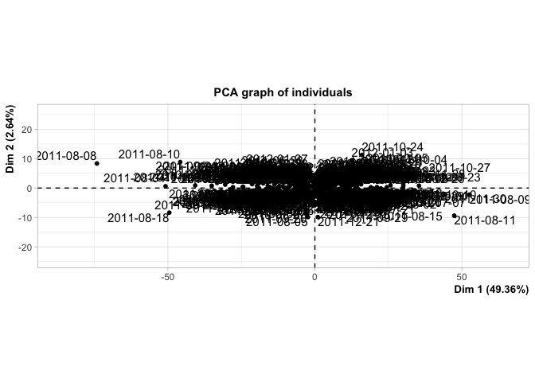<!-- --><!-- -->

```r
print(pca_output)
```

```
## **Results for the Principal Component Analysis (PCA)**
## The analysis was performed on 504 individuals, described by 347 variables
## *The results are available in the following objects:
## 
##    name               description                          
## 1  "$eig"             "eigenvalues"                        
## 2  "$var"             "results for the variables"          
## 3  "$var$coord"       "coord. for the variables"           
## 4  "$var$cor"         "correlations variables - dimensions"
## 5  "$var$cos2"        "cos2 for the variables"             
## 6  "$var$contrib"     "contributions of the variables"     
## 7  "$ind"             "results for the individuals"        
## 8  "$ind$coord"       "coord. for the individuals"         
## 9  "$ind$cos2"        "cos2 for the individuals"           
## 10 "$ind$contrib"     "contributions of the individuals"   
## 11 "$call"            "summary statistics"                 
## 12 "$call$centre"     "mean of the variables"              
## 13 "$call$ecart.type" "standard error of the variables"    
## 14 "$call$row.w"      "weights for the individuals"        
## 15 "$call$col.w"      "weights for the variables"
```

"cos2" is the quality of representation for variables on the factor map.  
"contrib" or "ctr" is the contributions of the variables.


```r
summary(pca_output)
```

```
## 
## Call:
## PCA(X = top_mcap_returns_df_short[1:504, ], scale.unit = TRUE,  
##      ncp = 10, graph = TRUE, axes = c(1, 2)) 
## 
## 
## Eigenvalues
##                        Dim.1   Dim.2   Dim.3   Dim.4   Dim.5   Dim.6   Dim.7
## Variance             171.268   9.170   6.178   5.315   4.040   3.144   2.744
## % of var.             49.357   2.643   1.780   1.532   1.164   0.906   0.791
## Cumulative % of var.  49.357  52.000  53.780  55.312  56.476  57.382  58.173
##                        Dim.8   Dim.9  Dim.10  Dim.11  Dim.12  Dim.13  Dim.14
## Variance               2.598   2.404   2.290   2.161   1.987   1.940   1.918
## % of var.              0.749   0.693   0.660   0.623   0.573   0.559   0.553
## Cumulative % of var.  58.922  59.614  60.274  60.897  61.470  62.029  62.582
##                       Dim.15  Dim.16  Dim.17  Dim.18  Dim.19  Dim.20  Dim.21
## Variance               1.828   1.791   1.769   1.679   1.660   1.565   1.529
## % of var.              0.527   0.516   0.510   0.484   0.479   0.451   0.441
## Cumulative % of var.  63.108  63.625  64.134  64.618  65.097  65.548  65.989
##                       Dim.22  Dim.23  Dim.24  Dim.25  Dim.26  Dim.27  Dim.28
## Variance               1.502   1.479   1.443   1.406   1.379   1.348   1.346
## % of var.              0.433   0.426   0.416   0.405   0.397   0.389   0.388
## Cumulative % of var.  66.421  66.848  67.264  67.669  68.066  68.455  68.843
##                       Dim.29  Dim.30  Dim.31  Dim.32  Dim.33  Dim.34  Dim.35
## Variance               1.323   1.320   1.286   1.248   1.229   1.213   1.209
## % of var.              0.381   0.380   0.371   0.360   0.354   0.350   0.348
## Cumulative % of var.  69.224  69.605  69.975  70.335  70.689  71.039  71.387
##                       Dim.36  Dim.37  Dim.38  Dim.39  Dim.40  Dim.41  Dim.42
## Variance               1.183   1.165   1.139   1.128   1.121   1.094   1.079
## % of var.              0.341   0.336   0.328   0.325   0.323   0.315   0.311
## Cumulative % of var.  71.728  72.064  72.392  72.717  73.040  73.356  73.666
##                       Dim.43  Dim.44  Dim.45  Dim.46  Dim.47  Dim.48  Dim.49
## Variance               1.073   1.063   1.040   1.032   1.024   1.006   0.998
## % of var.              0.309   0.306   0.300   0.298   0.295   0.290   0.288
## Cumulative % of var.  73.976  74.282  74.582  74.879  75.175  75.465  75.752
##                       Dim.50  Dim.51  Dim.52  Dim.53  Dim.54  Dim.55  Dim.56
## Variance               0.982   0.965   0.959   0.929   0.915   0.914   0.905
## % of var.              0.283   0.278   0.276   0.268   0.264   0.263   0.261
## Cumulative % of var.  76.035  76.314  76.590  76.858  77.122  77.385  77.646
##                       Dim.57  Dim.58  Dim.59  Dim.60  Dim.61  Dim.62  Dim.63
## Variance               0.897   0.891   0.874   0.861   0.857   0.850   0.845
## % of var.              0.258   0.257   0.252   0.248   0.247   0.245   0.244
## Cumulative % of var.  77.904  78.161  78.413  78.661  78.908  79.153  79.396
##                       Dim.64  Dim.65  Dim.66  Dim.67  Dim.68  Dim.69  Dim.70
## Variance               0.828   0.810   0.806   0.801   0.794   0.783   0.772
## % of var.              0.239   0.233   0.232   0.231   0.229   0.226   0.222
## Cumulative % of var.  79.635  79.868  80.101  80.331  80.560  80.786  81.008
##                       Dim.71  Dim.72  Dim.73  Dim.74  Dim.75  Dim.76  Dim.77
## Variance               0.770   0.757   0.751   0.740   0.730   0.719   0.713
## % of var.              0.222   0.218   0.216   0.213   0.210   0.207   0.205
## Cumulative % of var.  81.230  81.448  81.665  81.878  82.088  82.295  82.501
##                       Dim.78  Dim.79  Dim.80  Dim.81  Dim.82  Dim.83  Dim.84
## Variance               0.709   0.701   0.694   0.681   0.673   0.670   0.661
## % of var.              0.204   0.202   0.200   0.196   0.194   0.193   0.190
## Cumulative % of var.  82.705  82.907  83.107  83.304  83.497  83.690  83.881
##                       Dim.85  Dim.86  Dim.87  Dim.88  Dim.89  Dim.90  Dim.91
## Variance               0.655   0.650   0.643   0.639   0.634   0.624   0.617
## % of var.              0.189   0.187   0.185   0.184   0.183   0.180   0.178
## Cumulative % of var.  84.070  84.257  84.442  84.626  84.809  84.989  85.167
##                       Dim.92  Dim.93  Dim.94  Dim.95  Dim.96  Dim.97  Dim.98
## Variance               0.613   0.603   0.596   0.589   0.588   0.586   0.575
## % of var.              0.177   0.174   0.172   0.170   0.169   0.169   0.166
## Cumulative % of var.  85.343  85.517  85.689  85.859  86.028  86.197  86.363
##                       Dim.99 Dim.100 Dim.101 Dim.102 Dim.103 Dim.104 Dim.105
## Variance               0.569   0.561   0.556   0.548   0.543   0.533   0.530
## % of var.              0.164   0.162   0.160   0.158   0.156   0.154   0.153
## Cumulative % of var.  86.527  86.689  86.849  87.007  87.163  87.317  87.469
##                      Dim.106 Dim.107 Dim.108 Dim.109 Dim.110 Dim.111 Dim.112
## Variance               0.520   0.518   0.511   0.507   0.503   0.499   0.492
## % of var.              0.150   0.149   0.147   0.146   0.145   0.144   0.142
## Cumulative % of var.  87.619  87.769  87.916  88.062  88.207  88.351  88.492
##                      Dim.113 Dim.114 Dim.115 Dim.116 Dim.117 Dim.118 Dim.119
## Variance               0.488   0.483   0.474   0.468   0.466   0.460   0.457
## % of var.              0.141   0.139   0.137   0.135   0.134   0.133   0.132
## Cumulative % of var.  88.633  88.772  88.909  89.044  89.178  89.311  89.442
##                      Dim.120 Dim.121 Dim.122 Dim.123 Dim.124 Dim.125 Dim.126
## Variance               0.450   0.448   0.445   0.440   0.438   0.432   0.428
## % of var.              0.130   0.129   0.128   0.127   0.126   0.125   0.123
## Cumulative % of var.  89.572  89.701  89.829  89.956  90.082  90.207  90.330
##                      Dim.127 Dim.128 Dim.129 Dim.130 Dim.131 Dim.132 Dim.133
## Variance               0.425   0.420   0.415   0.410   0.404   0.399   0.395
## % of var.              0.123   0.121   0.120   0.118   0.117   0.115   0.114
## Cumulative % of var.  90.453  90.574  90.693  90.811  90.928  91.043  91.157
##                      Dim.134 Dim.135 Dim.136 Dim.137 Dim.138 Dim.139 Dim.140
## Variance               0.388   0.387   0.386   0.381   0.378   0.372   0.369
## % of var.              0.112   0.112   0.111   0.110   0.109   0.107   0.106
## Cumulative % of var.  91.269  91.380  91.491  91.601  91.710  91.817  91.924
##                      Dim.141 Dim.142 Dim.143 Dim.144 Dim.145 Dim.146 Dim.147
## Variance               0.366   0.363   0.357   0.356   0.356   0.350   0.348
## % of var.              0.105   0.105   0.103   0.103   0.103   0.101   0.100
## Cumulative % of var.  92.029  92.134  92.237  92.339  92.442  92.543  92.643
##                      Dim.148 Dim.149 Dim.150 Dim.151 Dim.152 Dim.153 Dim.154
## Variance               0.348   0.336   0.331   0.329   0.327   0.323   0.321
## % of var.              0.100   0.097   0.095   0.095   0.094   0.093   0.092
## Cumulative % of var.  92.743  92.840  92.936  93.030  93.125  93.218  93.310
##                      Dim.155 Dim.156 Dim.157 Dim.158 Dim.159 Dim.160 Dim.161
## Variance               0.318   0.315   0.312   0.311   0.307   0.304   0.302
## % of var.              0.092   0.091   0.090   0.090   0.089   0.087   0.087
## Cumulative % of var.  93.402  93.493  93.583  93.672  93.761  93.848  93.935
##                      Dim.162 Dim.163 Dim.164 Dim.165 Dim.166 Dim.167 Dim.168
## Variance               0.300   0.298   0.291   0.288   0.284   0.278   0.276
## % of var.              0.086   0.086   0.084   0.083   0.082   0.080   0.079
## Cumulative % of var.  94.022  94.108  94.192  94.275  94.356  94.437  94.516
##                      Dim.169 Dim.170 Dim.171 Dim.172 Dim.173 Dim.174 Dim.175
## Variance               0.270   0.266   0.265   0.263   0.262   0.259   0.254
## % of var.              0.078   0.077   0.076   0.076   0.075   0.075   0.073
## Cumulative % of var.  94.594  94.670  94.747  94.823  94.898  94.973  95.046
##                      Dim.176 Dim.177 Dim.178 Dim.179 Dim.180 Dim.181 Dim.182
## Variance               0.252   0.248   0.244   0.242   0.241   0.239   0.238
## % of var.              0.073   0.071   0.070   0.070   0.069   0.069   0.069
## Cumulative % of var.  95.118  95.190  95.260  95.330  95.399  95.468  95.537
##                      Dim.183 Dim.184 Dim.185 Dim.186 Dim.187 Dim.188 Dim.189
## Variance               0.234   0.230   0.229   0.226   0.224   0.221   0.219
## % of var.              0.067   0.066   0.066   0.065   0.064   0.064   0.063
## Cumulative % of var.  95.604  95.670  95.736  95.802  95.866  95.930  95.993
##                      Dim.190 Dim.191 Dim.192 Dim.193 Dim.194 Dim.195 Dim.196
## Variance               0.217   0.216   0.213   0.210   0.207   0.205   0.201
## % of var.              0.062   0.062   0.061   0.061   0.060   0.059   0.058
## Cumulative % of var.  96.055  96.117  96.179  96.239  96.299  96.358  96.416
##                      Dim.197 Dim.198 Dim.199 Dim.200 Dim.201 Dim.202 Dim.203
## Variance               0.199   0.197   0.193   0.192   0.189   0.187   0.183
## % of var.              0.057   0.057   0.056   0.055   0.054   0.054   0.053
## Cumulative % of var.  96.474  96.530  96.586  96.641  96.696  96.750  96.802
##                      Dim.204 Dim.205 Dim.206 Dim.207 Dim.208 Dim.209 Dim.210
## Variance               0.182   0.181   0.180   0.177   0.173   0.172   0.170
## % of var.              0.053   0.052   0.052   0.051   0.050   0.050   0.049
## Cumulative % of var.  96.855  96.907  96.959  97.010  97.060  97.110  97.159
##                      Dim.211 Dim.212 Dim.213 Dim.214 Dim.215 Dim.216 Dim.217
## Variance               0.168   0.166   0.163   0.162   0.158   0.155   0.154
## % of var.              0.049   0.048   0.047   0.047   0.046   0.045   0.045
## Cumulative % of var.  97.207  97.255  97.302  97.349  97.394  97.439  97.483
##                      Dim.218 Dim.219 Dim.220 Dim.221 Dim.222 Dim.223 Dim.224
## Variance               0.151   0.150   0.148   0.147   0.144   0.144   0.140
## % of var.              0.043   0.043   0.043   0.042   0.042   0.041   0.040
## Cumulative % of var.  97.527  97.570  97.613  97.655  97.697  97.738  97.779
##                      Dim.225 Dim.226 Dim.227 Dim.228 Dim.229 Dim.230 Dim.231
## Variance               0.139   0.138   0.136   0.134   0.133   0.133   0.130
## % of var.              0.040   0.040   0.039   0.039   0.038   0.038   0.038
## Cumulative % of var.  97.819  97.858  97.898  97.936  97.974  98.013  98.050
##                      Dim.232 Dim.233 Dim.234 Dim.235 Dim.236 Dim.237 Dim.238
## Variance               0.128   0.126   0.125   0.124   0.123   0.119   0.118
## % of var.              0.037   0.036   0.036   0.036   0.035   0.034   0.034
## Cumulative % of var.  98.087  98.124  98.160  98.196  98.231  98.265  98.299
##                      Dim.239 Dim.240 Dim.241 Dim.242 Dim.243 Dim.244 Dim.245
## Variance               0.117   0.115   0.114   0.113   0.112   0.109   0.108
## % of var.              0.034   0.033   0.033   0.033   0.032   0.031   0.031
## Cumulative % of var.  98.333  98.366  98.399  98.432  98.464  98.495  98.527
##                      Dim.246 Dim.247 Dim.248 Dim.249 Dim.250 Dim.251 Dim.252
## Variance               0.107   0.106   0.104   0.104   0.101   0.100   0.097
## % of var.              0.031   0.031   0.030   0.030   0.029   0.029   0.028
## Cumulative % of var.  98.558  98.588  98.618  98.648  98.677  98.706  98.734
##                      Dim.253 Dim.254 Dim.255 Dim.256 Dim.257 Dim.258 Dim.259
## Variance               0.095   0.095   0.094   0.092   0.091   0.090   0.089
## % of var.              0.027   0.027   0.027   0.027   0.026   0.026   0.026
## Cumulative % of var.  98.762  98.789  98.816  98.842  98.869  98.894  98.920
##                      Dim.260 Dim.261 Dim.262 Dim.263 Dim.264 Dim.265 Dim.266
## Variance               0.088   0.085   0.084   0.083   0.082   0.081   0.079
## % of var.              0.025   0.025   0.024   0.024   0.024   0.023   0.023
## Cumulative % of var.  98.945  98.970  98.994  99.018  99.042  99.065  99.088
##                      Dim.267 Dim.268 Dim.269 Dim.270 Dim.271 Dim.272 Dim.273
## Variance               0.078   0.078   0.077   0.076   0.074   0.072   0.071
## % of var.              0.023   0.023   0.022   0.022   0.021   0.021   0.021
## Cumulative % of var.  99.110  99.133  99.155  99.177  99.198  99.219  99.240
##                      Dim.274 Dim.275 Dim.276 Dim.277 Dim.278 Dim.279 Dim.280
## Variance               0.071   0.069   0.067   0.067   0.066   0.064   0.064
## % of var.              0.020   0.020   0.019   0.019   0.019   0.019   0.018
## Cumulative % of var.  99.260  99.280  99.299  99.319  99.338  99.356  99.375
##                      Dim.281 Dim.282 Dim.283 Dim.284 Dim.285 Dim.286 Dim.287
## Variance               0.063   0.062   0.060   0.059   0.058   0.057   0.057
## % of var.              0.018   0.018   0.017   0.017   0.017   0.016   0.016
## Cumulative % of var.  99.393  99.411  99.428  99.445  99.462  99.478  99.495
##                      Dim.288 Dim.289 Dim.290 Dim.291 Dim.292 Dim.293 Dim.294
## Variance               0.055   0.054   0.052   0.051   0.051   0.050   0.049
## % of var.              0.016   0.016   0.015   0.015   0.015   0.014   0.014
## Cumulative % of var.  99.510  99.526  99.541  99.556  99.570  99.585  99.599
##                      Dim.295 Dim.296 Dim.297 Dim.298 Dim.299 Dim.300 Dim.301
## Variance               0.048   0.047   0.046   0.045   0.044   0.044   0.043
## % of var.              0.014   0.014   0.013   0.013   0.013   0.013   0.012
## Cumulative % of var.  99.613  99.626  99.640  99.653  99.665  99.678  99.690
##                      Dim.302 Dim.303 Dim.304 Dim.305 Dim.306 Dim.307 Dim.308
## Variance               0.041   0.040   0.039   0.038   0.037   0.037   0.036
## % of var.              0.012   0.011   0.011   0.011   0.011   0.011   0.010
## Cumulative % of var.  99.702  99.713  99.725  99.736  99.747  99.757  99.767
##                      Dim.309 Dim.310 Dim.311 Dim.312 Dim.313 Dim.314 Dim.315
## Variance               0.035   0.034   0.034   0.033   0.033   0.032   0.030
## % of var.              0.010   0.010   0.010   0.009   0.009   0.009   0.009
## Cumulative % of var.  99.778  99.787  99.797  99.807  99.816  99.825  99.834
##                      Dim.316 Dim.317 Dim.318 Dim.319 Dim.320 Dim.321 Dim.322
## Variance               0.030   0.029   0.028   0.027   0.026   0.025   0.025
## % of var.              0.009   0.008   0.008   0.008   0.008   0.007   0.007
## Cumulative % of var.  99.842  99.851  99.859  99.867  99.874  99.881  99.889
##                      Dim.323 Dim.324 Dim.325 Dim.326 Dim.327 Dim.328 Dim.329
## Variance               0.024   0.023   0.023   0.022   0.021   0.021   0.020
## % of var.              0.007   0.007   0.007   0.006   0.006   0.006   0.006
## Cumulative % of var.  99.895  99.902  99.909  99.915  99.921  99.927  99.933
##                      Dim.330 Dim.331 Dim.332 Dim.333 Dim.334 Dim.335 Dim.336
## Variance               0.019   0.019   0.018   0.017   0.016   0.016   0.015
## % of var.              0.006   0.005   0.005   0.005   0.005   0.005   0.004
## Cumulative % of var.  99.939  99.944  99.949  99.954  99.959  99.963  99.968
##                      Dim.337 Dim.338 Dim.339 Dim.340 Dim.341 Dim.342 Dim.343
## Variance               0.015   0.014   0.014   0.013   0.012   0.011   0.010
## % of var.              0.004   0.004   0.004   0.004   0.003   0.003   0.003
## Cumulative % of var.  99.972  99.976  99.980  99.984  99.987  99.990  99.993
##                      Dim.344 Dim.345 Dim.346 Dim.347
## Variance               0.010   0.008   0.006   0.000
## % of var.              0.003   0.002   0.002   0.000
## Cumulative % of var.  99.996  99.998 100.000 100.000
## 
## Individuals (the 10 first)
##                Dist    Dim.1    ctr   cos2    Dim.2    ctr   cos2    Dim.3
## 2010-06-30 | 15.889 | -9.341  0.101  0.346 |  2.006  0.087  0.016 | -2.273
## 2010-07-01 | 14.257 | -2.236  0.006  0.025 | -0.761  0.013  0.003 |  1.398
## 2010-07-02 | 13.542 | -5.106  0.030  0.142 | -1.671  0.060  0.015 | -2.792
## 2010-07-06 | 16.305 |  3.919  0.018  0.058 | -4.686  0.475  0.083 | -5.014
## 2010-07-07 | 34.393 | 30.365  1.068  0.780 | -3.374  0.246  0.010 |  1.046
## 2010-07-08 | 15.360 |  8.327  0.080  0.294 | -2.900  0.182  0.036 | -0.315
## 2010-07-09 | 13.917 |  8.144  0.077  0.342 |  1.595  0.055  0.013 | -1.244
## 2010-07-12 | 12.823 | -2.455  0.007  0.037 | -1.129  0.028  0.008 |  0.808
## 2010-07-13 | 21.447 | 17.439  0.352  0.661 |  2.701  0.158  0.016 |  2.564
## 2010-07-14 | 10.908 | -1.260  0.002  0.013 |  0.443  0.004  0.002 |  0.328
##               ctr   cos2  
## 2010-06-30  0.166  0.020 |
## 2010-07-01  0.063  0.010 |
## 2010-07-02  0.250  0.043 |
## 2010-07-06  0.808  0.095 |
## 2010-07-07  0.035  0.001 |
## 2010-07-08  0.003  0.000 |
## 2010-07-09  0.050  0.008 |
## 2010-07-12  0.021  0.004 |
## 2010-07-13  0.211  0.014 |
## 2010-07-14  0.003  0.001 |
## 
## Variables (the 10 first)
##               Dim.1    ctr   cos2    Dim.2    ctr   cos2    Dim.3    ctr   cos2
## AAPL       |  0.592  0.204  0.350 |  0.198  0.428  0.039 |  0.086  0.121  0.007
## ABEV       |  0.601  0.211  0.361 | -0.023  0.006  0.001 | -0.055  0.049  0.003
## ABT        |  0.654  0.250  0.427 | -0.319  1.107  0.101 |  0.059  0.056  0.003
## ACGL       |  0.704  0.289  0.495 | -0.138  0.209  0.019 |  0.033  0.017  0.001
## ACN        |  0.731  0.312  0.535 |  0.083  0.076  0.007 |  0.034  0.018  0.001
## ADBE       |  0.640  0.239  0.410 |  0.117  0.150  0.014 |  0.129  0.268  0.017
## ADI        |  0.753  0.331  0.568 |  0.217  0.513  0.047 |  0.108  0.190  0.012
## ADP        |  0.871  0.443  0.759 | -0.082  0.073  0.007 |  0.108  0.187  0.012
## ADSK       |  0.760  0.337  0.578 |  0.222  0.537  0.049 |  0.110  0.197  0.012
## AEE        |  0.690  0.278  0.476 | -0.388  1.644  0.151 |  0.008  0.001  0.000
##             
## AAPL       |
## ABEV       |
## ABT        |
## ACGL       |
## ACN        |
## ADBE       |
## ADI        |
## ADP        |
## ADSK       |
## AEE        |
```


### Scree plot


```r
library(factoextra)
```

```
## Welcome! Want to learn more? See two factoextra-related books at https://goo.gl/ve3WBa
```

The first PC captures half the total variation. The first PC is considered to capture systematic variation (market variation).  

The the first 10 PCs catches 60 percent of the total variation, and only 10 percent of the non-systematic variance, if the first PC represents the market variation.  

To capture 90 percent of the variation we would need 125 PCs.  

So the diversification provided by the first 10 PCs is not great.  

Following Kaiser's rule we would have to keep no more than 48 PCs (eigenvalue > 1).


```r
head(get_eigenvalue(pca_output), 125)
```

```
##          eigenvalue variance.percent cumulative.variance.percent
## Dim.1   171.2680990       49.3568009                    49.35680
## Dim.2     9.1704676        2.6427860                    51.99959
## Dim.3     6.1782668        1.7804804                    53.78007
## Dim.4     5.3154082        1.5318179                    55.31189
## Dim.5     4.0404815        1.1644039                    56.47629
## Dim.6     3.1437707        0.9059858                    57.38227
## Dim.7     2.7436884        0.7906883                    58.17296
## Dim.8     2.5976653        0.7486067                    58.92157
## Dim.9     2.4036238        0.6926870                    59.61426
## Dim.10    2.2899508        0.6599282                    60.27419
## Dim.11    2.1613688        0.6228729                    60.89706
## Dim.12    1.9869580        0.5726104                    61.46967
## Dim.13    1.9403189        0.5591697                    62.02884
## Dim.14    1.9181369        0.5527772                    62.58162
## Dim.15    1.8281941        0.5268571                    63.10847
## Dim.16    1.7907792        0.5160747                    63.62455
## Dim.17    1.7692515        0.5098708                    64.13442
## Dim.18    1.6792303        0.4839280                    64.61835
## Dim.19    1.6604741        0.4785228                    65.09687
## Dim.20    1.5648260        0.4509585                    65.54783
## Dim.21    1.5292919        0.4407181                    65.98855
## Dim.22    1.5018594        0.4328125                    66.42136
## Dim.23    1.4794500        0.4263545                    66.84771
## Dim.24    1.4433477        0.4159503                    67.26366
## Dim.25    1.4064446        0.4053155                    67.66898
## Dim.26    1.3792744        0.3974854                    68.06646
## Dim.27    1.3481354        0.3885116                    68.45498
## Dim.28    1.3455437        0.3877647                    68.84274
## Dim.29    1.3232830        0.3813496                    69.22409
## Dim.30    1.3201124        0.3804359                    69.60453
## Dim.31    1.2864541        0.3707361                    69.97526
## Dim.32    1.2483283        0.3597488                    70.33501
## Dim.33    1.2294289        0.3543023                    70.68931
## Dim.34    1.2130689        0.3495876                    71.03890
## Dim.35    1.2089703        0.3484064                    71.38731
## Dim.36    1.1830100        0.3409251                    71.72823
## Dim.37    1.1645929        0.3356176                    72.06385
## Dim.38    1.1394869        0.3283824                    72.39223
## Dim.39    1.1283587        0.3251754                    72.71741
## Dim.40    1.1206186        0.3229448                    73.04035
## Dim.41    1.0938738        0.3152374                    73.35559
## Dim.42    1.0787320        0.3108738                    73.66646
## Dim.43    1.0733120        0.3093118                    73.97577
## Dim.44    1.0626409        0.3062366                    74.28201
## Dim.45    1.0404528        0.2998423                    74.58185
## Dim.46    1.0324407        0.2975333                    74.87939
## Dim.47    1.0244874        0.2952413                    75.17463
## Dim.48    1.0059908        0.2899109                    75.46454
## Dim.49    0.9983579        0.2877112                    75.75225
## Dim.50    0.9823959        0.2831112                    76.03536
## Dim.51    0.9653517        0.2781993                    76.31356
## Dim.52    0.9589987        0.2763685                    76.58993
## Dim.53    0.9293810        0.2678331                    76.85776
## Dim.54    0.9154753        0.2638257                    77.12159
## Dim.55    0.9136207        0.2632913                    77.38488
## Dim.56    0.9048240        0.2607562                    77.64564
## Dim.57    0.8967501        0.2584294                    77.90407
## Dim.58    0.8914747        0.2569091                    78.16097
## Dim.59    0.8735246        0.2517362                    78.41271
## Dim.60    0.8611772        0.2481779                    78.66089
## Dim.61    0.8565281        0.2468381                    78.90773
## Dim.62    0.8497460        0.2448836                    79.15261
## Dim.63    0.8454305        0.2436399                    79.39625
## Dim.64    0.8279519        0.2386028                    79.63485
## Dim.65    0.8099817        0.2334241                    79.86828
## Dim.66    0.8061090        0.2323081                    80.10058
## Dim.67    0.8007448        0.2307622                    80.33135
## Dim.68    0.7941843        0.2288716                    80.56022
## Dim.69    0.7829538        0.2256351                    80.78585
## Dim.70    0.7719969        0.2224775                    81.00833
## Dim.71    0.7701312        0.2219398                    81.23027
## Dim.72    0.7565410        0.2180234                    81.44829
## Dim.73    0.7508696        0.2163889                    81.66468
## Dim.74    0.7395266        0.2131201                    81.87780
## Dim.75    0.7300378        0.2103855                    82.08819
## Dim.76    0.7193475        0.2073047                    82.29549
## Dim.77    0.7127635        0.2054074                    82.50090
## Dim.78    0.7088429        0.2042775                    82.70518
## Dim.79    0.7008295        0.2019682                    82.90715
## Dim.80    0.6942005        0.2000578                    83.10720
## Dim.81    0.6814867        0.1963939                    83.30360
## Dim.82    0.6726954        0.1938603                    83.49746
## Dim.83    0.6696304        0.1929770                    83.69044
## Dim.84    0.6605752        0.1903675                    83.88080
## Dim.85    0.6548220        0.1887095                    84.06951
## Dim.86    0.6500040        0.1873210                    84.25683
## Dim.87    0.6426076        0.1851895                    84.44202
## Dim.88    0.6392203        0.1842133                    84.62624
## Dim.89    0.6344873        0.1828494                    84.80909
## Dim.90    0.6237277        0.1797486                    84.98883
## Dim.91    0.6173576        0.1779128                    85.16675
## Dim.92    0.6130401        0.1766686                    85.34342
## Dim.93    0.6034802        0.1739136                    85.51733
## Dim.94    0.5963940        0.1718715                    85.68920
## Dim.95    0.5892465        0.1698117                    85.85901
## Dim.96    0.5877431        0.1693784                    86.02839
## Dim.97    0.5864468        0.1690048                    86.19740
## Dim.98    0.5750124        0.1657096                    86.36311
## Dim.99    0.5687002        0.1638905                    86.52700
## Dim.100   0.5612274        0.1617370                    86.68873
## Dim.101   0.5560515        0.1602454                    86.84898
## Dim.102   0.5475128        0.1577847                    87.00676
## Dim.103   0.5427562        0.1564139                    87.16318
## Dim.104   0.5327590        0.1535329                    87.31671
## Dim.105   0.5295506        0.1526082                    87.46932
## Dim.106   0.5204810        0.1499945                    87.61931
## Dim.107   0.5177854        0.1492177                    87.76853
## Dim.108   0.5109399        0.1472449                    87.91578
## Dim.109   0.5072724        0.1461880                    88.06196
## Dim.110   0.5029807        0.1449512                    88.20691
## Dim.111   0.4985301        0.1436686                    88.35058
## Dim.112   0.4923858        0.1418979                    88.49248
## Dim.113   0.4884105        0.1407523                    88.63323
## Dim.114   0.4828621        0.1391534                    88.77239
## Dim.115   0.4744580        0.1367314                    88.90912
## Dim.116   0.4675618        0.1347440                    89.04386
## Dim.117   0.4655604        0.1341673                    89.17803
## Dim.118   0.4602199        0.1326282                    89.31066
## Dim.119   0.4571826        0.1317529                    89.44241
## Dim.120   0.4500993        0.1297116                    89.57212
## Dim.121   0.4480837        0.1291308                    89.70125
## Dim.122   0.4445254        0.1281053                    89.82936
## Dim.123   0.4404470        0.1269300                    89.95629
## Dim.124   0.4378227        0.1261737                    90.08246
## Dim.125   0.4321283        0.1245327                    90.20699
```


```r
fviz_eig(pca_output, addlabels = TRUE)
```

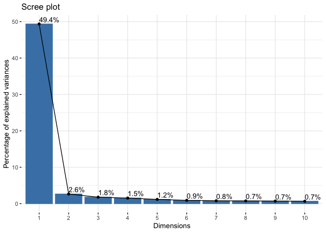<!-- -->

### Variables (individual stocks)


```r
library("corrplot")
```


```r
variables <- get_pca_var(pca_output)
```


Plot contribution of representation of the variables on factor map.  
Plotting the top 20 highest contributors to PC1.  


```r
top_pca_contrib_var <- head(variables$contrib[order(variables$contrib[, 1], decreasing=TRUE), ], 20)
# top_pca_variables <- lapply(variables, function(x) {
#   x[1:20, ]
# })
corrplot(top_pca_contrib_var, is.corr=FALSE)
```

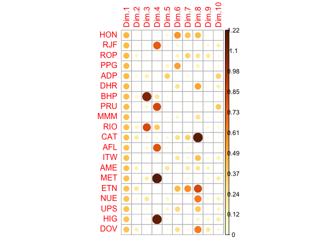<!-- -->

Which stock contributes most to each of the first 10 PCs?

```r
top_contributing_stocks <- list()
for(i in 1:ncol(variables$contrib)) {
  top_contributing_stock_id <- which(variables$contrib[ ,i] == max(variables$contrib[,i]))
  top_contributing_stocks[[i]] <- variables$contrib[top_contributing_stock_id, i]
  names(top_contributing_stocks[[i]]) <- rownames(variables$contrib)[top_contributing_stock_id]
}
```


```r
head(top_contributing_stocks, 10)
```

```
## [[1]]
##       HON 
## 0.4574893 
## 
## [[2]]
##       ED 
## 3.030579 
## 
## [[3]]
##    ROST 
## 2.56385 
## 
## [[4]]
##      WPM 
## 3.577042 
## 
## [[5]]
##        O 
## 2.631794 
## 
## [[6]]
##     MRVL 
## 2.575865 
## 
## [[7]]
##      AEM 
## 8.025388 
## 
## [[8]]
##       SO 
## 2.572893 
## 
## [[9]]
##     AMZN 
## 3.948117 
## 
## [[10]]
##      UAL 
## 2.479751
```


Plot quality of representation of the variables on factor map.  
Plotting the top 20 highest contributors to PC1 and omitting PC1 in the plot, which otherwise dominates the plot.  

```r
top_pca_cor2_var <- head(variables$cos2[order(variables$contrib[, 1], decreasing=TRUE), ], 20)
# top_pca_variables <- lapply(variables, function(x) {
#   x[1:20, ]
# })
corrplot(top_pca_cor2_var[, -1], is.corr=FALSE)
```

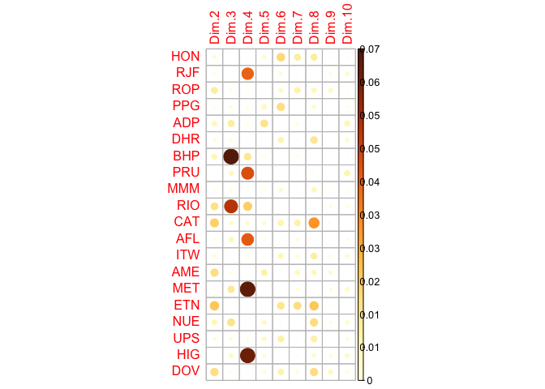<!-- -->


Total cos2 of variables on dim. 1:

```r
fviz_cos2(pca_output, choice = "var", axes = 1) +
  theme(axis.text.x = element_blank())
```

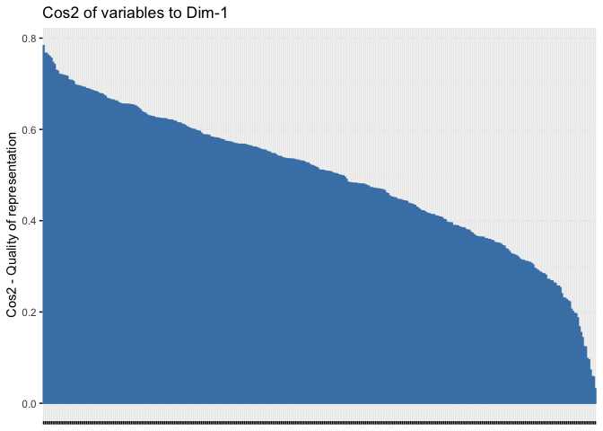<!-- -->

Total contrib of variables on dim. 1.  
Red dashed is average.

```r
fviz_contrib(pca_output, choice = "var", axes = 1) +
  theme(axis.text.x = element_blank())
```

<!-- -->


Total cos2 of variables on dim. 2:

```r
fviz_cos2(pca_output, choice = "var", axes = 2) +
  theme(axis.text.x = element_blank())
```

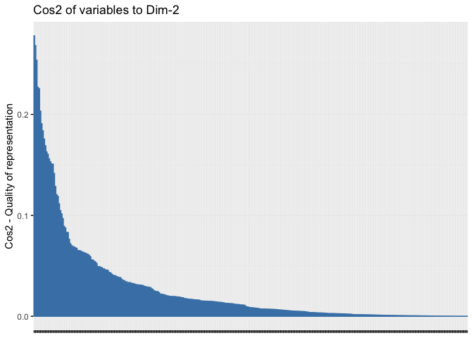<!-- -->

Total contrib of variables on dim. 2.  

```r
fviz_contrib(pca_output, choice = "var", axes = 2) +
  theme(axis.text.x = element_blank())
```

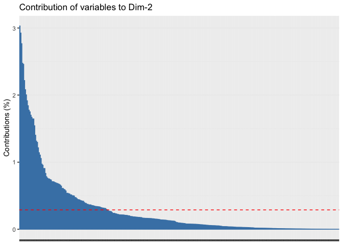<!-- -->


Total cos2 of variables on dim. 3:

```r
fviz_cos2(pca_output, choice = "var", axes = 3) +
  theme(axis.text.x = element_blank())
```

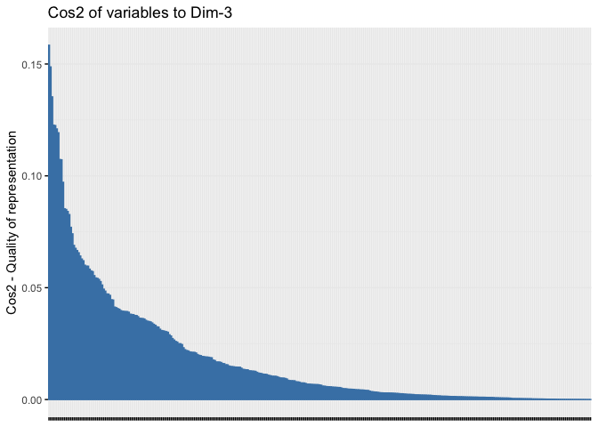<!-- -->

Total contrib of variables on dim. 3.  

```r
fviz_contrib(pca_output, choice = "var", axes = 3) +
  theme(axis.text.x = element_blank())
```

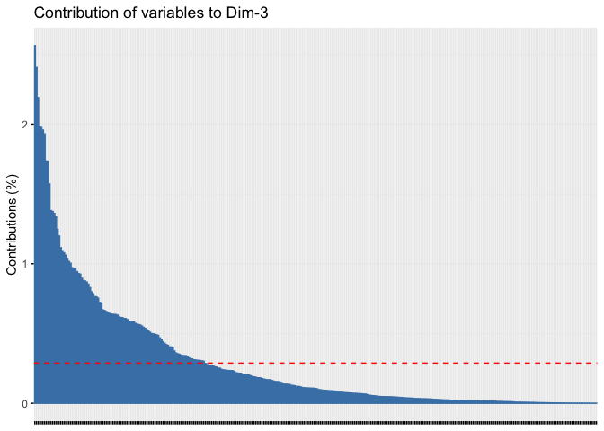<!-- -->


Total cos2 of variables on dim 4 thru 10.

```r
fviz_cos2(pca_output, choice = "var", axes = 4:10) +
  theme(axis.text.x = element_blank())
```

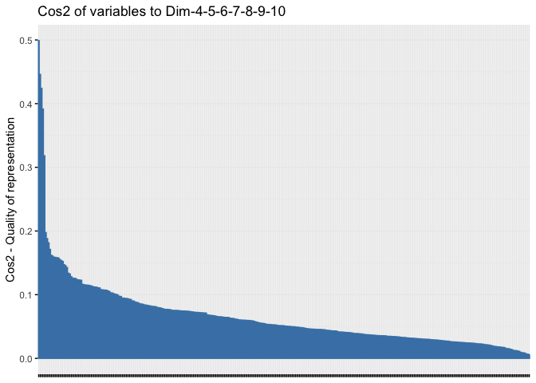<!-- -->

Total contrib of variables on dim. 4 thru 10.  

```r
fviz_contrib(pca_output, choice = "var", axes = 4:10) +
  theme(axis.text.x = element_blank())
```

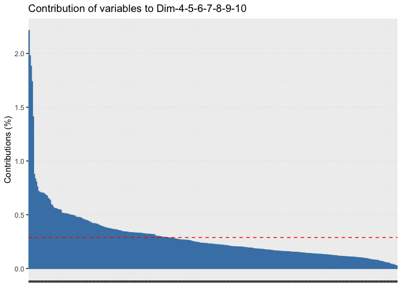<!-- -->


We see that a lot of variables (stocks) contribute to PC1, but only a few higher PC numbers.


## Plot coordinates (eigenvectors)

First 10 components (dimensions):

```r
as.data.frame(pca_output$var$coord[, 1:10]) %>% 
  mutate(stock = factor(row.names(pca_output$var$coord))) %>% 
  gather(key = "component", value = "coord", -stock) %>% 
  ggplot(aes(x = stock, y = coord, group = component, colour = component)) +
    geom_line(linewidth = 0.2) +  
    geom_point(size = 0.5) +
    theme(axis.text.x = element_blank())
```

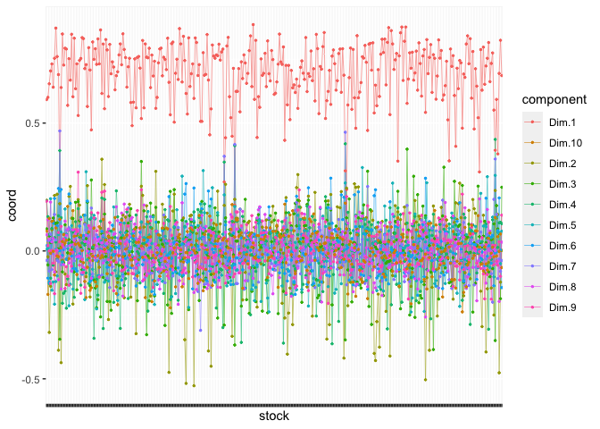<!-- -->

It is very clear to see, that all stockes - except a few - contribute mainly to $PC_1$, hence $PC_1$ represents market risk.

For which stocks are the coordinates for $PC_1$ smaller than for some other PC?


```r
strong_idio_risk <- list()
for(i in 2:10) {
  coords_i <- pca_output$var$coord[ ,i]
  strong_idio_risk_i <- coords_i[which(coords_i > pca_output$var$coord[ ,1])]
  strong_idio_risk_i
  if(length(strong_idio_risk_i) > 0) {
    strong_idio_risk[[i - 1]] <- strong_idio_risk_i
  } else {
    strong_idio_risk[[i - 1]] <- NA
  }
}
names(strong_idio_risk) <- paste0("component", 2:10)

strong_idio_risk
```

```
## $component2
##      GOLD      NFLX 
## 0.2017508 0.2458170 
## 
## $component3
## [1] NA
## 
## $component4
##       AEM       FNV      GOLD       NEM       WPM 
## 0.3924176 0.3474769 0.4117121 0.4190413 0.4360440 
## 
## $component5
## [1] NA
## 
## $component6
## [1] NA
## 
## $component7
##       AEM       FNV      GOLD       NEM 
## 0.4692458 0.3700811 0.4165433 0.4640805 
## 
## $component8
## [1] NA
## 
## $component9
## [1] NA
## 
## $component10
## [1] NA
```

Let's look at the components in pairs.

First two components:

```r
as.data.frame(pca_output$var$coord[, 1:2]) %>% 
  mutate(stock = factor(row.names(pca_output$var$coord))) %>% 
  gather(key = "component", value = "coord", -stock) %>% 
  ggplot(aes(x = stock, y = coord, group = component, colour = component)) +
    geom_line(linewidth = 0.2) +  
    geom_point(size = 0.5) +
    theme(axis.text.x = element_blank())
```

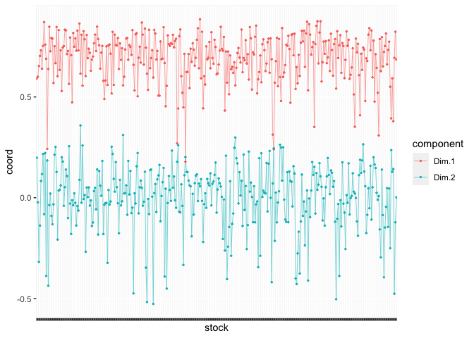<!-- -->

Components 3 - 4:

```r
as.data.frame(pca_output$var$coord[, 3:4]) %>% 
  mutate(stock = factor(row.names(pca_output$var$coord))) %>% 
  gather(key = "component", value = "coord", -stock) %>% 
  ggplot(aes(x = stock, y = coord, group = component, colour = component)) +
    geom_line(linewidth = 0.2) +  
    geom_point(size = 0.5) +
    theme(axis.text.x = element_blank())
```

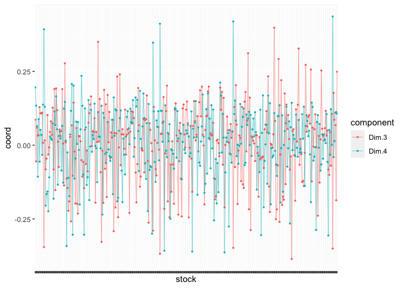<!-- -->

Components 5 - 6:

```r
as.data.frame(pca_output$var$coord[, 5:6]) %>% 
  mutate(stock = factor(row.names(pca_output$var$coord))) %>% 
  gather(key = "component", value = "coord", -stock) %>% 
  ggplot(aes(x = stock, y = coord, group = component, colour = component)) +
    geom_line(linewidth = 0.2) +  
    geom_point(size = 0.5) +
    theme(axis.text.x = element_blank())
```

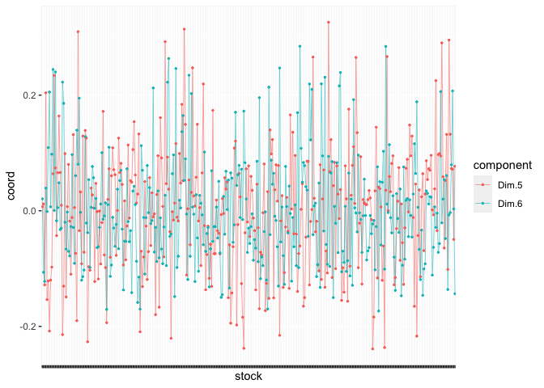<!-- -->

Components 7 - 8:

```r
as.data.frame(pca_output$var$coord[, 7:8]) %>% 
  mutate(stock = factor(row.names(pca_output$var$coord))) %>% 
  gather(key = "component", value = "coord", -stock) %>% 
  ggplot(aes(x = stock, y = coord, group = component, colour = component)) +
    geom_line(linewidth = 0.2) +  
    geom_point(size = 0.5) +
    theme(axis.text.x = element_blank())
```

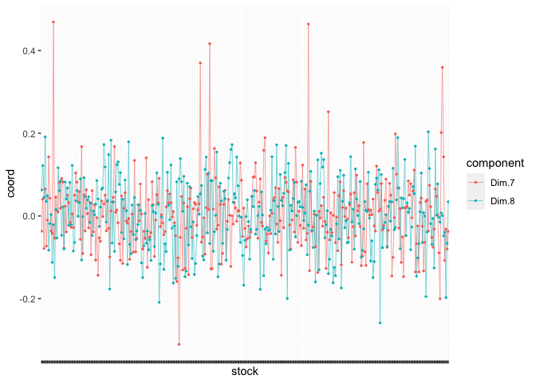<!-- -->

Components 9 - 10:

```r
as.data.frame(pca_output$var$coord[, 9:10]) %>% 
  mutate(stock = factor(row.names(pca_output$var$coord))) %>% 
  gather(key = "component", value = "coord", -stock) %>% 
  ggplot(aes(x = stock, y = coord, group = component, colour = component)) +
    geom_line(linewidth = 0.2) +  
    geom_point(size = 0.5) +
    theme(axis.text.x = element_blank())
```

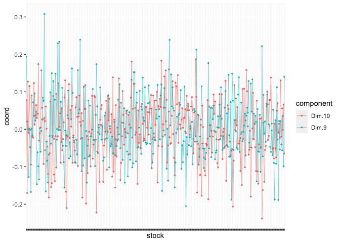<!-- -->

Instead we could look at bi-plots...


### Bi-plot

Reference:  
https://www.sthda.com/english/articles/31-principal-component-methods-in-r-practical-guide/112-pca-principal-component-analysis-essentials/#biplot 

Arrow colors represent cluster numbers from k-Sharp clustering.

Roughly speaking a bi-plot can be interpreted as follows:  

- An individual that is on the same side of a given variable has a high value for this variable;  
- An individual that is on the opposite side of a given variable has a low value for this variable.  


Dim 1+2

```r
fviz_pca_biplot(
    pca_output,
    axes = c(1,2),
    geom = "point",
    #col.ind = "contrib", ## color according to individual contribution to PC
    col.ind = "gray",
    col.var = factor(py$mcap_clusters), #"contrib", ## color according to contribution of variable to PC
    #gradient.cols = c("#00AFBB", "#E7B800", "#FC4E07"),
    palette = "simpsons",
    label = "none"
  ) +
  labs(title = "Biplot of PCA Results")
```

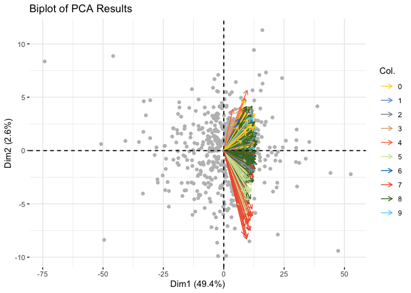<!-- -->


```r
fviz_pca_var(
  pca_output, 
  axes = c(1,2),
  col.var = "contrib", #"black",
  gradient.cols = c("#00AFBB", "#E7B800", "#FC4E07"),
  alpha.var = 0.25,
  label = "none"  
)
```

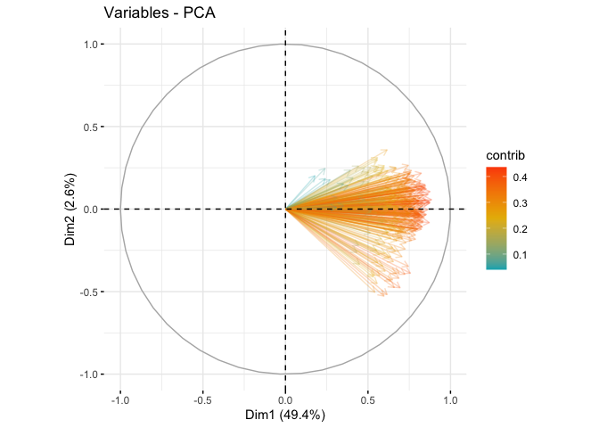<!-- -->


Dim 3+4

```r
fviz_pca_biplot(
    pca_output,
    axes = c(3,4),
    geom = "point",
    #col.ind = "contrib", ## color according to individual contribution to PC
    col.ind = "gray",
    col.var = factor(py$mcap_clusters), #"contrib", ## color according to contribution of variable to PC
    #gradient.cols = c("#00AFBB", "#E7B800", "#FC4E07"),
    palette = "simpsons",
    label = "none"
  ) +
  labs(title = "Biplot of PCA Results")
```

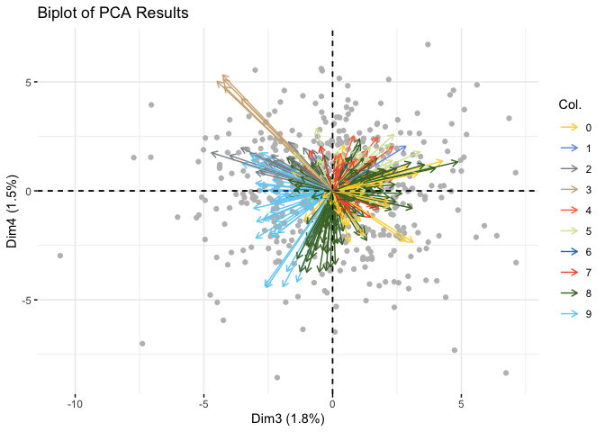<!-- -->


```r
fviz_pca_var(
  pca_output, 
  axes = c(3,4),
  col.var = "contrib", #"black",
  gradient.cols = c("#00AFBB", "#E7B800", "#FC4E07"),
  alpha.var = 0.25,
  label = "none"  
)
```

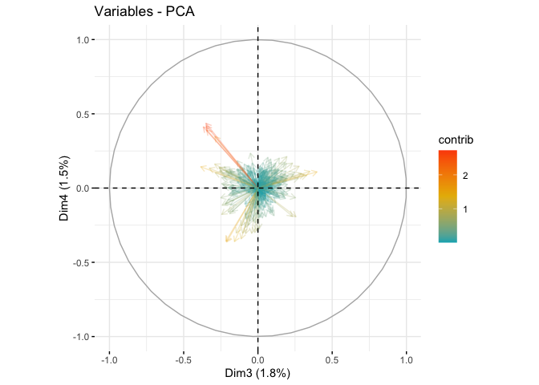<!-- -->


Dim 5+6

```r
fviz_pca_biplot(
    pca_output,
    axes = c(5,6),
    geom = "point",
    #col.ind = "contrib", ## color according to individual contribution to PC
    col.ind = "gray",
    col.var = factor(py$mcap_clusters), #"contrib", ## color according to contribution of variable to PC
    #gradient.cols = c("#00AFBB", "#E7B800", "#FC4E07"),
    palette = "simpsons",
    label = "none"
  ) +
  labs(title = "Biplot of PCA Results")
```

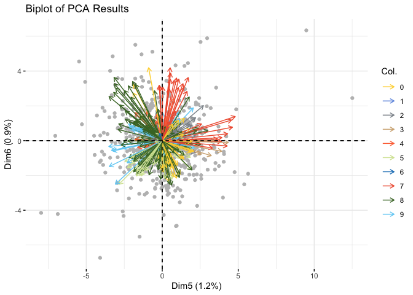<!-- -->


```r
fviz_pca_var(
  pca_output, 
  axes = c(5,6),
  col.var = "contrib", #"black",
  gradient.cols = c("#00AFBB", "#E7B800", "#FC4E07"),
  alpha.var = 0.25,
  label = "none"   
)
```

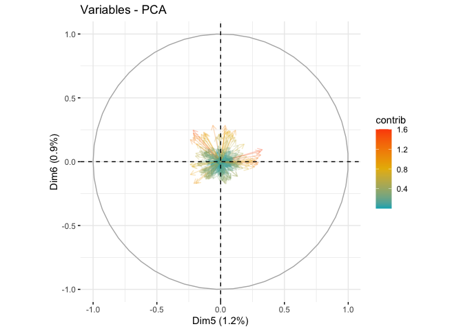<!-- -->


Dim 7+8

```r
fviz_pca_biplot(
    pca_output,
    axes = c(7,8),
    geom = "point",
    #col.ind = "contrib", ## color according to individual contribution to PC
    col.ind = "gray",
    col.var = factor(py$mcap_clusters), #"contrib", ## color according to contribution of variable to PC
    #gradient.cols = c("#00AFBB", "#E7B800", "#FC4E07"),
    palette = "simpsons",
    label = "none"
  ) +
  labs(title = "Biplot of PCA Results")
```

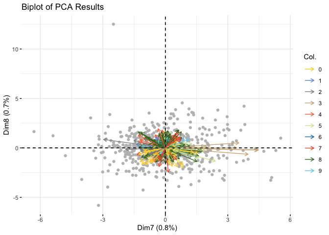<!-- -->


```r
fviz_pca_var(
  pca_output, 
  axes = c(7,8),
  col.var = "contrib", #"black",
  gradient.cols = c("#00AFBB", "#E7B800", "#FC4E07"),
  alpha.var = 0.25,
  label = "none"  
)
```

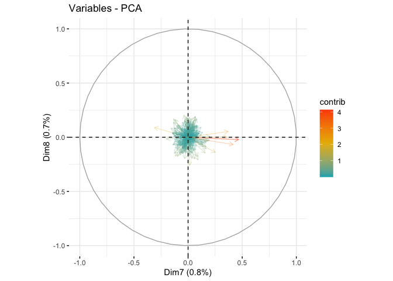<!-- -->


Dim 9+10

```r
fviz_pca_biplot(
    pca_output,
    axes = c(9,10),
    geom = "point",
    #col.ind = "contrib", ## color according to individual contribution to PC
    col.ind = "gray",
    col.var = factor(py$mcap_clusters), #"contrib", ## color according to contribution of variable to PC
    #gradient.cols = c("#00AFBB", "#E7B800", "#FC4E07"),
    palette = "simpsons",
    label = "none"
  ) +
  labs(title = "Biplot of PCA Results")
```

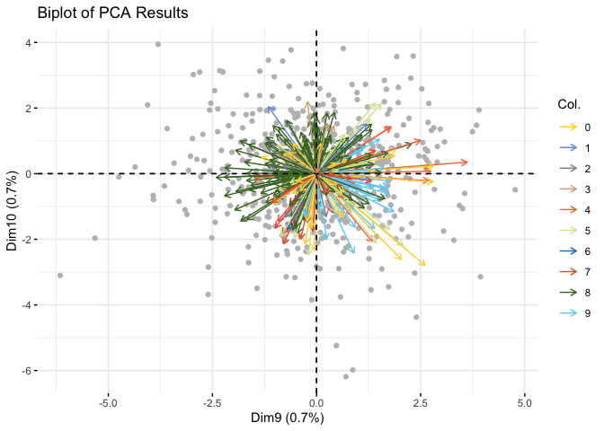<!-- -->


```r
fviz_pca_var(
  pca_output, 
  axes = c(9,10),
  col.var = "contrib", #"black",
  gradient.cols = c("#00AFBB", "#E7B800", "#FC4E07"),
  alpha.var = 0.25,
  label = "none" 
)
```

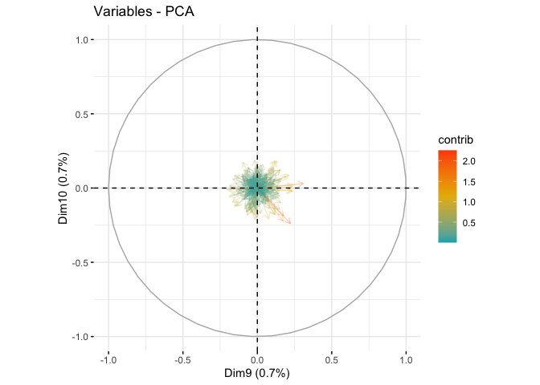<!-- -->

## Strategy ideas

### Idea 1

Grouping by clusters as an alternative to grouping by sector or industry.  

1) Group stocks into clusters using k-Sharp algorithm. Number of clusters is subject to budget constraints.  
2) From each cluster, select the stock closest to the centroid.  
3) Weight the stocks according to equal risk.  


### Idea 2

1) Each year, Apply PCA to the correlation matrix of a data set.  based on the previous two years of daily data.  
2) Exclude $PC_1$, as all stocks will have some degree of correlation with market risk ($PC_1$).  
3) Identify one stock for each used $PC_i$. Yang (see also Joliffe) offers this procedure:  
  1. Associate one variable with the highest coefficient in absolute value with each of the last $m_1$ principal components that have eigenvalue less than a certain level $l$ which we call the deletion criteria, then delete those $m_1$ variables. For example, one can use Kaiser’s rule. Recall that in the case of a correlation matrix, a principal component with eigenvalues smaller than 1 contains less information than one of the original variables.  
  2. A second PCA is performed on remaining variables. The same procedure was applied that associates one variable with each $m_2$ principal components that have an eigenvalue less than $l$, and delete those $m_2$ variables.  
  3. The procedure is repeated until no further deletions are considered necessary based on a stopping criteria. One can decide to stop the selection procedure based on the eigenvalue of the last principal component. For example, the stopping criteria can be delete variables until the retaining variables all have eigenvalue not less than 0.7.  
  - Alternative, simpler stock (variable) selection method (see Jolliffe, p 108):
    - Associate one variable with each of the first $m$ PCs, namely the variable not already chosen, with the highest coefficient, in absolute value, in each successive PC. These $m$ variables are retained, and the remaining $m^* = p - m$ are deleted. (This method is said to produce more "best" choices and more "bad" choices, while fewer "moderate" choices.)
4) Weight each stock $S_i$ by the ratio given by the stock's contribution to the corresponding $PC_i$ (given as contribution or coordinate) divided by the product of stock $S_i$'s contribution to $PC_1$ and the eigenvalue of $PC_i$, then normalized to sum to 1. (I.e. ignoring the stock's contribution to others PC's.)
  - The idea is balance the amount of variance contributed by each $PC_i|_{i>1}$ (each PC represented by one stock), and then adjust for each stock's contribution to the market risk represented by $PC_1$.  
5) Normalize the weighted portfolio to the desired volatility target.  


#### Implementation of idea 2

Assume that we are limited by budget constraints to 9 stocks. This implies including 10 PCs.

1) Each year, perform PCA based on the previous two years of daily data.  

```r
num_years_offset <- 0
pca_output <- PCA(top_mcap_returns_df_short[1:504 + (num_years_offset * 252), ], scale.unit = TRUE, ncp = 10, graph = FALSE)
```


3) Identify one stock for each used $PC_i$. Yang (see also Joliffe) offers this procedure:  
  1. For each $PC_j|_{1<j\leq m}$ select the variable (stock) with the highest absolute coordinate value:

```r
num_stocks <- ncol(pca_output$var$coord) - 1
coord_for_each_selected_stock <- numeric(num_stocks)
for(i in 1:num_stocks) {
  max_coord_i <- max(abs(pca_output$var$coord[ ,i+1]))
  coord_for_each_selected_stock[i] <- max_coord_i
  names(coord_for_each_selected_stock)[i] <- row.names(pca_output$var$coord)[which(abs(pca_output$var$coord[ ,i+1]) == max_coord_i)][1] ## Select the first if multiple stocks have exactly same coordinates
}
coord_for_each_selected_stock
```

```
##        ED      ROST       WPM         O      MRVL       AEM        SO      AMZN 
## 0.5271795 0.3979968 0.4360440 0.3260938 0.2845686 0.4692458 0.2585249 0.3080550 
##       UAL 
## 0.2382962
```


4) Weight each stock $S_i$ by the ratio given by the stock's contribution to the corresponding $PC_i$ (given as absolute coordinate) divided by the product of stock $S_i$'s contribution to $PC_1$ and the eigenvalue of $PC_i$, then normalized to sum to 1. (I.e. ignoring the stock's contribution to others PC's.)
  - The idea is balance the amount of variance contributed by each $PC_i|_{i>1}$ (each PC represented by one stock), and then adjust for each stock's contribution to the market risk represented by $PC_1$.
  

```r
weights <- numeric(length(coord_for_each_selected_stock))
pc1_coords <- pca_output$var$coord[ ,1]
selected_symbols <- names(coord_for_each_selected_stock)
for(i in seq_along(coord_for_each_selected_stock)) {
  stock_coord <- coord_for_each_selected_stock[i]
  weight_in_pc1 <- pc1_coords[which(row.names(pca_output$var$coord) == selected_symbols[i])]
  eigenvalue <- pca_output$eig[i + 1, 1]
  weights[i] <- stock_coord / (weight_in_pc1 * eigenvalue)
}
weights <- weights / sum(weights)
names(weights) <- selected_symbols

weights
```

```
##         ED       ROST        WPM          O       MRVL        AEM         SO 
## 0.04748752 0.05501070 0.10266060 0.05236832 0.07784745 0.34804339 0.09052237 
##       AMZN        UAL 
## 0.11924260 0.10681706
```


```r
selected_symbols_ids <- which(names(top_mcap_prices_df_short) %in% selected_symbols)
ggplot(
  aes(x = Index, y = Value, colour = Series), 
  data = fortify(top_mcap_prices_df_short[, selected_symbols_ids], melt = TRUE)) + 
    geom_line(linewidth = 0.2) + 
    labs(title = "Prices of selected stocks, yr 1+2", x ="Time", y = "Price") +
    theme(legend.position="none")
```

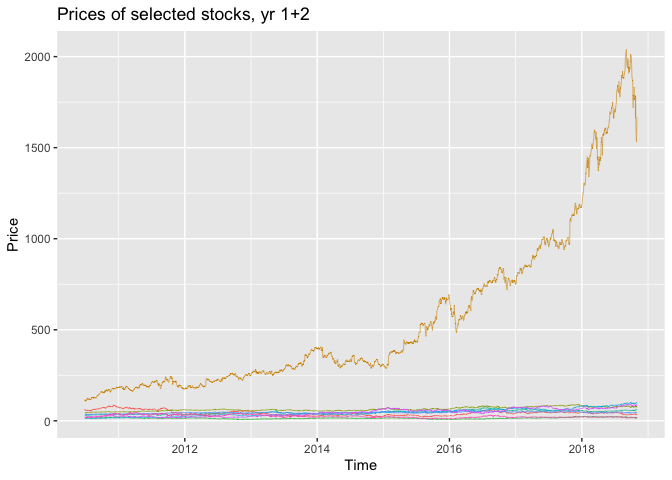<!-- -->


```r
selected_symbols_ids <- which(names(top_mcap_prices_df_short) %in% selected_symbols)
ggplot(
  aes(x = Index, y = Value, colour = Series), 
  data = fortify(scale(top_mcap_prices_df_short[, selected_symbols_ids]), melt = TRUE)) + 
    geom_line(linewidth = 0.2) + 
    labs(title = "Scaled prices of selected stocks, yr 1+2", x ="Time", y = "Price") +
    theme(legend.position="none")
```

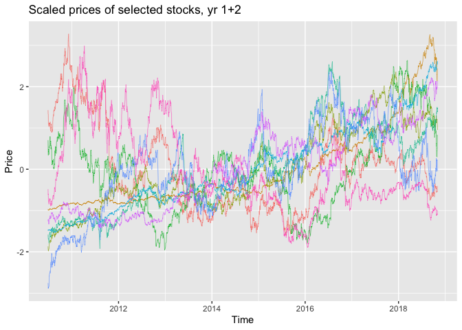<!-- -->

5) Normalize the weighted portfolio to the desired volatility target. 

TODO: Implement safe guards for risk weighting.

```r
sds <- lapply(top_mcap_prices_df_short[, selected_symbols_ids], function(x) {sd(x, na.rm = TRUE)})
#risk_normalized_weights <- lapply(sds, function(x) {x/sum(unlist(sds))})
risk_adjusted_weights <- unlist(lapply(sds, function(x) {1/x}))
risk_normalized_weights <- risk_adjusted_weights/sum(risk_adjusted_weights)

selected_pf_prices <- as.matrix(top_mcap_prices_df_short[, selected_symbols_ids]) %*% unname(risk_normalized_weights)

risk_normalized_weights
```

```
##         AEM        AMZN          ED        MRVL           O        ROST 
## 0.072676286 0.002166002 0.091362336 0.262303737 0.101110991 0.046578292 
##          SO         UAL         WPM 
## 0.243340655 0.048615925 0.131845776
```

Plot weighted portfolio average of selected stocks.  

```r
selected_portfolio <- data.frame(
  date = index(top_mcap_prices_df_short),
  price = selected_pf_prices
)
  
  
ggplot(aes(x = date, y = price), data = selected_portfolio) + 
    geom_line(linewidth = 0.2) + 
    labs(title = "Avg. of selected portfolio", x ="Time", y = "Price") +
    theme(legend.position="none")
```

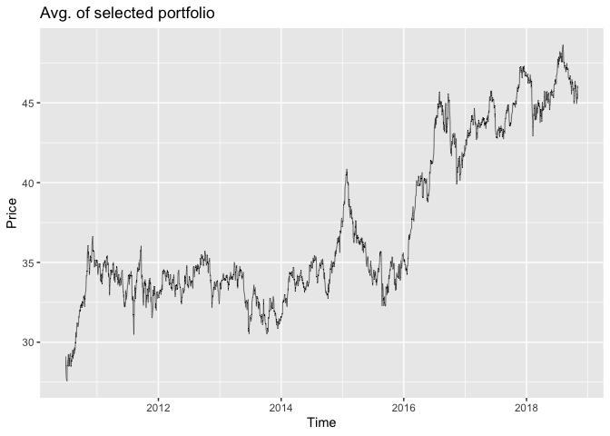<!-- -->


## Explained variation

We want to know the percentage of variance explained by the selected portfolio relative to the entire pool of candidate stocks.  

The variance of components is additive, as components are orthogonal by construction. If we assumed (unrealistically) that for each PC all stocks with a weight effectively larger than 0 were perfectly correlated, the selected stock each PC would then be express same percentage of variation as it's associated PC. This scenario would be trivial, so let's ignore it.

Let's now consider the opposite extreme. Here we assume that all stocks affecting each PC were perfectly _un_correlated. This is of course again totally unrealistically. Recall, that the point of using PCA is exactly that the variables with dominating weights for each PC are more ore less correlated, so that we can select one or a few variables for each PC to represent that dimension.  

TODO:  
How should we go about this? Adjust for covariances between stocks?  
Note here that for scaled data, correlations and covariances are the same.

For now let's do the calculations, given the assumption of uncorrelated stocks.


```r
pca_output <- PCA(top_mcap_returns_df_short[1:504, ], scale.unit = TRUE, ncp = 347)
```

<!-- -->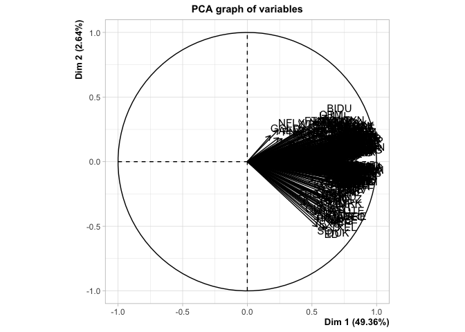<!-- -->


Let  
$c_{i,j}$ be the contribution of stock $j$ to $PC_i$, and  
$v_i$ the percentage of variance expressed by $PC_i$, and  
$n$ the number of PC's.  
Then we calculate the percentage variance $U_j$ expressed by each stock as  
$$u_j = \sum_{i = 1}^n c_{i,j} v_i$$  

Percentages are decimalpercentages, i.e. $1.00$ rather than $100\%$.


```r
stock_contribution <- function(contribution_tbl, eigenvalue_tbl, stock_id, num_components) {
  c_j <- contribution_tbl[stock_id, ]/100
  v_ <- eigenvalue_tbl[, 2]/100 ## Column 2 in eigenvalue table is "percentage of variance" for each component
  u_j <- 0
  
  for(i in 1:num_components) {
    u_j <- u_j + c_j[i] * v_[i]
  }
  unname(u_j)
}
```


```r
stock_contribution(
  contribution_tbl = pca_output$var$contrib, 
  eigenvalue_tbl = pca_output$eig, 
  stock_id = 1, 
  num_components = 347
)
```

```
## [1] 0.002881844
```


Then, for $m$ selected stocks, the percentage of variance, $u^*$, expressed by the selected portfolio of stocks is calculated as  
$$u^* =  \sum_{i = 1}^n \sum_{j = 1}^m c_{i,j} v_i$$


```r
pf_contribution <- function(contribution_tbl, eigenvalue_tbl, stock_id, num_components, pf_symbols, pf_weights) {
  u_ <- 0
  num_stocks <- length(pf_symbols)
  stock_pool <- row.names(contribution_tbl)
  stock_ids <- stock_pool[which(stock_pool %in% pf_symbols)]
  for(j in 1:num_stocks) {
    u_ <-  u_ + stock_contribution(
      contribution_tbl = pca_output$var$contrib, 
      eigenvalue_tbl = pca_output$eig, 
      stock_id = stock_ids[j], 
      num_components = num_components
    ) * pf_weights[j]
  }
  unname(u_)
}
```


```r
pf_contribution(
  contribution_tbl = pca_output$var$contrib, 
  eigenvalue_tbl = pca_output$eig, 
  stock_id = 1, 
  num_components = 347,
  pf_symbols = selected_symbols,
  pf_weights = risk_normalized_weights
)
```

```
## [1] 0.002881844
```


## Systematic vs non-systematic risk

We want to know the ratio between systematic and non-systematic risk in the selected portfolio. Here we define systematic risk as that captured by $PC_1$. So for the selected portfolio we want to know the ratio between it's contributions to $PC_1$ and $\{PC_i\}_{i>1}$.

TODO:  
How do we go about this?

