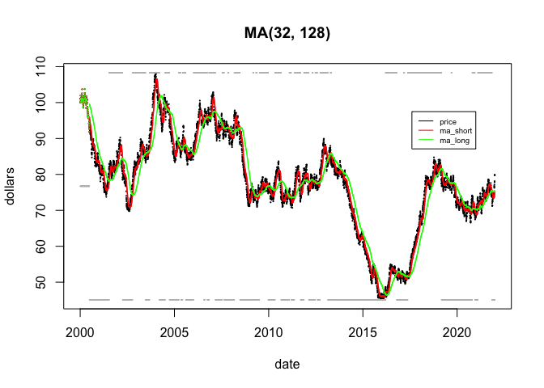
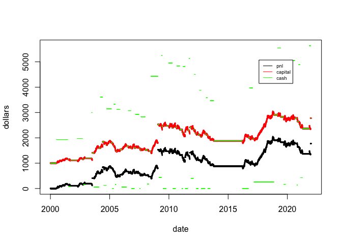
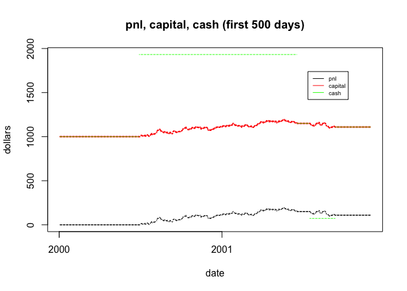
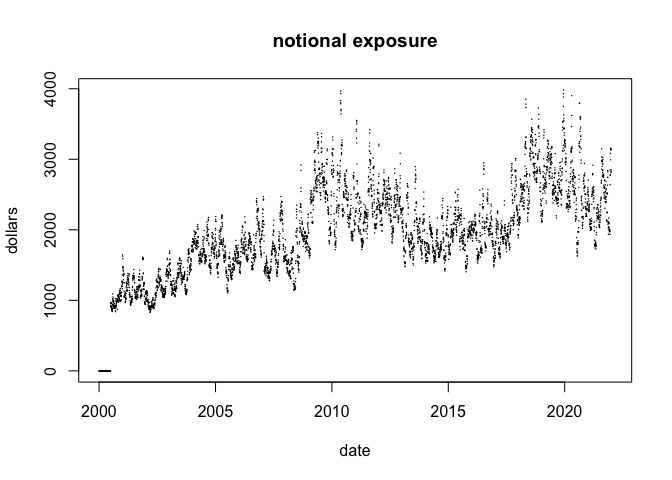

Starter System
================
mhv
6/29/2022

- <a href="#trade-simulation" id="toc-trade-simulation">Trade
  simulation</a>

This notebook only works with **rsystrade** v0.0.0.9000.

**rsystrade** v0.0.0.9000 is intended as a *minimal viable product*.

Load packages

``` r
library(timeDate)
```

# Trade simulation

Single instrument, single product.  
30 years of simulated price data.

Generate time series `prices` of simulated prices.  
Trades simulation iteratively builds a data frame `trades_data` with
`prices` and previous `trades_data` as input.

``` r
volatility = 0.12 ## I chose same vol as target_risk
holidays <- holidayNYSE()
days <- as.timeDate(seq(from = as.Date("2000-01-01"), to = as.Date("2021-12-31"), by = "day"))
bizdays <- days[isBizday(days, holidays = holidays, wday = 1:5)]
prices <- data.frame(date = bizdays)
names(prices)[1] <- "date"
#set.seed(3630)
set.seed(1729)
prices$returns <- c(NA, rnorm(nrow(prices) - 1, 0, volatility/sqrt(252)))
prices$price <- prices_from_returns(prices$returns, 100)
```

Replace prices with neat integer series

``` r
# gen_num <- function(max_num) {
#   num = NA
#   flag_up = 1
#   for(t in 1:max_num){
#     flag_down = 1
#     
#     if(flag_up == 1) {
#       num[t] <- ((t-1)%%200) + 1
#       flag_down = 0
#       if(num[t] == 200) {
#         flag_up = 0
#       }
#     }
#     
#     if(flag_down == 1) {
#       num[t] <- 200 - (t-1)%%200 + 1
#       flag_up = 0
#       if(num[t] == 2) {
#         flag_up = 1
#       }
#     }
#   }
#   num
# }
# prices$price <- gen_num(nrow(prices))
```

Run the simulation…

``` r
output <- trade_sim(prices, init_capital = 1000, n_fast = 32, n_slow = 128, risk_target = 0.12, stop_loss_fraction = 0.5)
```

    ## Calculating...
    ## 
    ## Done!

``` r
trades <- output[[1]]
accounts <- output[[2]]
```

``` r
head(trades, 10)
```

    ##          date    price open_close trade_on direction instrument_risk
    ## 1  2000-01-03 100.0000       <NA>    FALSE         0              NA
    ## 2  2000-01-04 100.1628       <NA>    FALSE         0              NA
    ## 3  2000-01-05 100.3019       <NA>    FALSE         0              NA
    ## 4  2000-01-06 101.1253       <NA>    FALSE         0              NA
    ## 5  2000-01-07 101.1473       <NA>    FALSE         0              NA
    ## 6  2000-01-10 101.9442       <NA>    FALSE         0              NA
    ## 7  2000-01-11 102.0122       <NA>    FALSE         0              NA
    ## 8  2000-01-12 100.9261       <NA>    FALSE         0              NA
    ## 9  2000-01-13 100.9683       <NA>    FALSE         0              NA
    ## 10 2000-01-14 100.9138       <NA>    FALSE         0              NA
    ##    leverage_factor notional_exposure position_size_units position_size_ccy
    ## 1                0                 0                   0                 0
    ## 2                0                 0                   0                 0
    ## 3                0                 0                   0                 0
    ## 4                0                 0                   0                 0
    ## 5                0                 0                   0                 0
    ## 6                0                 0                   0                 0
    ## 7                0                 0                   0                 0
    ## 8                0                 0                   0                 0
    ## 9                0                 0                   0                 0
    ## 10               0                 0                   0                 0
    ##    stop_loss_gap close_trade_stop_loss  ma_fast  ma_slow mac
    ## 1              0                     0 100.0000 100.0000   0
    ## 2              0                     0 100.1628 100.1628   0
    ## 3              0                     0 100.3019 100.3019   0
    ## 4              0                     0 101.1253 101.1253   0
    ## 5              0                     0 101.1473 101.1473   0
    ## 6              0                     0 101.9442 101.9442   0
    ## 7              0                     0 102.0122 102.0122   0
    ## 8              0                     0 100.9261 100.9261   0
    ## 9              0                     0 100.9683 100.9683   0
    ## 10             0                     0 100.9138 100.9138   0

``` r
head(accounts, 10)
```

    ##          date    price pnl account_value capital cash borrowed_cash
    ## 1  2000-01-03 100.0000   0          1000    1000 1000             0
    ## 2  2000-01-04 100.1628   0          1000    1000 1000             0
    ## 3  2000-01-05 100.3019   0          1000    1000 1000             0
    ## 4  2000-01-06 101.1253   0          1000    1000 1000             0
    ## 5  2000-01-07 101.1473   0          1000    1000 1000             0
    ## 6  2000-01-10 101.9442   0          1000    1000 1000             0
    ## 7  2000-01-11 102.0122   0          1000    1000 1000             0
    ## 8  2000-01-12 100.9261   0          1000    1000 1000             0
    ## 9  2000-01-13 100.9683   0          1000    1000 1000             0
    ## 10 2000-01-14 100.9138   0          1000    1000 1000             0
    ##    borrowed_asset
    ## 1               0
    ## 2               0
    ## 3               0
    ## 4               0
    ## 5               0
    ## 6               0
    ## 7               0
    ## 8               0
    ## 9               0
    ## 10              0

``` r
plot(trades$date, trades$price, pch = 16, cex = 0.3, xlab = "date", ylab = "dollars")
points(trades$date, trades$ma_fast, pch = 16, cex = 0.25, col = "red")
points(trades$date, trades$ma_slow, pch = 16, cex = 0.2, col = "green")
points(trades$date, (trades$mac + 1) * 0.5 * (max(trades$price) - min(trades$price)) + min(trades$price), pch = 16, cex = 0.2, col = "gray")
title('MA(32, 128)')
legend(
  x = as.numeric(trades$date[round(length(trades$date) * 0.8)]), y = max(trades$price) * 0.9,  
  legend=c('price', 'ma_short', 'ma_long'), 
  col=c('black','red','green'), 
  lty=c(1,1,1), cex=0.6
)
```

<!-- -->

``` r
plot(trades$date, accounts$pnl, pch = 16, cex = 0.4, xlab = "date", ylab = "dollars", ylim = c(min(c(accounts$pnl, accounts$capital, accounts$cash)), max(c(accounts$pnl, accounts$capital, accounts$cash))))
points(trades$date, accounts$capital, pch = 16, cex = 0.4, col = "red")
points(trades$date, accounts$cash, pch = 16, cex = 0.15, col = "green")
legend(
  x = as.numeric(trades$date[round(length(trades$date) * 0.8)]), y = max(c(accounts$pnl, accounts$capital, accounts$cash)) * 0.9, 
  legend=c('pnl', 'capital', 'cash'), 
  col=c('black','red','green'), 
  lty=c(1,1,1), cex=0.6
)
```

<!-- -->

(Lines here are not dashed. The gaps are weekends.)

``` r
plot(trades$date[1:500], accounts$pnl[1:500], pch = 16, cex = 0.2, xlab = "date", ylab = "dollars", ylim = c(min(accounts$pnl[1:500], accounts$capital[1:500], accounts$cash[1:500]), max(accounts$pnl[1:500], accounts$capital[1:500], accounts$cash[1:500])))
points(trades$date[1:500], accounts$capital[1:500], pch = 16, cex = 0.3, col = "red")
points(trades$date[1:500], accounts$cash[1:500], pch = 16, cex = 0.15, col = "green")
title('pnl, capital, cash (first 500 days)')
legend(
  x = as.numeric(trades$date[400]), y = max(accounts$pnl[1:500], accounts$capital[1:500], accounts$cash[1:500]) * 0.9,  
  legend=c('pnl', 'capital', 'cash'), 
  col=c('black','red','green'), 
  lty=c(1,1,1), cex=0.6
)
```

<!-- -->

``` r
plot(trades$date, trades$notional_exposure, pch = 16, cex = 0.2, xlab = "date", ylab = "dollars")
title('notional exposure')
```

<!-- -->
