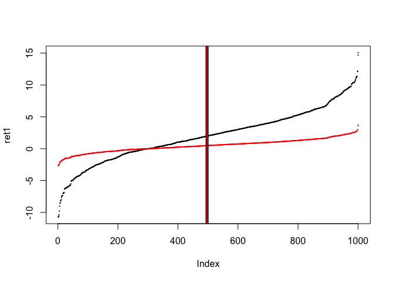
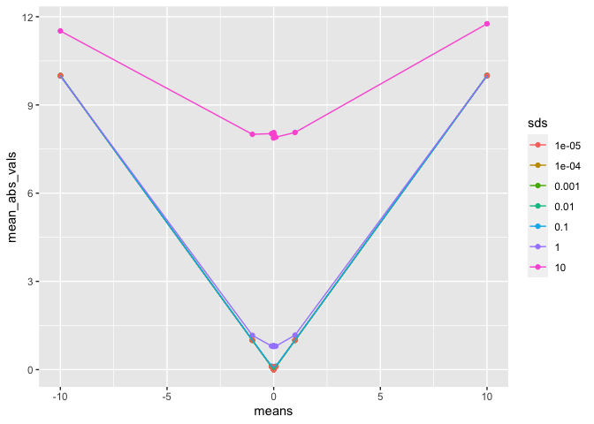

Volatility targeting
================
mhv
2023-02-16

- <a href="#volatility-targeting" id="toc-volatility-targeting">Volatility
  targeting</a>
- <a href="#scaling-signal-by-mean-of-absolute-signal"
  id="toc-scaling-signal-by-mean-of-absolute-signal">Scaling signal by
  mean of <em>absolute</em> signal</a>
  - <a href="#mean--0" id="toc-mean--0">mean = 0</a>
  - <a href="#diagnosis" id="toc-diagnosis">Diagnosis</a>
  - <a href="#mean--1" id="toc-mean--1">mean = 1</a>
- <a href="#diversification-multipliers"
  id="toc-diversification-multipliers">Diversification Multipliers</a>
  - <a href="#functions" id="toc-functions">Functions</a>
  - <a href="#calculations" id="toc-calculations">Calculations</a>
  - <a href="#conclusion" id="toc-conclusion">Conclusion</a>
  - <a href="#test-function" id="toc-test-function">Test function</a>
  - <a href="#half-normal-distribution-and-mean-absolute-value"
    id="toc-half-normal-distribution-and-mean-absolute-value">Half-normal
    distribution and Mean Absolute Value</a>
- <a href="#sdm" id="toc-sdm">SDM</a>

(See Obsidian note “Volatility Targeting”)

The more interesting stuff is way down below…

## Volatility targeting

Example: We generate a signal with approx mean 2 and approx volatility
4.  
We want to rescale the volatility to 1 and we want a mean of 10

Create vector of returns

``` r
set.seed(3746)
ret <- rnorm(1000, 2, 4)
```

Get mean - should be close to 2

``` r
mean(ret)
```

    ## [1] 1.976082

Get volatility - should be close to 4

``` r
sd(ret)
```

    ## [1] 4.073677

Standardise returns

``` r
std_ret <- ret / sd(ret)
```

Get mean of standardised returns

``` r
mean(std_ret)
```

    ## [1] 0.4850855

- The mean was of course reduced when the volatility was reduced

Get volatility of standardised returns - should be 1

``` r
sd(std_ret)
```

    ## [1] 1

``` r
ret1 <- sort(c(ret, mean(ret)))
std_ret1 <- sort(c(std_ret, mean(std_ret)))

plot(ret1, pch = 16, cex = 0.3, col = "black")
points(std_ret1, pch = 16, cex = 0.3, col = "red")
abline(v=which(ret1 == mean(ret1)), lty = "solid", lwd = 5, col="black")
abline(v=which(std_ret1 == mean(std_ret1)), lty = "solid", lwd = 2, col="red")
```

<!-- -->

So what if we want the same mean but standardised volatility? First we
shift the data to get a mean of 0:

``` r
demeaned_ret <- ret - mean(ret)
```

Check the mean of the “demeaned” returns - should be 0:

``` r
mean(demeaned_ret)
```

    ## [1] -5.997091e-17

Check the volatility of the “demeaned” returns - should be unchanged
(i.e. 4.073677)

``` r
sd(demeaned_ret)
```

    ## [1] 4.073677

Now standardise the demeaned returns

``` r
std_demeaned_ret <- demeaned_ret / sd(demeaned_ret)
```

Check mean of standardised demeaned returns - should be 0

``` r
mean(std_demeaned_ret)
```

    ## [1] -1.438181e-17

Check volatility of std_demeaned_ret - should be 1

``` r
sd(std_demeaned_ret)
```

    ## [1] 1

Now shift the mean of the standardised demeaned returns to our target
volatility of 10.

``` r
normalized_ret <- std_demeaned_ret + 10
```

Check mean of normalized returns - should be 10

``` r
mean(normalized_ret)
```

    ## [1] 10

Check volatility of normalized returns - should be 1

``` r
sd(normalized_ret)
```

    ## [1] 1

``` r
ret1 <- sort(c(ret, mean(ret)))
demeaned_ret1 <- sort(c(demeaned_ret, mean(demeaned_ret)))
std_demeaned_ret1 <- sort(c(std_demeaned_ret, mean(std_demeaned_ret)))
normalized_ret1 <- sort(c(normalized_ret, mean(normalized_ret)))


plot(ret1, pch = 16, cex = 0.3, col = "black")
points(demeaned_ret1, pch = 16, cex = 0.3, col = "green")
points(std_demeaned_ret1, pch = 16, cex = 0.3, col = "blue")
points(normalized_ret1, pch = 16, cex = 0.3, col = "orange")
abline(v=which(ret1 == mean(ret1)), lty = "solid", lwd = 5, col="black")
abline(v=which(demeaned_ret1 == mean(demeaned_ret1)), lty = "dashed", lwd = 4, col="green")
abline(v=which(std_demeaned_ret1 == mean(std_demeaned_ret1)), lty = "dashed", lwd = 3, col="blue")
abline(v=which(normalized_ret1 == mean(normalized_ret1)), lty = "dotted", lwd = 2, col="orange")
```

<!-- -->

The orange line shows that we end up with only positive signals.  
We don’t want the mean of the scaled signal to be 10. We want the mean
of the *absolute* signal to be 10.

## Scaling signal by mean of *absolute* signal

See pysystemtrade implementation:  
<https://github.com/robcarver17/pysystemtrade/blob/master/sysquant/estimators/forecast_scalar.py#L31>

``` r
set.seed(3746)
sig <- rnorm(1000, 2, 8)
```

This is how pysystemtrade does it:  
Find mean of abs signal

``` r
mean_abs_sig <- mean(abs(sig))
mean_abs_sig
```

    ## [1] 6.623671

Standardise signal: Divide signal by mean of absolute signal

``` r
std_sig <- sig/mean_abs_sig
```

Get mean of scaled signal

``` r
mean(std_sig)
```

    ## [1] 0.2947253

Get sd of scaled signal

``` r
sd(std_sig)
```

    ## [1] 1.230036

Get mean of positive scaled values

``` r
mean(std_sig[std_sig >= 0])
```

    ## [1] 1.071792

Get mean of negative scaled values

``` r
mean(std_sig[std_sig < 0])
```

    ## [1] -0.8904984

Get sd of positive scaled values

``` r
sd(std_sig[std_sig >= 0])
```

    ## [1] 0.789594

Get sd of negative scaled values

``` r
sd(std_sig[std_sig < 0])
```

    ## [1] 0.7369654

Scale signal to expected absolute value of 10

``` r
scaled_sig <- std_sig * 10
```

Mean of the scaled signal

``` r
mean(scaled_sig)
```

    ## [1] 2.947253

Mean of the absolute scaled signal

``` r
mean(abs(scaled_sig))
```

    ## [1] 10

sd of the scaled signal

``` r
sd(scaled_sig)
```

    ## [1] 12.30036

sd of the absolute scaled signal

``` r
sd(abs(scaled_sig))
```

    ## [1] 7.739106

Make plot (include mean in each signal to be able to make vlines)

``` r
sig1 <- sort(c(sig, mean(sig)))
std_sig1 <- sort(c(std_sig, mean(std_sig)))
scaled_sig1 <- sort(c(scaled_sig, mean(scaled_sig)))

plot(sig1, pch = 16, cex = 0.3, col = "black")
points(std_sig1, pch = 16, cex = 0.3, col = "red")
points(scaled_sig1, pch = 16, cex = 0.3, col = "green")
abline(v=which(sig1 == mean(sig1)), lwd = 3, col="black")
abline(v=which(std_sig1 == mean(std_sig1)), lty = "dashed", lwd = 2, col="red")
abline(v=which(scaled_sig1 == mean(scaled_sig1)), lty = "dotted", lwd = 1, col="green")
```

<!-- -->

### mean = 0

Compute the scaling factor for 20 simulated signals with the same input
parameters.  
Do this for different values of sd.

``` r
f_normalization_factor <- function(raw_signal, target = 1) {
  target/mean(abs(raw_signal))
}
```

``` r
sd_vals <- c(1, 0.1, 0.01, 0.001, 0.0001)
factor_vectors <- list()
for(i in seq_along(sd_vals)) {
  factor_vectors[[i]] <- 
    replicate(20, f_normalization_factor(rnorm(10000, 0, sd_vals[i]), 10))
}
range_ <- range(factor_vectors)
```

``` r
plot(factor_vectors[[1]], pch = 16, cex = 0.8, ylim = range_, log = "y", ylab = "scaling_factor", main = "Rescaled signal (lin-log)")
points(factor_vectors[[2]], pch = 16, cex = 0.8, col = "red")
points(factor_vectors[[3]], pch = 16, cex = 0.8, col = "green")
points(factor_vectors[[4]], pch = 16, cex = 0.8, col = "blue")
points(factor_vectors[[5]], pch = 16, cex = 0.8, col = "orange")
```

<!-- -->

``` r
mean(factor_vectors[[1]])
```

    ## [1] 12.50737

``` r
mean(factor_vectors[[2]])
```

    ## [1] 125.2921

``` r
mean(factor_vectors[[3]])
```

    ## [1] 1255.659

``` r
mean(factor_vectors[[4]])
```

    ## [1] 12540.4

``` r
mean(factor_vectors[[5]])
```

    ## [1] 125284

Note: When the mean of the raw signal is close to 0, the scaling factor
is inverse proportional to the volatility of the raw signal.

``` r
library(ggplot2)
```

``` r
means <- c(-100, -10, -1, -0.1, -0.01, - 0.001, 0, 0.001, 0.01, 0.1, 1, 10, 100)
sds <- c(10, 1, 0.1, 0.01, 0.001, 0.0001, 0.00001)
grid <- expand.grid(means = means, sds = sds)
for(i in 1:nrow(grid)) {
  grid[i, "scalars"] <- f_normalization_factor(rnorm(10000, grid$means[i], grid$sds[i]), 10)
}
```

``` r
ggplot(grid, aes(x = sds, y = scalars, color = as.factor(means))) +
  geom_point() +
  geom_line() +
  scale_x_log10() +
  scale_y_log10() +
  labs(x = "sds", y = "scalars", color = "means")
```

<!-- -->

### Diagnosis

What’s going on? Let’s look at how `mean(abs(x))` depends on `mean(x)`.

``` r
means <- c(-100, -10, -1, -0.1, -0.01, - 0.001, 0, 0.001, 0.01, 0.1, 1, 10, 100)
signals <- lapply(means, function(m) rnorm(10000, m, 1))
mean_abs_vals <- lapply(signals, function(x) mean(abs(x)))
df <- data.frame(means = means, mean_abs_vals = unlist(mean_abs_vals))
```

``` r
ggplot(df, aes(x = means, y = mean_abs_vals)) +
  geom_point() +
  geom_line() +
  labs(x = "means", y = "mean abs vals")
```

<!-- -->

We observe that the mean of the absolute values is equal to the absolute
value of the mean:

``` r
set.seed(3654)
sgnl1 <- rnorm(10000, -100, 1)
mean(abs(sgnl1)) == abs(mean(sgnl1))
```

    ## [1] TRUE

But not for all raw signals with a mean close to 0:

``` r
set.seed(3654)
sgnl2 <- rnorm(10000, 0, 1)
mean(sgnl2)
```

    ## [1] -0.006818511

``` r
mean(abs(sgnl2)) == abs(mean(sgnl2))
```

    ## [1] FALSE

``` r
set.seed(3654)
sgnl3 <- rnorm(10000, 0.4, 0.1)
set.seed(3654)
sgnl4 <- rnorm(10000, 0.5, 0.1)
mean(abs(sgnl3)) == abs(mean(sgnl3))
```

    ## [1] FALSE

``` r
mean(abs(sgnl4)) == abs(mean(sgnl4))
```

    ## [1] TRUE

``` r
format(
  mean(abs(sgnl3)) - abs(mean(sgnl3)), 
  scientific=F,
  nsmall = 20
)
```

    ## [1] "0.00000080417612741135"

``` r
format( 
 mean(abs(sgnl4)) - abs(mean(sgnl4)),
 scientific=F,
 nsmall = 20
)
```

    ## [1] "0.00000000000000000000"

Absolute value is also *not* equal to the absolute value of the mean for
all values of sd:

``` r
set.seed(3654)
sgnl5 <- rnorm(10000, 1, 0.1)
set.seed(3654)
sgnl6 <- rnorm(10000, 1, 0.2)
set.seed(3654)
sgnl7 <- rnorm(10000, 1, 0.3)
set.seed(3654)
sgnl8 <- rnorm(10000, 1, 1)
mean(abs(sgnl5)) == abs(mean(sgnl5))
```

    ## [1] TRUE

``` r
mean(abs(sgnl6)) == abs(mean(sgnl6))
```

    ## [1] TRUE

``` r
mean(abs(sgnl7)) == abs(mean(sgnl7))
```

    ## [1] FALSE

``` r
mean(abs(sgnl8)) == abs(mean(sgnl8))
```

    ## [1] FALSE

``` r
means <- c(-10, -1, -0.1, -0.01, - 0.001, 0, 0.001, 0.01, 0.1, 1, 10)
sds <- c(10, 1, 0.1, 0.01, 0.001, 0.0001, 0.00001)
grid <- expand.grid(means = means, sds = sds)
for(i in 1:nrow(grid)) {
  signal <- rnorm(10000, grid$means[i], grid$sds[i])
  grid[i, "mean_abs_vals"] <- mean(abs(signal))
}
```

``` r
ggplot(grid, aes(x = means, y = mean_abs_vals, color = as.factor(sds))) +
  geom_point() +
  geom_line() +
  labs(x = "means", y = "mean_abs_vals", color = "sds")
```

<!-- -->

``` r
ggplot(grid, aes(x = means, y = mean_abs_vals, color = as.factor(sds))) +
  geom_point() +
  geom_line() +
  scale_y_log10() +
  labs(x = "means", y = "mean_abs_vals", color = "sds")
```

<!-- -->

#### Analysis

The bigger the sd,

- the bigger `mean(abs(signal)) - abs(mean(signal))`.  
- $\Longrightarrow$ the smaller the *scaling factor*.  
- the less sensitive the scaling factor is to the mean of the raw
  signal.

The smaller the sd,

- the the smaller `mean(abs(signal)) - abs(mean(signal))`.  
- $\Longrightarrow$ the bigger the *scaling factor*.  
- $\Longrightarrow$ the bigger the scaled signal.  
- the more sensitive the scaling factor is to the mean of the raw
  signal.

When the mean of the raw signal is *not* close to zero:

- `mean(abs(signal))` and `abs(mean(signal))` are effectively equal for
  *small* sd.

When the mean of the raw signal is 0,

- the *scaling factor* is inverse proportional to sd.

The bigger the absolute mean of the signal,

- the less sensitive the *scaling factor* is to sd.

Notice:

- Doubling the <u>standard deviation</u> of a mean zero Gaussian will
  also double it’s <u>average absolute value</u>.  
- The *expected absolute value* of a Gaussian is equal to
  `sd * sqrt(2/pi)`.  
- If the mean isn’t zero (which for slow trend following and carry is
  very likely) then the standard deviation will be biased downwards
  compared to abs() although that would be easy to fix by using MAD
  rather than STDEV.  
- These points are from the discussion in this Obsidian note:
  - CarverRobert_SystematicTrading#F6: Price Volatility as Exponentially
    Weighted Moving Average (EWMA)

### mean = 1

``` r
sd_vals <- c(1, 0.1, 0.01, 0.001, 0.0001)
factor_vectors <- list()
for(i in seq_along(sd_vals)) {
  factor_vectors[[i]] <- 
    replicate(20, f_normalization_factor(rnorm(10000, 1, sd_vals[i]), 10))
}
range_ <- range(factor_vectors)
```

lin-lin

``` r
plot(factor_vectors[[1]], pch = 16, cex = 0.8, ylim = range_, ylab = "scaling_factor",
    main= "Rescaled signal (lin-lin)")
points(factor_vectors[[2]], pch = 16, cex = 0.8, col = "red")
points(factor_vectors[[3]], pch = 16, cex = 0.8, col = "green")
points(factor_vectors[[4]], pch = 16, cex = 0.8, col = "blue")
points(factor_vectors[[5]], pch = 16, cex = 0.8, col = "orange")
```

<!-- -->

Remove the signal with sd=1

``` r
range_ <- range(factor_vectors[2:5])
plot(factor_vectors[[2]], pch = 16, cex = 0.8, ylim = range_, ylab = "scaling_factor",
    main= "Rescaled signal (lin-lin)", col = "red")
#points(factor_vectors[[2]], pch = 16, cex = 0.8, col = "red")
points(factor_vectors[[3]], pch = 16, cex = 0.8, col = "green")
points(factor_vectors[[4]], pch = 16, cex = 0.8, col = "blue")
points(factor_vectors[[5]], pch = 16, cex = 0.8, col = "orange")
```

<!-- -->

``` r
mean(factor_vectors[[1]])
```

    ## [1] 8.567769

``` r
mean(factor_vectors[[2]])
```

    ## [1] 10.00221

``` r
mean(factor_vectors[[3]])
```

    ## [1] 9.999942

``` r
mean(factor_vectors[[4]])
```

    ## [1] 10

``` r
mean(factor_vectors[[5]])
```

    ## [1] 10

This looks much more reasonable!

## Diversification Multipliers

- Notes: ST, Ch 10: Position sizing:
  - Note: When the expected absolute value of the individual forecasts
    is 10, the *diversification multiplier* will ensure that the
    combined forecast is also 10.
    - \*\*\* \#todo Is this true?? \*\*\*
      - See Noter: ST, Ch 8: Combined forecasts

### Functions

``` r
f_sig_div_mult <- function(
    signal_correlations,
    signal_weights,
    min_cor = 0,
    max_sdm = 2.5) {
  H <- signal_correlations
  w <- signal_weights

  clamped_H <- clamp_matrix_lower(H, min_cor)
  clamp_signal_upper(
    1/sqrt(crossprod(t(w %*% clamped_H),  w)),
    max_signal = max_sdm
  )
}

f_signal_cor_mat <- function(
    signals
) {
  cor(signals)
}

f_signal_cov_mat <- function(
    signals
) {
  cov(signals)
}

f_normalization_factor <- function(raw_signal, target = 1) {
  target/mean(abs(raw_signal))
}

f_normalize_signal <- function(signal, normalization_factor = 1) {
  signal * normalization_factor
}

clamp_signal <- function(signal, min_signal = -Inf, max_signal = Inf) {
  #if(length(signal) != 1) {stop("clamp_signal() only takes a single number
  #                              as input.")}
  vapply(
    signal,
    function(x) {max(min_signal, min(x, max_signal))},
    numeric(1)
  )
}

clamp_matrix_lower <- function(input_matrix, min_signal) {
  apply(input_matrix,
        c(1,2),
        clamp_signal_lower,
        min_signal = min_signal
  )
}

clamp_signal_lower <- function(signal, min_signal = -Inf) {
  max(min_signal, signal)
}

clamp_signal_upper <- function(signal, max_signal = Inf) {
  min(signal, max_signal)
}

## This function is modified, so we don't have to load from a system list.
## Only one instrument
combine_signals <- function(
    clamped_signals,
    signal_weights,
    min_cor = 0,
    max_sdm = 2.5,
    sdm_mode = "div_mult",
    cor_or_cov = "cor") {

  # inst_names_by_algo <- get_inst_names_by_parsed_algo(system$algos)
  # unique_inst_names <-
  #   get_unique_inst_names_from_parsed_algos_list(system$algos)
  # 
  # n <- length(unique_inst_names)
  #combined_signals <- numeric(n)
  #signal_cor_mats <- list()

  #for(i in 1:n) {
    ## A subsystem is all the algos for an individual instrument
    # subsystem_IDs <- which(
    #   inst_names_by_algo[inst_names_by_algo == unique_inst_names[[i]]]
    # )

    ## Collect all clamped signals in subsystem i
    # signals <- sapply(
    #   signal_tables[subsystem_IDs], function(x) x$clamped_signal[t]
    # )
    ## Collect all signal weights in subsystem i
    # signal_weights <- sapply(
    #   signal_tables[subsystem_IDs], function(x) x$signal_weight[t]
    # )

    ## Calculate signal correlations.
    ## No need to do this every time we run update_position_table_row.
    clamped_signals_mat <- sapply(clamped_signals, function(x) x)
    
    if(cor_or_cov == "cor") {
      signal_cor_mat <- f_signal_cor_mat(clamped_signals_mat)
    } else if (cor_or_cov == "cov") {
      signal_cor_mat <- f_signal_cov_mat(clamped_signals_mat)
    }
      
    combined_signals <- clamped_signals_mat %*% signal_weights
    
    ## Signal Diversification Multiplier
    if(sdm_mode == "div_mult") {
      sdm <- f_sig_div_mult(
        signal_cor_mat, 
        signal_weights
      )
      print(paste("sdm: ", sdm))
    } else if(sdm_mode == "var") {
      n <- length(combined_signals)
      bias_correction <- sqrt((n - 1)/n)
      sdm <- 1/(sd(combined_signals) * bias_correction)
      print(paste("sdm: ", sdm))
    }
    combined_signals <-  combined_signals * sdm
    
  #}
  combined_signals
}
```

### Calculations

Generate 5 signals

``` r
set.seed(876234)
signals <- lapply(1:5, function(x) rnorm(200, 0, 1))
```

Calculate normalization factors

``` r
norm_factors <- lapply(signals, function(x) {f_normalization_factor(x, target = 10)})
norm_factors
```

    ## [[1]]
    ## [1] 12.03534
    ## 
    ## [[2]]
    ## [1] 13.07903
    ## 
    ## [[3]]
    ## [1] 12.46417
    ## 
    ## [[4]]
    ## [1] 12.77098
    ## 
    ## [[5]]
    ## [1] 12.65501

Normalize signals  
Show mean of absolute normalized signals (target = 10)

``` r
normalized_signals <- list()
for(i in seq_along(signals)) {
  normalized_signals[[i]] <- f_normalize_signal(signals[[i]], norm_factors[[i]])
}

lapply(normalized_signals, function(x) mean(abs(x)))
```

    ## [[1]]
    ## [1] 10
    ## 
    ## [[2]]
    ## [1] 10
    ## 
    ## [[3]]
    ## [1] 10
    ## 
    ## [[4]]
    ## [1] 10
    ## 
    ## [[5]]
    ## [1] 10

Clamped signals  
Show mean of absolute clamped signals (target = 10)

``` r
clamped_signals <- lapply(
  normalized_signals,
  function(x) {clamp_signal(x, min_signal = -20, max_signal = 20)}
)

lapply(clamped_signals, function(x) mean(abs(x)))
```

    ## [[1]]
    ## [1] 9.48431
    ## 
    ## [[2]]
    ## [1] 9.566417
    ## 
    ## [[3]]
    ## [1] 9.448788
    ## 
    ## [[4]]
    ## [1] 9.479629
    ## 
    ## [[5]]
    ## [1] 9.421413

Observe:  
Because we clamped the signal, the mean abs no longer hits the target.  
This is ok, but it means that the rescaled combined signal will also not
meet the target.

Combine signals.  
Show mean absolute value of combined signal.

``` r
signal_weights <- rep(1/5, 5)
combined_signal <- combine_signals(
  clamped_signals,
  #normalized_signals,
  signal_weights
)
```

    ## [1] "sdm:  2.15737878808594"

``` r
mean(abs(combined_signal))
```

    ## [1] 8.425561

### Conclusion

The mean absolute combined signal is a bit below the target, because of
the clamping.

### Test function

``` r
div_test_funk <- function(
    m, 
    s,
    min_signal = -20,
    max_signal = 20,
    min_cor = 0,
    max_sdm = 2.5,
    sdm_mode = "div_mult",
    cor_or_cov = "cor"
    ) {
  signals <- lapply(1:5, function(x) rnorm(200, m, s))
  norm_factors <- lapply(signals, function(x) {f_normalization_factor(x, target = 10)})
  normalized_signals <- list()
  for(i in seq_along(signals)) {
    normalized_signals[[i]] <- f_normalize_signal(signals[[i]], norm_factors[[i]])
  }
  clamped_signals <- lapply(
    normalized_signals,
    function(x) {clamp_signal(x, min_signal = -20, max_signal = 20)}
  )
  signal_weights <- rep(1/5, 5)
  combined_signal <- combine_signals(
    clamped_signals,
    #normalized_signals,
    signal_weights,
    sdm_mode = sdm_mode,
    min_cor = min_cor,
    max_sdm = max_sdm,
    cor_or_cov = cor_or_cov
  )
  list(signals = signals, 
   norm_factors = norm_factors, 
   normalized_signals = normalized_signals, 
   clamped_signals = clamped_signals, 
   signal_weights = signal_weights, 
   combined_signal = combined_signal
  )
}
```

``` r
div_test <- div_test_funk(
  m = 0, 
  s = 1,
  min_signal = -20,
  max_signal = 20,
  min_cor = 0,
  max_sdm = 2.5
)
```

    ## [1] "sdm:  2.10490761371908"

``` r
mean(abs(div_test$combined_signal))
```

    ## [1] 8.555264

``` r
div_test <- div_test_funk(
  m = 0, 
  s = 1,
  min_signal = -Inf,
  max_signal = Inf,
  min_cor = -Inf,
  max_sdm = Inf
)
```

    ## [1] "sdm:  2.11752460057426"

``` r
mean(abs(div_test$combined_signal))
```

    ## [1] 8.899273

Observation:  
Removing the restrictions doesn’t get us closer to the target.

Let’s try different mean and sd of the raw signal:

``` r
div_test <- div_test_funk(
  m = -1, 
  s = 4,
  min_signal = -Inf,
  max_signal = Inf,
  min_cor = -Inf,
  max_sdm = Inf
)
```

    ## [1] "sdm:  2.14582085809046"

``` r
mean(abs(div_test$combined_signal))
```

    ## [1] 9.527018

Observation:  
So this phenomenon has to do with the relation between the mean(signal)
and mean(abs(signal)).

Compare with 1/sd() instead of 1/(w^THw)

``` r
div_test <- div_test_funk(
  m = -1, 
  s = 4,
  min_signal = -Inf,
  max_signal = Inf,
  min_cor = -Inf,
  max_sdm = Inf,
  sdm_mode = "var"
)
```

    ## [1] "sdm:  0.205588524468273"

``` r
mean(abs(div_test$combined_signal))
```

    ## [1] 0.9514696

``` r
head(div_test$combined_signal)
```

    ##            [,1]
    ## [1,] -0.8574427
    ## [2,] -1.3620430
    ## [3,]  0.7177668
    ## [4,] -1.7233731
    ## [5,] -1.4774895
    ## [6,] -0.7929606

``` r
div_test <- div_test_funk(
  m = -1, 
  s = 4,
  min_signal = -Inf,
  max_signal = Inf,
  min_cor = -Inf,
  max_sdm = Inf,
  sdm_mode = "div_mult",
  cor_or_cov = "cor"
)
```

    ## [1] "sdm:  2.12341734942083"

``` r
mean(abs(div_test$combined_signal))
```

    ## [1] 9.161696

``` r
div_test <- div_test_funk(
  m = 0.1, 
  s = 0.1,
  min_signal = -Inf,
  max_signal = Inf,
  min_cor = -Inf,
  max_sdm = Inf,
  sdm_mode = "div_mult", #"div_mult" or "var"
  cor_or_cov = "cor" #"cor" or "cov"
)
```

    ## [1] "sdm:  2.1017176189473"

``` r
mean(abs(div_test$combined_signal))
```

    ## [1] 17.42174

### Half-normal distribution and Mean Absolute Value

The expected absolute value of a normal random variable with mean
$\mu=0$ and standard deviation $\sigma$ is
$\sigma \sqrt{\frac{2}{\pi}}$.  
See Half-normal distribution:  
<https://en.wikipedia.org/wiki/Half-normal_distribution>

``` r
std_norm_signal <- rnorm(1000000, 0, 1)

sd_pop <- function(x) {
  n <- length(x)
  bias_factor <- (n - 1) / n
  sd(x) * bias_factor
}

sqrt(2/pi) * sd_pop(std_norm_signal)
```

    ## [1] 0.798431

``` r
mean(abs(std_norm_signal))
```

    ## [1] 0.7988519

How does the absolute difference between the two methods depend on the
number of observations?

``` r
nnn <- 2^(4:23)
signals <- lapply(nnn, function(n) {
  set.seed(76523)
  rnorm(n, 0, 1)
})
aaa <- vapply(signals, function(x) {sqrt(2/pi) * sd_pop(x)}, numeric(1))
bbb <- vapply(signals, function(x) {mean(abs(x))}, numeric(1))
diffs <- abs(aaa - bbb)
df <- data.frame(nnn = nnn, diffs = diffs)
```

``` r
ggplot(df, aes(x = nnn, y = diffs)) +
  geom_point() +
  geom_line() +
  scale_x_continuous(trans='log2')  +
  scale_y_continuous(trans='log2')  +
  labs(x = "n", y = "diff") + 
  labs(title = "log-log")
```

<!-- -->

## SDM

``` r
signal_1 <- round(rnorm(1000), 2)
signal_2 <- round(rnorm(1000), 2)
```

``` r
signals <- data.frame(
  x1 = signal_1,
  x2 = signal_2
)
```

``` r
cov(signal_1, signal_2)
```

    ## [1] 0.02911757

``` r
cov(signals)
```

    ##            x1         x2
    ## x1 0.93970826 0.02911757
    ## x2 0.02911757 0.98144864

``` r
cov(signal_1, signal_1)
```

    ## [1] 0.9397083

Convert from correlation matrix to covariance matrix:  
Multiply cor matrix on both sides by diagonal matrix with sd’s in
diagonal.

``` r
D <- diag(c(sd(signal_1), sd(signal_2)))
D %*% cor(signals) %*% D
```

    ##            [,1]       [,2]
    ## [1,] 0.93970826 0.02911757
    ## [2,] 0.02911757 0.98144864

``` r
## compare:
cov(signals)
```

    ##            x1         x2
    ## x1 0.93970826 0.02911757
    ## x2 0.02911757 0.98144864

Convert from covariance matrix to correlation matrix:  
Multiply cov matrix on both sides by diagonal matrix with inverse sd’s
in diagonal. Get sd’s from diagonals in cov matrix.  
Note: `diag(<vector>)` produces a diagonal matrix. `diag(<matrix>)`
produces a vector of the diagonal.

``` r
D <- solve(
  sqrt(
    diag(
      diag(
        cov(signals)
      )
    )
  )
) ## Inverse
D %*% cov(signals) %*% D
```

    ##            [,1]       [,2]
    ## [1,] 1.00000000 0.03031969
    ## [2,] 0.03031969 1.00000000

``` r
## compare:
V <- diag(cov(signals)) ## Get variances from cov matrix

cov(signals)/V
```

    ##            x1         x2
    ## x1 1.00000000 0.03098575
    ## x2 0.02966795 1.00000000

``` r
## compare:
cor(signals)
```

    ##            x1         x2
    ## x1 1.00000000 0.03031969
    ## x2 0.03031969 1.00000000

``` r
H <- cor(signals)
V <- cov(signals)
signals_mat <- as.matrix(signals)
W <- c(0.3, 0.7)
comb_signals <- signals_mat %*% W
```

Check that $\sigma[\tilde{X}] \cdot K = \text{MAV} [\tilde{X}]$.  
When $\text{mean}(\tilde{X})=0$, $K = 2/\pi$.  
Here, the mean of $[\tilde{X}]$ is not zero, so we shift $[\tilde{X}]$
to get a zero mean.  
Now the expected difference is zero.  
0.01167052 is close to zero. Close enough?

``` r
## 1)
K <- sqrt(2/pi)
## Shift to zero mean
comb_sig_demean <- comb_signals - mean(comb_signals)
## The expected difference is zero
(sd(comb_sig_demean) * K) - mean(abs(comb_sig_demean))
```

    ## [1] 0.01504096

These should be identical

``` r
## 2a)
sqrt(var(comb_signals))[1,1]
```

    ## [1] 0.7600743

``` r
## 2b)
sd(comb_signals)
```

    ## [1] 0.7600743

``` r
## 3)
sqrt(
  crossprod(
    t(W %*% V),  
    W
  )
)[1,1]
```

    ## [1] 0.7600743

``` r
## 4)
Ws <- W * (diag(sqrt(V))) ## weighted st. devs
sqrt(
  crossprod(
    t(Ws %*% H),  
    Ws
  )
)[1,1]
```

    ## [1] 0.7600743

Observations:  
\* As expected, we have a conversion from $W^THW$ to $W^TVW$ in 1).  
\* As expected, $WCW$ is equal to $V[X]$, where $X$ is a vector of the
two stochastic variables generating the two signals.

``` r
H <- cov(signals)
W <- c(0.5, 0.5)
```

``` r
f_sig_div_mult(H, W)
```

    ## [1] 1.421556

``` r
1/(sd(as.matrix(signals) %*% W))
```

    ## [1] 1.421556

``` r
signals_mat <- as.matrix(signals)
W <- c(0.3, 0.7)
comb_signals <- signals_mat %*% W
```

Calculate combination of first elements in each signal manually and
compare with `comb_signals`.

``` r
0.3 * signals[1, 1] + 0.7 * signals[1, 2]
```

    ## [1] -0.256

``` r
comb_signals[1]
```

    ## [1] -0.256

Compare manual calculation based on correlations with sd(comb_signals)

``` r
sqrt(crossprod(t(W %*% cov(signals)),  W))
```

    ##           [,1]
    ## [1,] 0.7600743

``` r
sqrt(var(comb_signals))
```

    ##           [,1]
    ## [1,] 0.7600743

``` r
sd(comb_signals)
```

    ## [1] 0.7600743

``` r
clamp_matrix_lower <- function(input_matrix, min_signal) {
  apply(input_matrix,
        c(1,2),
        clamp_signal_lower,
        min_signal = min_signal
  )
}
```

``` r
clamp_matrix_lower(H, 0.5)
```

    ##           x1        x2
    ## x1 0.9397083 0.5000000
    ## x2 0.5000000 0.9814486

``` r
clamp_matrix_lower(H, min_signal = 0)
```

    ##            x1         x2
    ## x1 0.93970826 0.02911757
    ## x2 0.02911757 0.98144864

``` r
H
```

    ##            x1         x2
    ## x1 0.93970826 0.02911757
    ## x2 0.02911757 0.98144864
